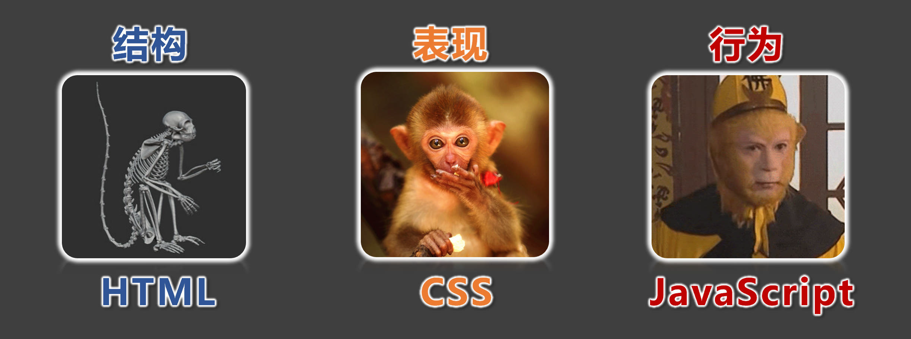
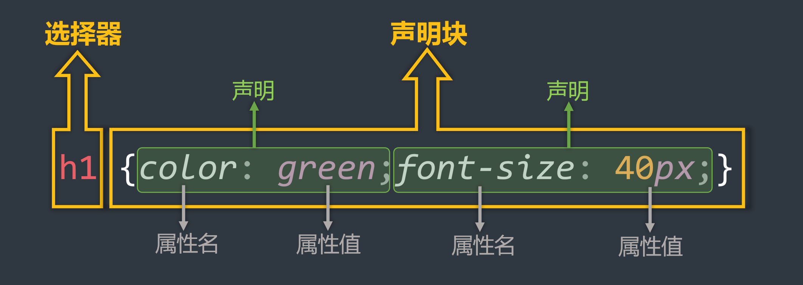

## 1. CSS简介



- <font color='#e96900'>CSS </font>的全称为：层叠样式表 ( <font color='#e96900'>Cascading Style Sheets</font> ) 。
- <font color='#e96900'>CSS </font>也是一种标记语言，用于给 <font color='#e96900'>HTML </font>结构设置样式，例如：文字大小、颜色、元素宽高等等。

## 2. CSS的编写位置
### 2.1 行内样式

- 写在标签的 <font color='#e96900'>style </font>属性中，（又称：内联样式）。

- 语法：

  ```html
  <h1 style="color:red; font-size:60px;">欢迎来到尚硅谷学习</h1>
  ```

  

  :::normal-demo 演示

  ```html
  <h1 style="color:red; font-size:60px;">欢迎来到尚硅谷学习</h1>
  ```

  :::

- 注意点：

  > [!tip]
  >
  > 1. <font color='#e96900'>style </font>属性的值不能随便写，写要符合 <font color='#e96900'>CSS </font>语法规范，是 <font color='#e96900'>名:值;</font> 的形式。
  > 2. 行内样式表，只能控制当前标签的样式，对其他标签无效。

- 存在的问题：

  > [!tip]
  >
  > 书写繁琐、样式不能复用、并且没有体现出：**结构与样式分离** 的思想，不推荐大量使用，只有对当前元素添加简单样式时，才偶尔使用。
  >

### 2.2 内部样式

- 写在 <font color='#e96900'>html </font>页面内部，将所有的 <font color='#e96900'>CSS </font>代码提取出来，单独放在 <font color='#e96900'>\<style></font> 标签中。

- 语法：

  ```html
  <style>
      h1{
          color: red;
          font-size: 40px;
      }
  </style>
  ```

  

- 示例：

  :::normal-demo 演示

  ```html
  <!DOCTYPE html>
  <html lang="zh-CN">
  <head>
      <meta charset="UTF-8">
      <title>位置2_内部样式</title>
      <style>
          h1 {
              color: green;
              font-size: 40px;
          }
          h2 {
              color: red;
              font-size: 60px;
          }
          p {
              color: blue;
              font-size: 80px;
          }
          /* img{
              width: 200px;
          } */
      </style>
  </head>
  <body>
      <h1>欢迎来到尚硅谷学习</h1>
      <h2>欢迎学习前端</h2>
      <p>北京欢迎你</p>
      <p>上海欢迎你</p>
      <p>深圳欢迎你</p>
      <p>武汉欢迎你</p>
      <p>西安欢迎你</p>
      <!--  -->
  </body>
  </html>
  ```

  

  :::

  

- 注意点：

  > [!tip]
  >
  > 1. <font color='#e96900'>&lt;style></font> 标签理论上可以放在 <font color='#e96900'>HTML </font>文档的任何地方，但一般都放在 <font color='#e96900'>&lt;head></font> 标签中。
  >
  > 2. 此种写法：样式可以复用、代码结构清晰。
  
- 存在的问题：

  > [!tip]
  >
  > 1. 并没有实现：结构与样式 **完全分离** 。
  > 2. 多个 <font color='#e96900'>HTML </font>页面无法复用样式。

### 2.3 外部样式

- 写在单独的 <font color='#e96900'>.css</font> 文件中，随后在 <font color='#e96900'>HTML</font> 文件中引入使用。

- 语法：

  1. 新建一个扩展名为 <font color='#e96900'>.css</font> 的样式文件，把所有 <font color='#e96900'>CSS</font> 代码都放入此文件中。

     ```css
     h1 {
     	color: red;
     	font-size: 40px;
     }
     ```

  2. 在 <font color='#e96900'>HTML</font> 文件中 <font color='#e96900'>&lt;head></font> 标签内 引入 <font color='#e96900'>.css</font> 文件。

     ```html
     <link rel="stylesheet" href="./xxx.css">
     ```

- 注意点：

  > [!tip]
  >
  > 1. <font color='#e96900'>&lt;link></font> 标签要写在 <font color='#e96900'>&lt;head></font> 标签中。
  >
  > 2. <font color='#e96900'> &lt;link></font> 标签属性说明：
  >   - <font color='#e96900'>href</font> ：引入的文档来自于哪里。
  >    
  >   - <font color='#e96900'>rel</font> ：( <font color='#e96900'>relation</font> ：关系）说明引入的文档与当前文档之间的关系。
  >    
  >3. 外部样式的优势：样式可以复用、结构清晰、可触发浏览器的缓存机制，提高访问速
  > 
  >度 ，实现了 **结构与样式的完全分离** 。
  > 
  >4. 实际开发中， **几乎都使用外部样式** ，这是 **<font color='red'>最推荐的使用方式！</font>** 

## 3. 样式表的优先级

- 优先级规则：**行内样式** <font color='#e96900'>> </font>**内部样式** <font color='#e96900'>=</font> **外部样式**

  > [!tip]
  >
  > 1. 内部样式、外部样式，这二者的优先级相同，且：后面的 会覆盖 前面的（简记：“后来者居上”）。
  > 2. 同一个样式表中，优先级也和编写顺序有关，且：后面的 会覆盖 前面的（简记：“后来者居上”）。

| 分类     | 优点                                                         | 缺点                                                  | 使用频率 | 作用范围 |
| -------- | ------------------------------------------------------------ | ----------------------------------------------------- | -------- | -------- |
| 行内样式 | **<font color='green'>优先级最高</font>**                    | 1. 结构与样式未分离<br>2. 代码结构混乱<br>3. 样式不能复用 | 很低     | 当前标签 |
| 内部样式 | <font color='green'>**1. 样式可复用<br> 2. 代码结构清晰**</font> | 1. 结构与样式未彻底分离2. 样式不能多页面复用      | 一般     | 当前页面 |
| 外部样式 | <font color='green'>**1. 样式可多页面复用<br>2. 代码结构清晰<br>3. 可触发浏览器的缓存机制<br>4. 结构与样式彻底分离**</font> | 需要引入才能使用                                      | <font color='red'>**最高**</font> | 多个页面 |

## 4. CSS语法规范

<font color='#e96900'>CSS</font> 语法规范由两部分构成：

-  **选择器** ：找到要添加样式的元素。

-  **声明块** ：设置具体的样式（ **声明块** 是由一个或多个 **声明** 组成的），声明的格式为： <font color='#e96900'>属性名: 属性值;</font> 

  > [!tip]
  >
  > 备注1：最后一个声明后的分号理论上能省略，但最好还是写上。
  >
  > 备注2：选择器与声明块之间，属性名与属性值之间，均有一个空格，理论上能省略，但最好还是写上。

  

- 注释的写法：

  ```css
  /* 给 h1 元素添加样式 */
  h1 {
      /* 设置文字颜色为红色 */
      color: red;
      /* 设置文字大小为40px */
      font-size: 40px;
  }
  ```

  

## 5. CSS代码风格

- **展开风格** —— 开发时推荐，便于维护和调试。

  ```css
  h1 {
      color: red;
      font-size: 40px;
  }
  ```

  

- **紧凑风格** —— 项目上线时推荐，可减小文件体积。

  ```css
  h1{color:red;font-size:40px;}
  ```

  

- 备注：

  > [!tip]
  >
  > 项目上线时，我们会通过工具将【展开风格】的代码，变成【紧凑风格】，这样可以减小文
  >
  > 件体积，节约网络流量，同时也能让用户打开网页时速度更快。