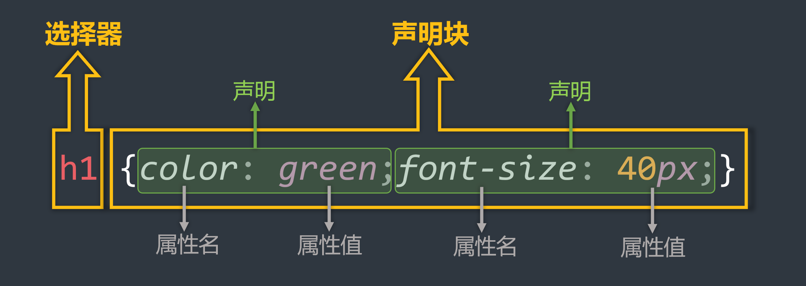

## 1. CSS简介


- <span style="color: #e96900;">CSS </span>的全称为：层叠样式表 ( <span style="color: #e96900;">Cascading Style Sheets</span> ) 。
- <span style="color: #e96900;">CSS </span>也是一种标记语言，用于给 <span style="color: #e96900;">HTML </span>结构设置样式，例如：文字大小、颜色、元素宽高等等。

## 2. CSS的编写位置
### 2.1 行内样式

- 写在标签的 <span style="color: #e96900;">style </span>属性中，（又称：内联样式）。

- 语法：

  ```html
  <h1 style="color:red; span-size:60px;">欢迎来到尚硅谷学习</h1> 
  ```

  

  :::normal-demo 演示

  ```html
  <h1 style="color:red; span-size:60px;">欢迎来到尚硅谷学习</h1>
  ```

  :::

- 注意点：

  > [!tip]
  >
  > 1. <span style="color: #e96900;">style </span>属性的值不能随便写，写要符合 <span style="color: #e96900;">CSS </span>语法规范，是 <span style="color: #e96900;">名:值;</span> 的形式。
  > 2. 行内样式表，只能控制当前标签的样式，对其他标签无效。

- 存在的问题：

  > [!tip]
  >
  > 书写繁琐、样式不能复用、并且没有体现出：**结构与样式分离** 的思想，不推荐大量使用，只有对当前元素添加简单样式时，才偶尔使用。
  >

### 2.2 内部样式

- 写在 <span style="color: #e96900;">html </span>页面内部，将所有的 <span style="color: #e96900;">CSS </span>代码提取出来，单独放在 <span style="color: #e96900;">\<style></span> 标签中。

- 语法：

  ```html
  <style>
      h1{
          color: red;
          span-size: 40px;
      }
  </style>
  ```

  

- 示例：

  :::normal-demo 演示

  ```html
  <!DOCTYPE html>
  <html lang="zh-CN">
  <head>
      <meta charset="UTF-8">
      <title>位置2_内部样式</title>
      <style>
          h1 {
              color: green;
              span-size: 40px;
          }
          h2 {
              color: red;
              span-size: 60px;
          }
          p {
              color: blue;
              span-size: 80px;
          }
          /* img{
              width: 200px;
          } */
      </style>
  </head>
  <body>
      <h1>欢迎来到尚硅谷学习</h1>
      <h2>欢迎学习前端</h2>
      <p>北京欢迎你</p>
      <p>上海欢迎你</p>
      <p>深圳欢迎你</p>
      <p>武汉欢迎你</p>
      <p>西安欢迎你</p>
      <!--  -->
  </body>
  </html>
  ```

  

  :::

  

- 注意点：

  > [!tip]
  >
  > 1. <span style="color: #e96900;">&lt;style></span> 标签理论上可以放在 <span style="color: #e96900;">HTML </span>文档的任何地方，但一般都放在 <span style="color: #e96900;">&lt;head></span> 标签中。
  >
  > 2. 此种写法：样式可以复用、代码结构清晰。
  
- 存在的问题：

  > [!tip]
  >
  > 1. 并没有实现：结构与样式 **完全分离** 。
  > 2. 多个 <span style="color: #e96900;">HTML </span>页面无法复用样式。

### 2.3 外部样式

- 写在单独的 <span style="color: #e96900;">.css</span> 文件中，随后在 <span style="color: #e96900;">HTML</span> 文件中引入使用。

- 语法：

  1. 新建一个扩展名为 <span style="color: #e96900;">.css</span> 的样式文件，把所有 <span style="color: #e96900;">CSS</span> 代码都放入此文件中。

     ```css
     h1 {
     	color: red;
     	span-size: 40px;
     }
     ```

  2. 在 <span style="color: #e96900;">HTML</span> 文件中 <span style="color: #e96900;">&lt;head></span> 标签内 引入 <span style="color: #e96900;">.css</span> 文件。

     ```html
     <link rel="stylesheet" href="./xxx.css">
     ```

- 注意点：

  > [!tip]
  >
  > 1. <span style="color: #e96900;">&lt;link></span> 标签要写在 <span style="color: #e96900;">&lt;head></span> 标签中。
  >
  > 2. <span style="color: #e96900;"> &lt;link></span> 标签属性说明：
  >   - <span style="color: #e96900;">href</span> ：引入的文档来自于哪里。
  >    
  >   - <span style="color: #e96900;">rel</span> ：( <span style="color: #e96900;">relation</span> ：关系）说明引入的文档与当前文档之间的关系。
  >    
  >3. 外部样式的优势：样式可以复用、结构清晰、可触发浏览器的缓存机制，提高访问速
  > 
  >度 ，实现了 **结构与样式的完全分离** 。
  > 
  >4. 实际开发中， **几乎都使用外部样式** ，这是 **<span style="color: red;">最推荐的使用方式！</span>** 

## 3. 样式表的优先级

- 优先级规则：**行内样式** <span style="color: #e96900;">> </span>**内部样式** <span style="color: #e96900;">=</span> **外部样式**

  > [!tip]
  >
  > 1. 内部样式、外部样式，这二者的优先级相同，且：后面的 会覆盖 前面的（简记：“后来者居上”）。
  > 2. 同一个样式表中，优先级也和编写顺序有关，且：后面的 会覆盖 前面的（简记：“后来者居上”）。

| 分类     | 优点                                                         | 缺点                                                  | 使用频率 | 作用范围 |
| -------- | ------------------------------------------------------------ | ----------------------------------------------------- | -------- | -------- |
| 行内样式 | **<span style="color: green;">优先级最高</span>**                    | 1. 结构与样式未分离<br>2. 代码结构混乱<br>3. 样式不能复用 | 很低     | 当前标签 |
| 内部样式 | <span style="color: green;">**1. 样式可复用<br> 2. 代码结构清晰**</span> | 1. 结构与样式未彻底分离2. 样式不能多页面复用      | 一般     | 当前页面 |
| 外部样式 | <span style="color: green;">**1. 样式可多页面复用<br>2. 代码结构清晰<br>3. 可触发浏览器的缓存机制<br>4. 结构与样式彻底分离**</span> | 需要引入才能使用                                      | <span style="color: red;">**最高**</span> | 多个页面 |

## 4. CSS语法规范

<span style="color: #e96900;">CSS</span> 语法规范由两部分构成：

-  **选择器** ：找到要添加样式的元素。

-  **声明块** ：设置具体的样式（ **声明块** 是由一个或多个 **声明** 组成的），声明的格式为： <span style="color: #e96900;">属性名: 属性值;</span> 

  > [!tip]
  >
  > 备注1：最后一个声明后的分号理论上能省略，但最好还是写上。
  >
  > 备注2：选择器与声明块之间，属性名与属性值之间，均有一个空格，理论上能省略，但最好还是写上。

  

- 注释的写法：

  ```css
  /* 给 h1 元素添加样式 */
  h1 {
      /* 设置文字颜色为红色 */
      color: red;
      /* 设置文字大小为40px */
      span-size: 40px;
  }
  ```

  

## 5. CSS代码风格

- **展开风格** —— 开发时推荐，便于维护和调试。

  ```css
  h1 {
      color: red;
      span-size: 40px;
  }
  ```

  

- **紧凑风格** —— 项目上线时推荐，可减小文件体积。

  ```css
  h1{color:red;span-size:40px;}
  ```

  

- 备注：

  > [!tip]
  >
  > 项目上线时，我们会通过工具将【展开风格】的代码，变成【紧凑风格】，这样可以减小文
  >
  > 件体积，节约网络流量，同时也能让用户打开网页时速度更快。