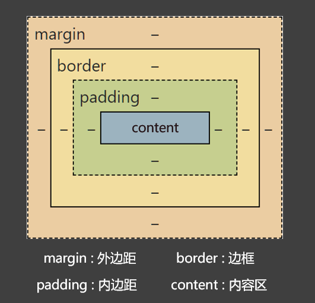

## 1. CSS 长度单位

1. <span style="color: #e96900;">px</span> ：像素。
2. <span style="color: #e96900;">em</span> ：相对元素 <span style="color: #e96900;">font-size</span> 的倍数。
3. <span style="color: #e96900;">rem</span> ：相对根字体大小，html标签就是根。
4. <span style="color: #e96900;">%</span> ：相对父元素计算。

示例：

:::normal-demo 演示

```html
<!DOCTYPE html>
<html lang="zh-CN">
<head>
    <meta charset="UTF-8">
    <title>01_CSS中常用的长度单位</title>
    <style>
        html {
            font-size: 40px;
        }
        #d1 {
            /* 第一种长度单位：px（像素） */
            width: 200px;
            height: 200px;
            font-size: 20px;
            background-color: skyblue;
        }
        #d2 {
            /* 第二种长度单位：em（相对于当前元素或其父元素的font-size的倍数） */
            width: 10em;
            height: 10em;
            font-size: 20px;
            background-color: orange;
        }
        #d3 {
            /* 第三种长度单位：rem（相对于根元素的font-size的倍数） */
            width: 5rem;
            height: 5rem;
            font-size: 20px;
            background-color: green;
        }
        #d4 {
            width: 200px;
            height: 200px;
            font-size: 20px;
            background-color: gray;
        }
        .inside {
            /* 第四种长度单位：%（相对其父元素的百分比） */
            width: 50%;
            height: 25%;
            font-size: 150%;
            background-color: orange;
        }
        .test {
            font-size: 20px;
            text-indent: 2em;
            background-color: yellowgreen;
        }
    </style>
</head>
<body>
    <div id="d1">1</div>
    <hr>
    <div id="d2">2</div>
    <hr>
    <div id="d3">3</div>
    <hr>
    <div id="d4">
        <div class="inside">4</div>
    </div>
    <hr>
    <div class="test">好好学习，天天向上</div>
</body>
</html>
```


:::

> [!tip]
>
> 注意： <span style="color: #e96900;">CSS</span> 中设置长度，必须加单位，否则样式无效！

## 2.  元素的显示模式

- **块元素（block）** 

  > [!tip]
  >
  > 又称：块级元素
  >
  > 特点：
  >
  > 1. 在页面中 **<span style="color: red;">独占一行</span>** ，不会与任何元素共用一行，是从上到下排列的。
  > 2. 默认宽度：撑满 **<span style="color: red;">父元素</span>** 。
  > 3. 默认高度：由 **<span style="color: red;">内容</span>** 撑开。
  > 4. **<span style="color: red;">可以</span>** 通过<span style="color: #e96900;"> CSS</span> 设置宽高。

- **行内元素（inline）** 

  > [!tip]
  >
  > 又称：内联元素
  >
  > 特点:
  >
  > 1. 在页面中 **<span style="color: red;">不独占一行</span>** ，一行中不能容纳下的行内元素，会在下一行继续从左到右排
  >
  > 列。
  >
  > 2. 默认宽度：由 **<span style="color: red;">内容</span>** 撑开。
  > 3. 默认高度：由 **<span style="color: red;">内容</span>** 撑开。
  > 4. **<span style="color: red;">无法</span>** 通过 <span style="color: #e96900;">CSS</span> 设置宽高。

- **行内块元素（inline-block）** 

  > [!tip]
  >
  > 又称：内联块元素
  >
  > 特点：
  >
  > 1. 在页面中 **<span style="color: red;">不独占一行</span>** ，一行中不能容纳下的行内元素，会在下一行继续从左到右排列。
  >
  > 2. 默认宽度：由 **<span style="color: red;">内容</span>** 撑开。
  > 3. 默认高度：由 **<span style="color: red;">内容</span>** 撑开。
  > 4. **<span style="color: red;">可以</span>** 通过 <span style="color: #e96900;">CSS</span> 设置宽高

**<span style="color: red;">注意：</span>** 元素早期只分为： **行内元素** 、 **块级元素** ，区分条件也只有一条："是否独占一行"，如果按照这种分类方式，行内块元素应该算作行内元素。

示例：

:::normal-demo 演示

```html
<!DOCTYPE html>
<html lang="zh-CN">
<head>
    <meta charset="UTF-8">
    <title>02_元素的显示模式</title>
    <style>
        div {
            width: 200px;
            height: 200px;
        }
        #d1 {
            background-color: skyblue;
        }
        #d2 {
            background-color: orange;
        }
        #d3 {
            background-color: green;
        }
        .one {
            background-color: skyblue;
        }
        .two {
            background-color: orange;
        }
        span {
            width: 200px;
            height: 200px;
        }
        img {
            width: 200px;
        }
    </style>
</head>
<body>
    <div id="d1">山回路转不见君</div>
    <div id="d2">雪上空留马行处</div>
    <div id="d3">风里雨里我在尚硅谷等你</div>
    <hr>
    <span class="one">人之初</span>
    <span class="two">性本善</span>
    <span class="one">人之初</span>
    <span class="two">性本善</span>
    <span class="one">人之初</span>
    <span class="two">性本善</span>
    <span class="one">人之初</span>
    <span class="two">性本善</span>
    <span class="one">人之初</span>
    <span class="two">性本善</span>
    <span class="one">人之初</span>
    <span class="two">性本善</span>
    <span class="one">人之初</span>
    <span class="two">性本善</span>
    <span class="one">人之初</span>
    <span class="two">性本善</span>
    <span class="one">人之初</span>
    <span class="two">性本善</span>
    <span class="one">人之初</span>
    <span class="two">性本善</span>
    <span class="one">人之初</span>
    <span class="two">性本善</span>
    <span class="one">人之初</span>
    <span class="two">性本善</span>
    <span class="one">人之初</span>
    <span class="two">性本善</span>
    <span class="one">人之初</span>
    <span class="two">性本善</span>
    <span class="one">人之初</span>
    <span class="two">性本善</span>
    <span class="one">人之初</span>
    <span class="two">性本善</span>
    <span class="one">人之初</span>
    <span class="two">性本善</span>
    <span class="one">人之初</span>
    <span class="two">性本善</span>
    <span class="one">人之初</span>
    <span class="two">性本善</span>
    <span class="one">人之初</span>
    <span class="two">性本善</span>
    <hr>
    
    
    
</body>
</html>
```


:::

## 3. 总结各元素的显示模式

- **块元素（block）** 

  > [!tip]
  >
  > 1. 主体结构标签： <span style="color: #e96900;">\<html></span> 、 <span style="color: #e96900;">\<body></span> 
  > 2. 排版标签： <span style="color: #e96900;">\<h1> ~ \<h6></span> 、 <span style="color: #e96900;">\<hr></span> 、 <span style="color: #e96900;">\<p></span> 、 <span style="color: #e96900;">\<pre></span> 、 <span style="color: #e96900;">\<div></span>
  > 3. 列表标签： <span style="color: #e96900;">\<ul> </span>、 <span style="color: #e96900;">\<ol></span> 、 <span style="color: #e96900;">\<li></span> 、 <span style="color: #e96900;">\<dl></span> 、 <span style="color: #e96900;">\<dt></span> 、 <span style="color: #e96900;">\<dd></span>
  > 4. 表格相关标签： <span style="color: #e96900;">\<table></span> 、 <span style="color: #e96900;">\<tbody></span> 、 <span style="color: #e96900;">\<thead></span> 、 <span style="color: #e96900;">\<tfoot></span> 、 <span style="color: #e96900;">\<tr></span> 、<span style="color: #e96900;">\<caption></span> 
  >
  > 5. <span style="color: #e96900;">\<form></span> 与 <span style="color: #e96900;">\<option></span>

- **行内元素（inline）** 

  > [!tip]
  >
  > 1. 文本标签： <span style="color: #e96900;">\<br></span> 、 <span style="color: #e96900;">\<em></span> 、 <span style="color: #e96900;">\<strong></span> 、 <span style="color: #e96900;">\<sup></span> 、 <span style="color: #e96900;">\<sub></span> 、 <span style="color: #e96900;">\<del></span> 、 <span style="color: #e96900;">\<ins></span> 
  > 2. <span style="color: #e96900;">\<a></span> 与 <span style="color: #e96900;">\<label></span>

- **行内块元素（inline-block）** 

  > [!tip]
  >
  > 1. 图片： <span style="color: #e96900;">\</span>
  > 2. 单元格： <span style="color: #e96900;">\<td></span> 、 <span style="color: #e96900;">\<th></span>
  > 3. 表单控件： <span style="color: #e96900;">\<input></span> 、 <span style="color: #e96900;">\<textarea></span> 、 <span style="color: #e96900;">\<select></span> 、 <span style="color: #e96900;">\<button></span>
  > 4. 框架标签： <span style="color: #e96900;">\<iframe></span>

## 4. 修改元素的显示模式

通过 <span style="color: #e96900;">CSS</span> 中的 <span style="color: #e96900;">display</span> 属性可以修改元素的默认显示模式，常用值如下：

| 值                                                | 描述                             |
| ------------------------------------------------- | -------------------------------- |
| <span style="color: #e96900;">none</span>         | 元素会被 **隐藏** 。             |
| <span style="color: #e96900;">block</span>        | 元素将作为 **块级元素** 显示。   |
| <span style="color: #e96900;">inline</span>       | 元素将作为 **内联元素** 显示。   |
| <span style="color: #e96900;">inline-block</span> | 元素将作为 **行内块元素** 显示。 |

演示：

:::normal-demo 演示

```html
<!DOCTYPE html>
<html lang="zh-CN">
<head>
    <meta charset="UTF-8">
    <title>04_修改元素的显示模式</title>
    <style>
        div {
            width: 200px;
            height: 200px;
            font-size: 20px;
            display: inline-block;
        }
        #d1 {
            background-color: skyblue;
        }
        #d2 {
            background-color: orange;
        }
        #d3 {
            background-color: green;
        }
        a {
            width: 200px;
            height: 200px;
            font-size: 20px;
            display: block;
        }
        #s1 {
            background-color: skyblue;
        }
        #s2 {
            background-color: orange;
        }
        #s3 {
            background-color: green;
        }
    </style>
</head>
<body>
    <div id="d1">你好1</div>
    <div id="d2">你好2</div>
    <div id="d3">你好3</div>
    <hr>
    <a id="s1" href="https://www.baidu.com">去百度</a>
    <a id="s2" href="https://www.jd.com">去京东</a>
    <a id="s3" href="https://www.toutiao.com">去头条</a>
</body>
</html>
```


:::

## 5. 盒子模型的组成

<span style="color: #e96900;">CSS</span> 会把所有的 <span style="color: #e96900;">HTML</span> 元素都看成一个**盒子**，所有的样式也都是基于这个盒子。

1. **margin（外边距）：** 盒子与外界的距离。
2. **border（边框）：** 盒子的边框。
3. **padding（内边距）：** 紧贴内容的补白区域。
4. **content（内容）：** 元素中的文本或后代元素都是它的内容。

图示如下：



**盒子的大小** **=** <span style="color: #e96900;">content</span> **+** **左右** <span style="color: #e96900;">padding</span> **+** **左右** <span style="color: #e96900;">border</span> **。**

> [!tip]
>
> 注意：外边距 <span style="color: #e96900;">margin</span> 不会影响盒子的大小，但会影响盒子的位置。

示例：

:::normal-demo 演示

```html
<!DOCTYPE html>
<html lang="zh-CN">
<head>
    <meta charset="UTF-8">
    <title>05_盒子模型的组成部分</title>
    <style>
        div {
            /* 内容区的宽 */
            width: 400px;
            /* 内容区的高 */
            height: 400px;
            /* 内边距，设置的背景颜色会填充内边距区域 */
            padding: 20px;
            /* 边框，设置的背景颜色会填充边框区域 */
            border: 10px solid black;
            /* 外边距 */
            margin: 50px;

            font-size: 20px;
            background-color: gray;
        }
    </style>
</head>
<body>
    <div>你好啊</div>
</body>
</html><!DOCTYPE html>
<html lang="zh-CN">
<head>
    <meta charset="UTF-8">
    <title>05_盒子模型的组成部分</title>
    <style>
        div {
            /* 内容区的宽 */
            width: 400px;
            /* 内容区的高 */
            height: 400px;
            /* 内边距，设置的背景颜色会填充内边距区域 */
            padding: 20px;
            /* 边框，设置的背景颜色会填充边框区域 */
            border: 10px solid black;
            /* 外边距 */
            margin: 50px;

            font-size: 20px;
            background-color: gray;
        }
    </style>
</head>
<body>
    <div>你好啊</div>
</body>
</html>
```


:::

## 6. 盒子内容区（content）

| CSS 属性名                                      | 功能                   | 属性值 |
| ----------------------------------------------- | ---------------------- | ------ |
| <span style="color: #e96900;">width</span>      | 设置内容区域宽度       | 长度   |
| <span style="color: #e96900;">max-width</span>  | 设置内容区域的最大宽度 | 长度   |
| <span style="color: #e96900;">min-width</span>  | 设置内容区域的最小宽度 | 长度   |
| <span style="color: #e96900;">height</span>     | 设置内容区域的高度     | 长度   |
| <span style="color: #e96900;">max-height</span> | 设置内容区域的最大高度 | 长度   |
| <span style="color: #e96900;">min-height</span> | 设置内容区域的最小高度 | 长度   |

> [!tip]
>
> **注意：** 
>
> <span style="color: #e96900;">max-width</span> 、 <span style="color: #e96900;">min-width</span> 一般不与 <span style="color: #e96900;">width</span> 一起使用。
>
> <span style="color: #e96900;">max-height</span> 、 <span style="color: #e96900;">min-height</span> 一般不与 <span style="color: #e96900;">height</span> 一起使用。

示例：

:::normal-demo 演示

```html
<!DOCTYPE html>
<html lang="zh-CN">
<head>
    <meta charset="UTF-8">
    <title>06_盒子的内容区_content</title>
    <style>
        div {
            width: 800px;
            /* min-width: 600px; */
            /* max-width: 1000px; */

            height: 200px;
            /* min-height: 50px; */
            /* max-height: 400px; */
            background-color: skyblue;
        }
    </style>
</head>
<body>
    <div>Lorem ipsum dolor sit amet consectetur adipisicing elit. Impedit, atque optio, dicta error modi voluptatibus velit, nemo nesciunt dignissimos exercitationem incidunt ratione consectetur eos totam quisquam! Dolores minima magni necessitatibus, debitis sit, et tenetur temporibus quasi exercitationem porro, eligendi ipsam facilis adipisci praesentium aspernatur maxime quis itaque tempore enim saepe eveniet. Error soluta nobis facilis ut quia officia voluptas amet odio recusandae! Eos suscipit ab nihil. Perspiciatis ut impedit ea porro maiores ullam qui libero ipsam! Unde veniam id nostrum aliquid ex voluptas eum officia minus optio deserunt hic praesentium animi nihil, quisquam eveniet vitae nam doloribus non asperiores a expedita at saepe accusamus. Incidunt deleniti culpa est, consequuntur quis dolore amet vel tempore sequi beatae nulla accusamus fugit nihil mollitia. Aliquam consequatur, tempora suscipit porro distinctio illum autem architecto obcaecati vitae pariatur exercitationem hic totam et iusto, ut doloremque facilis voluptatibus, quo doloribus reiciendis placeat. Voluptatibus esse doloremque exercitationem blanditiis aliquid quo voluptate beatae labore itaque nostrum harum nemo unde ea deleniti rem quis nesciunt consequatur, vel modi a magnam atque! Necessitatibus, eligendi! Ipsum consequuntur officiis reiciendis laboriosam atque saepe inventore facere repellendus incidunt, nobis et deserunt! Sunt minima odio voluptas voluptatibus. At id nesciunt tempora quam consequatur omnis eos odit numquam! Possimus, consequuntur, nam maiores veniam ipsam consequatur repellat aspernatur earum soluta nisi voluptates molestiae amet magni facilis omnis natus nostrum placeat accusamus quasi sint facere perspiciatis tempora vel voluptatibus. Expedita voluptas quia cupiditate optio harum sapiente pariatur fuga corporis quas doloribus. Praesentium aut illum blanditiis, eaque placeat aliquid voluptatibus minima perferendis rerum aliquam veniam porro cum quia! Maiores, soluta dignissimos. Voluptatem delectus laudantium, temporibus, vel totam amet fugiat ducimus provident labore quos eligendi consequatur numquam dolore aspernatur fuga atque ut nobis! Quisquam alias labore culpa, nulla ut temporibus inventore, earum, quod ipsum ea amet iusto. Recusandae nihil laboriosam quis porro nemo nesciunt sed qui facere sint officia, omnis dolorum quam corrupti molestiae aspernatur, dolor ipsam voluptatem vitae fuga error. Cumque, neque eius quos ut est itaque tempora voluptatum repellendus. Nihil quas molestiae qui! Nihil ea atque veniam modi iure maxime in ipsam quisquam pariatur magni adipisci autem non id, ab labore odio nesciunt nostrum nemo laborum. Ea adipisci dignissimos, qui, omnis et eaque neque reiciendis ipsum at iure, numquam consectetur ipsa inventore doloribus minus dolorum optio nostrum doloremque praesentium magnam iusto sit voluptatum ut? Omnis, atque ratione soluta vitae veritatis officia quae iste placeat, commodi magni sit. Voluptates, temporibus perspiciatis. Omnis velit nemo vero minus alias est eveniet deserunt unde, at quo. Saepe, debitis impedit! Sint unde maxime eius voluptas blanditiis nobis aspernatur error temporibus nisi iste eligendi vitae, consectetur numquam culpa, debitis veritatis consequuntur aliquid. Labore porro, voluptatibus consequatur facilis, nulla, dignissimos aliquam similique ullam odio nesciunt animi commodi praesentium perspiciatis est eum error explicabo exercitationem tempora? Cupiditate debitis veniam, temporibus dicta amet tempore modi voluptatum optio ratione alias quidem earum in, maxime est quo vero recusandae beatae? Architecto, veniam pariatur. Numquam officia qui, dicta quaerat eius, cupiditate sequi dolorem dolorum molestias beatae tempora? Similique exercitationem corporis illo debitis eligendi cumque voluptate mollitia doloribus perspiciatis alias amet quam aut sapiente voluptatem tempora, numquam repellat id repudiandae totam ipsam quae velit. Ad reiciendis nulla mollitia quaerat doloremque, ducimus suscipit architecto voluptatem molestias iusto quibusdam expedita ab soluta corporis. Esse pariatur totam nisi voluptates neque ad eligendi, molestiae minima culpa sed ex perferendis natus rerum iusto quos iure, recusandae commodi magnam consectetur officiis adipisci veritatis quae tempore. Reprehenderit eius architecto id harum eos distinctio blanditiis nihil quod natus sunt, fuga aliquam odit dolore. Nostrum incidunt dicta quidem quas fugit fuga officia sit! Harum nam maiores eum tempore animi officia earum repudiandae reiciendis pariatur? Fuga repudiandae quia voluptatibus nobis omnis recusandae tempora ipsa reiciendis a obcaecati in et fugit amet cupiditate architecto, provident nostrum quisquam maxime? Praesentium earum modi consequuntur pariatur autem molestiae ea expedita dicta perferendis provident quis eveniet ducimus dolorum exercitationem enim dolorem, asperiores nesciunt nemo eaque nulla mollitia. Quae at eius eligendi laudantium quod natus dicta quam dolorem voluptatibus, facere quasi labore vitae magni sequi sunt nobis optio officiis pariatur deserunt reiciendis ipsa. Harum veniam eum ducimus cum odit reprehenderit fuga? Necessitatibus dolorem perspiciatis reiciendis quibusdam maiores fuga tempore distinctio et saepe, accusamus, nostrum deleniti assumenda, vel recusandae iusto ut nesciunt consequuntur vero unde sed debitis nihil? Impedit facere quod non optio officia eius, rerum culpa consequatur repellendus. Explicabo, vel nihil placeat optio expedita corrupti fugiat magni voluptatum deserunt, autem hic deleniti porro molestiae. Vero, culpa. Corrupti soluta nesciunt praesentium culpa nihil ratione eligendi excepturi quam ex totam incidunt nostrum minima eius provident repudiandae ipsam exercitationem, veniam nam. Explicabo cupiditate nulla similique labore, tenetur unde architecto esse neque quae repellat corporis pariatur iusto dicta provident dignissimos minus quaerat ipsa, aut consectetur. Odit iure aut rem corrupti perspiciatis repudiandae debitis recusandae officiis exercitationem quam quisquam, cumque rerum!</div>
</body>
</html>
```


:::

## 7. 关于默认宽度

所谓的默认宽度，就是 **<span style="color: red;">不设置</span>** <span style="color: #e96900;">width</span> **<span style="color: red;">属性时</span>**，元素所呈现出来的宽度。

**总宽度** = 父的 <span style="color: #e96900;">content</span> — 自身的左右 <span style="color: #e96900;">margin</span> 。

**内容区的宽度** = 父的 <span style="color: #e96900;">content</span> — 自身的左右 <span style="color: #e96900;">margin</span> — 自身的左右 <span style="color: #e96900;">border</span> — 自身的左右 <span style="color: #e96900;">padding</span> 。

示例：

:::normal-demo 演示

```html
<!DOCTYPE html>
<html lang="zh-CN">
<head>
    <meta charset="UTF-8">
    <title>07_关于默认宽度</title>
    <style>
        div {
            height: 200px;
            margin: 50px;
            border: 5px solid black;
            padding: 5px;
            background-color: gray;
        }
    </style>
</head>
<body>
    <div>你好啊</div>
</body>
</html>
```


:::

## 8. 盒子内边距（padding）

| CSS 属性名                                          | 功能     | 属性值                    |
| --------------------------------------------------- | -------- | ------------------------- |
| <span style="color: #e96900;">padding-top</span>    | 上内边距 | 长度                      |
| <span style="color: #e96900;">padding-right</span>  | 右内边距 | 长度                      |
| <span style="color: #e96900;">padding-bottom</span> | 下内边距 | 长度                      |
| <span style="color: #e96900;">padding-left</span>   | 左内边距 | 长度                      |
| <span style="color: #e96900;">padding</span>        | 复合属性 | 长度，可以设置 1 ~ 4 个值 |

<span style="color: #e96900;">padding</span> 复合属性的使用规则：

1. <span style="color: #e96900;">padding: 10px;</span> 四个方向内边距都是 <span style="color: #e96900;">10px</span> 。
2. <span style="color: #e96900;">padding: 10px 20px;</span> 上 <span style="color: #e96900;">10px</span> ，左右 <span style="color: #e96900;">20px</span> 。（上下、左右）
3. <span style="color: #e96900;">padding: 10px 20px 30px;</span> 上 <span style="color: #e96900;">10px</span> ，左右 <span style="color: #e96900;">20px</span> ，下 <span style="color: #e96900;">30px</span> 。（上、左右、下）
4. <span style="color: #e96900;">padding: 10px 20px 30px 40px;</span> 上 <span style="color: #e96900;">10px</span> ，右 <span style="color: #e96900;">20px</span> ，下 <span style="color: #e96900;">30px</span> ，左 <span style="color: #e96900;">40px</span> 。（上、右、下、左）

> [!tip]
>
> 注意点：
>
> 1. <span style="color: #e96900;">padding</span> 的值不能为负数。
> 2. **行内元素** 的 左右内边距是没问题的，上下内边距不能完美的设置。
> 3. **块级元素** 、**行内块元素** ，四个方向 **内边距** 都可以完美设置。

示例：

:::normal-demo 演示

```html
<!DOCTYPE html>
<html lang="zh-CN">
<head>
    <meta charset="UTF-8">
    <title>08_盒子的内边距_padding</title>
    <style>
        #d1 {
            width: 400px;
            height: 400px;

            /* 左侧内边距 */
            /* padding-left: 20px; */

            /* 上内边距 */
            /* padding-top: 30px; */

            /* 右侧内边距 */
            /* padding-right: 40px; */

            /* 底内边距 */
            /* padding-bottom: 50px; */

            /* 复合属性，写一个值，含义：四个方向的内边距是一样的 */
            padding: 20px;

            /* 复合属性，写两个值，含义：上下、左右 */
            /* padding: 10px 20px; */

            /* 复合属性，写三个值，含义：上、左右、下 */
            /* padding: 10px 20px 30px; */

            /* 复合属性，写四个值，含义：上、右、下、左 */
            /* padding: 10px 20px 30px 40px; */


            font-size: 20px;
            background-color: skyblue;
        }
        span {
            background-color: orange;
            font-size: 20px;
            padding-left: 20px;
            padding-right: 20px;
            padding-top: 20px;
            padding-bottom: 20px;
        }
        img {
            width: 200px;
            padding: 50px;
        }
    </style>
</head>
<body>
    <div id="d1">你好啊</div>
    <hr>
    <span>我很好</span>
    <div>Lorem ipsum dolor sit amet, consectetur adipisicing elit. Sunt, sint.</div>
    <hr>
    
    <div>小姐姐很想你呀</div>
</body>
</html>
```


:::

## 9. 盒子边框（border）

| CSS 属性名                                                   | 功能                               | 属性值                                                       |
| ------------------------------------------------------------ | ---------------------------------- | ------------------------------------------------------------ |
| <span style="color: #e96900;">border-style</span>            | 边框线风格复合了四个方向的边框风格 | <span style="color: #e96900;">none</span> ： 默认值 <br><span style="color: #e96900;">solid</span> ： 实线 <br><span style="color: #e96900;">dashed</span> ： 虚线<br/><span style="color: #e96900;"> dotted</span> ： 点线<br/><span style="color: #e96900;">double</span> ： 双实线<br>...... |
| <span style="color: #e96900;">border-width</span>            | 边框线宽度复合了四个方向的边框宽度 | 长度，默认 <span style="color: #e96900;">3px</span>          |
| <span style="color: #e96900;">border-color</span>            | 边框线颜色复合了四个方向的边框颜色 | 颜色，默认黑色                                               |
| <span style="color: #e96900;">border</span>                  | 复合属性                           | 值没有顺序和数量要求。                                       |
| <span style="color: #e96900;">border-left</span> <br><span style="color: #e96900;">border-left-style</span> <br/><span style="color: #e96900;">border-left-width</span> <br/><span style="color: #e96900;">border-left-color</span> <br/><span style="color: #e96900;">border-right</span> <br/><span style="color: #e96900;">border-right-style</span> <br/><span style="color: #e96900;">border-right-width</span> <br/><span style="color: #e96900;">border-right-color</span> <br/><span style="color: #e96900;">border-top</span> <br/><span style="color: #e96900;">border-top-style</span> <br/><span style="color: #e96900;">border-top-width</span> <br/><span style="color: #e96900;">border-top-color</span> <br/><span style="color: #e96900;">border-bottom</span> <br/><span style="color: #e96900;">border-bottom-style</span> <br/><span style="color: #e96900;">border-bottom-width</span> <br/><span style="color: #e96900;">border-bottom-color</span> | 分别设置各个方向的边框             | 同上                                                         |

> [!tip]
>
> 边框相关属性共 <span style="color: #e96900;">20</span> 个。
>
> <span style="color: #e96900;">border-style</span> 、 <span style="color: #e96900;">border-width</span> 、 <span style="color: #e96900;">border-color</span> 其实也是复合属性。

示例：

:::normal-demo 演示

```html
<!DOCTYPE html>
<html lang="zh-CN">
<head>
    <meta charset="UTF-8">
    <title>09_盒子的边框_border</title>
    <style>
        div {
            width: 400px;
            height: 400px;
            background-color: skyblue;

            border-left-width: 10px;
            border-right-width: 20px;
            border-top-width: 30px;
            border-bottom-width: 40px;

            border-left-color: red;
            border-right-color: orange;
            border-top-color: green;
            border-bottom-color: tomato;

            border-left-style: solid;
            border-right-style: dashed;
            border-top-style: double;
            border-bottom-style: dotted;

            /* border-color: red; */
            /* border-width: 80px; */
            /* border-style: dashed; */

            border-left: 50px solid purple;
            border-right: 60px dashed orange;
            border-top: 70px double green;
            border-bottom: 80px dotted gray;

            /* border: 10px solid red; */
        }
    </style>
</head>
<body>
    <div>你好啊</div>
</body>
</html>
```


:::

## 10. 盒子外边距_margin

| CSS **属性名**                                     | 功能                                                         | 属性值                                              |
| -------------------------------------------------- | ------------------------------------------------------------ | --------------------------------------------------- |
| <span style="color: #e96900;">margin-left</span>   | **左**外边距                                                 | <span style="color: #e96900;">CSS</span> 中的长度值 |
| <span style="color: #e96900;">margin-right</span>  | **右**外边距                                                 | <span style="color: #e96900;">CSS</span> 中的长度值 |
| <span style="color: #e96900;">margin-top</span>    | **上**外边距                                                 | <span style="color: #e96900;">CSS</span> 中的长度值 |
| <span style="color: #e96900;">margin-bottom</span> | **下**外边距                                                 | <span style="color: #e96900;">CSS</span> 中的长度值 |
| <span style="color: #e96900;">margin</span>        | 复合属性，可以写 <span style="color: #e96900;">1~4</span> 个值，规律同 <span style="color: #e96900;">padding</span> （顺时针） | <span style="color: #e96900;">CSS</span> 中的长度值 |

示例：

:::normal-demo 演示

```html
<!DOCTYPE html>
<html lang="zh-CN">
<head>
    <meta charset="UTF-8">
    <title>10_盒子的外边距_margin</title>
    <style>
        div {
            width: 400px;
            height: 400px;

            /* margin-left: 10px; */
            /* margin-right: 20px; */
            /* margin-top: 30px; */
            /* margin-bottom: 40px; */

            margin: 50px;
            /* margin: 10px 20px; */
            /* margin: 10px 20px 30px; */
            /* margin: 10px 20px 30px 40px; */

            background-color: skyblue;
        }
    </style>
</head>
<body>
    <div>你好啊</div>
</body>
</html>
```


:::

### 10.1  margin 注意事项

> [!tip]
>
> 1. 子元素的 <span style="color: #e96900;">margin</span> ，是参考父元素的 <span style="color: #e96900;">content</span> 计算的。（因为是父亲的 <span style="color: #e96900;">content</span> 中承装着子元素）
>
>    :::normal-demo 演示
>
>    ```html
>    <!DOCTYPE html>
>    <html lang="zh-CN">
>    <head>
>        <meta charset="UTF-8">
>        <title>11_margin的注意事项1</title>
>        <style>
>            .outer {
>                width: 400px;
>                height: 400px;
>                padding: 50px;
>                background-color: gray;
>            }
>            .inner {
>                width: 100px;
>                height: 100px;
>                margin: 100px;
>                background-color: orange;
>            }
>        </style>
>    </head>
>    <body>
>        <!-- 子元素的margin是参考父元素的content计算的。 -->
>        <div class="outer">
>            <div class="inner"></div>
>        </div>
>    </body>
>    </html>
>    ```
>
>    
>
>    :::
>
> 2. 上 <span style="color: #e96900;">margin</span> 、左 <span style="color: #e96900;">margin</span> ：影响自己的位置；下 <span style="color: #e96900;">margin</span> 、右 <span style="color: #e96900;">margin</span> ：影响后面兄弟元素的位置。
>
>    :::normal-demo 演示
>
>    ```html
>    <!DOCTYPE html>
>    <html lang="zh-CN">
>    <head>
>        <meta charset="UTF-8">
>        <title>12_margin的注意事项2</title>
>        <style>
>            .box {
>                width: 200px;
>                height: 200px;
>            }
>            .box1 {
>                background-color: skyblue;
>            }
>            .box2 {
>                background-color: orange;
>                margin-top: 50px;
>                margin-bottom: 50px;
>            }
>            .box3 {
>                background-color: green;
>            }
>            .second {
>                margin-left: 50px;
>                margin-right: 50px;
>            }
>        </style>
>    </head>
>    <body>
>        <!-- 上margin、左margin会影响自身的位置，下margin、右margin会影响兄弟元素的位置 -->
>        <div class="box box1">1</div>
>        <div class="box box2">2</div>
>        <div class="box box3">3</div>
>        <hr>
>        
>    </body>
>    </html>
>    ```
>
>    
>
>    :::
>
> 3. 块级元素、行内块元素，均可以完美地设置四个方向的 <span style="color: #e96900;">margin</span> ；但行内元素，左右 <span style="color: #e96900;">margin</span> 可以完美设置，上下 <span style="color: #e96900;">margin</span> 设置无效。
>
>    :::normal-demo 演示
>
>    ```html
>    <!DOCTYPE html>
>    <html lang="zh-CN">
>    <head>
>        <meta charset="UTF-8">
>        <title>13_margin的注意事项3</title>
>        <style>
>            #d1 {
>                width: 400px;
>                height: 400px;
>                margin: 50px;
>                background-color: deepskyblue;
>            }
>            img {
>                margin: 50px;
>            }
>            .one {
>                background-color: skyblue;
>            }
>            .two {
>                background-color: orange;
>                margin-left: 50px;
>                margin-right: 50px;
>                margin-top: 3000px;
>                margin-bottom: 3000px;
>            }
>            .three {
>                background-color: green;
>            }
>        </style>
>    </head>
>    <body>
>        <!-- 对于行内元素来说，左右的margin是可以完美设置的，上下的margin设置后是无效的。 -->
>        <div id="d1">我是一个块级元素</div>
>        <div>我是一段文字</div>
>        <hr>
>        
>        <div>我是一段文字</div>
>        <hr>
>        <span class="one">人之初</span><span class="two">性本善</span><span class="three">性相近</span>
>        <div>我是一段文字</div>
>    </body>
>    </html>
>    ```
>
>    
>
>    :::
>
> 4. margin 的值也可以是 <span style="color: #e96900;">auto</span> ，如果给一个**块级元素**设置左右 <span style="color: #e96900;">margin</span> 都为 <span style="color: #e96900;">auto</span> ，该块级元素会在父元素中水平居中。
>
>    :::normal-demo 演示
>
>    ```html
>    <!DOCTYPE html>
>    <html lang="zh-CN">
>    <head>
>        <meta charset="UTF-8">
>        <title>14_margin的注意事项4</title>
>        <style>
>            div {
>                width: 800px;
>                height: 100px;
>                /* margin-left: auto; */
>                /* margin-right: auto; */
>                margin: 100px auto;
>                background-color: deepskyblue;
>            }
>            span {
>                background-color: purple;
>                margin: 0 auto;
>            }
>        </style>
>    </head>
>    <body>
>        <!-- margin的值也可以是auto，给一个块级元素左右margin设置auto可以实现该元素在其父元素内水平居中 -->
>        <div>你好啊</div>
>        <span>好好学习</span>
>    </body>
>    </html>
>    ```
>
>    
>
>    :::
>
> 5. <span style="color: #e96900;">margin</span> 的值可以是负值。
>
>    :::normal-demo 演示
>
>    ```html
>    <!DOCTYPE html>
>    <html lang="zh-CN">
>    <head>
>        <meta charset="UTF-8">
>        <title>15_margin的注意事项5</title>
>        <style>
>            .box {
>                width: 200px;
>                height: 200px;
>            }
>            .box1 {
>                background-color: skyblue;
>            }
>            .box2 {
>                margin-top: -200px;
>                background-color: orange;
>            }
>        </style>
>    </head>
>    <body>
>        <div class="box box1">1</div>
>        <div class="box box2">2</div>
>    </body>
>    </html>
>    ```
>
>    
>
>    :::

### 10.2  margin 塌陷问题

**什么是** <span style="color: #e96900;">margin</span> **塌陷？**

第一个子元素的**上** <span style="color: #e96900;">margin</span> 会作用在父元素上，最后一个子元素的**下** <span style="color: #e96900;">margin</span> 会作用在父元素上。

**如何解决** <span style="color: #e96900;">margin</span> **塌陷？**

- 方案一： 给父元素设置不为 0 的 <span style="color: #e96900;">padding</span> 。
- 方案二： 给父元素设置宽度不为 0 的 <span style="color: #e96900;">border</span> 。
- 方案三：给父元素设置 css 样式 <span style="color: #e96900;">overflow:hidden</span> （推荐使用）

示例：

:::normal-demo 演示

```html
<!DOCTYPE html>
<html lang="zh-CN">
<head>
    <meta charset="UTF-8">
    <title>16_margin塌陷问题</title>
    <style>
        .outer {
            width: 400px;
            /* height: 400px; */
            background-color: gray;
            /* border: 10px solid transparent; */
            /* padding: 10px; */
            overflow: hidden;
        }
        .inner1 {
            width: 100px;
            height: 100px;
            background-color: orange;
            /* 下面这行代码是有问题的 */
            margin-top: 50px;
        }
        .inner2 {
            width: 100px;
            height: 100px;
            background-color: green;
            margin-bottom: 50px;
        }
    </style>
</head>
<body>
    <div class="outer">
        <div class="inner1">inner1</div>
        <div class="inner2">inner2</div>
    </div>
    <div>我是一段测试的文字</div>
</body>
</html>
```


:::

### 10.3 margin 合并问题

**什么是** <span style="color: #e96900;">margin</span> **合并？**

上面兄弟元素的**下外边距**和下面兄弟元素的**上外边距**会合并，取一个最大的值，而不是相加。

示例：

:::normal-demo 演示

```html
<!DOCTYPE html>
<html lang="zh-CN">
<head>
    <meta charset="UTF-8">
    <title>17_margin合并问题</title>
    <style>
        .box {
            width: 200px;
            height: 200px;
        }
        .box1 {
            background-color: deepskyblue;
            /* margin-bottom: 110px; */
        }
        .box2 {
            background-color: orange;
            margin-top: 110px;
        }
        .test {
            width: 200px;
            height: 200px;
            display: inline-block;
        }
        .testa {
            background-color: purple;
            margin-right: 50px;
        }
        .testb {
            background-color: tomato;
            margin-left: 50px;
        }
    </style>
</head>
<body>
    <div class="box box1">1</div>
    <div class="box box2">2</div>
    <hr>
    <div class="test testa">a</div><div class="test testb">b</div>
</body>
</html>
```


:::

**如何解决** <span style="color: #e96900;">margin</span> **塌陷？**

无需解决，布局的时候上下的兄弟元素，只给一个设置上下外边距就可以了。

示例：

:::normal-demo 演示

```html
<!DOCTYPE html>
<html lang="zh-CN">
<head>
    <meta charset="UTF-8">
    <title>16_margin塌陷问题</title>
    <style>
        .outer {
            width: 400px;
            /* height: 400px; */
            background-color: gray;
            /* border: 10px solid transparent; */
            /* padding: 10px; */
            overflow: hidden;
        }
        .inner1 {
            width: 100px;
            height: 100px;
            background-color: orange;
            /* 下面这行代码是有问题的 */
            margin-top: 50px;
        }
        .inner2 {
            width: 100px;
            height: 100px;
            background-color: green;
            margin-bottom: 50px;
        }
    </style>
</head>
<body>
    <div class="outer">
        <div class="inner1">inner1</div>
        <div class="inner2">inner2</div>
    </div>
    <div>我是一段测试的文字</div>
</body>
</html>
```


:::

## 11. 处理内容溢出

| CSS 属性名                                      | 功能                         | 属性值                                                       |
| ----------------------------------------------- | ---------------------------- | ------------------------------------------------------------ |
| <span style="color: #e96900;">overflow</span>   | 溢出内容的处理方式           | <span style="color: #e96900;">visible</span> ：显示，默认值<br><span style="color: #e96900;">hidden</span> ：隐藏<br/><span style="color: #e96900;">scroll</span> ：显示滚动条，不论内容是否溢出 <br/><span style="color: #e96900;">auto</span> ：自动显示滚动条，内容不溢出不显示 |
| <span style="color: #e96900;">overflow-x</span> | 水平方向溢出内容的处理方式   | 同 <span style="color: #e96900;">overflow</span>             |
| <span style="color: #e96900;">overflow-y</span> | 垂直方向溢出内容给的处理方式 | 同 <span style="color: #e96900;">overflow</span>             |

示例：

:::normal-demo 演示

```html
<!DOCTYPE html>
<html lang="zh-CN">
<head>
    <meta charset="UTF-8">
    <title>18_处理内容的溢出</title>
    <style>
        #d1 {
            width: 400px;
            height: 200px;
            background-color: skyblue;
            overflow: auto;
            /* overflow-x: visible; */
            /* overflow-y: hidden; */
        }
        #d2 {
            width: 1000px;
            background-color: orange;
        }
    </style>
</head>
<body>
    <div id="d1">
        Lorem ipsum dolor sit amet consectetur adipisicing elit. Quo accusantium veritatis reiciendis id
        molestiae magnam aspernatur esse blanditiis est. Maiores reprehenderit porro dignissimos, perspiciatis suscipit
        <div id="d2">Lorem ipsum dolor sit amet, consectetur adipisicing elit. Consectetur alias provident quia, reiciendis incidunt rerum, perspiciatis quam nobis omnis quae maxime in esse architecto doloremque numquam tenetur eum quasi velit excepturi ut id inventore. Consequuntur, ad iure velit maiores obcaecati voluptatibus expedita molestiae natus sit mollitia veritatis vero aliquid adipisci?</div>
        ullam perferendis nam inventore sapiente earum voluptatem dolores ut quae fuga. Itaque delectus cum et illum
        enim dicta similique nemo pariatur, recusandae molestias. Repellendus ratione recusandae minima ea quis eligendi
        quae amet. Animi, nulla. Perferendis libero nihil eligendi ea! Accusantium molestias numquam reprehenderit
        quibusdam delectus, repellat impedit ratione. Iste nam autem vero magni facilis at ex ullam, officiis, corrupti
        voluptate tempora. Quibusdam, aperiam eveniet illo quidem excepturi, neque, repellat totam beatae in quas
        provident natus!
    </div>
</body>

</html>
```


:::

## 12. 隐藏元素的方式

### 方式一：visibility 属性 

<span style="color: #e96900;">visibility</span> 属性默认值是 <span style="color: #e96900;">show</span> ，如果设置为 <span style="color: #e96900;">hidden</span> ，元素会隐藏。

元素看不见了，还占有原来的位置（元素的大小依然保持）。

### 方式二： display 属性

设置 <span style="color: #e96900;">display:none</span> ，就可以让元素隐藏。

彻底地隐藏，不但看不见，也不占用任何位置，没有大小宽高。

### 示例

:::normal-demo 演示

```html
<!DOCTYPE html>
<html lang="zh-CN">
<head>
    <meta charset="UTF-8">
    <title>19_隐藏元素的两种方式</title>
    <style>
        .box {
            width: 200px;
            height: 200px;
        }
        .box1 {
            background-color: skyblue;
            display: none;
            /* visibility: hidden; */
        }
        .box2 {
            background-color: orange;
        }
    </style>
</head>
<body>
    <div class="box box1">1</div>
    <div class="box box2">2</div>
</body>
</html>
```


:::

## 13. 样式的继承

有些样式会继承，元素如果本身设置了某个样式，就使用本身设置的样式；但如果本身没有设置某个样式，会从父元素开始一级一级继承（优先继承离得近的祖先元素）。

### 会继承的 css 属性

```
字体属性、文本属性（除了vertical-align）、文字颜色 等。
```


### 不会继承的 css 属性

```
边框、背景、内边距、外边距、宽高、溢出方式 等
```


> [!tip]
>
> 一个规律：能继承的属性，都是不影响布局的，简单说：都是和盒子模型没关系的。

示例：

:::normal-demo 演示

```html
<!DOCTYPE html>
<html lang="zh-CN">
<head>
    <meta charset="UTF-8">
    <title>20_样式的继承</title>
    <link rel="stylesheet" href="./index.css">
    <style>
        /* body {
            
        } */
        #d1 {
            height: 600px;
            padding: 50px;
            background-color: gray;
        }
        #d2 {
            height: 400px;
            padding: 50px;
            background-color: orange;
            font-size: 40px;
            color: yellow;
            font-weight: bold;
        }
        #d3 {
            height: 200px;
            background-color: green;
        }
    </style>
</head>
<body>
    <div id="d1">
        <div id="d2">
            <div id="d3" style="font-family: 隶书;">你好啊</div>
        </div>
    </div>
</body>
</html>
```


:::

## 14.默认样式

元素一般都些默认的样式，例如：

1. <span style="color: #e96900;">\<a></span> 元素：下划线、字体颜色、鼠标小手。

2. <span style="color: #e96900;">\<h1> ~ \<h6></span> 元素： 文字加粗、文字大小、上下外边距。

3. <span style="color: #e96900;">\<p></span> 元素：上下外边距

4. <span style="color: #e96900;">\<ul></span> 、 <span style="color: #e96900;">\<ol></span> 元素：左内边距

5. <span style="color: #e96900;">body</span> 元素： <span style="color: #e96900;">8px</span> 外边距（4个方向）

   ......

优先级：**元素的默认样式** **>** **继承的样式**，所以如果要重置元素的默认样式，选择器一定要直接选择器到该元素。

示例：

:::normal-demo 演示

```html
<!DOCTYPE html>
<html lang="zh-CN">
<head>
    <meta charset="UTF-8">
    <title>21_元素的默认样式</title>
    <style>
        body {
            margin: 0;
        }
        #d1 {
            font-size: 50px;
            color: orange;
            background-color: gray;
        }
        a {
            color: black;
            text-decoration: none;
            cursor: default;
        }
    </style>
</head>
<body>
    <div id="d1">
        <a href="https://www.baidu.com">去百度</a>
        <span>你好啊</span>
    </div>
    <hr>
    <h1>一级标题</h1>
    <h2>二级标题</h2>
    <hr>
    <p>我是一个段落</p>
    <hr>
    <ul>
        <li>张三</li>
        <li>李四</li>
    </ul>
</body>
</html>
```


:::

## 15. 布局小技巧

1. 行内元素、行内块元素，可以被父元素当做文本处理。

   > [!tip]
   >
   > 即：可以像处理文本对齐一样，去处理：行内、行内块在父元素中的对齐。
   >
   > 例如： <span style="color: #e96900;">text-align</span> 、 <span style="color: #e96900;">line-height</span> 、 <span style="color: #e96900;">text-indent</span> 等。

2. 如何让子元素，在父亲中 **<span style="color: red;">水平居中</span>**：

   - 若子元素为 **<span style="color: blue;">块元素</span>**，给父元素加上： <span style="color: #e96900;">margin:0 auto;</span> 。

   - 若子元素为 <span style="color: blue;">**行内元素**、**行内块元素**</span>，给父元素加上： <span style="color: #e96900;">text-align:center</span> 。

3. 如何让子元素，在父亲中 **<span style="color: red;">垂直居中</span>**：

   - 若子元素为 **<span style="color: blue;">块元素</span>**，给子元素加上： <span style="color: #e96900;">margin-top</span> ，值为：(父元素 <span style="color: #e96900;">content</span> －子元素盒子总高) / 2。

   - 若子元素为<span style="color: blue;">**行内元素**、**行内块元素**</span>：

     - 让父元素的 <span style="color: #e96900;">height</span> = line-height ，每个子元素都加上： <span style="color: #e96900;">vertical-align:middle;</span> 。

     - 补充：若想绝对垂直居中，父元素 <span style="color: #e96900;">font-size</span> 设置为 <span style="color: #e96900;">0</span> 。

示例：

:::normal-demo 演示1

```html
<!DOCTYPE html>
<html lang="zh-CN">
<head>
    <meta charset="UTF-8">
    <title>22_布局技巧1</title>
    <style>
        .outer {
            width: 400px;
            height: 400px;
            background-color: gray;
            overflow: hidden;
        }
        .inner {
            width: 200px;
            height: 100px;
            background-color: orange;
            margin: 0 auto;
            margin-top: 150px;
            text-align: center;
            line-height: 100px;
        }
    </style>
</head>
<body>
    <div class="outer">
        <div class="inner">inner</div>
    </div>
</body>
</html>
```


:::


:::normal-demo 演示2

```html
<!DOCTYPE html>
<html lang="zh-CN">
<head>
    <meta charset="UTF-8">
    <title>23_布局技巧2</title>
    <style>
        .outer {
            width: 400px;
            height: 400px;
            background-color: gray;
            text-align: center;
            line-height: 400px;
        }
        .inner {
            background-color: orange;
            font-size: 20px;
        }
    </style>
</head>
<body>
    <div class="outer">
        <span class="inner">出来玩啊？</span>
    </div>
</body>
</html>
```


:::


:::normal-demo 演示3

```html
<!DOCTYPE html>
<html lang="zh-CN">
<head>
    <meta charset="UTF-8">
    <title>24_布局技巧3</title>
    <style>
        .outer {
            width: 400px;
            height: 400px;
            background-color: gray;
            text-align: center;
            line-height: 400px;
            font-size: 0px;
            text-indent: 20px;
        }
        img {
            vertical-align: middle;
        }
        span {
            font-size: 40px;
            vertical-align: middle;
            background-color: orange;
        }
    </style>
</head>
<body>
    <div class="outer">
        <span>出来玩啊？</span>
        
    </div>
</body>
</html>
```


:::

## 16. 元素之间的空白问题

**产生的原因：** 

行内元素、行内块元素，彼此之间的换行会被浏览器解析为一个空白字符。

**解决方案：** 

1. **方案一：** 去掉换行和空格（不推荐）。
2. **方案二：** 给父元素设置 <span style="color: #e96900;">font-size:0</span> ，再给需要显示文字的元素，单独设置字体大小（推荐）。

示例：

:::normal-dmo 演示

```html
<!DOCTYPE html>
<html lang="zh-CN">
<head>
    <meta charset="UTF-8">
    <title>25_元素之间的空白问题</title>
    <style>
        div {
            height: 200px;
            background-color: gray;
            font-size: 0px;
        }
        .s1 {
            background-color: skyblue;
        }
        .s2 {
            background-color: orange;
        }
        .s3 {
            background-color: green;
        }
        span {
            font-size: 20px;
        }
    </style>
</head>
<body>
    <div>
        <span class="s1">人之初</span>
        <span class="s2">性本善</span>
        <span class="s3">性相近</span>
        <hr>
        
        
        
    </div>
</body>
</html>
```


:::

## 17. 行内块的幽灵空白问题

**产生原因：** 

行内块元素与文本的基线对齐，而文本的基线与文本最底端之间是有一定距离的。

**解决方案：** 

1. **方案一：** 给行行内块设置 <span style="color: #e96900;">vertical</span> ，值不为 <span style="color: #e96900;">baseline</span> 即可，设置为 <span style="color: #e96900;">middel</span> 、 <span style="color: #e96900;">bottom</span> 、 <span style="color: #e96900;">top</span> 均可。
2. **方案二：** 若父元素中只有一张图片，设置图片为 <span style="color: #e96900;">display:block</span> 。
3. **方案三：** 给父元素设置 <span style="color: #e96900;">font-size: 0</span> 。如果该行内块内部还有文本，则需单独设置 <span style="color: #e96900;">font-size</span> 。

示例：

:::normal-demo 演示

```html
<!DOCTYPE html>
<html lang="zh-CN">
<head>
    <meta charset="UTF-8">
    <title>26_行内块的幽灵空白问题</title>
    <style>
        div {
            width: 600px;
            background-color: skyblue;
            /* font-size: 0; */
        }
        img {
            height: 200px;
            /* vertical-align: bottom; */
            /* display: block; */
        }
    </style>
</head>
<body>
    <div>
        
    </div>
</body>
</html>
```


:::

