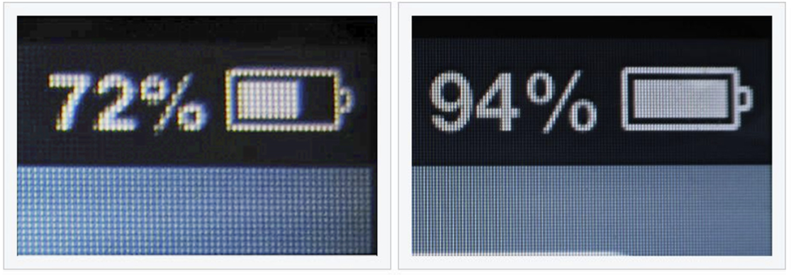
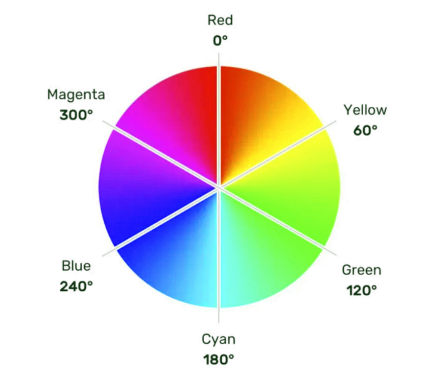
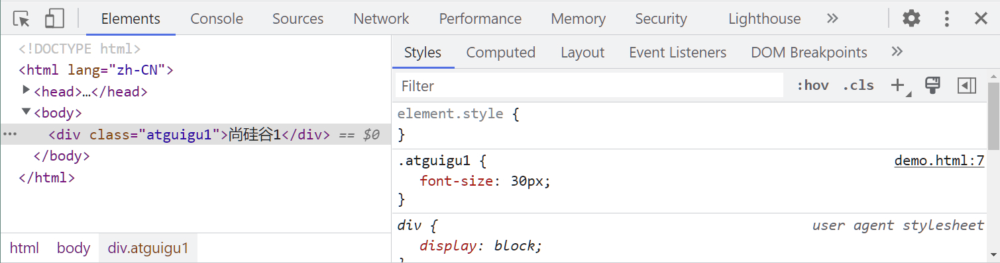

## 1. 像素的概念

- 概念：我们的电脑屏幕是，是由一个一个“小点”组成的，每个“小点”，就是一个像素（px）。

- 规律：像素点越小，呈现的内容就越清晰、越细腻。

  

  > [!tip]
  >
  > 注意点：如果电脑设置中开启了缩放，那么就会影响一些工具的测量结果，但这无所谓，因为我们工作中都是参考详细的设计稿，去给元素设置宽高。
  
- 示例：

  :::normal-demo 演示

  ```html
  <!DOCTYPE html>
  <html lang="zh-CN">
  <head>
      <meta charset="UTF-8">
      <title>像素</title>
      <style>
          .atguigu1 {
              width: 1cm;
              height: 1cm;
              background-color: red;
          }
          .atguigu2 {
              width: 1mm;
              height: 1mm;
              background-color: green;
          }
          .atguigu3 {
              width: 100px;
              height: 100px;
              background-color: blue;
          }
      </style>
  </head>
  <body>
      <div class="atguigu1"></div>
      <br>
      <div class="atguigu2"></div>
      <br>
      <div class="atguigu3"></div>
  </body>
  </html>
  ```

  

  :::

## 2. 颜色的表示
### 2.1 表示方式一：颜色名

- 编写方式：直接使用颜色对应的英文单词，编写比较简单，例如：

  1. **<span style="color: red;">红色：red</span>**

  2. **<span style="color: green;">绿色：green</span>**

  3. **<span style="color: blue;">蓝色：blue</span>**

  4. **<span style="color: purple;">紫色：purple</span>**

  5. **<span style="color: orange;">橙色：orange</span>**

  6. **<span style="color: gray;">灰色：gray</span>**

     ……

  > [!tip]
  >
  > 1. 颜色名这种方式，表达的颜色比较单一，所以用的并不多。
  >
  > 2. 具体颜色名参考 MDN 官方文档：
  >
  >    [CSS：层叠样式表 | MDN (mozilla.org)](https://developer.mozilla.org/zh-CN/docs/Web/CSS/named-color)
  
- 示例：

  :::normal-demo 演示

  ```html
  <!DOCTYPE html>
  <html lang="zh-CN">
  <head>
      <meta charset="UTF-8">
      <title>颜色_第1种表示_颜色名</title>
      <style>
          h2 {
              color:red;
          }
      </style>
  </head>
  <body>
      <h2>尚硅谷</h2>
  </body>
  </html>
  ```

  

  :::

### 2.2 表示方式二：rgb 或 rgba

- 编写方式：使用 **红、黄、蓝** 这三种光的三原色进行组合。

  - **<span style="color: red;">r</span>** 表示 **<span style="color: red;">红色</span>** 
  - **<span style="color: green;">g</span>** 表示 **<span style="color: green;">绿色</span>** 
  - **<span style="color: blue;">b</span>** 表示 **<span style="color: blue;">蓝色</span>**
  - **a** 表示 **透明度** 

- 举例：

  ```css
  /* 使用 0~255 之间的数字表示一种颜色 */
  color: rgb(255, 0, 0);/* 红色 */
  color: rgb(0, 255, 0);/* 绿色 */
  color: rgb(0, 0, 255);/* 蓝色 */
  color: rgb(0, 0, 0);/* 黑色 */
  color: rgb(255, 255, 255);/* 白色 */
  
  /* 混合出任意一种颜色 */
  color:rgb(138, 43, 226) /* 紫罗兰色 */
  color:rgba(255, 0, 0, 0.5);/* 半透明的红色 */
  
  /* 也可以使用百分比表示一种颜色（用的少） */
  color: rgb(100%, 0%, 0%);/* 红色 */
  color: rgba(100%, 0%, 0%,50%);/* 半透明的红色 */
  ```

- 小规律：

  > [!tip]
  >
  > 1. 若三种颜色值相同，呈现的是灰色，值越大，灰色越浅。
  > 2. <span style="color: #e96900;">rgb(0, 0, 0)</span> 是黑色， <span style="color: #e96900;">rgb(255, 255,255)</span> 是白色。
  > 3. 对于 <span style="color: #e96900;">rbga</span> 来说，前三位的 <span style="color: #e96900;">rgb</span> 形式要保持一致，要么都是 <span style="color: #e96900;">0~255</span> 的数字，要么都是 <span style="color: #e96900;">百分比</span>  。
  
- 示例：

  :::normal-demo 演示

  ```html
  <!DOCTYPE html>
  <html lang="zh-CN">
  <head>
      <meta charset="UTF-8">
      <title>颜色_第2种表示_rgb或rgba</title>
      <style>
          .atguigu1 {
              color: rgb(255,0,0);
          }
          .atguigu2 {
              color: rgb(0,255,0);
          }
          .atguigu3 {
              color: rgb(0,0,255);
          }
          .atguigu4 {
              color: rgb(138,43,226);
          }
          .atguigu5 {
              color: rgb(100%,0%,0%);
          }
          .atguigu6 {
              color: rgba(255,0,0,0.5);
          }
          .atguigu7 {
              color: rgba(59, 79, 189, 0.505)
          }
      </style>
  </head>
  <body>
      <h2 class="atguigu1">尚硅谷1</h2>
      <h2 class="atguigu2">尚硅谷2</h2>
      <h2 class="atguigu3">尚硅谷3</h2>
      <h2 class="atguigu4">尚硅谷4</h2>
      <h2 class="atguigu5">尚硅谷5</h2>
      <h2 class="atguigu6">尚硅谷6</h2>
      <h2 class="atguigu7">尚硅谷7</h2>
  </body>
  </html>
  ```

  

  :::

### 2.3 表示方式三：HEX 或 HEXA

<span style="color: #e96900;">HEX</span> 的原理同与 <span style="color: #e96900;">rgb</span> 一样，依然是通过：**<span style="color: red;">红</span>**、**<span style="color: green;">绿</span>**、**<span style="color: blue;">蓝色</span>** 进行组合，只不过要用 **6位（分成3组）** 来表达，

格式为： **#<span style="color: red;">rr</span><span style="color: green;">gg</span><span style="color: blue;">bb</span>** 

> [!tip]
>
> 每一位数字的取值范围是： <span style="color: #e96900;">0 ~ f</span> ，即：（ <span style="color: #e96900;">0, 1, 2, 3, 4, 5, 6, 7, 8, 9, a, b, c, d, e, f</span> ）
>
> 所以每一种光的最小值是： <span style="color: #e96900;">00</span> ，最大值是： <span style="color: #e96900;">ff</span>

```css
color: #ff0000;/* 红色 */
color: #00ff00;/* 绿色 */
color: #0000ff;/* 蓝色 */
color: #000000;/* 黑色 */
color: #ffffff;/* 白色 */

/* 如果每种颜色的两位都是相同的，就可以简写*/
color: #ff9988;/* 可简为：#f98 */

/* 但要注意前三位简写了，那么透明度就也要简写 */
color: #ff998866;/* 可简为：#f986 */
```


> [!tip]
>
> 注意点： <span style="color: #e96900;">IE</span> 浏览器不支持 <span style="color: #e96900;">HEXA</span> ，但支持 <span style="color: #e96900;">HEX</span> 。

示例：

:::normal-demo 演示

```html
<!DOCTYPE html>
<html lang="zh-CN">
<head>
    <meta charset="UTF-8">
    <title>颜色_第3种表示_HEX或HEXA</title>
    <style>
        .atguigu1 {
            color: #ff0000;
        }
        .atguigu2 {
            color: #00ff00;
        }
        .atguigu3 {
            color: #0000ff;
        }
        .atguigu4 {
            color: #87ceebff;
        }
        .atguigu5 {
            color: #D41504;
        }
    </style>
</head>
<body>
    <h2 class="atguigu1">尚硅谷1</h2>
    <h2 class="atguigu2">尚硅谷2</h2>
    <h2 class="atguigu3">尚硅谷3</h2>
    <h2 class="atguigu4">尚硅谷4</h2>
    <h2 class="atguigu5">尚硅谷5</h2>
</body>
</html>
```


:::

### 2.4 表示方式四：HSL 或 HSLA

- <span style="color: #e96900;">HSL</span> 是通过：色相、饱和度、亮度，来表示一个颜色的，格式为： <span style="color: #e96900;">hsl(色相,饱和度,亮度)</span>

  - 色相：取值范围是 <span style="color: #e96900;">0~360</span> 度，具体度数对应的颜色如下图：

    

  - 饱和度：取值范围是 <span style="color: #e96900;">0%~100%</span> 。（向色相中对应颜色中添加灰色， <span style="color: #e96900;">0%</span> 全灰， <span style="color: #e96900;">100%</span> 没有灰）

  - 亮度：取值范围是 <span style="color: #e96900;">0%~100%</span> 。（ <span style="color: #e96900;">0%</span> 亮度没了，所以就是黑色。 <span style="color: #e96900;">100%</span> 亮度太强，所以就是白色了）

- <span style="color: #e96900;">HSLA</span> 其实就是在 <span style="color: #e96900;">HSL</span> 的基础上，添加了透明度。

- 示例：

  :::normal-demo 演示

  ```html
  <!DOCTYPE html>
  <html lang="zh-CN">
  <head>
      <meta charset="UTF-8">
      <title>颜色_第4种表示_HSL或HSLA</title>
      <style>
          .atguigu1 {
              color: hsl(0, 100%, 50%);
          }
          .atguigu2 {
              color: hsl(60, 100%, 50%);
          }
          .atguigu3 {
              color: hsl(120, 100%, 50%);
          }
          .atguigu4 {
              color: hsl(180, 100%, 50%);
          }
          .atguigu5 {
              color: hsl(0, 100%, 50%);
          }
          .atguigu6 {
              color: hsla(0, 100%, 50%, 67.8%);
          }
      </style>
  </head>
  <body>
      <h2 class="atguigu1">尚硅谷1</h2>
      <h2 class="atguigu2">尚硅谷2</h2>
      <h2 class="atguigu3">尚硅谷3</h2>
      <h2 class="atguigu4">尚硅谷4</h2>
      <h2 class="atguigu5">尚硅谷5</h2>
      <h2 class="atguigu6">尚硅谷6</h2>
  </body>
  </html>
  ```

  

  :::

## 3. CSS字体属性

### 3.1 字体大小

- 属性名： <span style="color: #e96900;">font-size</span>

- 作用：控制字体的大小。

- 语法：

  ```css
  div {
      font-size: 40px;
  }
  ```

- 注意点：

  > [!tip]
  >
  > 1. <span style="color: #e96900;">Chrome</span> 浏览器支持的最小文字为 <span style="color: #e96900;">12px</span> （可以调节），默认的文字大小为 <span style="color: #e96900;">16px</span> ，并且 <span style="color: #e96900;">0px</span> 会自动消失。
  >
  > 2. 不同浏览器默认的字体大小可能不一致，所以最好给一个明确的值，不要用默认大小。
  >
  > 3. 通常以给 <span style="color: #e96900;">body</span> 设置 <span style="color: #e96900;">font-size</span> 属性，这样 <span style="color: #e96900;">body</span> 中的其他元素就都可以继承了。

- 调节 <span style="color: #e96900;">Chrome</span> 浏览器支持的最小文字：

  设置 => 外观 => 自定义字体 => 最小字号
  
- 借助控制台看样式：

  
  
- 示例：

  :::normal-demo 演示

  ```html
  <!DOCTYPE html>
  <html lang="zh-CN">
  <head>
      <meta charset="UTF-8">
      <title>01_字体大小</title>
      <style>
          /* body {
              font-size: 20px;
          } */
          .atguigu1 {
              font-size: 40px;
          }
          .atguigu2 {
              font-size: 30px;
          }
          .atguigu3 {
              font-size: 20px;
          }
          .atguigu4 {
              font-size: 12px;
          }
          .atguigu5 {
              /* 浏览器能够接受的最小字体是12px */
              font-size: 3px;
          }
          .atguigu7 {
              font-size: 30px;
          }
          
      </style>
  </head>
  <body>
      <div class="atguigu1">尚硅谷1</div>
      <div class="atguigu2">尚硅谷2</div>
      <div class="atguigu3">尚硅谷3</div>
      <div class="atguigu4">尚硅谷4</div>
      <div class="atguigu5">尚硅谷5</div>
      <div>尚硅谷6</div>
      <div class="atguigu7">尚硅谷7</div>
  </body>
  </html>
  ```

  

  :::

### 3.2 字体族

- 属性名： <span style="color: #e96900;">font-family</span>

- 作用：控制字体类型。

- 语法：

  ```css
  div {
      font-family: "STCaiyun", "Microsoft YaHei", sans-serif
  }
  ```

- 注意：

  > [!tip]
  >
  > 1. 使用字体的英文名字兼容性会更好，具体的英文名可以自行查询，或在电脑的设置里去寻找。
  >
  >    设置 => 个性化 => 字体
  >
  > 2. 如果字体名包含空格，必须使用引号包裹起来。
  >
  > 3. 可以设置多个字体，按照从左到右的顺序逐个查找，找到就用，没有找到就使用后面的，且通常在最后写上 <span style="color: #e96900;">serif </span>（衬线字体）或 <span style="color: #e96900;">sans-serif</span> （非衬线字体）。
  >
  > 4. <span style="color: #e96900;">windows</span> 系统中，默认的字体就是微软雅黑。
  
- 示例：

  :::normal-demo 演示

  ```html
  <!DOCTYPE html>
  <html lang="zh-CN">
  <head>
      <meta charset="UTF-8">
      <title>02_字体族</title>
      <style>
          .atguigu1 {
              font-size: 100px;
              font-family: "微软雅黑";
          }
          .atguigu2 {
              font-size: 100px;
              font-family: "楷体";
          }
          .atguigu3 {
              font-size: 100px;
              font-family: "宋体";
          }
          .atguigu4 {
              font-size: 100px;
              font-family: "华文彩云";
          }
          .atguigu5 {
              font-size: 100px;
              font-family: "翩翩体-简","华文彩云","华文琥珀","微软雅黑";
          }
          .atguigu6 {
              font-size: 100px;
              font-family: "HanziPen SC","STCaiyun","STHupo","Microsoft YaHei",sans-serif;
          }
      </style>
  </head>
  <body>
      <div class="atguigu1">尚硅谷1</div>
      <div class="atguigu2">尚硅谷2</div>
      <div class="atguigu3">尚硅谷3</div>
      <div class="atguigu4">尚硅谷4</div>
      <div class="atguigu5">尚硅谷5</div>
      <div class="atguigu6">尚硅谷6</div>
  </body>
  </html>
  ```

  

  :::

### 3.3 字体风格

- 属性名： <span style="color: #e96900;">font-style</span>

- 作用：控制字体是否为斜体。

- 常用值：

  1. <span style="color: #e96900;">normal</span> ：正常（默认值）
  2. <span style="color: #e96900;">italic</span> ：斜体（使用字体自带的斜体效果）
  3. <span style="color: #e96900;">oblique</span> ：斜体（强制倾斜产生的斜体效果）

  > [!tip]
  >
  > 实现斜体时，更推荐使用 <span style="color: #e96900;">italic</span> 。

- 语法：

  ```css
  div {
      font-style: italic;
  }
  ```

- 示例：

  :::normal-demo 演示

  ```html
  <!DOCTYPE html>
  <html lang="zh-CN">
  <head>
      <meta charset="UTF-8">
      <title>03_字体风格</title>
      <style>
          .atguigu1 {
              font-size: 100px;
              font-style: normal;
          }
          .atguigu2 {
              font-size: 100px;
              font-style: italic;
          }
          .atguigu3 {
              font-size: 100px;
              font-style: oblique;
          }
          em {
              font-size: 100px;
              font-style: normal;
          }
      </style>
  </head>
  <body>
      <div class="atguigu1">尚硅谷1</div>
      <div class="atguigu2">尚硅谷2</div>
      <div class="atguigu3">尚硅谷3</div>
      <em>尚硅谷4</em>
  </body>
  </html>
  ```

  

  :::

### 3.4 字体粗细

- 属性名： <span style="color: #e96900;">font-weight</span>

- 作用：控制字体的粗细。

- 常用值：

  - 关键词：

    > [!tip]
    >
    > 1. <span style="color: #e96900;">lighter</span> ：细
    > 2. <span style="color: #e96900;">normal</span> ： 正常
    > 3. <span style="color: #e96900;">bold</span> ：粗
    > 4. <span style="color: #e96900;">bolder</span> ：很粗 （多数字体不支持）

  - 数值：

    > [!tip]
    >
    > 1. <span style="color: #e96900;">100~1000</span> 且无单位，数值越大，字体越粗 （或一样粗，具体得看字体设计时的
    >
    > 精确程度）。
    >
    > 2. <span style="color: #e96900;">100~300</span> 等同于<span style="color: #e96900;"> lighter</span> ， <span style="color: #e96900;">400~500</span> 等同于 <span style="color: #e96900;">normal</span> ， <span style="color: #e96900;">600</span> 及以上等同于<span style="color: #e96900;">bold</span> 。

- 语法：

  ```css
  div {
      font-weight: bold;
  }
  
  div {
      font-weight: 600;
  }
  ```

- 示例：

  :::normal-demo 演示

  ```html
  <!DOCTYPE html>
  <html lang="zh-CN">
  <head>
      <meta charset="UTF-8">
      <title>04_字体粗细</title>
      <style>
          div {
              font-size: 100px;
          }
          .atguigu1 {
              font-weight: lighter;
          }
          .atguigu2 {
              font-weight: normal;
          }
          .atguigu3 {
              font-weight: bold;
          }
          .atguigu4 {
              font-weight: bolder;
          }
          .atguigu5 {
              font-weight: 600;
          }
      </style>
  </head>
  <body>
      <div class="atguigu1">尚硅谷1</div>
      <div class="atguigu2">尚硅谷2</div>
      <div class="atguigu3">尚硅谷3</div>
      <div class="atguigu4">尚硅谷4</div>
      <div class="atguigu5">尚硅谷5</div>
  </body>
  </html>
  ```

  

  :::

### 3.5 字体复合写法

- 属性名： <span style="color: #e96900;">font</span> ，可以把上述字体样式合并成一个属性。

- 作用：将上述所有字体相关的属性复合在一起编写。

- 编写规则：
  1. 字体大小、字体族必须都写上。
  2. 字体族必须是最后一位、字体大小必须是倒数第二位。
  3. 各个属性间用空格隔开。
  
- 实际开发中更推荐复合写法，但这也不是绝对的，比如只想设置字体大小，那就直接用 <span style="color: #e96900;">font-size</span> 属性。

- 示例

  :::normal-demo 演示

  ```html
  <!DOCTYPE html>
  <html lang="zh-CN">
  <head>
      <meta charset="UTF-8">
      <title>05_字体复合属性</title>
      <style>
          .atguigu {
              font: bold italic 100px "STCaiyun","STHupo",sans-serif;
          }
      </style>
  </head>
  <body>
      <div class="atguigu">尚硅谷</div>
  </body>
  </html>
  ```

  

  :::

## 4. CSS文本属性

### 4.1 文本颜色

- 属性名： <span style="color: #e96900;">color</span>

- 作用：控制文字的颜色。

- 可选值：

  1. 颜色名
  2. <span style="color: #e96900;">rgb</span> 或 <span style="color: #e96900;">rgba</span>
  3. <span style="color: #e96900;">HEX</span> 或 <span style="color: #e96900;">HEXA</span> （十六进制）
  4. <span style="color: #e96900;">HSL</span> 或 <span style="color: #e96900;">HSLA</span>

  > [!tip]
  >
  > 开发中常用的是： <span style="color: #e96900;">rgb/rgba</span> 或 <span style="color: #e96900;">HEX/HEXA</span> （十六进制）。

- 举例：

  ```css
  div {
      color: rgb(112,45,78);
  }
  ```

- 示例

  :::normal-demo 演示

  ```html
  <!DOCTYPE html>
  <html lang="zh-CN">
  <head>
      <meta charset="UTF-8">
      <title>01_文本颜色</title>
      <style>
          div {
              font-size: 90px;
          }
          .atguigu1 {
              color: red;
          }
          .atguigu2 {
              color: rgb(255, 0, 0);
          }
          .atguigu3 {
              color: rgba(255, 0, 0, .5);
          }
          .atguigu4 {
              color: #00f;
          }
          .atguigu5 {
              color: #00f8;
          }
          .atguigu6 {
              color: hsl(0, 100%, 50%);
          }
          .atguigu7 {
              color: hsla(0, 100%, 50%, .5);
              background-color: orange;
          }
      </style>
  </head>
  <body>
      <div class="atguigu1">尚硅谷1</div>
      <div class="atguigu2">尚硅谷2</div>
      <div class="atguigu3">尚硅谷3</div>
      <div class="atguigu4">尚硅谷4</div>
      <div class="atguigu5">尚硅谷5</div>
      <div class="atguigu6">尚硅谷6</div>
      <div class="atguigu7">尚硅谷7</div>
  </body>
  </html>
  ```

  

  :::

### 4.2 文本间距

- 字母间距： <span style="color: #e96900;">letter-spacing</span> 

- 单词间距：<span style="color: #e96900;"> word-spacing</span> （通过空格识别词）

- 属性值为像素（ <span style="color: #e96900;">px</span> ），正值让间距增大，负值让间距缩小。

- 示例：

  :::normal-demo 演示

  ```html
  <!DOCTYPE html>
  <html lang="zh-CN">
  <head>
      <meta charset="UTF-8">
      <title>02_文本间距</title>
      <style>
          div {
              font-size: 30px;
          }
          .atguigu2 {
              /* 字母间距 */
              letter-spacing: 20px;
          }
          .atguigu3 {
              /* 单词间距 */
              word-spacing: 20px;
          }
      </style>
  </head>
  <body>
      <div>You got a dream, you gotta protect it.尚硅谷1</div>
      <div class="atguigu2">You got a dream, you gotta protect it.尚硅谷2</div>
      <div class="atguigu3">You got a dream, you gotta protect it.尚硅谷3</div>
  </body>
  </html>
  ```

  

  :::

### 4.3 文本修饰

- 属性名： text-decoration

- 作用：控制文本的各种装饰线。

- 可选值：

  1. <span style="color: #e96900;">none</span> ： 无装饰线（常用）
  2. <span style="color: #e96900;">underline</span> ：下划线（常用）
  3. <span style="color: #e96900;">overline</span> ： 上划线
  4. <span style="color: #e96900;">line-through</span> ： 删除线

  可搭配如下值使用：

  1. <span style="color: #e96900;">dotted</span> ：虚线
  2. <span style="color: #e96900;">wavy</span> ：波浪线
  3. 也可以指定颜色

- 举例：

  ```css
  a {
      text-decoration: none;
  }
  ```

- 示例：

  :::normal-demo 演示

  ```html
  <!DOCTYPE html>
  <html lang="zh-CN">
  <head>
      <meta charset="UTF-8">
      <title>03_文本修饰</title>
      <style>
          div {
              font-size: 40px;
          }
          .atguigu1 {
              /* 上划的绿色虚线 */
              text-decoration:overline dotted green;
          }
          .atguigu2 {
              /* 下划的红色波浪线 */
              text-decoration: underline wavy red;
          }
          .atguigu3 {
              /* 删除线 */
              text-decoration: line-through;
          }
          .atguigu4,ins,del {
              font-size: 40px;
              /* 没有各种线 */
              text-decoration: none;
          }
      </style>
  </head>
  <body>
      <div class="atguigu1">尚硅谷1</div>
      <div class="atguigu2">尚硅谷2</div>
      <div class="atguigu3">尚硅谷3</div>
      <a class="atguigu4" href="https://www.baidu.com">尚硅谷4</a>
      <ins>测试1</ins>
      <del>测试2</del>
  </body>
  </html>
  ```

  

  :::

### 4.4 文本缩进

- 属性名： text-indent 。

- 作用：控制文本首字母的缩进。

- 属性值： css 中的长度单位，例如： px

- 举例：

  ```css
  div {
      text-indent: 40px;
  }
  ```

- 示例：

  :::normal-demo 演示

  ```html
  <!DOCTYPE html>
  <html lang="zh-CN">
  <head>
      <meta charset="UTF-8">
      <title>04_文本缩进</title>
      <style>
          div {
              font-size: 60px;
              text-indent: 120px;
          }
      </style>
  </head>
  <body>
      <div>欢迎来到尚硅谷学习！欢迎来到尚硅谷学习！欢迎来到尚硅谷学习！欢迎来到尚硅谷学习！欢迎来到尚硅谷学习！</div>
  </body>
  </html>
  ```

  

  :::

> [!tip]
>
> 后面我们会学习 <span style="color: #e96900;">css</span> 中一些新的长度单位，目前我们只知道像素( <span style="color: #e96900;">px</span> )。

### 4.5 文本对齐_水平

- 属性名： <span style="color: #e96900;">text-align</span> 。

- 作用：控制文本的水平对齐方式。

- 常用值：

  1. <span style="color: #e96900;">left</span> ：左对齐（默认值）
  2. <span style="color: #e96900;">right</span> ：右对齐
  3. <span style="color: #e96900;">center</span> ：居中对齐

- 举例：

  ```css
  div {
      text-align: center;
  }
  ```

- 示例：

  :::normal-demo 演示

  ```html
  <!DOCTYPE html>
  <html lang="zh-CN">
  <head>
      <meta charset="UTF-8">
      <title>05_文本对齐_水平</title>
      <style>
          div {
              font-size: 40px;
              background-color: orange;
              text-align: right;
          }
      </style>
  </head>
  <body>
      <div>尚硅谷</div>
  </body>
  </html>
  ```

  

  :::

### 4.6 细说 font-size

1. 由于字体设计原因，文字最终呈现的大小，并不一定与 <span style="color: #e96900;">font-size</span> 的值一致，可能大，也可能小。

   > [!tip]
   >
   > 例如： <span style="color: #e96900;">font-size</span> 设为 <span style="color: #e96900;">40px</span> ，最终呈现的文字，可能比 <span style="color: #e96900;">40px</span> 大，也可能比 <span style="color: #e96900;">40px</span> 小。

2. 通常情况下，文字相对字体设计框，并不是垂直居中的，通常都靠下 一些。

3. 示例：

   :::normal-demo 演示

   ```html
   <!DOCTYPE html>
   <html lang="zh-CN">
   <head>
       <meta charset="UTF-8">
       <title>06_细说font-size</title>
       <style>
           div {
               font-size: 40px;
               background-color: skyblue;
               font-family: "翩翩体-简";
           }
       </style>
   </head>
   <body>
       <div>atguigux尚硅谷</div>
       <span style="font-size: 40px; font-family: 微软雅黑;">尚</span>
       <span style="font-size: 40px; font-family: 隶书;">尚</span>
       <span style="font-size: 40px; font-family: 翩翩体-简;">尚</span>
   </body>
   </html>
   ```

   

   :::

### 4.7 行高

- 属性名： <span style="color: #e96900;">line-height</span>

- 作用：控制一行文字的高度。

- 可选值：

  1. <span style="color: #e96900;">normal</span> ：由浏览器根据文字大小决定的一个默认值。
  2. 像素( <span style="color: #e96900;">px</span> )。
  3. <span style="color: #e96900;">数字</span>：参考自身 <span style="color: #e96900;">font-size</span> 的倍数（很常用）。
  4. <span style="color: #e96900;">百分比</span>：参考自身 <span style="color: #e96900;">font-size</span> 的百分比

- 备注：由于字体设计原因，文字在一行中，并不是绝对垂直居中，若一行中都是文字，不会太影响观感。

- 举例：

  ```css
  div {
      line-height: 60px;
      line-height: 1.5;
      line-height: 150%;
  }
  ```

- 示例：

  :::normal-demo 演示

  ```html
  <!DOCTYPE html>
  <html lang="zh-CN">
  <head>
      <meta charset="UTF-8">
      <title>07_行高</title>
      <style>
          #d1 {
              font-size: 40px;
              background-color: skyblue;
  
              /* 第一种写法，值为像素 */
              /* line-height: 40px; */
  
              /* 第二种写法，值为normal */
              /* line-height: normal; */
  
              /* 第三种写法，值为数值 —— 用的比较多 */
              line-height: 1.5;
  
              /* 第四种写法，值为百分比 */
              /* line-height: 150%; */
  
          }
      </style>
  </head>
  <body>
      <div id="d1">atguigux尚硅谷让天下没有难掉的头发atguigu尚硅谷让天下没有难掉的头发atguigu尚硅谷让天下没有难掉的头发atguigu尚硅谷让天下没有难掉的头发atguigu尚硅谷让天下没有难掉的头发atguigu尚硅谷让天下没有难掉的头发atguigu尚硅谷让天下没有难掉的头发</div>
  </body>
  </html>
  ```

  

  :::

- 行高注意事项：

  > [!tip]
  >
  > 1. <span style="color: #e96900;">line-height</span> 过小会怎样？—— 文字产生重叠，且最小值是 <span style="color: #e96900;">0</span> ，不能为负数。
  >
  > 2. <span style="color: #e96900;">line-height</span> 是可以继承的，且为了能更好的呈现文字，最好写数值。
  >
  > 3. <span style="color: #e96900;">line-height</span> 和 <span style="color: #e96900;">height</span> 是什么关系？
  >
  >    - 设置了 <span style="color: #e96900;">height</span> ，那么高度就是 <span style="color: #e96900;">height</span> 的值。
  >
  >    - 不设置 <span style="color: #e96900;">height</span> 的时候，会根据 <span style="color: #e96900;">line-height</span> 计算高度。

- 应用场景：

  1. 对于多行文字：控制行与行之间的距离。

  2. 对于单行文字：让 <span style="color: #e96900;">height</span> 等于 <span style="color: #e96900;">line-height</span> ，可以实现文字垂直居中。

     > [!tip]
     >
     > 备注：由于字体设计原因，靠上述办法实现的居中，并不是绝对的垂直居中，但如果一行中都是文字，不会太影响观感。
  
- 示例：

  :::normal-demo 演示

  ```html
  <!DOCTYPE html>
  <html lang="zh-CN">
  <head>
      <meta charset="UTF-8">
      <title>08_行高_注意事项</title>
      <style>
          /* 注意点1：行高过小会怎样？ —— 文字重叠，且最小值是0，不能为负数。 */
          #d1 {
              font-size: 40px;
              background-color: skyblue;
              line-height: 0px;
          }
  
          /* 注意点2：行高是可以继承的 */
          #d2 {
              font-size: 40px;
              background-color: orange;
              line-height: 1.5;
          }
          span {
              font-size: 200px;
              color: red;
          }
  
          /* 注意点3：line-height和height是什么关系 
              设置了height，高度就是height的值。
              没有设置height，高度就是line-height*行数
          */
          #d3 {
              font-size: 40px;
              background-color: yellowgreen;
              line-height: 100px;
          }
  
          #d4 {
              font-size: 40px;
              background-color: skyblue;
              line-height: 0px;
          }
  
          /* 行高的应用场景1：调整多行文字的间距 */
          #d5 {
              font-size: 40px;
              background-color: skyblue;
              line-height: 100px;
          }
  
          /* 行高的应用场景2：单行文字的垂直居中 */
          #d6 {
              font-size: 40px;
              background-color: skyblue;
              height: 300px;
              line-height: 300px;
          }
  
      </style>
  </head>
  <body>
      <div id="d1">atguigu尚硅谷让天下没有难学的技术atguigu尚硅谷让天下没有难学的技术atguigu尚硅谷让天下没有难学的技术atguigu尚硅谷让天下没有难学的技术atguigu尚硅谷让天下没有难学的技术atguigu尚硅谷让天下没有难学的技术atguigu尚硅谷让天下没有难学的技术</div>
      <br>
      <hr>
      <br>
      <div id="d2">atguigu尚硅谷让天下没有难学的技术atguigu尚硅谷让天下没有难学的技术atguigu尚硅谷让天下没有难学的技术atguigu<span>尚硅谷</span>让天下没有难学的技术atguigu尚硅谷让天下没有难学的技术atguigu尚硅谷让天下没有难学的技术atguigu尚硅谷让天下没有难学的技术</div>
      <br>
      <hr>
      <br>
      <div id="d3">atguigu尚硅谷让天下没有难学的技术atguigu尚硅谷让天下没有难学的技术atguigu尚硅谷让天下没有难学的技术atguigu尚硅谷让天下没有难学的技术</div>
      <br>
      <hr>
      <br>
      <div id="d4">atguigu尚硅谷让天下没有难学的技术atguigu尚硅谷让天下没有难学的技术atguigu尚硅谷让天下没有难学的技术atguigu尚硅谷让天下没有难学的技术</div>
      <br>
      <hr>
      <br>
      <div id="d5">atguigu尚硅谷让天下没有难学的技术atguigu尚硅谷让天下没有难学的技术atguigu尚硅谷让天下没有难学的技术atguigu尚硅谷让天下没有难学的技术</div>
      <br>
      <hr>
      <br>
      <div id="d6">atguigu尚硅谷让天下没有难学的技术x</div>
  </body>
  </html>
  ```

  

  :::

### 4.8  文本对齐_垂直

- **顶部：** 无需任何属性，在垂直方向上，默认就是顶部对齐。

- **居中：** 对于单行文字，让 height = line-height 即可。

   > [!tip]
   >
   > 问题：多行文字 **垂直居中** 怎么办？—— 后面我们用定位去做。

- **底部：** 对于单行文字，目前一个临时的方式：

   - 让 <span style="color: #e96900;">line-height = ( height × 2 ) - font-size - x</span> 。

   - 示例：

     :::normal-demo 演示

     ```html
     <!DOCTYPE html>
     <html lang="zh-CN">
     <head>
         <meta charset="UTF-8">
         <title>09_文本对齐_垂直</title>
         <style>
             div {
                 font-size: 40px;
                 height: 400px;
                 line-height: 745px;
                 background-color: skyblue;
             }
         </style>
     </head>
     <body>
         <div>atguigu尚硅谷</div>
     </body>
     </html>
     ```

     

     :::

   - 备注： <span style="color: #e96900;">x</span> 是根据字体族，动态决定的一个值。

   > [!tip]
   >
   > 问题：垂直方向上的底部对齐，更好的解决办法是什么？—— 后面我们用定位去做。

### 4.9 vertical-align

- 属性名： <span style="color: #e96900;">vertical-align</span> 。

- 作用：用于指定 **<span style="color: red;">同一行元素之间</span>**，或 **<span style="color: red;">表格单元格</span>** 内文字的 **<span style="color: red;">垂直对齐方式</span>**。

- 常用值：

  1. <span style="color: #e96900;">baseline</span> （默认值）：使元素的基线与父元素的基线对齐。
  2. <span style="color: #e96900;">top</span> ：使元素的 **<span style="color: red;">顶部</span>** 与其 **<span style="color: red;">所在行的顶部</span>** 对齐。
  3. <span style="color: #e96900;">middle</span> ：使元素的 **<span style="color: red;">中部</span>** 与 **<span style="color: red;">父元素的基线</span>** 加上父元素 **<span style="color: red;">字母 x 的一半</span>** 对齐。
  4. <span style="color: #e96900;">bottom</span> ：使元素的 **<span style="color: red;">底部</span>** 与其 **<span style="color: red;">所在行的底部</span>** 对齐。

  > [!tip]
  >
  > 特别注意： <span style="color: #e96900;">vertical-align</span> 不能控制块元素。
  
- 示例：

  :::normal-demo 演示

  ```html
  <!DOCTYPE html>
  <html lang="zh-CN">
  <head>
      <meta charset="UTF-8">
      <title>10_vertical-align</title>
      <style>
          div {
              font-size: 100px;
              height: 300px;
              background-color: skyblue;
          }
          span {
              font-size: 40px;
              background-color: orange;
              vertical-align: middle;
          }
          img {
              height: 30px;
              vertical-align: top;
          }
          .san {
              vertical-align: bottom;
          }
      </style>
  </head>
  <body>
      <div>
          atguigu尚硅谷x<span>x前端</span>
      </div>
      <hr>
      <div>
          atguigu尚硅谷x
      </div>
      <hr>
      <table border="1" cellspacing="0">
          <caption>人员信息</caption>
          <thead>
              <tr>
                  <th>姓名</th>
                  <th>年龄</th>
                  <th>性别</th>
              </tr>
          </thead>
          <tbody>
              <tr height="200">
                  <td class="san">张三</td>
                  <td>18</td>
                  <td>男</td>
              </tr>
              <tr>
                  <td>李四</td>
                  <td>20</td>
                  <td>女</td>
              </tr>
          </tbody>
      </table>
  </body>
  </html>
  ```

  

  :::

## 5. CSS列表属性

列表相关的属性，可以作用在 <span style="color: #e96900;">ul</span> 、 <span style="color: #e96900;">ol</span> 、 <span style="color: #e96900;">li</span> 元素上。

| CSS 属性名                                               | 功能               | 属性值                                                       |
| -------------------------------------------------------- | ------------------ | ------------------------------------------------------------ |
| <span style="color: #e96900;"> list-style-type</span>    | 设置列表符号       | 常用值如下：<br><span style="color: #e96900;">none</span> ：不显示前面的标识（很常用！）<br/><span style="color: #e96900;">square</span> ：实心方块<br/><span style="color: #e96900;"> disc</span> ：圆形<br/><span style="color: #e96900;">decimal</span> ：数字<br/><span style="color: #e96900;">lower-roman</span> ：小写罗马字<br/><span style="color: #e96900;">upper-roman</span> ：大写罗马字<br><span style="color: #e96900;"> lower-alpha</span> ：小写字母<br/><span style="color: #e96900;">upper-alpha</span> ：大写字母 |
| <span style="color: #e96900;">list-style-position</span> | 设置列表符号的位置 | <span style="color: #e96900;">inside</span> ：在 <span style="color: #e96900;">li</span> 的里面<br><span style="color: #e96900;">outside</span> ：在 <span style="color: #e96900;">li</span> 的外边 |
| <span style="color: #e96900;">list-style-image</span>    | 自定义列表符号     | <span style="color: #e96900;">url(图片地址)</span>           |
| <span style="color: #e96900;">list-style</span>          | 复合属性           | 没有数量、顺序的要求                                         |

示例：

:::normal-demo 演示

```html
<!DOCTYPE html>
<html lang="zh-CN">
<head>
    <meta charset="UTF-8">
    <title>列表相关属性</title>
    <style>
        ul {
            /* 列表符号 */
            /* list-style-type: decimal; */
            /* 列表符号的位置 */
            /* list-style-position: inside; */
            /* 自定义列表符号 */
            /* list-style-image: url("../images/front_end/video.gif"); */
            /* 复合属性 */
            list-style: decimal url("../images/front_end/video.gif") inside;
        }
        li {
            background-color: skyblue;
        }
    </style>
</head>
<body>
    <ul>
        <li>《震惊！两男子竟然在教室做出这种事》</li>
        <li>《一夜暴富指南》</li>
        <li>《给成功男人的五条建议》</li>
    </ul>
</body>
</html>
```


:::

## 6. CSS表格属性

**1.** **边框相关属性（其他元素也能用）：**

| CSS 属性名                                        | 功能         | 属性值                                                       |
| ------------------------------------------------- | ------------ | ------------------------------------------------------------ |
| <span style="color: #e96900;">border-width</span> | 边框宽度     | <span style="color: #e96900;">CSS</span> 中可用的长度值      |
| <span style="color: #e96900;">border-color</span> | 边框颜色     | <span style="color: #e96900;">CSS</span> 中可用的颜色值      |
| <span style="color: #e96900;">border-style</span> | 边框风格     | <span style="color: #e96900;">none</span> 默认值<br><span style="color: #e96900;"> solid</span> 实线<br/><span style="color: #e96900;"> dashed</span> 虚线<br/><span style="color: #e96900;"> dotted</span> 点线<br/><span style="color: #e96900;"> double</span> 双实线 |
| <span style="color: #e96900;">border</span>       | 边框复合属性 | 没有数量、顺序的要求                                         |

示例：

:::normal-demo 演示

```html
<!DOCTYPE html>
<html lang="zh-CN">
<head>
    <meta charset="UTF-8">
    <title>01_边框相关属性</title>
    <style>
        table {
            /* border-width: 2px; */
            /* border-color: green; */
            /* border-style: solid; */
            border:2px green solid;
        }
        td,th {
            border:2px orange solid;
        }
        h2 {
            border:3px red solid;
        }
        span {
            border:3px purple dashed;
        }
    </style>
</head>
<body>
    <h2>边框相关的属性，不仅仅是表格能用，其他元素也能用</h2>
    <span>你要加油呀！</span>
    <table>
        <caption>人员信息</caption>
        <thead>
            <tr>
                <th>序号</th>
                <th>姓名</th>
                <th>年龄</th>
                <th>性别</th>
                <th>政治面貌</th>
            </tr>
        </thead>
        <tbody>
            <tr>
                <td>1</td>
                <td>张三</td>
                <td>18</td>
                <td>男</td>
                <td>党员</td>
            </tr>
            <tr>
                <td>2</td>
                <td>李四</td>
                <td>19</td>
                <td>女</td>
                <td>团员</td>
            </tr>
            <tr>
                <td>3</td>
                <td>王五</td>
                <td>20</td>
                <td>男</td>
                <td>群众</td>
            </tr>
            <tr>
                <td>4</td>
                <td>赵六</td>
                <td>21</td>
                <td>女</td>
                <td>党员</td>
            </tr>
        </tbody>
    </table>
</body>
</html>
```


:::

> [!tip]
>
> 注意：
>
> 1. 以上 <span style="color: #e96900;">4</span> 个边框相关的属性，其他元素也可以用，这是我们第一次遇见它们。
> 2. 在后面的盒子模型中，我们会详细讲解边框相关的知识。

**2.** **表格独有属性（只有 <span style="color: #e96900;">table</span> 标签才能使用）：**

| CSS 属性名                                           | 功能                 | 属性值                                                       |
| ---------------------------------------------------- | -------------------- | ------------------------------------------------------------ |
| <span style="color: #e96900;">table-layout</span>    | 设置列宽度           | <span style="color: #e96900;">auto</span> ：自动，列宽根据内容计算（默认值）。<br><span style="color: #e96900;">fixed</span> ：固定列宽，平均分。 |
| <span style="color: #e96900;">border-spacing</span>  | 单元格间距           | <span style="color: #e96900;">CSS</span> 中可用的长度值。生效的前提：单元格边框不能合并。 |
| <span style="color: #e96900;">border-collapse</span> | 合并单元格边框       | <span style="color: #e96900;">collapse</span> ：合并<br><span style="color: #e96900;">separate</span> ：不合并 |
| <span style="color: #e96900;">empty-cells</span>     | 隐藏没有内容的单元格 | <span style="color: #e96900;">show</span> ：显示，默认<br><span style="color: #e96900;">hide</span> ：隐藏生效前提：单元格不能合并。 |
| <span style="color: #e96900;">caption-side</span>    | 设置表格标题位置     | <span style="color: #e96900;">top</span> ：上面（默认值）<br><span style="color: #e96900;">bottom</span> ：在表格下面 |

> [!tip]
>
> 以上 <span style="color: #e96900;">5</span> 个属性，只有表格才能使用，即： <span style="color: #e96900;">\<table></span> 标签。

示例：

:::normal-demo 演示

```html
<!DOCTYPE html>
<html lang="zh-CN">
<head>
    <meta charset="UTF-8">
    <title>02_表格独有属性</title>
    <style>
        table {
            border:2px green solid;
            width:500px;
            /* 控制表格的列宽 */
            table-layout: fixed;
            /* 控制单元格间距（生效的前提是：不能合并边框） */
            border-spacing: 10px;
            /* 合并相邻的单元格的边框 */
            border-collapse: collapse;
            /* 隐藏没有内容的单元格（生效的前提是：不能合并边框） */
            empty-cells: hide;
            /* 设置表格标题的位置 */
            caption-side: top;
        }
        td,th {
            border:2px orange solid;
        }
        .number {
            width: 50px;
            height: 50px;
        }
    </style>
</head>
<body>
    <table>
        <caption>人员信息</caption>
        <thead>
            <tr>
                <th class="number">序号</th>
                <th>姓名</th>
                <th>年龄</th>
                <th>性别</th>
                <th>政治面貌</th>
            </tr>
        </thead>
        <tbody>
            <tr>
                <td>1</td>
                <td>张三</td>
                <td>18</td>
                <td>男</td>
                <td>党员</td>
            </tr>
            <tr>
                <td>2</td>
                <td>李四</td>
                <td>19</td>
                <td>女</td>
                <td>团员</td>
            </tr>
            <tr>
                <td>3</td>
                <td>王五</td>
                <td>20</td>
                <td></td>
                <td>群众</td>
            </tr>
            <tr>
                <td>4</td>
                <td>赵六</td>
                <td>21</td>
                <td>女</td>
                <td>党员</td>
            </tr>
        </tbody>
    </table>
</body>
</html>
```


:::

## 7. CSS背景属性

| css 属性名                                               | 功能             | 属性值                                                       |
| -------------------------------------------------------- | ---------------- | ------------------------------------------------------------ |
| <span style="color: #e96900;">background-color</span>    | 设置背景颜色     | 符合 <span style="color: #e96900;">CSS</span> 中颜色规范的值。默认背景颜色是 <span style="color: #e96900;">transparent</span> 。 |
| <span style="color: #e96900;">background-image</span>    | 设置背景图片     | <span style="color: #e96900;">url(图片的地址)</span>         |
| <span style="color: #e96900;">background-repeat</span>   | 设置背景重复方式 | <span style="color: #e96900;">repeat</span> ：重复，铺满整个元素，默认值。<br><span style="color: #e96900;">repeat-x</span> ：只在水平方向重复。 <br><span style="color: #e96900;">repeat-y</span> ：只在垂直方向重复。 <br><span style="color: #e96900;">no-repeat</span> ：不重复。 |
| <span style="color: #e96900;">background-position</span> | 设置背景图位置   | **通过关键字设置位置：**<br>写两个值，用空格隔开水平： <span style="color: #e96900;">left</span> 、 <span style="color: #e96900;">center</span> 、 <span style="color: #e96900;">right</span><br>垂直: <span style="color: #e96900;">top</span> 、 <span style="color: #e96900;">center</span> 、 <span style="color: #e96900;">bottom</span><br>如果只写一个值，另一个方向的值取 <span style="color: #e96900;">center</span> <br><br>**通过长度指定坐标位置：** 以元素左上角，为坐标原点，设置图片左上角的位置。<br>两个值，分别是 <span style="color: #e96900;">x</span> 坐标和 <span style="color: #e96900;">y</span> 坐标。只写一个值，会被当做 <span style="color: #e96900;">x</span> 坐标， <span style="color: #e96900;">y</span> 坐标取 <span style="color: #e96900;">center</span> |
| background                                               | 复合属性         | 没有数量和顺序要求                                           |

示例：

:::normal-demo 演示

```html
<!DOCTYPE html>
<html lang="zh-CN">
<head>
    <meta charset="UTF-8">
    <title>背景相关属性</title>
    <style>
        body {
            background-color: gray;
        }
        div {
            width: 400px;
            height: 400px;
            border:5px black solid;
            font-size: 20px;
            /* 设置背景颜色，默认值是transparent */
            background-color: skyblue;
            /* 设置背景图片 */
            background-image: url(../images/front_end/悟空.jpg);
            /* 设置背景图片的重复方式 */
            background-repeat: no-repeat;
            /* 控制背景图片的位置——第一种写法：用关键词 */
            background-position: center;
            /* 控制背景图片的位置——第二种写法：用具体的像素值 */
            background-position: 100px 200px;
            /* 复合属性 */
            background: url(../images/front_end/悟空.jpg) no-repeat 100px 200px;
            
        }
    </style>
</head>
<body>
    <div>你好啊！</div>
</body>
</html>
```


:::

## 8. CSS鼠标属性

| CSS 属性名                                  | 功能               | 属性值                                                       |
| ------------------------------------------- | ------------------ | ------------------------------------------------------------ |
| <span style="color: #e96900;">cursor</span> | 设置鼠标光标的样式 | <span style="color: #e96900;">pointer</span> ：小手 <br><span style="color: #e96900;">move</span> ：移动图标 <br/><span style="color: #e96900;">text</span> ：文字选择器 <br/><span style="color: #e96900;">crosshair</span> ：十字架 <br/><span style="color: #e96900;">wait</span> ：等待<br/><span style="color: #e96900;">help</span> ：帮助 |

> [!tip]
>
> 扩展：自定义鼠标图标
>
> ```css
> /* 自定义鼠标光标 */
> cursor: url("./arrow.png"),pointer;
> ```

示例：

:::normal-demo 演示

```html
<!DOCTYPE html>
<html lang="zh-CN">
<head>
    <meta charset="UTF-8">
    <title>鼠标相关属性</title>
    <style>
        div {
            width: 400px;
            height: 400px;
            background-color: skyblue;
            cursor: url("../images/front_end/arrow.png"),pointer;
        }
        button {
            cursor: pointer;
        }
        input {
            cursor: move;
        }
    </style>
</head>
<body>
    <div>
        把鼠标放进来看一看
        <input type="text">
        <a href="#">百度</a>
        <button>点我</button>
    </div>
</body>
</html>
```


:::

