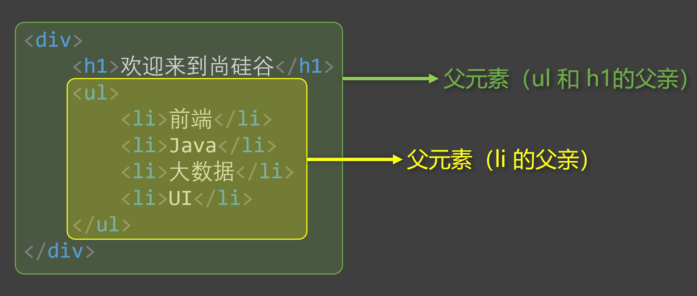
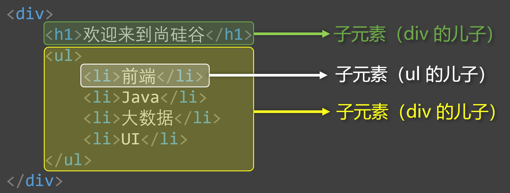
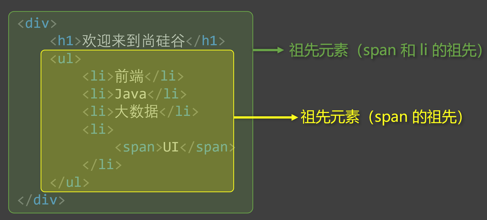
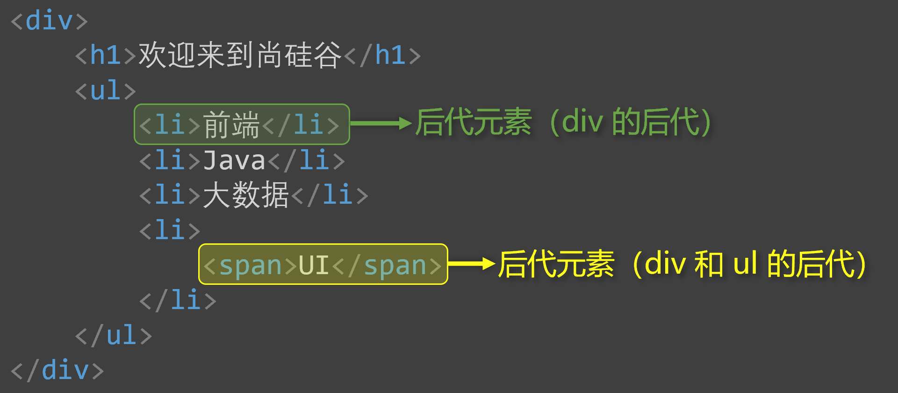
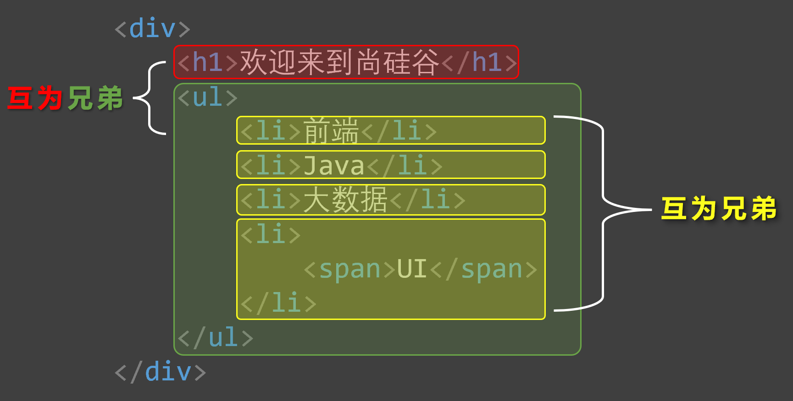
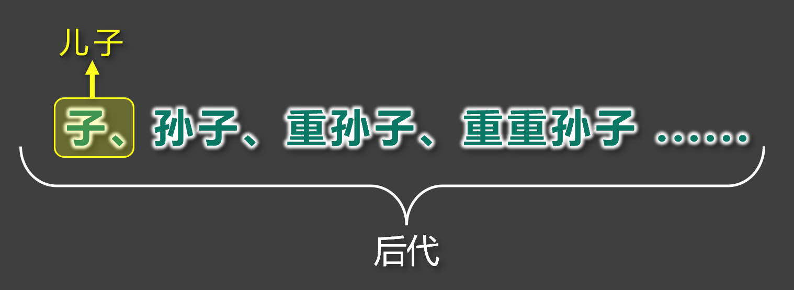
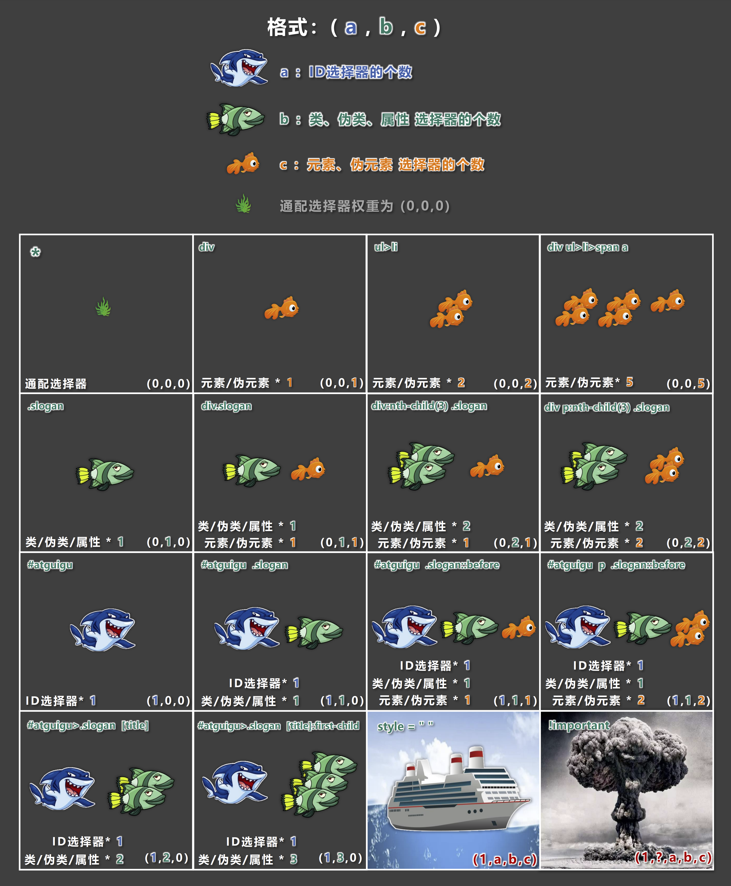
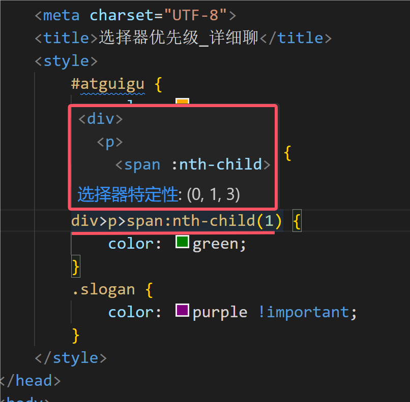

## 1.  CSS基本选择器

1. 通配选择器
2. 元素选择器
3. 类选择器
4. <span style="color: #e96900;">id</span> 选择器

### 1.1  通配选择器

- 作用：可以选中所有的 HTML 元素。

- 语法：

  ```
  * {
   属性名: 属性值
  }
  ```

- 举例：

  ```css
  /* 选中所有元素 */
  * {
      color: orange;
      span-size: 40px;
  }
  ```
  
  :::normal-demo 演示
  
  ```html
  <!DOCTYPE html>
  <html lang="zh-CN">
  <head>
      <meta charset="UTF-8">
      <title>01_通配选择器</title>
      <style>
          * {
              color: orange;
              span-size: 40px;
          }
      </style>
  </head>
  <body>
      <h1>欢迎来到土味官网，土的味道我知道</h1>
      <br>
      <h2>土味情话</h2>
      <h3>作者：优秀的网友们</h3>
      <p>万水千山总是情，爱我多点行不行！</p>
      <p>草莓、蓝莓、蔓越莓，今天你想我了没？</p>
      <p>我心里给你留了一块地，我的死心塌地！</p>
  </body>
  </html>
  ```
  
  
  
  :::

> [!tip]
>
> 备注：目前来看通配选择器貌似有点鸡肋，但后面清除样式时，会对我们有很大帮助，后面会详细讲。

### 1.2  元素选择器

- 作用：为页面中 **某种元素** 统一设置样式。

- 语法：

  ```
  标签名 {
   属性名: 属性值;
  }
  ```

- 举例：

  ```css
  /* 选中所有h1元素 */
  h1 {
      color: orange;
      span-size: 40px;
  }
  
  /* 选中所有p元素 */
  p {
      color: blue;
      span-size: 60px;
  }
  ```

  :::normal-demo 演示

  ```html
  <!DOCTYPE html>
  <html lang="zh-CN">
  <head>
      <meta charset="UTF-8">
      <title>02_元素选择器</title>
      <style>
          h2 {
              color: chocolate;
          }
          h3 {
              color: green;
          }
          p {
              color: red;
          }
          h1 {
             span-size: 50px; 
          }
      </style>
  </head>
  <body>
      <h1>欢迎来到土味官网，土的味道我知道</h1>
      <br>
      <h2>土味情话</h2>
      <h3>作者：优秀的网友们</h3>
      <p>万水千山总是情，爱我多点行不行！</p>
      <p>草莓、蓝莓、蔓越莓，今天你想我了没？</p>
      <p>我心里给你留了一块地，我的死心塌地！</p>
      <br>
      <h2>反杀土味情话</h2>
      <h3>作者：更优秀的网友们</h3>
      <p>一寸光阴一寸金，劝你死了这条心！</p>
      <p>西瓜、南瓜、哈密瓜，把你打成大傻瓜！</p>
      <p>我心里只有一块地，我的玛莎拉蒂！</p>
  </body>
  </html>
  ```

  

  :::

- 备注：元素选择器无法实现 **差异化设置** ，例如上面的代码中，所有的 p 元素效果都一样。

### 1.3  类选择器

- 作用：根据元素的 <span style="color: #e96900;">class</span> 值，来选中某些元素。

  > [!tip]
  >
  > <span style="color: #e96900;">class</span> 翻译过来有：**种类**、**类别** 的含义，所以 class 值，又称：类名。

- 语法：

  ```
  .类名 {
   属性名: 属性值;
  }
  ```

- 举例：

  ```css
  /* 选中所有class值为speak的元素 */
  .speak {
      color: red;
  }
  /* 选中所有class值为answer的元素 */
  .answer {
      color: blue;
  }
  ```

  :::normal-demo 演示

  ```html
  <!DOCTYPE html>
  <html lang="zh-CN">
  <head>
      <meta charset="UTF-8">
      <title>03_类选择器</title>
      <style>
          /* 选中页面中所有类名为speak的元素 */
          .speak {
              color: red;
          }
          /* 选中页面中所有类名为answer的元素 */
          .answer {
              color: green;
          }
          /* 选中页面中所有类名为big的元素 */
          .big {
              span-size: 60px;
          }
      </style>
  </head>
  <body>
      <h1>欢迎来到土味官网，土的味道我知道</h1>
      <br>
      <h2>土味情话</h2>
      <h3>作者：优秀的网友们</h3>
      <p class="speak big">我对你说：万水千山总是情，爱我多点行不行！</p>
      <p class="speak">我对你说：草莓、蓝莓、蔓越莓，今天你想我了没？</p>
      <p class="speak">我对你说：我心里给你留了一块地，我的死心塌地！</p>
      <span class="speak">哈哈</span>
      <br>
      <h2>反杀土味情话</h2>
      <h3>作者：更优秀的网友们</h3>
      <p class="answer">你回答我：一寸光阴一寸金，劝你死了这条心！</p>
      <p class="answer">你回答我：西瓜、南瓜、哈密瓜，把你打成大傻瓜！</p>
      <p class="answer">你回答我：我心里只有一块地，我的玛莎拉蒂！</p>
  </body>
  </html>
  ```

  

  :::

- 注意点：

  > [!tip]
  >
  > 1. 元素的 <span style="color: #e96900;">class</span> 属性值不带 <span style="color: #e96900;">.</span> ，但 <span style="color: #e96900;">CSS</span> 的类选择器要带 <span style="color: #e96900;">.</span> 。
  > 2. <span style="color: #e96900;">class</span> 值，是我们自定义的，按照标准：不要使用纯数字、不要使用中文、尽量使用英文与数字的组合，若由多个单词组成，使用 <span style="color: #e96900;">-</span> 做连接，例如： <span style="color: #e96900;">left-menu</span> ，且命名要有意义，做到 “见名知意”。
  >
  > 3. 一个元素不能写多个 <span style="color: #e96900;">class</span> 属性，下面是 <span style="color: red;">**错误示例：**</span>
  >
  >    ```html
  >    <!-- 该写法错误，元素的属性不能重复，后写的会失效 -->
  >    <h1 class="speak" class="big">你好啊</h1>
  >    ```
  >
  >
  >
  > 4. 一个元素的 <span style="color: #e96900;">class</span> 属性，能写多个值，要用空格隔开，例如：
  >
  >    ```html
  >    <!-- 该写法正确，class属性，能写多个值 -->
  >    <h1 class="speak big">你好啊</h1>
  >    ```
  >
  >

### 1.4  ID选择器

- 作用：根据元素的 id 属性值，来 **精准的** 选中 **某个** 元素。

- 语法：

  ```
  #id值 {
   属性名: 属性值;
  }
  ```

- 举例：

  ```css
  /* 选中id值为earthy的那个元素 */
  #earthy {
      color: red;
      span-size: 60px;
  }
  ```

  :::normal-demo 演示

  ```html
  <!DOCTYPE html>
  <html lang="zh-CN">
  <head>
      <meta charset="UTF-8">
      <title>04_ID选择器</title>
      <style>
          #earthy {
              color: red;
          }
          #turn-earthy {
              color: blue;
          }
          .turn {
              span-size: 60px;
          }
      </style>
  </head>
  <body>
      <h1>欢迎来到土味官网，土的味道我知道</h1>
      <br>
      <h2 id="earthy">土味情话</h2>
      <h3>作者：优秀的网友们</h3>
      <p>我对你说：万水千山总是情，爱我多点行不行！</p>
      <p>我对你说：草莓、蓝莓、蔓越莓，今天你想我了没？</p>
      <p>我对你说：我心里给你留了一块地，我的死心塌地！</p>
      <span>哈哈</span>
      <br>
      <h2 id="turn-earthy" class="turn">反杀土味情话</h2>
      <h3>作者：更优秀的网友们</h3>
      <p>你回答我：一寸光阴一寸金，劝你死了这条心！</p>
      <p>你回答我：西瓜、南瓜、哈密瓜，把你打成大傻瓜！</p>
      <p>你回答我：我心里只有一块地，我的玛莎拉蒂！</p>
  </body>
  </html>
  ```

  

  :::

- 注意：

  - ​    <span style="color: #e96900;">id</span> 属性值：尽量由 **字母、数字、下划线（ <span style="color: #e96900;">_</span> ）、短杠（ <span style="color: #e96900;">-</span> ）** 组成，最好以字母开头、不要包含空格、区分大小写。
  - 一个元素只能拥有一个<span style="color: #e96900;"> id</span> 属性，多个元素的 <span style="color: #e96900;">id</span> 属性值不能相同。
  - 一个元素可以同时拥有 <span style="color: #e96900;">id</span> 和 <span style="color: #e96900;">class</span> 属性。

### 1.5  基本选择器总结

| 基本选择器 |                             特点                             | 用法                                                    |
| ---------- | :----------------------------------------------------------: | ------------------------------------------------------- |
| 通配选择器 |               选中所有标签，一般用于清除样式。               | <span style="color: #e96900;">* {color:red}</span>      |
| 元素选择器 |            选中所有同种标签，但是不能差异化选择。            | <span style="color: #e96900;">h1 {color:red}</span>     |
| 类选择器   | 选中所有特定类名（ <span style="color: #e96900;">class</span> 值）的元素 —— <span style="color: red;">使用频率很高</span>。 | <span style="color: #e96900;"> .say {color:red}</span>  |
| ID 选择器  | 选中特定 <span style="color: #e96900;">id</span> 值的那个元素（唯一的）。 | <span style="color: #e96900;">#earthy{color:red}</span> |

## 2. CSS复合选择器

CSS选择器整体分类两大类：

一、基本选择器：

①通配选择器

②元素选择器

③类选择器

④ <span style="color: #e96900;">ID</span> 选择器

二、复合选择器：

①交集选择器

②并集选择器

③后代选择器

④子元素选择器

.....

> [!tip]
>
> 1. 复合选择器建立在基本选择器之上，由多个基础选择器，通过不同的方式组合而成。
> 2. 复合选择器可以在复杂结构中，快速而准确的选中元素。

### 2.1 交集选择器

- 作用：选中 <span style="color: red;">同时符合</span> 多个条件的元素。

  > [!tip]
  >
  > 交集有 **并且** 的含义（通俗理解： **即......又......** 的意思），例如：年轻 <span style="color: red;">且</span> 长得帅。

- 语法：<span style="color: red;">选择器1</span><span style="color: blue;">选择器2</span><span style="color: #e96900;">选择器3</span>...<span style="color: green;">选择器n</span> <span style="color: #e96900;">{}</span>

- 举例：

  ```css
  /* 选中：类名为beauty的p元素，为此写法用的非常多！！！ */
  p.beauty {
      color: blue;
  }
  /* 选中：类名包含rich和beauty的元素 */
  .rich.beauty {
      color: green;
  }
  ```

  :::normal-demo 演示

  ```html
  <!DOCTYPE html>
  <html lang="zh-CN">
  <head>
      <meta charset="UTF-8">
      <title>01_交集选择器</title>
      <style>
          /* 选中类名为rich的元素*/
          .rich {
              color: gold;
          }
          /* 选中类名为beauty的元素*/
          .beauty {
              color: red;
          }
          /* 选中类名为beauty的p元素，这种形式（元素配合类选择器）以后用的很多！！ */
          p.beauty {
              color: green;
          }
          /* 选中同时具备rich和beauty类名的元素 */
          .rich.beauty {
              color: orange;
          }
      </style>
  </head>
  <body>
      <h2 class="rich">土豪张三</h2>
      <h2 class="beauty">明星李四</h2>
      <h2 class="rich beauty">土豪明星王五</h2>
      <hr>
      <p class="beauty">小狗旺财</p>
      <p class="beauty">小猪佩奇</p>
  </body>
  </html>
  ```

  

  :::

- 注意：

  1. 有标签名，标签名必须写在前面。
  2. <span style="color: #e96900;">id</span> 选择器、通配选择器，理论上可以作为交集的条件，但实际应用中几乎不用 —— 因为没有意义。

  3. 交集选择器中 **不可能** 出现 **两个元素选择器** ，因为一个元素，不可能既是 <span style="color: #e96900;">p</span> 元素又是 <span style="color: #e96900;">span</span> 元素。

  4. 用的最多的交集选择器是：元素选择器配合类名选择器，例如： <span style="color: #e96900;">p.beauty</span> 。

### 2.2 并集选择器

- 作用：选中多个选择器对应的元素，又称： **分组选择器** 。

  > [!tip]
  >
  > 所谓并集就是 **或者** 的含义（通俗理解：**要么......要么......** 的意思），例如：给我转10万块钱 <span style="color: red;">或者</span> 我报警。

- 语法：<span style="color: red;">选择器1</span>, <span style="color: blue;">选择器2</span>, <span style="color: #e96900;">选择器3</span>, ... <span style="color: green;">选择器n</span> <span style="color: #e96900;">{}</span>

  > [!tip]
  >
  > 多个选择器通过 <span style="color: #e96900;">,</span> 连接，此处 <span style="color: #e96900;">,</span> 的含义就是： **或** 。

- 举例：

  ```css
  /* 选中id为peiqi，或类名为rich，或类名为beauty的元素 */
  #peiqi,
  .rich,
  .beauty {
      span-size: 40px;
      background-color: skyblue;
      width: 200px;
  }
  ```

  :::normal-demo 演示

  ```html
  <!DOCTYPE html>
  <html lang="zh-CN">
  <head>
      <meta charset="UTF-8">
      <title>02_并集选择器</title>
      <style>
          .rich {
              color: gold;
          }
          .beauty {
              color: red;
          }
          .dog {
              color: blue;
          }
          .pig {
              color: green;
          }
          /* 选中类名为：rich或beauty或dog或pig或id为suxi的元素*/
          .rich,
          .beauty,
          .dog,
          .pig,
          #suxi {
              span-size: 40px;
              background-color: gray;
              width: 180px;
          }
      </style>
  </head>
  <body>
      <h2 class="rich">土豪张三</h2>
      <h2 class="beauty">明星李四</h2>
      <h2>破产王五（不加任何样式）</h2>
      <hr>
      <p class="dog">小狗旺财</p>
      <p class="pig">小猪佩奇</p>
      <p id="suxi">小羊苏西</p>
  </body>
  </html>
  ```

  

  :::

- 注意：

  1. 并集选择器，我们一般竖着写。
  2. 任何形式的选择器，都可以作为并集选择器的一部分 。
  3. 并集选择器，通常用于集体声明，可以缩小样式表体积。

### 2.3 HTML元素间的关系

分为：

①父元素、

②子元素、

③祖先元素、

④后代元素、

⑤兄弟元素。

1. 父元素： <span style="color: red;">**直接**</span> 包裹某个元素的元素，就是该元素的父元素。

   > [!tip]
   >
   > 

2. 子元素：被父元素 <span style="color: red;">**直接**</span> 包含的元素（简记：儿子元素）。

   > [!tip]
   >
   > 

3. 祖先元素：父亲的父亲......，一直往外找，都是祖先。

   > [!tip]
   >
   > 备注：父元素，也算是祖先元素的一种。
   >
   > 例如：张三的父亲，也算是张三的祖先，但一般还是称呼：父亲。
   >
   > 

4. 后代元素：儿子的儿子......，一直往里找，都是后代。

   > [!tip]
   >
   > 备注：子元素，也算是后代元素的一种。
   >
   > 例如：张三的儿子，也算是张三的后代，但一般还是称呼：儿子。
   >
   > 

5. 兄弟元素：具有相同父元素的元素，互为兄弟元素。

   > [!tip]
   >
   > 

### 2.4 后代选择器

- 作用：选中指定元素中，符合要求的后代元素。

- 语法：<span style="color: red;">选择器1</span> <span style="color: blue;">选择器2</span> <span style="color: #e96900;">选择器3</span> ...... <span style="color: green;">选择器n</span> <span style="color: #e96900;">{}</span> （先写祖先，再写后代）

  > [!tip]
  >
  > 选择器之间，用<span style="color: #e96900;">空格</span>隔开，空格可以理解为：" <span style="color: #e96900;">xxx</span> 中的"，其实就是后代的意思。
  >
  > 选择器 <span style="color: #e96900;">1234....n</span> ，可以是我们之前学的任何一种选择器。

- 举例：

  ```css
  /* 选中ul中的所有li */
  ul li {
      color: red;
  }
  /* 选中ul中所有li中的a */
  ul li a {
      color: orange;
  }
  /* 选中类名为subject元素中的所有li */
  .subject li {
      color: blue;
  }
  /* 选中乐明为subject元素中的所有类名为front-end的li */
  .subject .front-end li {
      color: blue;
  }
  ```

  :::normal-demo 演示

  ```html
  <!DOCTYPE html>
  <html lang="zh-CN">
  <head>
      <meta charset="UTF-8">
      <title>03_后代选择器</title>
      <style>
          ul li {
              color: red;
          }
          ol li {
              color: green;
          }
          ul li a {
              color: orange;
          }
          ol li a {
              color: gray;
          }
          .subject li.front-end {
              color: blue;
          }
          .subject div.front-end {
              color: chocolate;
          }
      </style>
  </head>
  <body>
      <ul>
          <li>抽烟</li>
          <li>喝酒</li>
          <li>
              <a href="#">烫头</a>
          </li>
      </ul>
      <hr>
      <ol>
          <li>张三</li>
          <li>李四</li>
          <li>
              <a href="#">王五</a>
          </li>
      </ol>
      <hr>
      <ol class="subject">
          <li class="front-end">前端</li>
          <div class="front-end">学科介绍：学好前端，挂帅杨帆！</div>
          <li>Java</li>
          <li>大数据</li>
          <li>UI</li>
      </ol>
  </body>
  </html>
  ```

  :::

- 注意：

  1. 后代选择器，最终选择的是后代，不选中祖先。
  2. 儿子、孙子、重孙子，都算是后代。
  3. 结构一定要符合之前讲的 <span style="color: #e96900;">HTML</span> 嵌套要求，例如：不能 <span style="color: #e96900;">p</span> 中写 <span style="color: #e96900;">h1 ~ h6</span> 。

### 2.5 子代选择器

- 作用：选中指定元素中，符合要求的 **子** 元素（ **儿子元素** ）。（先写父，再写子）

  > [!tip]
  >
  > 子代选择器又称：子元素选择器、子选择器。

- 语法：<span style="color: red;">选择器1</span> > <span style="color: blue;">选择器2</span> > <span style="color: #e96900;">选择器3</span> > ...... <span style="color: green;">选择器n</span> <span style="color: #e96900;">{}</span>

- 举例：

  ```css
  /* div中的子代a元素 */
  div>a {
      color: red;
  }
  /* 类名为person的元素的子代a元素 */
  .person>a {
      color: red;
  }
  ```

  :::normal-demo 演示

  ```html
  <!DOCTYPE html>
  <html lang="zh-CN">
  <head>
      <meta charset="UTF-8">
      <title>04_子代选择器</title>
      <style>
          div>a {
              color: red;
          }
          div>p>a{
              color: skyblue;
          }
          .foot>a {
              color: chocolate;
          }
      </style>
  </head>
  <body>
      <div>
          <a href="#">张三</a>
          <a href="#">李四</a>
          <a href="#">王五</a>
          <p>
              <a href="#">赵六</a>
              <div class="foot">
                  <a href="#">孙七</a>
              </div>
          </p>
      </div>
  </body>
  </html>
  ```

  :::

- 注意：

  1. 子代选择器，最终选择的是子代，不是父级。

  2. 子、孙子、重孙子、重重孙子 ...... <span style="color: red;">统称后代</span>！， **子** 就是指 **儿子** 。

     

### 2.6 兄弟选择器

- 相邻兄弟选择器：

  - 作用：选中指定元素后，符合条件的 **相邻兄弟** 元素。

    > [!tip]
    >
    > 所谓相邻，就是 **紧挨着** 他的下一个，简记：睡在我下铺的兄弟。

  - 语法： <span style="color: #e96900;">选择器1+选择器2 {}</span> 。

  - 示例：

    ```css
    /* 选中div后相邻的兄弟p元素 */
    div+p {
        color: red:
    }
    ```

    :::normal-demo 演示

    ```html
    <!DOCTYPE html>
    <html lang="zh-CN">
    <head>
        <meta charset="UTF-8">
        <title>05_兄弟选择器</title>
        <style>
            /* 选中div后紧紧相邻的兄弟p元素（睡在我下铺的兄弟）—— 相邻兄弟选择器 */
            div+p {
                color: red;
            }
    
            /* 选中div后所有的兄弟p元素（睡在我下铺的所有兄弟）—— 通用兄弟选择器 */
            /* div~p {
                color: red;
            }
            li~li {
                color: orange;
            } */
        </style>
    </head>
    <body>
        <div>尚硅谷</div>
        <p>前端</p>
    	<p>Java</p>
    	<p>大数据</p>
    	<p>UI</p>
        <ul>
            <li>主页</li>
            <li>秒杀</li>
            <li>订单</li>
            <li>我的</li>
        </ul>
    </body>
    </html>
    ```
    
    
    
    :::

- 通用兄弟选择器：

  - 作用：选中指定元素后，符合条件的 **所有兄弟** 元素。（简记：睡在我下铺的所有兄弟）

  - 语法： <span style="color: #e96900;">选择器1~选择器2 {} </span>。

  - 实例：

    ```css
    /* 选中div后大的所有的兄弟p元素 */
    div~p {
        color: red;
    }
    ```
    
    :::normal-demo 演示
    
    ```html
    <!DOCTYPE html>
    <html lang="zh-CN">
    <head>
        <meta charset="UTF-8">
        <title>05_兄弟选择器</title>
        <style>
            /* 选中div后紧紧相邻的兄弟p元素（睡在我下铺的兄弟）—— 相邻兄弟选择器 */
            /* div+p {
                color: red;
            } */
    
            /* 选中div后所有的兄弟p元素（睡在我下铺的所有兄弟）—— 通用兄弟选择器 */
            div~p {
                color: red;
            }
            li~li {
                color: orange;
            }
        </style>
    </head>
    <body>
        <div>尚硅谷</div>
        <p>前端</p>
    	<p>Java</p>
    	<p>大数据</p>
    	<p>UI</p>
        <ul>
            <li>主页</li>
            <li>秒杀</li>
            <li>订单</li>
            <li>我的</li>
        </ul>
    </body>
    </html>
    ```
    
    
    
    :::

- 注意：两种兄弟选择器，选择的是 **<span style="color: blue;">下面</span>** 的兄弟

### 2.7 属性选择器

- 作用：选中属性值符合一定要求的元素。

- 语法：

  1.  <span style="color: #e96900;">[属性名]</span> 选中 **<span style="color: blue;">具有</span>** 某个属性的元素。

     :::normal-demo 演示

     ```html
     <!DOCTYPE html>
     <html lang="zh-CN">
     <head>
         <meta charset="UTF-8">
         <title>06_属性选择器</title>
         <style>
             /* 第一种写法：选中具有title属性的元素 */
             [title] {
                 color: red;
             }
         </style>
     </head>
     <body>
         <div title="atguigu1">尚硅谷1</div>
     	<div title="atguigu2">尚硅谷2</div>
     	<div title="guigu">尚硅谷3</div>
     	<div title="guigu" class="school">尚硅谷4</div>
     </body>
     </html>
     ```

     

     :::

  2.  <span style="color: #e96900;">[属性名="值"]</span> 选中包含某个属性，且属性值 **<span style="color: blue;">等于</span>** 指定值的元素。

     :::normal-demo 演示

     ```html
     <!DOCTYPE html>
     <html lang="zh-CN">
     <head>
         <meta charset="UTF-8">
         <title>06_属性选择器</title>
         <style>
             [title="atguigu1"] {
                 color: red;
             }
         </style>
     </head>
     <body>
         <div title="atguigu1">尚硅谷1</div>
     	<div title="atguigu2">尚硅谷2</div>
     	<div title="guigu">尚硅谷3</div>
     	<div title="guigu" class="school">尚硅谷4</div>
     </body>
     </html>
     ```

     

     :::

  3.  <span style="color: #e96900;">[属性名^="值"]</span> 选中包含某个属性，且属性值以指定的值 **<span style="color: blue;">开头</span>** 的元素。

     :::normal-demo 演示

     ```html
     <!DOCTYPE html>
     <html lang="zh-CN">
     <head>
         <meta charset="UTF-8">
         <title>06_属性选择器</title>
         <style>
             [title^="a"] {
                 color: red;
             } 
         </style>
     </head>
     <body>
         <div title="atguigu1">尚硅谷1</div>
     	<div title="atguigu2">尚硅谷2</div>
     	<div title="guigu">尚硅谷3</div>
     	<div title="guigu" class="school">尚硅谷4</div>
     </body>
     </html>
     ```

     

     :::

  4.  <span style="color: #e96900;">[属性名$="值"]</span> 选中包含某个属性，且属性值以指定的值 **<span style="color: blue;">结尾</span>** 的元素。

     :::normal-demo 演示

     ```html
     <!DOCTYPE html>
     <html lang="zh-CN">
     <head>
         <meta charset="UTF-8">
         <title>06_属性选择器</title>
         <style>
             /* 第四种写法：选中具有title属性，且属性值以字母u结尾的元素 */
             [title$="u"] {
                 color: red;
             } 
         </style>
     </head>
     <body>
         <div title="atguigu1">尚硅谷1</div>
     	<div title="atguigu2">尚硅谷2</div>
     	<div title="guigu">尚硅谷3</div>
     	<div title="guigu" class="school">尚硅谷4</div>
     </body>
     </html>
     ```

     

     :::

  5. ​    <span style="color: #e96900;">[属性名*=“值”]</span> 选择包含某个属性，属性值 **<span style="color: blue;">包含</span>** 指定值的元素。

     :::normal-demo 演示

     ```html
     <!DOCTYPE html>
     <html lang="zh-CN">
     <head>
         <meta charset="UTF-8">
         <title>06_属性选择器</title>
         <style>
             /* 第五种写法：选中具有title属性，且属性值包含字母u的元素 */
             [title*="u"] {
                 color: red;
             }
         </style>
     </head>
     <body>
         <div title="atguigu1">尚硅谷1</div>
     	<div title="atguigu2">尚硅谷2</div>
     	<div title="guigu">尚硅谷3</div>
     	<div title="guigu" class="school">尚硅谷4</div>
     </body>
     </html>
     ```

     

     :::

- 举例：

  ```css
  /* 选中具有title属性的元素 */
  div[title] {
      color: red;
  }
  
  /* 选中title属性值为atguigu的元素 */
  div[title="atguigu"] {
      color: red;
  }
  
  /* 选中title属性以a开头的元素 */
  div[title^="a"] {
      color: red;
  }
  
  /* 选中title属性以u结尾的元素 */
  div[title$="u"] {
      color: red;
  }
  
  /* 选中title属性值包含g的元素 */
  div[title*="g"] {
      color: red;
  }
  ```

### 2.8 伪类选择器

- 作用：选中特殊状态的元素。

  > [!tip]
  >
  > 如何理解“伪” ? — 虚假的，不是真的。
  >
  > 如何理解“伪类”？ — 像类( <span style="color: #e96900;">class</span> )，但不是类，是元素的一种特殊状态。

- 常用的伪类选择器：

  **一、动态伪类：**

  1. ​    <span style="color: #e96900;">:link</span> 超链接 **<span style="color: blue;">未被访问</span>** 的状态。

  2. ​    <span style="color: #e96900;">:visited</span> 超链接 **<span style="color: blue;">访问过</span>** 的状态。

  3. ​    <span style="color: #e96900;">:hover</span> 鼠标 **<span style="color: blue;">悬停</span>** 在元素上的状态。

  4. ​    <span style="color: #e96900;">:active</span> 元素 **<span style="color: blue;">激活</span>** 的状态。

     > [!tip]
     >
     > 什么是激活？—— 按下鼠标不松开。
     >
     > 注意点：遵循 <span style="color: #e96900;">LVHA</span> 的顺序，即： <span style="color: #e96900;">link</span> 、 <span style="color: #e96900;">visited</span> 、 <span style="color: #e96900;">hover</span> 、 <span style="color: #e96900;">active</span> 。

  5. <span style="color: #e96900;">:focus</span> 获取焦点的元素。

     > [!tip]
     >
     > 表单类元素才能使用 <span style="color: #e96900;">:focus</span> 伪类。
     >
     > 当用户：点击元素、触摸元素、或通过键盘的 “ <span style="color: #e96900;">tab</span> ” 键等方式，选择元素时，就是获得焦点。

  6. 示例：

     :::normal-demo 演示

     ```html
     <!DOCTYPE html>
     <html lang="zh-CN">
     <head>
         <meta charset="UTF-8">
         <title>08_伪类选择器_动态伪类</title>
         <style>
             /* 选中的是没有访问过的a元素 */
             a:link {
                 color: orange;
             }
             /* 选中的是访问过的a元素 */
             a:visited {
                 color: gray;
             }
             /* 选中的是鼠标悬浮状态的a元素 */
             a:hover {
                 color: skyblue;
             }
             /* 选中的是激活状态的a元素 */
             a:active {
                 color: green;
             }
             /* 选中的是鼠标悬浮的span元素 */
             span:hover {
                 color: green;
             }
             /* 选中的是激活的span元素 */
             span:active {
                 color: red;
             }
             /* 选中的是获取焦点状态的input元素、获取焦点状态的select元素 */
             input:focus,select:focus {
                 color: orange;
                 background-color: green;
             }
         </style>
     </head>
     <body>
         <a href="https://www.baidu.com">去百度</a>
         <a href="https://www.jd.com">去京东</a>
         <span>尚硅谷</span>
         <br>
         <input type="text">
         <br>
         <input type="text">
         <br>
         <input type="text">
         <select>
             <option value="beijing">北京</option>
             <option value="shanghai">上海</option>
         </select>
     </body>
     </html>
     ```
  
     
  
     :::
  
  **二、结构伪类:**
  
  - **常用的：**
  
    1. <span style="color: #e96900;">:first-child</span> 所有兄弟元素中的 **<span style="color: blue;">第一个</span>** 。
  
       :::normal-demo 演示1
  
       ```html
       <!DOCTYPE html>
       <html lang="zh-CN">
       <head>
           <meta charset="UTF-8">
           <title>09_伪类选择器_结构伪类_1</title>
           <style>
               /* 选中的是div的第一个儿子p元素（按照所有兄弟计算的） —— 看结构1 */
               div>p:first-child {
                   color: red;
               }
           </style>
       </head>
       <body>
           <!-- 结构1 -->
           <div>
               <p>张三：98分</p>
               <p>李四：88分</p>
               <p>王五：78分</p>
               <p>赵六：68分</p>
           </div>
       </body>
       </html>
       ```
  
       
  
       :::
  
       
  
       :::normal-demo 演示2
  
       ```html
       <!DOCTYPE html>
       <html lang="zh-CN">
       <head>
           <meta charset="UTF-8">
           <title>09_伪类选择器_结构伪类_1</title>
           <style>
               /* 选中的是div的第一个儿子p元素（按照所有兄弟计算的） —— 看结构2 */
               div>p:first-child {
                   color: red;
               }
           </style>
       </head>
       <body>
           <!-- 结构2 -->
           <div>
               <span>张三：98分</span>
               <p>李四：88分</p>
               <p>王五：78分</p>
               <p>赵六：68分</p>
           </div>
       
       </body>
       </html>
       ```
  
       
  
       :::
  
       
  
       :::normal-demo 演示3
  
       ```html
       <!DOCTYPE html>
       <html lang="zh-CN">
       <head>
           <meta charset="UTF-8">
           <title>09_伪类选择器_结构伪类_1</title>
           <style>
               /* 选中的是div的后代p元素，且p的父亲是谁无所谓，但p必须是其父亲的第一个儿子（按照所有兄弟计算的） —— 看结构3 */
               div p:first-child {
                   color: red;
               }
           </style>
       </head>
       <body>
           <!-- 结构3 -->
           <p>测试1</p>
           <div>
               <p>测试2</p>
               <marquee>
                   <p>测试3</p>
                   <p>张三：98分</p>
               </marquee>
               <p>李四：88分</p>
               <p>王五：78分</p>
               <p>赵六：68分</p>
           </div>
       </body>
       </html>
       ```
  
       
  
       :::
  
       
  
       :::normal-demo 演示4
  
       ```html
       <!DOCTYPE html>
       <html lang="zh-CN">
       <head>
           <meta charset="UTF-8">
           <title>09_伪类选择器_结构伪类_1</title>
           <style>
               /* 选中的是p元素，且p的父亲是谁无所谓，但p必须是其父亲的第一个儿子（按照所有兄弟计算的） —— 看结构3 */
               p:first-child {
                   color: red;
               }
           </style>
       </head>
       <body>
           <!-- 结构3 -->
           <p>测试1</p>
           <div>
               <p>测试2</p>
               <marquee>
                   <p>测试3</p>
                   <p>张三：98分</p>
               </marquee>
               <p>李四：88分</p>
               <p>王五：78分</p>
               <p>赵六：68分</p>
           </div>
       </body>
       </html>
       ```
  
       
  
       :::
  
       
  
    2. <span style="color: #e96900;">:last-child</span> 所有兄弟元素中的 **<span style="color: blue;">最后一个</span>** 。
  
       :::normal-demo 演示
  
       ```html
       <!DOCTYPE html>
       <html lang="zh-CN">
       <head>
           <meta charset="UTF-8">
           <title>10_伪类选择器_结构伪类_2</title>
           <style>
               /* 选中的是div的最后一个儿子p元素（按照所有兄弟计算的）—— 结构1*/
               div>p:last-child {
                   color: red;
               }
           </style>
       </head>
       <body>
           <!-- 结构1 -->
           <div>
               <p>张三：98分</p>
               <p>李四：88分</p>
               <p>王五：78分</p>
               <p>赵六：68分</p>
               <p>孙七：58分</p>
               <p>老八：48分</p>
           </div>
       </body>
       </html>
       ```
  
       
  
       :::
  
       
  
    3. <span style="color: #e96900;">:nth-child(n)</span> 所有兄弟元素中的 **<span style="color: blue;">第 n 个</span>** 。
       :::normal-demo 演示1
    
       ```html
       <!DOCTYPE html>
       <html lang="zh-CN">
       <head>
           <meta charset="UTF-8">
           <title>10_伪类选择器_结构伪类_2</title>
           <style>       
               /* 选中的是div的第n个儿子p元素（按照所有兄弟计算的）—— 结构1 */
               div>p:nth-child(3) {
                   color: red;
               }
           </style>
       </head>
       <body>
           <!-- 结构1 -->
           <div>
               <p>张三：98分</p>
               <p>李四：88分</p>
               <p>王五：78分</p>
               <p>赵六：68分</p>
               <p>孙七：58分</p>
               <p>老八：48分</p>
           </div>
       </body>
       </html>
       ```
    
       
    
       :::
    
       
    
       :::normal-demo 演示2
    
       ```html
       <!DOCTYPE html>
       <html lang="zh-CN">
       <head>
           <meta charset="UTF-8">
           <title>10_伪类选择器_结构伪类_2</title>
           <style>
               /* 选中的是div的偶数个儿子p元素（按照所有兄弟计算的）—— 结构2 */
               /* 关于n的值 —— 结构2：
                       1. 0或不写：什么都选不中 —— 几乎不用。
                       2. n ：选中所有子元素  —— 几乎不用。
                       3. 1 ~ 正无穷的整数，选中对应序号的子元素。
                       4. 2n 或 even  ：选中序号为偶数的子元素。
                       5. 2n+1 或 odd ：选中序号为奇数的子元素。
                       6. -n+3 : 选中前三个。
                */
               div>p:nth-child(2n) {
                   color: red;
               }
           </style>
       </head>
       <body>
           <!-- 结构2 -->
           <div>
               <p>第1个</p>
               <p>第2个</p>
               <p>第3个</p>
               <p>第4个</p>
               <p>第5个</p>
               <p>第6个</p>
               <p>第7个</p>
               <p>第8个</p>
               <p>第9个</p>
               <p>第10个</p>
           </div>
       </body>
       </html>
       ```
    
       
    
       :::
    
       
    
    4. <span style="color: #e96900;">:first-of-type</span> 所有 **<span style="color: red;">同类型</span>** 兄弟元素中的 **<span style="color: blue;">第一个</span>** 。
       :::normal-demo 演示
    
       ```html
       <!DOCTYPE html>
       <html lang="zh-CN">
       <head>
           <meta charset="UTF-8">
           <title>10_伪类选择器_结构伪类_2</title>
           <style>
               /* 选中的是div的第一个儿子p元素（按照所有同类型兄弟计算的）—— 结构3 */
               div>p:first-of-type{
                   color: red;
               }
           </style>
       </head>
       <body>
           <!-- 结构3 -->
           <div>
               <span>测试1</span>
               <p>张三：98分</p>
               <p>李四：88分</p>
               <p>王五：78分</p>
               <span>测试2</span>
               <p>赵六：68分</p>
               <span>测试3</span>
               <p>孙七：58分</p>
               <span>测试4</span>
               <p>老八：48分</p>
               <span>测试5</span>
           </div>
       </body>
       </html>
       ```
    
       
    
       :::
    
       
    
    5. <span style="color: #e96900;">:last-of-type</span> 所有 **<span style="color: red;">同类型</span>** 兄弟元素中的 **<span style="color: blue;">最后一个</span>** 。
       :::normal-demo 演示
    
       ```html
       <!DOCTYPE html>
       <html lang="zh-CN">
       <head>
           <meta charset="UTF-8">
           <title>10_伪类选择器_结构伪类_2</title>
           <style>
               /* 选中的是div的最后一个儿子p元素（按照所有同类型兄弟计算的）—— 结构3 */
               div>p:last-of-type{
                   color: red;
               }
           </style>
       </head>
       <body>
           <!-- 结构3 -->
           <div>
               <span>测试1</span>
               <p>张三：98分</p>
               <p>李四：88分</p>
               <p>王五：78分</p>
               <span>测试2</span>
               <p>赵六：68分</p>
               <span>测试3</span>
               <p>孙七：58分</p>
               <span>测试4</span>
               <p>老八：48分</p>
               <span>测试5</span>
           </div>
       </body>
       </html>
       ```
    
       
    
       :::
    
       
    
    6. <span style="color: #e96900;">:nth-of-type(n)</span> 所有 **<span style="color: red;">同类型</span>** 兄弟元素中的 **<span style="color: blue;">第 n 个</span>** 。
    
       :::normal-demo 演示
    
       ```html
       <!DOCTYPE html>
       <html lang="zh-CN">
       <head>
           <meta charset="UTF-8">
           <title>10_伪类选择器_结构伪类_2</title>
           <style>
         
               /* 选中的是div的第n个儿子p元素（按照所有同类型兄弟计算的）—— 结构3 */
               div>p:nth-of-type(5) {
                   color: red;
               }
           </style>
       </head>
       <body>
           <!-- 结构3 -->
           <div>
               <span>测试1</span>
               <p>张三：98分</p>
               <p>李四：88分</p>
               <p>王五：78分</p>
               <span>测试2</span>
               <p>赵六：68分</p>
               <span>测试3</span>
               <p>孙七：58分</p>
               <span>测试4</span>
               <p>老八：48分</p>
               <span>测试5</span>
           </div>
       </body>
       </html>
       ```
    
       
    
       :::
    
       
    
    关于 <span style="color: #e96900;">n</span> 的值：
    
    > [!tip]
    >
    > 1.  <span style="color: #e96900;">0</span> 或 <span style="color: #e96900;">不写</span> ：什么都选不中 —— 几乎不用。
    > 2. <span style="color: #e96900;">n</span> ：选中所有子元素 —— 几乎不用。
    > 3.  <span style="color: #e96900;"> 1~正无穷的整数</span> ：选中 <span style="color: #e96900;">对应序号</span> 的子元素。
    > 4. <span style="color: #e96900;">2n</span> 或 <span style="color: #e96900;">even</span> ：选中序号为 <span style="color: #e96900;">偶数</span> 的子元素。
    > 5. <span style="color: #e96900;">2n+1</span> 或 <span style="color: #e96900;">odd</span> ：选中序号为 <span style="color: #e96900;">奇数</span> 的子元素。
    > 6. <span style="color: #e96900;">-n+3</span> ：选中的是 <span style="color: #e96900;">前 3 个</span>。
    
  - **了解即可：**
  
    1. <span style="color: #e96900;">:nth-last-child(n)</span> 所有兄弟元素中的 **<span style="color: blue;">倒数第 n 个</span>**。
    
       :::normal-demo 演示
    
       ```html
       <!DOCTYPE html>
       <html lang="zh-CN">
       <head>
           <meta charset="UTF-8">
           <title>11_伪类选择器_结构伪类_3</title>
           <style>
               /* 选中div中倒数第n个的儿子p元素（按照所有兄弟）—— 看结构1 */
               div>p:nth-last-child(3) {
                   color: red;
               }
           </style>
       </head>
       <body>
           <!-- 结构1 -->
           <div>
               <span>测试1</span>
               <p>张三：98分</p>
               <p>李四：88分</p>
               <p>王五：78分</p>
               <p>赵六：68分</p>
               <p>孙七：58分</p>
               <p>老八：48分</p>
               <span>测试2</span>
           </div>
       </body>
       </html>
       ```
    
       
    
       :::
    
       
    
    2. <span style="color: #e96900;">:nth-last-of-type(n)</span> 所有 **<span style="color: red;">同类型</span>** 兄弟元素中的 **<span style="color: blue;">倒数第 n 个</span>** 。
    
       :::normal-demo 演示
    
       ```html
       <!DOCTYPE html>
       <html lang="zh-CN">
       <head>
           <meta charset="UTF-8">
           <title>11_伪类选择器_结构伪类_3</title>
           <style>
               /* 选中div中倒数第n个的儿子p元素（按照所有同类型的兄弟）—— 看结构1 */
               div>p:nth-last-of-type(2) {
                   color: red;
               }
           </style>
       </head>
       <body>
           <!-- 结构1 -->
           <div>
               <span>测试1</span>
               <p>张三：98分</p>
               <p>李四：88分</p>
               <p>王五：78分</p>
               <p>赵六：68分</p>
               <p>孙七：58分</p>
               <p>老八：48分</p>
               <span>测试2</span>
           </div>
       </body>
       </html>
       ```
    
       
    
       :::
    
       
    
    3. <span style="color: #e96900;">:only-child</span> 选择没有兄弟的元素（独生子女）。
    
       :::normal-demo 演示
    
       ```html
       <!DOCTYPE html>
       <html lang="zh-CN">
       <head>
           <meta charset="UTF-8">
           <title>11_伪类选择器_结构伪类_3</title>
           <style>     
               /* 选中的是没有兄弟的span元素 —— 看结构2 */
               span:only-child {
                   color: red;
               }
       
           </style>
       </head>
       <body>
           <!-- 结构2 -->
           <div>
               <span>测试1</span>
           </div>
           <div>
               <span>测试2</span>
               <p>张三：98分</p>
               <p>李四：88分</p>
               <p>王五：78分</p>
               <p>赵六：68分</p>
               <p>孙七：58分</p>
               <p>老八：48分</p>
           </div>
       </body>
       </html>
       ```
    
       
    
       :::
    
       
    
    4. <span style="color: #e96900;">:only-of-type</span> 选择没有 **<span style="color: red;">同类型</span>** 兄弟的元素。
    
       :::normal-demo 演示
    
       ```html
       <!DOCTYPE html>
       <html lang="zh-CN">
       <head>
           <meta charset="UTF-8">
           <title>11_伪类选择器_结构伪类_3</title>
           <style>
               /* 选中的是没有同类型兄弟的span元素 —— 看结构2 */
               span:only-of-type {
                   color: red;
               }
           </style>
       </head>
       <body>
           <!-- 结构2 -->
           <div>
               <span>测试1</span>
           </div>
           <div>
               <span>测试2</span>
               <p>张三：98分</p>
               <p>李四：88分</p>
               <p>王五：78分</p>
               <p>赵六：68分</p>
               <p>孙七：58分</p>
               <p>老八：48分</p>
           </div>
       </body>
       </html>
       ```
    
       
    
       :::
    
       
    
    5. <span style="color: #e96900;">:root</span> 根元素。
    
       :::normal-demo 演示
    
       ```html
       <!DOCTYPE html>
       <html lang="zh-CN">
       <head>
           <meta charset="UTF-8">
           <title>11_伪类选择器_结构伪类_3</title>
           <style>
               /* 选中的是根元素 */
               :root {
                   background-color: gray;
               }
           </style>
       </head>
       <body>
           <!-- 结构2 -->
           <div>
               <span>测试1</span>
           </div>
           <div>
               <span>测试2</span>
               <p>张三：98分</p>
               <p>李四：88分</p>
               <p>王五：78分</p>
               <p>赵六：68分</p>
               <p>孙七：58分</p>
               <p>老八：48分</p>
           </div>
       </body>
       </html>
       ```
    
       
    
       :::
    
       
    
    7. <span style="color: #e96900;">:empty</span> 内容为空元素（空格也算内容）。
    
       :::normal-demo 演示
    
       ```html
       <!DOCTYPE html>
       <html lang="zh-CN">
       <head>
           <meta charset="UTF-8">
           <title>11_伪类选择器_结构伪类_3</title>
           <style>
               div:empty {
                   width: 100px;
                   height: 100px;
                   background-color: red;
               }
       
           </style>
       </head>
       <body>
           <!-- 结构3 -->
           <div></div>
       </body>
       </html>
       ```
    
       
    
       :::
    
       
  
  **三、否定伪类：**
  
   <span style="color: #e96900;">:not(选择器)</span> 排除满足括号中条件的元素。
  
  :::normal-demo 演示1
  
  ```html
  <!DOCTYPE html>
  <html lang="zh-CN">
  <head>
      <meta charset="UTF-8">
      <title>12_伪类选择器_否定伪类</title>
      <style>
          /* 选中的是div的儿子p元素，但是排除类名为fail的元素 */
          div>p:not(.fail) {
              color: red;
          }
      </style>
  </head>
  <body>
      <div>
          <p>张三：98分</p>
          <p>李四：88分</p>
          <p>王五：78分</p>
          <p>赵六：68分</p>
          <p class="fail" title="你要加油啊！孙七">孙七：58分</p>
          <p class="fail" title="你要加油啊！老八">老八：48分</p>
      </div>
  </body>
  </html>
  ```
  
  
  
  :::
  
  
  
  :::normal-demo 演示2
  
  ```html
  <!DOCTYPE html>
  <html lang="zh-CN">
  <head>
      <meta charset="UTF-8">
      <title>12_伪类选择器_否定伪类</title>
      <style>
          /* 选中的是div的儿子p元素，但是排除title属性值以“你要加油”开头的 */
          div>p:not([title^="你要加油"]) {
              color: red;
          }
      </style>
  </head>
  <body>
      <div>
          <p>张三：98分</p>
          <p>李四：88分</p>
          <p>王五：78分</p>
          <p>赵六：68分</p>
          <p class="fail" title="你要加油啊！孙七">孙七：58分</p>
          <p class="fail" title="你要加油啊！老八">老八：48分</p>
      </div>
  </body>
  </html>
  ```
  
  
  
  :::
  
  
  
  :::normal-demo 演示3
  
  ```html
  <!DOCTYPE html>
  <html lang="zh-CN">
  <head>
      <meta charset="UTF-8">
      <title>12_伪类选择器_否定伪类</title>
      <style>
          /* 选中的是div的儿子p元素，但排除第一个儿子p元素 */
          div>p:not(:first-child) {
              color: red;
          }
      </style>
  </head>
  <body>
      <div>
          <p>张三：98分</p>
          <p>李四：88分</p>
          <p>王五：78分</p>
          <p>赵六：68分</p>
          <p class="fail" title="你要加油啊！孙七">孙七：58分</p>
          <p class="fail" title="你要加油啊！老八">老八：48分</p>
      </div>
  </body>
  </html>
  ```
  
  
  
  :::
  
  
  
  **四、UI伪类：**
  
  1. <span style="color: #e96900;">:checked</span> 被选中的复选框或单选按钮。
  
  2. <span style="color: #e96900;">:enable</span> 可用的表单元素（没有 <span style="color: #e96900;">disabled</span> 属性）。
  
  3. <span style="color: #e96900;">:disabled</span> 不可用的表单元素（有 <span style="color: #e96900;">disabled</span> 属性）。
  
  4. 示例：
  
     :::normal-demo 演示
  
     ```html
     <!DOCTYPE html>
     <html lang="zh-CN">
     <head>
         <meta charset="UTF-8">
         <title>13_伪类选择器_UI伪类</title>
         <style>
             /* 选中的是勾选的复选框或单选按钮 */
             input:checked {
                 width: 100px;
                 height: 100px;
             }
             /* 选中的是被禁用的input元素 */
             input:disabled {
                 background-color: gray;
             }
             /* 选中的是可用的input元素 */
             input:enabled {
                 background-color: green;
             }
     
         </style>
     </head>
     <body>
         <input type="checkbox">
         <input type="radio" name="gender">
         <input type="radio" name="gender">
         <input type="text">
         <input type="text" disabled>
     </body>
     </html>
     ```
  
     
  
     :::
  
  **五、目标伪类（了解）**
  
   <span style="color: #e96900;">:target</span> 选中锚点指向的元素。
  
  :::normal-demo 演示
  
  ```html
  <!DOCTYPE html>
  <html lang="zh-CN">
  <head>
      <meta charset="UTF-8">
      <title>14_伪类选择器_目标伪类</title>
      <style>
          div {
              background-color: gray;
              height: 300px;
          }
          div:target {
              background-color: green;
          }
      </style>
  </head>
  <body>
      <a href="#one">去看第1个</a>
      <a href="#two">去看第2个</a>
      <a href="#three">去看第3个</a>
      <a href="#four">去看第4个</a>
      <a href="#five">去看第5个</a>
      <a href="#six">去看第6个</a>
  
      <div id="one">第1个</div>
      <br>
      <div id="two">第2个</div>
      <br>
      <div id="three">第3个</div>
      <br>
      <div id="four">第4个</div>
      <br>
      <div id="five">第5个</div>
      <br>
      <div id="six">第6个</div>
  </body>
  </html>
  ```
  
  
  
  :::
  
  **六、语言伪类（了解）**
  
   <span style="color: #e96900;">:lang()</span> 根据指定的语言选择元素（本质是看 <span style="color: #e96900;">lang</span> 属性的值）。
  
  :::normal-demo 演示
  
  ```html
  <!DOCTYPE html>
  <html lang="zh-CN">
  <head>
      <meta charset="UTF-8">
      <title>15_伪类选择器_语言伪类</title>
      <style>
          div:lang(en) {
              color: red;
          }
          :lang(zh-CN) {
              color: green;
          }
      </style>
  </head>
  <body>
      <div>尚硅谷1</div>
      <div lang="en">尚硅谷2</div>
      <p>前端</p>
      <span>你好</span>
  </body>
  </html>
  ```
  
  
  
  :::

### 2.9 伪元素选择器

- 作用：选中元素中的一些特殊位置。

- 常用伪元素
  -  <span style="color: #e96900;">::first-letter</span> 选中元素中的 **<span style="color: blue;">第一个文字</span>** 。
  -  <span style="color: #e96900;">::first-line</span> 选中元素中的 **<span style="color: blue;">第一行文字</span>** 。
  -  <span style="color: #e96900;">::selection</span> 选中 **<span style="color: blue;">被鼠标选中的</span>** 内容。
  -  <span style="color: #e96900;">::placeholder</span> 选中输入框的 **<span style="color: blue;">提示文字</span>** 。
  -  <span style="color: #e96900;">::before</span> 在元素 **<span style="color: blue;">最开始</span>** 的位置，创建一个子元素（必须用 <span style="color: #e96900;">content</span> 属性指定内容）。
  -  <span style="color: #e96900;">::after</span> 在元素 **<span style="color: blue;">最后</span>** 的位置，创建一个子元素（必须用 <span style="color: #e96900;">content</span> 属性指定内容）。

- 示例
  
  :::normal-demo 演示
  
  ```html
  <!DOCTYPE html>
  <html lang="zh-CN">
  <head>
      <meta charset="UTF-8">
      <title>16_伪元素选择器</title>
      <style>
          /* 什么是伪元素？ —— 很像元素，但不是元素（element），是元素中的一些特殊位置 */
  
          /* 选中的是div中的第一个文字 */
          div::first-letter {
              color: red;
              font-size: 40px;
          }
          /* 选中的是div中的第一行文字 */
          div::first-line {
              background-color: yellow;
          }
          /* 选中的是div中被鼠标选择的文字 */
          div::selection {
              background-color: green;
              color: orange;
          }
          /* 选中的是input元素中的提示文字 */
          input::placeholder {
              color: skyblue;
          }
          /* 选中的是p元素最开始的位置，随后创建一个子元素 */
          p::before {
              content:"￥";
          }
          /* 选中的是p元素最后的位置，随后创建一个子元素 */
          p::after {
              content:".00"
          }
      </style>
  </head>
  <body>
      <div>Lorem ipsum dolor sit amet consectetur adipisicing elit. Sunt quibusdam amet eligendi velit dolore sequi, exercitationem consequatur, quis maiores tempore accusantium ipsum aspernatur iusto fugiat fuga natus est placeat. Accusamus maiores culpa et sunt dolorum incidunt. Ducimus in odio tempora minima provident deleniti, ex voluptatem facere, molestias unde exercitationem pariatur rem vero ut quidem quaerat aliquam, nam debitis perspiciatis. Facere?</div>
      <br>
      <input type="text" placeholder="请输入您的用户名">
      <p>199</p>
      <p>299</p>
      <p>399</p>
      <p>499</p>
  </body>
  </html>
  ```
  
  
  
  :::
  
  > [!tip]
  >
  > VSCode 生成一段英文：
  >
  > <span style="color: #e96900;">**lorem**</span> 
  >
  > <span style="color: #e96900;">**lorem5**</span> ：生成5个单词的英文句子

## 3. 选择器的优先级（权重）

通过 **<span style="color: green;">不同的选择器</span>** ，选中 **<span style="color: green;">相同的元素</span>** ，并且为 **<span style="color: green;">相同的样式名</span>** 设置 **<span style="color: green;">不同的值</span>** 时，就发生了样式的冲突。

到底应用哪个样式，此时就需要看 **<span style="color: red;">优先级</span>** 了。

- 简单描述：

  :::normal-demo 演示
  
  ```html
  <!DOCTYPE html>
  <html lang="zh-CN">
  <head>
      <meta charset="UTF-8">
      <title>选择器优先级_简单聊</title>
      <style>
          /* 行内 > ID选择器 > 类选择器 > 元素选择器 > 通配选择器 */
          
          #atguigu {
              color: red;
          }
          h2 {
              color: orange;
          }
          .slogan {
              color: green;
          }
          h2 {
              color: gray;
          }
          * {
              color: purple;
          }
      </style>
  </head>
  <body>
      <h2 class="slogan" id="atguigu">尚硅谷，让天下没有难学的技术！</h2>
  </body>
  </html>
  ```
  
  
  
  :::
  
  > [!tip]
  >
  >  **行内样式** > **ID选择器** > **类选择器** > **元素选择器** > **通配选择器**。
  
- 详细描述：

  1. 计算方式：每个选择器，都可计算出一组权重，格式为：<span style="color: #e96900;"> (a,b,c)</span>

     > [!tip]
     >
     > - <span style="color: #e96900;">a</span> : **ID** 选择器的个数。
     > - <span style="color: #e96900;">b</span> : **类、伪类、属性** 选择器的个数。
     > - <span style="color: #e96900;">c</span> : **元素、伪元素** 选择器的个数。
     >
     > 例如：
     >
     > | 选择器                                                       | 权重                                         |
     > | ------------------------------------------------------------ | -------------------------------------------- |
     > | <span style="color: #e96900;">ul>li</span>                   | <span style="color: #e96900;">(0,0,2)</span> |
     > | <span style="color: #e96900;">div ul>li p a span</span>      | <span style="color: #e96900;">(0,0,6)</span> |
     > | <span style="color: #e96900;">#atguigu .slogan</span>        | <span style="color: #e96900;">(1,1,0)</span> |
     > | <span style="color: #e96900;">#atguigu .slogan a</span>      | <span style="color: #e96900;">(1,1,1)</span> |
     > | <span style="color: #e96900;">#atguigu .slogan a:hover</span> | <span style="color: #e96900;">(1,2,1)</span> |

  2. 比较规则：按照 **<span style="color: red;">从左到右</span>** 的顺序，依次比较大小，当前位胜出后，后面的不再对比，例如：

     > [!tip]
     >
     > - <span style="color: #e96900;">(1,0,0) > (0,2,2)</span>
     > - <span style="color: #e96900;">(1,1,0) > (1,0,3)</span>
     > - <span style="color: #e96900;">(1,1,3) > (1,1,2)</span>

  3. 特殊规则：

     1. **行内样式** 权重大于 **所有选择器** 。
     2. <span style="color: #e96900;">!important</span> 的权重，大于 **行内样式** ，大于 **所有选择器**，**权重最高！**

  4. 示例

     :::normal-demo 演示
  
     ```html
     <!DOCTYPE html>
     <html lang="zh-CN">
     <head>
         <meta charset="UTF-8">
         <title>选择器优先级_详细聊</title>
         <style>
             #atguigu {
                 color: orange;
             }
             .container span.slogan {
                 color: red;
             }
             div>p>span:nth-child(1) {
                 color: green;
             }
             .slogan {
                 color: purple !important;
             }
         </style>
     </head>
     <body>
         <div class="container">
             <p>
                 <span class="slogan" id="atguigu" style="color: blue;">尚硅谷，让天下没有难学的技术！</span>
                 <span>欢迎同学们来学习！</span>
             </p>
         </div>
     </body>
     </html>
     ```
  
     
  
     :::
  
  5. 图示：
  
     
  
- VSCode 快速查看选择器的优先级（权重）

  鼠标放在选择器上，便会出现该选择器的权重

  
