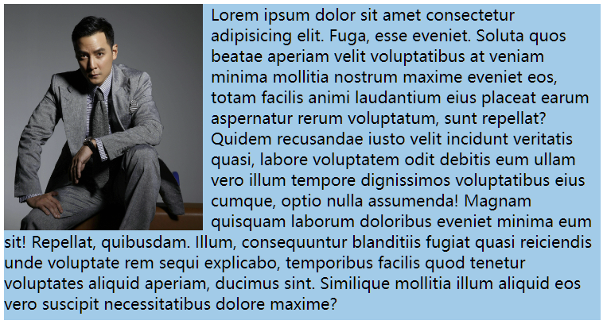
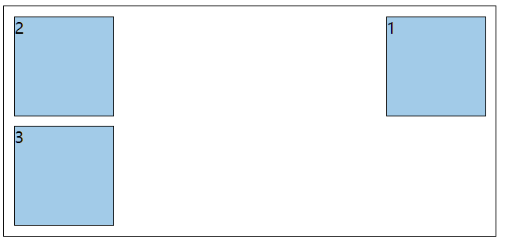
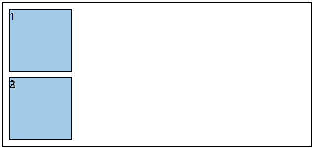
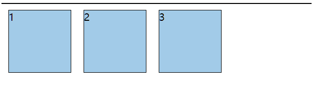
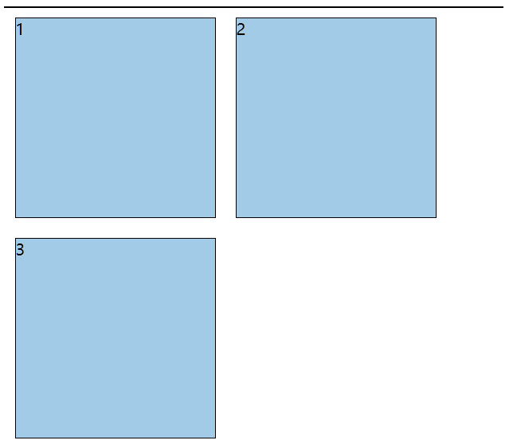
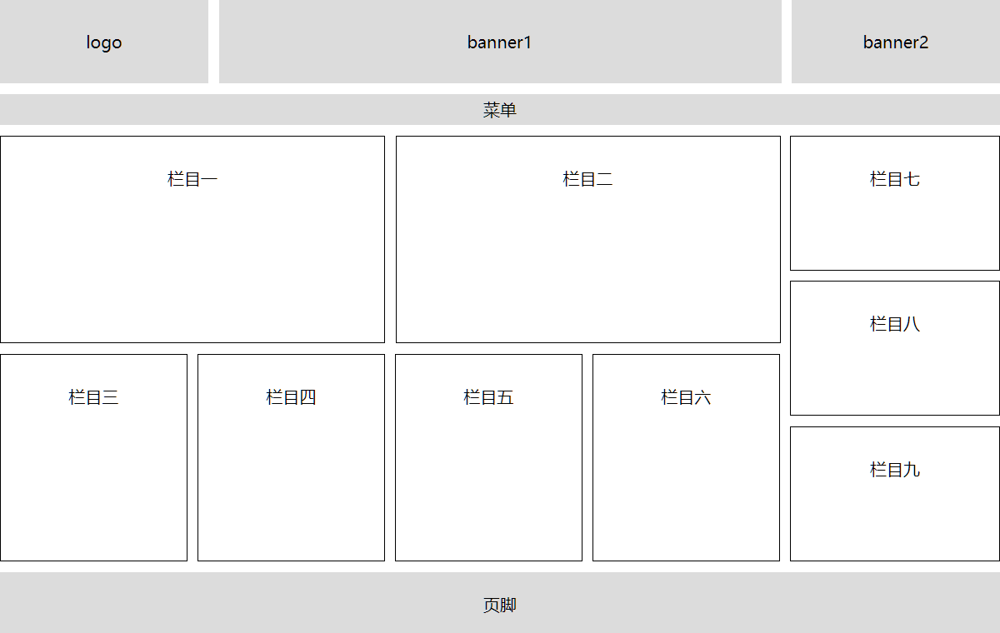
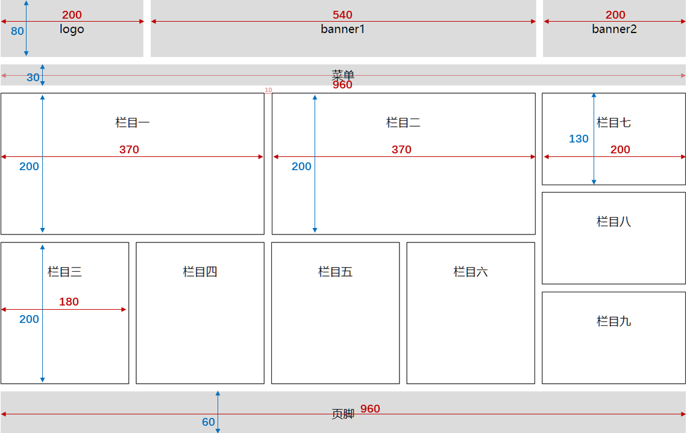

## 1.  浮动的简介

在最初，浮动是用来实现文字环绕图片效果的，现在浮动是主流的页面布局方式之一。



示例：

:::normal-demo 演示

```html
<!DOCTYPE html>
<html lang="zh-CN">
<head>
    <meta charset="UTF-8">
    <title>01_浮动_简介</title>
    <style>
        div {
            width: 600px;
            height: 400px;
            background-color: skyblue;
        }
        img {
            width: 200px;
            float: right;
            /* margin-right: 0.5em; */
        }
        .test::first-letter {
            font-size: 80px;
            float: left;
        }
    </style>
</head>
<body>
    <div>
        
        Lorem ipsum dolor sit amet consectetur adipisicing elit. Sint, minus magnam accusamus eum laborum ducimus possimus beatae fugit illum molestias odit et asperiores adipisci sunt dolorem qui autem enim excepturi alias ab unde temporibus. Sapiente labore a magnam commodi itaque architecto quos doloribus voluptates perferendis rem, earum consectetur. Tempora inventore ducimus veritatis voluptatem deleniti rem laboriosam. Officiis, impedit explicabo! Impedit labore ea et vero rerum nihil in cum qui, itaque blanditiis eius nemo est? Tempora explicabo voluptates consectetur officia aperiam eos impedit veritatis necessitatibus quidem deleniti ea, in odit cum ex harum voluptas, quos eveniet quae voluptate aspernatur quod! Nostrum?
    </div>
    <hr>
    <div class="test">
        Lorem ipsum dolor sit amet consectetur, adipisicing elit. Quaerat voluptate impedit provident, debitis nostrum cumque iste ab ipsum tempora dicta neque aliquid error in dolorum qui iure. Quibusdam eligendi ea id! Accusamus praesentium vitae quidem iusto placeat provident alias tempore quasi quos, nesciunt rem, molestias quisquam? Quisquam laborum nulla ea veniam, nesciunt, dolores modi officia animi laboriosam minima exercitationem. Reiciendis enim sint at nisi quae obcaecati, vel iusto non libero officia possimus explicabo quis harum inventore sapiente accusantium id quidem cupiditate et expedita maiores perferendis! Reiciendis, distinctio doloribus! Quia harum iste doloremque pariatur obcaecati doloribus quasi iusto minima magnam iure!
    </div>
</body>
</html>
```


:::

## 2. 元素浮动后的特点

1. :nauseated_face:脱离文档流。
2. :blush:不管浮动前是什么元素，浮动后：默认宽与高都是被内容撑开（尽可能小），而且可以设置宽

高。

3. :blush:不会独占一行，可以与其他元素共用一行。
4. :blush:不会 <span style="color: #e96900;">margin</span> 合并，也不会 <span style="color: #e96900;">margin</span> 塌陷，能够完美的设置四个方向的 <span style="color: #e96900;">margin</span> 和 <span style="color: #e96900;">padding</span> 。
5. 不会像行内块一样被当做文本处理（没有行内块的空白问题）。

示例：

:::normal-demo 演示

```html
<!DOCTYPE html>
<html lang="zh-CN">
<head>
    <meta charset="UTF-8">
    <title>02_元素浮动后的特点</title>
    <style>
        .outer {
            width: 800px;
            height: 400px;
            padding: 10px;
            background-color: gray;
            text-align: center;
        }
        .box {
            font-size: 20px;
            padding: 10px;
        }
        .box1 {
            background-color: skyblue;
        }
        .box2 {
            background-color: orange;
            float: left;
            /* width: 200px; */
            /* height: 200px; */
            /* margin-left: 20px; */
            /* margin-right: 20px; */
            /* margin-top: 20px; */
            /* margin-bottom: 20px; */
        }
        .box3 {
            background-color: green;
            float: left;
        }
    </style>
</head>
<body>
    <div class="outer">
        <div class="box box1">盒子1</div>
        <div class="box box2">盒子2</div>
        <div class="box box3">盒子3</div>
    </div>
</body>
</html>
```


:::

## 3. 浮动小练习

练习1：盒子1右浮动，效果如下



:::normal-demo 演示

```html
<!DOCTYPE html>
<html lang="zh-CN">
<head>
    <meta charset="UTF-8">
    <title>03_浮动的小练习1</title>
    <style>
        .outer {
            width: 500px;
            background-color: gray;
            border: 1px solid black;
        }
        .box {
            width: 100px;
            height: 100px;
            background-color: skyblue;
            border: 1px solid black;
            margin: 10px;
        }
        .box1 {
            float: right;
        }
    </style>
</head>
<body>
    <div class="outer">
        <div class="box box1">1</div>
        <div class="box box2">2</div>
        <div class="box box3">3</div>
    </div>
</body>
</html>
```


:::

练习2：盒子1左浮动，效果如下



:::normal-demo 演示：

```html
<!DOCTYPE html>
<html lang="zh-CN">
<head>
    <meta charset="UTF-8">
    <title>03_浮动的小练习1</title>
    <style>
        .outer {
            width: 500px;
            background-color: gray;
            border: 1px solid black;
        }
        .box {
            width: 100px;
            height: 100px;
            background-color: skyblue;
            border: 1px solid black;
            margin: 10px;
        }
        .box1 {
            float: left;
        }
    </style>
</head>
<body>
    <div class="outer">
        <div class="box box1">1</div>
        <div class="box box2">2</div>
        <div class="box box3">3</div>
    </div>
</body>
</html>
```


:::

练习3：所有盒子都浮动，效果如下



:::normal-demo 演示

```html
<!DOCTYPE html>
<html lang="zh-CN">
<head>
    <meta charset="UTF-8">
    <title>03_浮动的小练习1</title>
    <style>
        .outer {
            width: 500px;
            background-color: gray;
            border: 1px solid black;
        }
        .box {
            width: 100px;
            height: 100px;
            background-color: skyblue;
            border: 1px solid black;
            margin: 10px;
            float: left;
        }
    </style>
</head>
<body>
    <div class="outer">
        <div class="box box1">1</div>
        <div class="box box2">2</div>
        <div class="box box3">3</div>
    </div>
</body>
</html>
```


:::

练习4：所有盒子浮动后，盒子3落下来，效果如下



:::normal-demo 演示

```html
<!DOCTYPE html>
<html lang="zh-CN">
<head>
    <meta charset="UTF-8">
    <title>03_浮动的小练习1</title>
    <style>
        .outer {
            width: 500px;
            background-color: gray;
            border: 1px solid black;
        }
        .box {
            width: 200px;
            height: 200px;
            background-color: skyblue;
            border: 1px solid black;
            margin: 10px;
            float: left;
        }
    </style>
</head>
<body>
    <div class="outer">
        <div class="box box1">1</div>
        <div class="box box2">2</div>
        <div class="box box3">3</div>
    </div>
</body>
</html>
```


:::

练习5：所有盒子浮动后，盒子3卡住了，效果如下

:::normal-demo 演示

```html
<!DOCTYPE html>
<html lang="zh-CN">
<head>
    <meta charset="UTF-8">
    <title>03_浮动的小练习</title>
    <style>
        .outer {
            width: 500px;
            background-color: gray;
            border: 1px solid black;
        }
        .box {
            width: 200px;
            height: 200px;
            background-color: skyblue;
            border: 1px solid black;
            margin: 10px;
            float: left;
        }
        .box1 {
            height: 230px;
        }
    </style>
</head>
<body>
    <div class="outer">
        <div class="box box1">1</div>
        <div class="box box2">2</div>
        <div class="box box3">3</div>
    </div>
</body>
</html>
```


:::

## 4. 解决浮动产生的影响

### 4.1 元素浮动后会有哪些影响

**对兄弟元素的影响：** 后面的兄弟元素，会占据浮动元素之前的位置，在浮动元素的下面；对前面的兄弟无影响。

**对父元素的影响：** 不能撑起父元素的高度，导致父元素高度塌陷；但父元素的宽度依然束缚浮动的元素。

### 4.2 解决浮动产生的影响（清除浮动）

**解决方案：** 

1. 方案一： 给父元素指定高度。

2. 方案二： 给父元素也设置浮动，带来其他影响。

3. 方案三： 给父元素设置 <span style="color: #e96900;">overflow:hidden</span> 。

4. 方案四： 在所有浮动元素的最后面，添加一个块级元素，并给该块级元素设置 <span style="color: #e96900;">clear:both</span> 。

5. **方案五**： 给浮动元素的父元素，设置伪元素，通过伪元素清除浮动，原理与方案四相同。===> 推荐使用

   ```css
   .parent::after {
       content: "";
       display: block;
       clear: both;
   }
   ```

   示例：

   :::normal-demo 演示

   ```html
   <!DOCTYPE html>
   <html lang="zh-CN">
   <head>
       <meta charset="UTF-8">
       <title>05_解决浮动后的影响</title>
       <style>
           .outer {
               width: 500px;
               background-color: gray;
               border: 1px solid black;
               /* 第一种解决方案 */
               /* height: 122px; */
   
               /* 第二种解决方案 */
               /* float: left; */
   
               /* 第三种解决方案 */
               /* overflow: hidden; */
   
           }
           .box {
               width: 100px;
               height: 100px;
               background-color: skyblue;
               border: 1px solid black;
               margin: 10px;
           }
           .box1,.box2,.box3,.box4 {
               float: left;
           }
           .mofa {
               /* 第四种解决方案 */
               clear: both;
           }
           /* 第五种解决方案 */
           .outer::after {
               content: '';
               display: block;
               clear: both;
           }
       </style>
   </head>
   <body>
       <div class="outer">
           <div class="box box1">1</div>
           <div class="box box2">2</div>
           <div class="box box3">3</div>
           <div class="box box4">4</div>
           <!-- <div class="mofa"></div> -->
       </div>
       <div style="background-color:orange">Lorem ipsum dolor sit amet consectetur adipisicing elit. Assumenda expedita rem similique at laboriosam, magnam, ipsam inventore odit odio ipsum ex ad beatae quia, consequuntur quam dolore modi atque? Doloribus libero eos ut consequatur, assumenda amet quidem est quae doloremque maxime id cumque explicabo aliquam. Quas, explicabo illo neque rem dolores impedit aspernatur suscipit vel, dolore incidunt totam aliquam laborum! Fuga in rerum repudiandae suscipit, labore optio iste ratione nobis velit dolorem laborum doloribus perferendis porro enim, sequi, delectus nulla quam? Recusandae quidem nobis voluptatum quam quaerat itaque aliquam reiciendis molestias ratione nesciunt exercitationem quisquam laborum sit error magnam optio atque, debitis tempore. Quibusdam repellendus perspiciatis id consequuntur saepe suscipit enim temporibus, ipsa minima dolores laudantium inventore recusandae nam. Quo harum sunt reprehenderit nisi? Error quia quibusdam possimus tempore incidunt. Doloribus vitae quis nisi quod, aperiam molestias id quibusdam voluptate recusandae iure tempore hic doloremque similique corrupti expedita non odit a natus. Eius, harum iste, dolor omnis, saepe dolore illo aliquid impedit officia explicabo itaque dicta eos exercitationem at tempora perspiciatis voluptate ad eaque mollitia maiores obcaecati numquam. Veniam ex facere fugit ullam est velit officiis a autem perferendis ratione aliquid dolor voluptate magnam, illo alias sequi totam, ab nemo?</div>
   </body>
   </html>
   ```

   

   :::

> [!tip]
>
> 布局中的一个原则：设置浮动的时候，兄弟元素要么全都浮动，要么全都不浮动。

## 5. 浮动布局小练习

整体效果如下：



具体标注如下：



示例：

:::normal-demo 演示

```html
<!DOCTYPE html>
<html lang="zh-CN">
<head>
    <meta charset="UTF-8">
    <title>06_浮动布局小练习</title>
    <style>
        * {
            margin: 0;
            padding: 0;
        }
        .leftfix {
            float: left;
        }
        .rightfix {
            float: right;
        }
        .clearfix::after {
            content: '';
            display: block;
            clear: both;
        }
        .container {
            width: 960px;
            margin: 0 auto;
            text-align: center;
        }
        .logo {
            width: 200px;
        }
        .banner1 {
            width: 540px;
            margin: 0 10px;
        }
        .banner2 {
            width: 200px;
        }
        .logo,.banner1,.banner2 {
            height: 80px;
            line-height: 80px;
            background-color: #ccc;
        }
        .menu {
            height: 30px;
            background-color: #ccc;
            margin-top: 10px;
            line-height: 30px;
        }
        .item1,.item2 {
            width: 368px;
            height: 198px;
            line-height: 198px;
            border: 1px solid black;
            margin-right: 10px;
        }
        .content {
            margin-top: 10px;
        }
        .item3,.item4,.item5,.item6 {
            width: 178px;
            height: 198px;
            line-height: 198px;
            border: 1px solid black;
            margin-right: 10px;
        }
        .bottom {
            margin-top: 10px;
        }
        .item7,.item8,.item9 {
            width: 198px;
            height: 128px;
            line-height: 128px;
            border: 1px solid black;
        }
        .item8 {
            margin: 10px 0;
        }
        .footer {
            height: 60px;
            background-color: #ccc;
            margin-top: 10px;
            line-height: 60px;
        }
    </style>
</head>
<body>
    <div class="container">
        <!-- 头部 -->
        <div class="page-header clearfix">
            <div class="logo leftfix">logo</div>
            <div class="banner1 leftfix">banner1</div>
            <div class="banner2 leftfix">banner2</div>
        </div>
        <!-- 菜单 -->
        <div class="menu">菜单</div>
        <!-- 内容区 -->
        <div class="content clearfix">
            <!-- 左侧 -->
            <div class="left leftfix">
                <!-- 上 -->
                <div class="top clearfix">
                    <div class="item1 leftfix">栏目一</div>
                    <div class="item2 leftfix">栏目二</div>
                </div>
                <!-- 下 -->
                <div class="bottom clearfix">
                    <div class="item3 leftfix">栏目三</div>
                    <div class="item4 leftfix">栏目四</div>
                    <div class="item5 leftfix">栏目五</div>
                    <div class="item6 leftfix">栏目六</div>
                </div>
            </div>
            <!-- 右侧 -->
            <div class="right rightfix">
                <div class="item7">栏目七</div>
                <div class="item8">栏目八</div>
                <div class="item9">栏目九</div>
            </div>
        </div>
        <!-- 页脚 -->
        <div class="footer">页脚</div>
    </div>
</body>
</html>
```


:::

> [!tip]
>
> VSCode 快速写类名：格式：<span style="color: #e96900;">标签名.类名</span> 
>
> 示例：
>
> <span style="color: #e96900;">div</span> 标签中添加 <span style="color: #e96900;">container</span> 类名
>
> ```
> div.container
> ```
>
> 效果：
>
> ```css
> <div class="container"></div>
> ```
>
> VSCode 快速写 id ：格式：<span style="color: #e96900;">标签名#id名</span> 
>
> 示例：
>
> <span style="color: #e96900;">div</span> 标签中添加 <span style="color: #e96900;">book</span> id名
>
> ```
> div#book
> ```
>
> 效果：
>
> ```css
> <div id="book"></div>
> ```

## 6.浮动相关属性

| CSS 属性                                   | 功能                                       | 属性值                                                       |
| ------------------------------------------ | ------------------------------------------ | ------------------------------------------------------------ |
| <span style="color: #e96900;">float</span> | 设置浮动                                   | <span style="color: #e96900;">left</span> : 设置左浮动 <br><span style="color: #e96900;">right</span> : 设置右浮动 <br><span style="color: #e96900;">none</span> ：不浮动，默认值 |
| <span style="color: #e96900;">clear</span> | 清除浮动<br>清除前面兄弟元素浮动元素的响应 | <span style="color: #e96900;">left</span> ：清除前面左浮动的影响 <br><span style="color: #e96900;">right</span> ：清除前面右浮动的影响 <br><span style="color: #e96900;">both</span> ：清除前面左右浮动的影响 |

