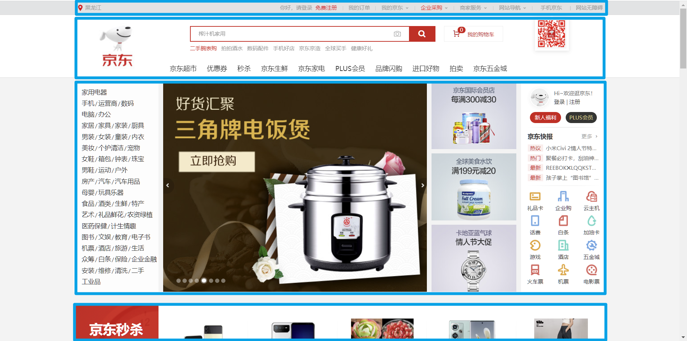

## 1. 版心

- 在 PC 端网页中，一般都会有一个固定宽度且水平居中的盒子，来显示网页的主要内容，这是网页的 **版心** 。

- 版心的宽度一般是 960 ~ 1200 像素之间。

- 版心可以是一个，也可以是多个。

  

## 2. 常用布局名词

| 位置               |                                                              |
| ------------------ | ------------------------------------------------------------ |
| 顶部导航条         | <span style="color: #e96900;">topbar</span>                  |
| 页头               | <span style="color: #e96900;">header</span> 、 <span style="color: #e96900;">page-header</span> |
| 导航               | <span style="color: #e96900;">nav</span> 、 <span style="color: #e96900;">navigator</span> 、 <span style="color: #e96900;">navbar</span> |
| 搜索框             | <span style="color: #e96900;">search</span> 、 <span style="color: #e96900;">search-box</span> |
| 横幅、广告、宣传图 | <span style="color: #e96900;">banner</span>                  |
| 主要内容           | <span style="color: #e96900;">content</span> 、 <span style="color: #e96900;">main</span> |
| 侧边栏             | <span style="color: #e96900;">aside</span> 、 <span style="color: #e96900;">sidebar</span> |
| 页脚               | <span style="color: #e96900;">footer </span>、 <span style="color: #e96900;">page-footer</span> |

## 3. 重置默认样式

很多元素都有默认样式，比如：

1. <span style="color: #e96900;">p</span> 元素有默认的上下 <span style="color: #e96900;">margin</span> 。
2. <span style="color: #e96900;">h1~h6</span> 标题也有上下 <span style="color: #e96900;">margin</span> ，且字体加粗。
3. <span style="color: #e96900;">body</span> 元素有默认的 <span style="color: #e96900;">8px</span> 外边距。
4. 超链接有默认的文字颜色和下划线。
5. <span style="color: #e96900;">ul</span> 元素有默认的左 <span style="color: #e96900;">pading</span> 。
6. .......

> [!tip]
>
> 在早期，元素默认样式，能够让我们快速的绘制网页，但如今网页的设计越来越复杂，内容越来越多，而且很精细，这些默认样式会给我们绘制页面带来麻烦；而且这些默认样式，在不同的浏览器上呈现出来的效果也不一样，所以我们需要重置这些默认样式。

### 方案一：使用全局选择器

```css
* {
    margin: 0;
    padding: 0;
    ......
}
```

> [!tip]
>
> 此种方法，在简单案例中可以用一下，但实际开发中不会使用，因为 <span style="color: #e96900;">*</span> 选择的是所有元素，而并不是所有的元素都有默认样式；而且我们重置时，有时候是需要做特定处理的，比如：想让 <span style="color: #e96900;">a</span> 元素的文字是灰色，其他元素文字是蓝色。

### 方案二：reset.css

选择到具有默认样式的元素，清空其默认的样式。

> [!tip]
>
> 经过 reset 后的网页，好似“一张白纸”，开发人员可根据设计稿，精细的去添加具体的样式。

### 方案三：Normalize.css

<span style="color: #e96900;">Normalize.css</span> 是一种最新方案，它在清除默认样式的基础上，保留了一些有价值的默认样式。

- 官网地址：[Normalize.css)](https://necolas.github.io/normalize.css/)

相对于 <span style="color: #e96900;">reset.css</span> ， <span style="color: #e96900;">Normalize.css</span> 有如下优点：

1. 保护了有价值的默认样式，而不是完全去掉它们。
2. 为大部分HTML元素提供一般化的样式。
3. 新增对 HTML5 元素的设置。
4. 对并集选择器的使用比较谨慎，有效避免调试工具杂乱。

> [!tip]
>
> 备注： <span style="color: #e96900;">Normalize.css</span> 的重置，和 <span style="color: #e96900;">reset.css</span> 相比，更加的温和，开发时可根据实际情况进行选择。