## 1. CSS3 新增长度单位

1. <span style="color: #e96900;">rem</span> 根元素字体大小的倍数，只与根元素字体大小有关。
2. <span style="color: #e96900;">vw</span> 视口宽度的百分之多少 <span style="color: #e96900;">10vw</span> 就是视口宽度的 <span style="color: #e96900;">10%</span> 。
3. <span style="color: #e96900;">vh</span> 视口高度的百分之多少 <span style="color: #e96900;">10vh</span> 就是视口高度的 <span style="color: #e96900;">10%</span> 。
4. <span style="color: #e96900;">vmax</span> 视口宽高中大的那个的百分之多少。（了解即可）
5. <span style="color: #e96900;">vmin</span> 视口宽高中小的那个的百分之多少。（了解即可）

示例：

:::normal-demo 演示

```html
<!DOCTYPE html>
<html lang="zh-CN">
<head>
    <meta charset="UTF-8">
    <title>新增长度单位</title>
    <style>
        * {
            margin: 0;
            padding: 0;
        }
        .box1 {
            width: 200px;
            height: 200px;
            background-color: deepskyblue;
        }
        .box2 {
            width: 20vw;
            height: 20vh;
            background-color: green;
        }
        .box3 {
            width: 20vmax;
            height: 20vmin;
            background-color: orange;
        }
    </style>
</head>
<body>
    <div class="box1">像素</div>
    <div class="box2">vw和vh</div>
    <div class="box3">vmax</div>
</body>
</html>
```


:::

## 2. CSS3 新增颜色设置方式

<span style="color: #e96900;">CSS3</span> 新增了三种颜色设置方式，分别是： <span style="color: #e96900;">rgba</span> 、 <span style="color: #e96900;">hsl</span> 、 <span style="color: #e96900;">hsla</span> ，由于之前已经详细讲解，此处略过。

## 3. CSS3 新增选择器

<span style="color: #e96900;">CSS3</span> 新增的选择器有：动态伪类、目标伪类、语言伪类、 <span style="color: #e96900;">UI</span> 伪类、结构伪类、否定伪类、伪元素；这些在 <span style="color: #e96900;">CSS2</span> 中已经详细讲解，此处略过。

## 4. CSS3 新增盒模型相关属性
### 4.1.  <span style="color: #e96900;">box-sizing</span> 怪异盒模型

使用 <span style="color: #e96900;">box-sizing</span> 属性可以设置盒模型的两种类型

| 可选值                                           | 含义                                                         |
| ------------------------------------------------ | ------------------------------------------------------------ |
| <span style="color: #e96900;">content-box</span> | <span style="color: #e96900;">width</span> 和 <span style="color: #e96900;">height</span> 设置的是盒子内容区的大小。（默认值） |
| <span style="color: #e96900;">border-box</span>  | <span style="color: #e96900;">width</span> 和 <span style="color: #e96900;">height</span> 设置的是盒子总大小。（怪异盒模型） |

示例：

:::normal-demo 演示

```html
<!DOCTYPE html>
<html lang="zh-CN">
<head>
    <meta charset="UTF-8">
    <title>01_box-sizing</title>
    <style>
        .box1 {
            width: 200px;
            height: 200px;
            background-color: deepskyblue;
            padding: 5px;
            border: 5px solid black;
            margin-bottom: 20px;
        }
        .box2 {
            width: 200px;
            height: 200px;
            background-color: gray;
            padding: 5px;
            border: 5px solid black;
            box-sizing: border-box;
        }
    </style>
</head>
<body>
    <div class="box1"></div>
    <div class="box2"></div>
</body>
</html>
```


:::

### 4.2. <span style="color: #e96900;">resize</span> 调整盒子大小

使用 <span style="color: #e96900;">resize</span> 属性可以控制是否允许用户调节元素尺寸。

| 值                                              | 含义                            |
| ----------------------------------------------- | ------------------------------- |
| <span style="color: #e96900;">none</span>       | 不允许用户调整元素大小。 (默认) |
| <span style="color: #e96900;">both</span>       | 用户可以调节元素的宽度和高度。  |
| <span style="color: #e96900;">horizontal</span> | 用户可以调节元素的宽度 。       |
| <span style="color: #e96900;">vertical</span>   | 用户可以调节元素的高度。        |

示例：

:::normal-demo 演示

```html
<!DOCTYPE html>
<html lang="zh-CN">
<head>
    <meta charset="UTF-8">
    <title>02_resize</title>
    <style>
        .box1 {
            width: 40px;
            height: 40px;
            background-color: orange;
            resize: both;
            overflow: scroll;
        }
        .box2 {
            width: 80px;
            height: 60px;
            background-color: skyblue;
        }
    </style>
</head>
<body>
    <div class="box1">
        <div class="box2">123</div>
    </div>
</body>
</html>
```


:::

### 4.3.  <span style="color: #e96900;">box-shadow</span> 盒子阴影

- 使用 <span style="color: #e96900;">box-shadow</span> 属性为盒子添加阴影。

- 语法：

  ```css
  box-shadow: h-shadow v-shadow blur spread color inset;
  ```

  

- 各个值的含义：

  | 值                                            | 含义                                 |
  | --------------------------------------------- | ------------------------------------ |
  | <span style="color: #e96900;">h-shadow</span> | 水平阴影的位置，必须填写，可以为负值 |
  | <span style="color: #e96900;">v-shadow</span> | 垂直阴影的位置，必须填写，可以为负值 |
  | <span style="color: #e96900;">blur</span>     | 可选，模糊距离                       |
  | <span style="color: #e96900;">spread</span>   | 可选，阴影的外延值                   |
  | <span style="color: #e96900;">color</span>    | 可选，阴影的颜色                     |
  | <span style="color: #e96900;">inset</span>    | 可选，将外部阴影改为内部阴影         |

- 默认值： <span style="color: #e96900;">box-shadow:none</span> 表示没有阴影

- 示例：

  ```css
  /* 写两个值，含义：水平位置、垂直位置 */
  box-shadow: 10px 10px;
  
  /* 写三个值，含义：水平位置、垂直位置、颜色 */
  box-shadow: 10px 10px red;
  
  /* 写三个值，含义：水平位置、垂直位置、模糊值 */
  box-shadow: 10px 10px 10px;
  
  /* 写四个值，含义：水平位置、垂直位置、模糊值、颜色 */
  box-shadow: 10px 10px 10px red;
  
  /* 写五个值，含义：水平位置、垂直位置、模糊值、外延值、颜色 */
  box-shadow: 10px 10px 10px 10px blue;
  
  /* 写六个值，含义：水平位置、垂直位置、模糊值、外延值、颜色、内阴影 */
  box-shadow: 10px 10px 20px 3px blue inset;
  ```

  示例：
  
  :::normal-demo 演示
  
  ```html
  <!DOCTYPE html>
  <html lang="zh-CN">
  <head>
      <meta charset="UTF-8">
      <title>03_box-shadow</title>
      <style>
          .box1 {
              width: 400px;
              height: 400px;
              background-color: orange;
              margin: 0 auto;
              margin-top: 100px;
              font-size: 40px;
  
              /* 写两个值，含义：水平位置 垂直位置 */
              /* box-shadow: 10px 10px; */
  
              /* 写三个值，含义：水平位置 垂直位置 阴影的颜色 */
              /* box-shadow: 10px 10px blue; */
  
              /* 写三个值，含义：水平位置 垂直位置 模糊程度 */
              /* box-shadow: 10px 10px 20px; */
  
              /* 写四个值，含义：水平位置 垂直位置 模糊程度 阴影颜色 */
              /* box-shadow: 10px 10px 20px blue; */
  
              /* 写五个值，含义：水平位置 垂直位置 模糊程度 外延值 阴影颜色 */
              /* box-shadow: -10px -10px 20px 10px blue; */
  
              /* 写六个值，含义：水平位置 垂直位置 模糊程度 外延值 阴影颜色 内阴影 */
              /* box-shadow: 10px 10px 20px 10px blue inset; */
  
              position: relative;
              top: 0;
              left: 0;
              transition: 0.4s linear all ;
          }
          .box1:hover {
              box-shadow: 0px 0px 20px black;
              top: -1px;
              left: 0;
          }
      </style>
  </head>
  <body>
      <div class="box1">你好啊</div>
  </body>
  </html>
  ```
  
  
  
  :::

### 4.4. <span style="color: #e96900;">opacity</span> 不透明度

- <span style="color: #e96900;">opacity</span> 属性能为整个元素添加透明效果， 值是 <span style="color: #e96900;">0</span> 到 <span style="color: #e96900;">1</span> 之间的小数， <span style="color: #e96900;">0</span> 是完全透明， <span style="color: #e96900;">1</span> 表示完全不透明。

  > [!tip]
  >
  > <span style="color: #e96900;">opacity</span> 与 <span style="color: #e96900;">rgba</span> 的区别？
  >
  > <span style="color: #e96900;">opacity</span> 是一个属性，设置的是整个元素（包括元素里的内容）的不透明度。
  >
  > <span style="color: #e96900;">rgba</span> 是颜色的设置方式，用于设置颜色，它的透明度，仅仅是调整颜色的透明度。
  
- 示例：

  :::normal-demo 演示

  ```html
  <!DOCTYPE html>
  <html lang="zh-CN">
  <head>
      <meta charset="UTF-8">
      <title>04_opacity</title>
      <style>
          .box1 {
              width: 200px;
              height: 200px;
              background-color: orange;
              font-size: 40px;
              opacity: 0.1;
              font-weight: bold;
          }
          .box2 {
              position: relative;
          }
          h1 {
              position: absolute;
              top: 100px;
              left: 0;
              background-color: black;
              color: white;
              width: 400px;
              line-height: 100px;
              text-align: center;
              font-size: 40px;
              opacity: 0.5;
          }
      </style>
  </head>
  <body>
      <div class="box1">你好啊</div>
      <div class="box2">
          
          <h1>你瞅啥</h1>
      </div>
  </body>
  </html>
  ```

  :::

## 5. CSS3 新增背景属性
### 5.1. background-origin

- 作用：设置背景图的原点。

- 语法
  1. <span style="color: #e96900;">padding-box</span> ：从 <span style="color: #e96900;">padding</span> 区域开始显示背景图像。—— 默认值
  2. <span style="color: #e96900;">border-box</span> ： 从 <span style="color: #e96900;">border</span> 区域开始显示背景图像。
  3. <span style="color: #e96900;">content-box</span> ： 从 <span style="color: #e96900;">content</span> 区域开始显示背景图像。
  
- 示例：

  :::normal-demo 演示

  ```html
  <!DOCTYPE html>
  <html lang="zh-CN">
  <head>
      <meta charset="UTF-8">
      <title>01_background-origin</title>
      <style>
          .box1 {
              width: 400px;
              height: 400px;
              background-color: skyblue;
              margin: 0 auto;
              font-size: 40px;
              padding: 50px;
              border: 50px dashed rgba(255, 0, 0, 0.7);
  
              background-image: url('../images/bg01.jpg');
              background-repeat: no-repeat;
              background-origin: border-box;
          }
      </style>
  </head>
  <body>
      <div class="box1">你好啊</div>
  </body>
  </html>
  ```

  

  :::

### 5.2. background-clip

- 作用：设置背景图的向外裁剪的区域。

- 语法

  1. <span style="color: #e96900;">border-box</span> ： 从 <span style="color: #e96900;">border</span> 区域开始向外裁剪背景。 —— 默认值
  2. <span style="color: #e96900;">padding-box</span> ： 从 <span style="color: #e96900;">padding</span> 区域开始向外裁剪背景。
  3. <span style="color: #e96900;">content-box</span> ： 从 <span style="color: #e96900;">content</span> 区域开始向外裁剪背景。
  4. <span style="color: #e96900;">text</span> ：背景图只呈现在文字上。

  > [!tip]
  >
  > ~~注意：若值为 <span style="color: #e96900;">text</span> ，那么 <span style="color: #e96900;">backgroun-clip</span> 要加上 <span style="color: #e96900;">-webkit-</span> 前缀。~~
  
- 示例：

  :::normal-demo 演示

  ```html
  <!DOCTYPE html>
  <html lang="zh-CN">
  <head>
      <meta charset="UTF-8">
      <title>02_background-clip</title>
      <style>
          .box1 {
              width: 400px;
              height: 400px;
              background-color: skyblue;
              margin: 0 auto;
              font-size: 120px;
              font-weight: bold;
              padding: 50px;
              border: 50px dashed rgba(255, 0, 0, 0.7);
              color: transparent;
  
              background-image: url('../images/bg02.jpg');
              background-repeat: no-repeat;
              background-origin: border-box;
              background-clip: text;
          }
      </style>
  </head>
  <body>
      <div class="box1">你好啊</div>
  </body>
  </html>
  ```

  

  :::

### 5.3. background-size

- 作用：设置背景图的尺寸。

- 语法：

  1. 用长度值指定背景图片大小，不允许负值。

     ```css
     background-size: 300px 200px;
     ```

     

  2. 用百分比指定背景图片大小，不允许负值。

     ```css
     background-size: 100% 100%;
     ```

     

  3. <span style="color: #e96900;">auto</span> ： 背景图片的真实大小。 —— 默认值

  4. <span style="color: #e96900;">contain</span> ： 将背景图片等比缩放，使背景图片的宽或高，与容器的宽或高相等，再将完整背景图片包含在容器内，但要注意：可能会造成容器里部分区域没有背景图片。

     ```css
     background-size: contain;
     ```

     

  5. <span style="color: #e96900;">cover</span> ：将背景图片等比缩放，直到完全覆盖容器，图片会尽可能全的显示在元素上，但要注意：背景图片有可能显示不完整。—— 相对比较好的选择

     ```css
     background-size: cover;
     ```

- 示例：

  :::normal-demo 演示

  ```html
  <!DOCTYPE html>
  <html lang="zh-CN">
  <head>
      <meta charset="UTF-8">
      <title>03_background-size</title>
      <style>
          div {
              width: 400px;
              height: 400px;
              padding: 50px;
              border: 1px solid black;
              background-image: url('../images/bg03.jpg');
              /* background-repeat: no-repeat; */
  
              /* background-size: 400px 400px; */
              /* background-size: 100% 100%; */
              /* background-size: contain; */
              background-size: cover;
          }
      </style>
  </head>
  <body>
      <div></div>
  </body>
  </html>
  ```

  

  :::

### 5.4.  background 复合属性

- 语法：

  ```css
  background: color url repeat position / size origin clip
  ```

  > [!tip]
  >
  > **注意：**
  >
  > 1. <span style="color: #e96900;">origin</span> 和 <span style="color: #e96900;">clip</span> 的值如果一样，如果只写一个值，则 origin 和 <span style="color: #e96900;">clip</span> 都设置；如果设置了两个值，前面的是 <span style="color: #e96900;">origin</span> ，后面的 <span style="color: #e96900;">clip</span> 。
  >
  > 2. <span style="color: #e96900;">size</span> 的值必须写在 <span style="color: #e96900;">position</span> 值的后面，并且用 <span style="color: #e96900;">/</span> 分开。
  
- 示例：

  :::normal-demo 演示

  ```html
  <!DOCTYPE html>
  <html lang="zh-CN">
  <head>
      <meta charset="UTF-8">
      <title>04_background复合属性</title>
      <style>
          .box1 {
              width: 400px;
              height: 400px;
              margin: 0 auto;
              font-size: 40px;
              padding: 50px;
              border: 50px dashed rgba(255, 0, 0, 0.7);
  
              /* background: 背景颜色 背景url 是否重复 位置 / 大小 原点 裁剪方式; */
              background:skyblue url('../images/bg03.jpg') no-repeat 10px 10px / 500px 500px border-box content-box;
          }
      </style>
  </head>
  <body>
      <div class="box1">你好啊</div>
  </body>
  </html>
  ```

  

  :::

### 5.5. 多背景图

<span style="color: #e96900;">CSS3</span> 允许元素设置多个背景图片

```css
/* 添加多个背景图 */
background: url(../images/bg-lt.png) no-repeat,
            url(../images/bg-rt.png) no-repeat right top,
            url(../images/bg-lb.png) no-repeat left bottom,
            url(../images/bg-rb.png) no-repeat right bottom;
```

示例：

:::normal-demo 演示

```html
<!DOCTYPE html>
<html lang="zh-CN">
<head>
    <meta charset="UTF-8">
    <title>05_多背景图</title>
    <style>
        div {
            width: 400px;
            height: 400px;
            border: 1px solid black;
            background: url('../images/bg-lt.png') no-repeat left top,
                        url('../images/bg-rt.png') no-repeat right top,
                        url('../images/bg-lb.png') no-repeat left bottom,
                        url('../images/bg-rb.png') no-repeat right bottom;
        }
    </style>
</head>
<body>
    <div></div>
</body>
</html>
```


:::

## 6. CSS3新增边框属性

### 6.1  边框圆角

- 在 <span style="color: #e96900;">CSS3</span> 中，使用 <span style="color: #e96900;">border-radius</span> 属性可以将盒子变为圆角。

- 同时设置四个角的圆角：

  ```css
  border-radius:10px;
  ```

  

- 分开设置每个角的圆角（几乎不用）：

  | 属性名                                                       | 作用                                                         |
  | ------------------------------------------------------------ | ------------------------------------------------------------ |
  | <span style="color: #e96900;">border-top-left-radius</span>  | 设置左上角圆角半径：<br>1. 一个值是正圆半径，<br/>2. 两个值分别是椭圆的 <span style="color: #e96900;">x</span> 半径、 <span style="color: #e96900;">y</span> 半径。 |
  | <span style="color: #e96900;">border-top-right-radius</span> | 设置右上角圆角半径：<br/>1. 一个值是正圆半径，<br/>2. 两个值分别是椭圆的 <span style="color: #e96900;">x</span> 半径、 <span style="color: #e96900;">y</span> 半径。 |
  | <span style="color: #e96900;">border-bottom-right-radius</span> | 设置右下角圆角半径：<br/>1. 一个值是正圆半径，<br/>2. 两个值分别是椭圆的 <span style="color: #e96900;">x</span> 半径、 <span style="color: #e96900;">y</span> 半径。 |
  | <span style="color: #e96900;">border-bottom-left-radius</span> | 设置左下角圆角半径：<br/>1. 一个值是正圆半径，<br/>2. 两个值分别是椭圆的 <span style="color: #e96900;">x</span> 半径、 <span style="color: #e96900;">y</span> 半径。 |

- 分开设置每个角的圆角，综合写法（几乎不用）：

  ```css
  border-raidus: 左上角x 右上角x 右下角x 左下角x / 左上y 右上y 右下y 左下y
  ```

- 示例：

  :::normal-demo 演示

  ```html
  <!DOCTYPE html>
  <html lang="zh-CN">
  <head>
      <meta charset="UTF-8">
      <title>01_边框圆角</title>
      <style>
          div {
              width: 400px;
              height: 400px;
              border: 2px solid black;
              margin: 0 auto;
  
              /* border-radius: 200px; */
              /* border-radius: 50%; */
  
              /* border-top-left-radius: 100px; */
              /* border-top-right-radius: 50px; */
              /* border-bottom-right-radius: 20px; */
              /* border-bottom-left-radius: 10px; */
  
              /* border-top-left-radius: 100px 50px; */
              /* border-top-right-radius: 50px 20px; */
              /* border-bottom-right-radius: 20px 10px; */
              /* border-bottom-left-radius: 10px 5px; */
  
              border-radius:100px 50px 20px 10px / 50px 20px 10px 5px;
  
          }
      </style>
  </head>
  <body>
      <div></div>
  </body>
  </html>
  ```

  

  :::

### 6.2 边框外轮廓（了解）

- <span style="color: #e96900;">outline-width</span> ：外轮廓的宽度。

- <span style="color: #e96900;">outline-color</span> ：外轮廓的颜色。

- <span style="color: #e96900;">outline-style</span> ：外轮廓的风格。

  - <span style="color: #e96900;">none</span> ： 无轮廓
  - <span style="color: #e96900;">dotted</span> ： 点状轮廓
  - <span style="color: #e96900;">dashed</span> ： 虚线轮廓
  - <span style="color: #e96900;">solid</span> ： 实线轮廓
  - <span style="color: #e96900;">double</span> ： 双线轮廓

- <span style="color: #e96900;">outline-offset</span> 设置外轮廓与边框的距离，正负值都可以设置。

  > [!tip]
  >
  > 注意： <span style="color: #e96900;">outline-offset</span> 不是 <span style="color: #e96900;">outline</span> 的子属性，是一个独立的属性。

- <span style="color: #e96900;">outline</span> 复合属性

  ```css
  outline:50px solid blue;
  ```

- 示例：

  :::normal-demo 演示

  ```html
  <!DOCTYPE html>
  <html lang="zh-CN">
  <head>
      <meta charset="UTF-8">
      <title>02_边框外轮廓</title>
      <style>
          .box1 {
              width: 400px;
              height: 400px;
              padding: 10px;
              border: 10px solid black;
              background-color: gray;
              font-size: 40px;
              margin: 0 auto;
              margin-top: 100px;
  
              /* outline-width: 20px; */
              /* outline-color: orange; */
              /* outline-style: solid; */
              outline-offset: 30px;
  
              outline:20px solid orange;
  
          }
      </style>
  </head>
  <body>
      <div class="box1">你好啊</div>
      <div>Lorem ipsum dolor sit amet consectetur adipisicing elit. Nobis, architecto.</div>
  </body>
  </html>
  ```

  

  :::

## 7. CSS3新增文本属性

### 7.1 文本阴影

- 在 <span style="color: #e96900;">CSS3</span> 中，我们可以使用 <span style="color: #e96900;">text-shadow</span> 属性给文本添加阴影。

- 语法：

  ```css
  text-shadow: h-shadow v-shadow blur color;
  ```

  | 值                                            | 描述                               |
  | --------------------------------------------- | ---------------------------------- |
  | <span style="color: #e96900;">h-shadow</span> | 必须写，水平阴影的位置。允许负值。 |
  | <span style="color: #e96900;">v-shadow</span> | 必须写，垂直阴影的位置。允许负值。 |
  | <span style="color: #e96900;">blur</span>     | 可选，模糊的距离。                 |
  | <span style="color: #e96900;">color</span>    | 可选，阴影的颜色                   |

  默认值： <span style="color: #e96900;">text-shadow:none</span> 表示没有阴影。
  
- 示例：

  :::normal-demo 演示

  ```html
  <!DOCTYPE html>
  <html lang="zh-CN">
  <head>
      <meta charset="UTF-8">
      <title>01_文本阴影</title>
      <style>
          body {
              background-color: black;
          }
          h1 {
              font-size: 80px;
              text-align: center;
              color: white;
              
              /* text-shadow: 3px 3px; */
              /* text-shadow: 3px 3px red; */
              /* text-shadow: 3px 3px 10px red; */
              /* text-shadow: 0px 0px 15px black; */
              text-shadow: 0px 0px 20px red;
          }
      </style>
  </head>
  <body>
      <h1>红浪漫洗浴欢迎您的光临</h1>
  </body>
  </html>
  ```

  

  :::

### 7.2 文本换行

- 在 <span style="color: #e96900;">CSS3</span> 中，我们可以使用 <span style="color: #e96900;">white-space</span> 属性设置文本换行方式。

- 常用值如下：

  | 值                                            | 含义                                                         |
  | --------------------------------------------- | ------------------------------------------------------------ |
  | <span style="color: #e96900;">normal</span>   | 文本超出边界自动换行，文本中的换行被浏览器识别为一个空格。（默认值） |
  | <span style="color: #e96900;">pre</span>      | 原样输出，与 <span style="color: #e96900;">pre</span> 标签的效果相同。 |
  | <span style="color: #e96900;">pre-wrap</span> | 在 <span style="color: #e96900;">pre</span> 效果的基础上，超出元素边界自动换行。 |
  | <span style="color: #e96900;">pre-line</span> | 在 pre 效果的基础上，超出元素边界自动换行，且只识别文本中的换行，空格会忽略。 |
  | <span style="color: #e96900;">nowrap</span>   | 强制不换行                                                   |
  
- 示例：

  :::normal-demo 演示

  ```html
  <!DOCTYPE html>
  <html lang="zh-CN">
  <head>
      <meta charset="UTF-8">
      <title>02_文本换行</title>
      <style>
          div {
              width: 400px;
              height: 400px;
              border: 1px solid black;
              font-size: 20px;
              white-space: nowrap;
          }
      </style>
  </head>
  <body>
      <div>
          山回路转不见君           
          雪上空留马行处
          山回路转不见君 山回路转不见君山回路转不见君山回路转不见君山回路转不见君
          雪上空留马行处
          山回路转不见君
          雪上空留马行处
          山回路转不见君
          雪上空留马行处
          山回路转不见君
          雪上空留马行处
          山回路转不见君
          雪上空留马行处
      </div>
  </body>
  </html>
  ```

  

  :::

### 7.3 文本溢出

- 在 <span style="color: #e96900;">CSS3</span> 中，我们可以使用 <span style="color: #e96900;">text-overflow</span> 属性设置文本内容溢出时的呈现模式。

- 常用值如下：

  | 值                                            | 含义                                            |
  | --------------------------------------------- | ----------------------------------------------- |
  | <span style="color: #e96900;">clip</span>     | 当内联内容溢出时，将溢出部分裁切掉。 （默认值） |
  | <span style="color: #e96900;">ellipsis</span> | 当内联内容溢出块容器时，将溢出部分替换为 ... 。 |

  > [!tip]
  >
  > 注意：要使得 <span style="color: #e96900;">text-overflow</span> 属性生效，块容器必须显式定义 <span style="color: #e96900;">overflow</span> 为非 <span style="color: #e96900;">visible</span> 值， <span style="color: #e96900;">white-space</span> 为 <span style="color: #e96900;">nowrap</span> 值。
  
- 示例：

  :::normal-demo 演示

  ```html
  <!DOCTYPE html>
  <html lang="zh-CN">
  <head>
      <meta charset="UTF-8">
      <title>03_文本溢出</title>
      <style>
          ul {
              width: 400px;
              height: 400px;
              border: 1px solid black;
              font-size: 20px;
              list-style: none;
              padding-left: 0;
              padding: 10px;
          }
          li {
              margin-bottom: 10px;
              overflow: hidden;
              white-space: nowrap;
              text-overflow: ellipsis;
          }
      </style>
  </head>
  <body>
      <ul>
          <li>焦点访谈：隐形冠军 匠心打造 分毫必争</li>
          <li>我，嫁到日本才发现，女性活得真憋屈，体毛不能有，放屁也不自由</li>
          <li>高洪波无缘！足协盟主热门人选曝光，3选1，冷门人物或成黑马杀出</li>
          <li>《狂飙》爆火以后“疯驴子”被骂上热搜：跪着赚钱丢人吗</li>
          <li>气温猛降15℃，冷空气再来袭！这些地方迎大范围降雨！“虚高”气温大跳水！！！！！</li>
      </ul>
  </body>
  </html>
  ```

  

  :::

### 7.4 文本修饰

- <span style="color: #e96900;">CSS3</span> 升级了 <span style="color: #e96900;">text-decoration</span> 属性，让其变成了复合属性。

  ```css
  text-decoration: text-decoration-line || text-decoration-style || text-decoration-color
  ```

  

- 子属性及其含义：

  - <span style="color: #e96900;">text-decoration-line</span> 设置文本装饰线的位置
    - <span style="color: #e96900;">none</span> ： 指定文字无装饰 （默认值）
    - <span style="color: #e96900;">underline</span> ： 指定文字的装饰是下划线
    - <span style="color: #e96900;">overline</span> ： 指定文字的装饰是上划线
    - <span style="color: #e96900;">line-through</span> ： 指定文字的装饰是贯穿线
  - <span style="color: #e96900;">text-decoration-style</span> 文本装饰线条的形状
    - <span style="color: #e96900;">solid</span> ： 实线 （默认）
    - <span style="color: #e96900;">double</span> ： 双线
    - <span style="color: #e96900;">dotted</span> ： 点状线条
    - <span style="color: #e96900;">dashed</span> ： 虚线
    - <span style="color: #e96900;">wavy</span> ： 波浪线
  - <span style="color: #e96900;">text-decoration-color</span> 文本装饰线条的颜色
  
- 示例：

  :::normal-demo 演示

  ```html
  <!DOCTYPE html>
  <html lang="zh-CN">
  <head>
      <meta charset="UTF-8">
      <title>04_文本修饰</title>
      <style>
          h1 {
              font-size: 100px;
              /* text-decoration-line: overline; */
              /* text-decoration-style: dashed; */
              /* text-decoration-color: blue; */
              text-decoration: overline wavy blue;
          }
      </style>
  </head>
  <body>
      <h1>你好啊，欢迎来到尚硅谷学习</h1>
  </body>
  </html>
  ```

  

  :::

### 7.5 文本描边

注意：文字描边功能仅 <span style="color: #e96900;">webkit</span> 内核浏览器支持。

- <span style="color: #e96900;">-webkit-text-stroke-width</span> ：设置文字描边的宽度，写长度值。
- <span style="color: #e96900;">-webkit-text-stroke-color</span> ：设置文字描边的颜色，写颜色值。
- <span style="color: #e96900;">-webkit-text-stroke</span> ：复合属性，设置文字描边宽度和颜色。

示例：

:::normal-demo 演示

```html
<!DOCTYPE html>
<html lang="zh-CN">
<head>
    <meta charset="UTF-8">
    <title>05_文本描边</title>
    <style>
        h1 {
            font-size: 100px;
            /* -webkit-text-stroke-color:red; */
            /* -webkit-text-stroke-width:3px; */
            /* -webkit-text-stroke-width:3px; */
            -webkit-text-stroke:3px red;
            color: transparent;
        }
    </style>
</head>
<body>
    <h1>先生您好，欢迎光临红浪漫！</h1>
</body>
</html>
```


:::

## 8. CSS3 新增渐变
### 8.1 线性渐变

- 多个颜色之间的渐变， 默认**从上到下**渐变。

  > [!tip]
  >
  > 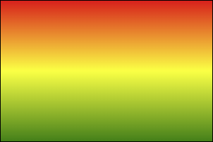
  >
  > ```css
  > background-image: linear-gradient(red,yellow,green);
  > ```

- 使用<span style="color: #e96900;">关键词</span>设置线性**渐变的方向**。

  > [!tip]
  >
  > 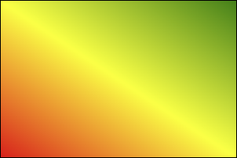
  >
  > ```css
  > background-image: linear-gradient(to top,red,yellow,green);
  > background-image: linear-gradient(to right top,red,yellow,green);
  > ```
  >
  > 

- 使用<span style="color: #e96900;">角度</span>设置线性**渐变的方向**。

  > [!tip]
  >
  > 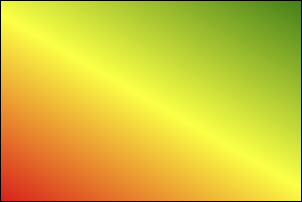
  >
  > ```css
  > background-image: linear-gradient(30deg,red,yellow,green);
  > ```
  >
  > 

- 调整开始**渐变的位置**。

  > [!tip]
  >
  > 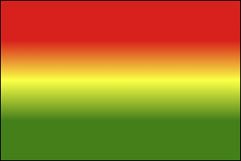
  >
  > ```css
  > background-image: linear-gradient(red 50px,yellow 100px ,green 150px);
  > ```
  >
  
- 示例：

  :::normal-demo 演示

  ```html
  <!DOCTYPE html>
  <html lang="zh-CN">
  <head>
      <meta charset="UTF-8">
      <title>01_线性渐变</title>
      <style>
          .box {
              width: 300px;
              height: 200px;
              border: 1px solid black;
              float: left;
              margin-left: 50px;
              font-size: 20px;
          }
          .box1 {
              background-image: linear-gradient(red,yellow,green);
          }
          .box2 {
              background-image: linear-gradient(to right top,red,yellow,green);
          }
          .box3 {
              background-image: linear-gradient(20deg,red,yellow,green);
          }
          .box4 {
              background-image: linear-gradient(red 50px,yellow 100px,green 150px);
          }
          .box5 {
              background-image: linear-gradient(20deg,red 50px,yellow 100px,green 150px);
              font-size: 80px;
              text-align: center;
              line-height: 200px;
              font-weight: bold;
              color: transparent;
              background-clip: text;
          }
      </style>
  </head>
  <body>
      <div class="box box1">默认情况（从上到下）</div>
      <div class="box box2">通过关键词调整线性渐变渐变的方向</div>
      <div class="box box3">通过角度调整线性渐变渐变的方向</div>
      <div class="box box4">调整线性渐变的区域</div>
      <div class="box box5">你好啊</div>
  </body>
  </html>
  ```

  

  :::

### 8.2 径向渐变

- 多个颜色之间的渐变， 默认从圆心四散。（注意：不一定是正圆，要看容器本身宽高比）

  > [!tip]
  >
  > 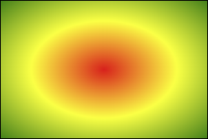
  >
  > ```css
  > background-image: radial-gradient(red,yellow,green);
  > ```
  >
  > 

- 使用<span style="color: #e96900;">关键词调整</span>渐变圆的<span style="color: #e96900;">圆心位置</span>。

  > [!tip]
  >
  > 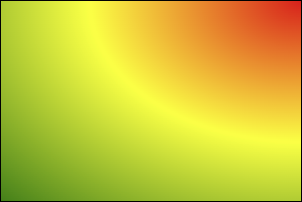
  >
  > ```css
  > background-image: radial-gradient(at right top,red,yellow,green);
  > ```
  >
  > 

- 使用<span style="color: #e96900;">像素值调整</span>渐变圆的<span style="color: #e96900;">圆心位置</span>。

  > [!tip]
  >
  > 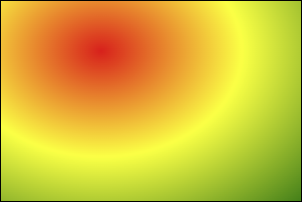
  >
  > ```css
  > background-image: radial-gradient(at 100px 50px,red,yellow,green);
  > ```
  >
  > 

- 调整渐变形状为<span style="color: #e96900;">正圆</span> 。

  > [!tip]
  >
  > 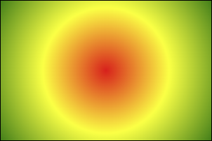
  >
  > ```css
  > background-image: radial-gradient(circle,red,yellow,green);
  > ```
  >
  > 

- 调整形状的半径 。

  > [!tip]
  >
  > 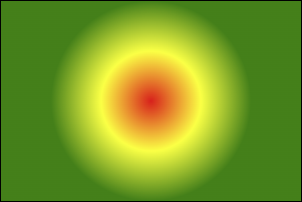
  >
  > ```css
  > background-image: radial-gradient(100px,red,yellow,green);
  > ```
  >
  > 
  >
  > 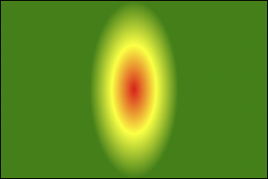
  >
  > ```css
  > background-image: radial-gradient(50px 100px,red,yellow,green);
  > ```
  >
  > 

- 调整开始渐变的位置。

  > [!tip]
  >
  > 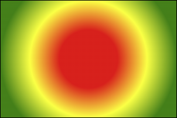
  >
  > ```css
  > background-image: radial-gradient(red 50px,yellow 100px,green 150px);
  > ```
  >
  
- 示例：

  :::normal-demo 演示

  ```html
  <!DOCTYPE html>
  <html lang="zh-CN">
  <head>
      <meta charset="UTF-8">
      <title>02_径向渐变</title>
      <style> 
          .box {
              width: 300px;
              height: 200px;
              border: 1px solid black;
              float: left;
              margin-left: 50px;
              font-size: 20px;
              margin-top: 20px;
          }
          .box1 {
              background-image: radial-gradient(red,yellow,green);
          }
          .box2 {
              background-image: radial-gradient(at right top,red,yellow,green);
          }
          .box3 {
              background-image: radial-gradient(at 100px 50px,red,yellow,green);
          }
          .box4 {
              background-image: radial-gradient(circle,red,yellow,green);
          }
          .box5 {
              background-image: radial-gradient(200px 200px,red,yellow,green);
          }
          .box6 {
              background-image: radial-gradient(red 50px,yellow 100px,green 150px);
          }
          .box7 {
              background-image: radial-gradient(100px 50px at 150px 150px,red 50px,yellow 100px,green 150px);
          }
      </style>
  </head>
  <body>
      <div class="box box1">默认情况</div>
      <div class="box box2">通过关键词调整径向渐变圆的圆心</div>
      <div class="box box3">通过像素值调整径向渐变圆的圆心</div>
      <div class="box box4">通过circle关键字调整为正圆</div>
      <div class="box box5">通过像素值调整为正圆</div>
      <div class="box box6">调整径向渐变的区域</div>
      <div class="box box7">综合写法</div>
  </body>
  </html>
  ```

  

  :::


### 8.3 重复渐变

无论线性渐变，还是径向渐变，在没有发生渐变的位置，继续进行渐变，就为重复渐变。

- 使用 <span style="color: #e96900;">repeating-linear-gradient</span> 进行重复线性渐变，具体参数同 <span style="color: #e96900;">linear-gradient</span> 。
- 使用 <span style="color: #e96900;">repeating-radial-gradient</span> 进行重复径向渐变，具体参数同 <span style="color: #e96900;">radial-gradient</span> 。

示例：

:::normal-demo 演示

```html
<!DOCTYPE html>
<html lang="zh-CN">
<head>
    <meta charset="UTF-8">
    <title>03_重复渐变</title>
    <style>
        .box {
            width: 300px;
            height: 200px;
            border: 1px solid black;
            float: left;
            margin-left: 50px;
            font-size: 20px;
        }
        .box1 {
            background-image: repeating-linear-gradient(red 50px,yellow 100px,green 150px);
        }
        .box2 {
            background-image: repeating-radial-gradient(red 50px,yellow 100px,green 150px);
        }
    </style>
</head>
<body>
    <div class="box box1">重复线性渐变</div>
    <div class="box box2">重复径向渐变</div>
</body>
</html>
```


:::

> [!tip]
>
> 我们可以利用渐变，做出很多有意思的效果：例如：横格纸、立体球等等。

示例：

:::normal-demo 演示

```html
<!DOCTYPE html>
<html lang="zh-CN">
<head>
    <meta charset="UTF-8">
    <title>04_渐变小案例</title>
    <style>
        .box1 {
            width: 600px;
            height: 800px;
            padding: 20px;
            border: 1px solid black;
            margin: 0 auto;
            background-image: repeating-linear-gradient(transparent 0px,transparent 29px,gray 30px);
            background-clip: content-box;
        }
        .box2 {
            width: 200px;
            height: 200px;
            border-radius: 50%;
            background-image: radial-gradient(at 80px 80px,white,#333);
        }
    </style>
</head>
<body>
    <div class="box1"></div>
    <div class="box2"></div>
</body>
</html>
```


:::

## 9. web 字体
### 9.1 基本用法

可以通过 <span style="color: #e96900;">@font-face</span> 指定字体的具体地址，浏览器会自动下载该字体，这样就不依赖用户电脑上的字体了。

- 语法（简写方式）

  ```css
  @font-face {
      font-family: "情书字体";
      src: url('./方正手迹.ttf');
  }
  ```

  

- 语法（高兼容性写法）

  ```css
  @font-face {
      font-family: "atguigu";
      font-display: swap;
      src: url('webfont.eot'); /* IE9 */
      src: url('webfont.eot?#iefix') format('embedded-opentype'), /* IE6-IE8 */
          url('webfont.woff2') format('woff2'),
          url('webfont.woff') format('woff'), /* chrome、firefox */
          url('webfont.ttf') format('truetype'), /* chrome、firefox、opera、Safari,Android*/
          url('webfont.svg#webfont') format('svg'); /* iOS 4.1- */
  }
  ```

- 示例：

  :::normal-demo 演示

  ```html
  <!DOCTYPE html>
  <html lang="zh-CN">
  <head>
      <meta charset="UTF-8">
      <title>Document</title>
      <style>
          @font-face {
              font-family: "情书字体";
              src: url('./font1/方正手迹.ttf');
          }
          @font-face {
              font-family: "atguigu";
              font-display: swap;
              src: url('./font2/webfont.eot'); /* IE9 */
              src: url('./font2/webfont.eot?#iefix') format('embedded-opentype'), /* IE6-IE8 */
              url('./font2/webfont.woff2') format('woff2'),
              url('./font2/webfont.woff') format('woff'), /* chrome、firefox */
              url('./font2/webfont.ttf') format('truetype'), /* chrome、firefox、opera、Safari, Android, iOS 4.2+*/
              url('./font2/webfont.svg#webfont') format('svg'); /* iOS 4.1- */
          }
          .t1 {
              font-size: 100px;
              font-family: '情书字体';
          }
          .t2 {
              font-size: 100px;
              font-family: 'atguigu';
          }
      </style>
  </head>
  <body>
      <h1 class="t1">春风得意马蹄疾，不信人间有别离</h1>
      <h1 class="t2">春风得意马蹄疾，不信人间有别离</h1>
  </body>
  </html>
  ```

  

  :::

### 9.2 定制字体

- 中文的字体文件很大，使用完整的字体文件不现实，通常针对某几个文字进行单独定制。
- 可使用阿里 <span style="color: #e96900;">Web</span> 字体定制工具：[iconfont-webfont平台](https://www.iconfont.cn/webfont#!/webfont/index)

> [!tip]
>
> 字体图标的具体使用方式，每个平台不尽相同，最好参考平台使用指南，视频中我们是以使用最多的阿里图标库作为演示。
>
> 阿里图标官网地址：[iconfont-阿里巴巴矢量图标库](https://www.iconfont.cn/)

### 9.3 字体图标

- 相比图片更加清晰。
- 灵活性高，更方便改变大小、颜色、风格等。
- 兼容性好， <span style="color: #e96900;">IE</span> 也能支持。

> [!tip]
>
> 字体图标的具体使用方式，每个平台不尽相同，最好参考平台使用指南，视频中我们是以使用最多
>
> 的阿里图标库作为演示。
>
> 阿里图标官网地址：[iconfont-阿里巴巴矢量图标库](https://www.iconfont.cn/)

本地使用示例：

:::normal-demo 演示1——Unicode

```html
<!DOCTYPE html>
<html lang="zh-CN">
<head>
    <meta charset="UTF-8">
    <title>Document</title>
    <style>
        /* 第一步 */
        @font-face {
            font-family: 'iconfont';
            src: url('./font3/iconfont.woff2?t=1676857973138') format('woff2'),
                url('./font3/iconfont.woff?t=1676857973138') format('woff'),
                url('./font3/iconfont.ttf?t=1676857973138') format('truetype');
        }
        /* 第二步 */
        .iconfont {
            font-family: "iconfont" !important;
            font-size: 100px;
        }
    </style>
</head>
<body>
    <span class="iconfont">&#xe85c;</span>
    <span class="iconfont">&#xe85d;</span>
    <span class="iconfont">&#xe85e;</span>
    <span class="iconfont">&#xe85f;</span>
</body>
</html>
```


:::


:::normal-demo 演示2——Font class

```html
<!DOCTYPE html>
<html lang="zh-CN">
<head>
    <meta charset="UTF-8">
    <title>03_字体图标_方式二</title>
    <link rel="stylesheet" href="./font3/iconfont.css">
    <style>
        .iconfont {
            font-size: 100px;
        }
    </style>
</head>
<body>
    <span class="iconfont icon-chengzi"></span>
    <span class="iconfont icon-bingqilin"></span>
    <span class="iconfont icon-hanbao"></span>
    <span class="iconfont icon-kafeibei"></span>
</body>
</html>
```


:::


:::normal-demo 演示3——Symbol

```html
<!DOCTYPE html>
<html lang="zh-CN">
<head>
    <meta charset="UTF-8">
    <title>04_字体图标_方式三</title>
    <script src="./font3/iconfont.js"></script>
    <style>
        svg {
            width: 150px;
        }
    </style>
</head>
<body>
    <svg class="icon" aria-hidden="true">
        <use xlink:href="#icon-chengzi"></use>
    </svg>
    <svg class="icon" aria-hidden="true">
        <use xlink:href="#icon-bingqilin"></use>
    </svg>
    <svg class="icon" aria-hidden="true">
        <use xlink:href="#icon-hanbao"></use>
    </svg>
    <svg class="icon" aria-hidden="true">
        <use xlink:href="#icon-kafeibei"></use>
    </svg>
</body>
</html>
```


:::


在线使用示例：

:::normal-demo 演示1——Unicode

```html
<!DOCTYPE html>
<html lang="zh-CN">
<head>
    <meta charset="UTF-8">
    <title>05_字体图标_方式一_在线使用</title>
    <style>
        @font-face {
            font-family: 'iconfont';  /* Project id 3904680 */
            src: url('//at.alicdn.com/t/c/font_3904680_cctp97jw61q.woff2?t=1676858967519') format('woff2'),
                url('//at.alicdn.com/t/c/font_3904680_cctp97jw61q.woff?t=1676858967519') format('woff'),
                url('//at.alicdn.com/t/c/font_3904680_cctp97jw61q.ttf?t=1676858967519') format('truetype');
        }
        .iconfont {
            font-family: "iconfont" !important;
            font-size: 100px;
        }
    </style>
</head>
<body>
    <span class="iconfont">&#xe85c;</span>
    <span class="iconfont">&#xe85d;</span>
    <span class="iconfont">&#xe85e;</span>
    <span class="iconfont">&#xe85f;</span>
</body>
</html>
```


:::

:::normal-demo 演示2——Font class

```html
<!DOCTYPE html>
<html lang="zh-CN">
<head>
    <meta charset="UTF-8">
    <title>06_字体图标_方式二_在线使用</title>
    <link rel="stylesheet" href="//at.alicdn.com/t/c/font_3904680_cctp97jw61q.css">
    <style>
        .iconfont {
            font-size: 100px;
        }
    </style>
</head>
<body>
    <span class="iconfont icon-chengzi"></span>
    <span class="iconfont icon-bingqilin"></span>
    <span class="iconfont icon-hanbao"></span>
    <span class="iconfont icon-kafeibei"></span>
</body>
</html>
```


:::

:::normal-demo 演示3——Symbol

```html
<!DOCTYPE html>
<html lang="zh-CN">
<head>
    <meta charset="UTF-8">
    <title>07_字体图标_方式三_在线使用</title>
    <script src="//at.alicdn.com/t/c/font_3904680_cctp97jw61q.js"></script>
</head>
<body>
    <svg class="icon" aria-hidden="true">
        <use xlink:href="#icon-chengzi"></use>
    </svg>
    <svg class="icon" aria-hidden="true">
        <use xlink:href="#icon-bingqilin"></use>
    </svg>
    <svg class="icon" aria-hidden="true">
        <use xlink:href="#icon-hanbao"></use>
    </svg>
    <svg class="icon" aria-hidden="true">
        <use xlink:href="#icon-kafeibei"></use>
    </svg>
</body>
</html>
```


:::

## 10. 2D变换

> [!tip]
>
> 前提：二维坐标系如下图所示

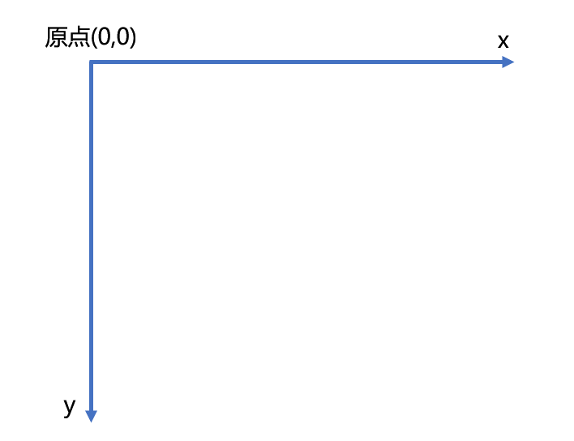

### 10.1. 2D位移

<span style="color: #e96900;">2D</span> 位移可以改变元素的位置，具体使用方式如下：

1. 先给元素添加 **转换属性** <span style="color: #e96900;">transform</span>

2. 编写 <span style="color: #e96900;">transform</span> 的具体值，相关可选值如下：

   | 值                                              | 含义                                                         |
   | ----------------------------------------------- | ------------------------------------------------------------ |
   | <span style="color: #e96900;">translateX</span> | 设置水平方向位移，需指定长度值；若指定的是百分比，是参考自身宽度的百分比。 |
   | <span style="color: #e96900;">translateY</span> | 设置垂直方向位移，需指定长度值；若指定的是百分比，是参考自身高度的百分比。 |
   | <span style="color: #e96900;">translate</span>  | 一个值代表水平方向，两个值代表：水平和垂直方向。             |

3. 注意点：

   > [!tip]
   >
   > 1. 位移与相对定位很相似，都不脱离文档流，不会影响到其它元素。
   > 2. 与相对定位的区别：相对定位的百分比值，参考的是其父元素；定位的百分比值，参考的是其自身。
   >
   > 3. 浏览器针对位移有优化，与定位相比，浏览器处理位移的效率更高。
   >
   > 4. <span style="color: #e96900;">transform</span> 可以链式编写，例如：
   >
   >    ```css
   >    transform: translateX(30px) translateY(40px);
   >    ```
   >
   > 5. 位移对行内元素无效。
   >
   > 6. 位移配合定位，可实现元素水平垂直居中
   >
   >    ```css
   >    .box {
   >        position: absolute;
   >        left: 50%;
   >        top: 50%;
   >        transform: translate(-50%, -50%);
   >    }
   >    ```
   >

4. 示例：

   :::normal-demo 演示

   ```html
   <!DOCTYPE html>
   <html lang="zh-CN">
   <head>
       <meta charset="UTF-8">
       <title>01_位移</title>
       <style>
           .outer {
               width: 200px;
               height: 200px;
               border: 2px solid black;
               margin: 0 auto;
               margin-top: 100px;
               position: relative;
           }
           .inner {
               width: 200px;
               height: 200px;
               background-color: deepskyblue;
               /* 水平位移 */
               /* transform: translateX(50px); */
   
               /* 垂直位移 */
               /* transform: translateY(50px); */
   
               /* 水平+垂直位移 */
               /* transform: translate(50px,50px); */
           }
   
           .inner2 {
               width: 60px;
               height: 60px;
               background-color: orange;
               position: absolute;
               top: 50%;
               left: 50%;
               transform: translate(-50%,-50%);
           }
       </style>
   </head>
   <body>
       <div class="outer">
           <div class="inner">你好啊</div>
       </div>
   
       <div class="outer">
           <div class="inner2">你好啊</div>
       </div>
   </body>
   </html>
   ```

   

   :::

### 10.2. 2D缩放

<span style="color: #e96900;">2D</span> 缩放是指：让元素放大或缩小，具体使用方式如下：

1. 先给元素添加 **转换属性** <span style="color: #e96900;">transform</span>

2. 编写 <span style="color: #e96900;">transform</span> 的具体值，相关可选值如下：

   | 值                                          | 含义                                                         |
   | ------------------------------------------- | ------------------------------------------------------------ |
   | <span style="color: #e96900;">scaleX</span> | 设置水平方向的缩放比例，值为一个数字， <span style="color: #e96900;">1</span> 表示不缩放，大于 <span style="color: #e96900;">1</span> 放大，小于 <span style="color: #e96900;">1</span> 缩小。 |
   | <span style="color: #e96900;">scaleY</span> | 设置垂直方向的缩放比例，值为一个数字， <span style="color: #e96900;">1</span> 表示不缩放，大于 <span style="color: #e96900;">1</span> 放大，小于 <span style="color: #e96900;">1</span> 缩小。 |
   | <span style="color: #e96900;">scale</span>  | 同时设置水平方向、垂直方向的缩放比例，一个值代表同时设置水平和垂直缩放；两个值分别代表：水平缩放、垂直缩放。 |

3. 注意点：

   > [!tip]
   >
   > 1. <span style="color: #e96900;">scale</span> 的值，是支持写负数的，但几乎不用，因为容易让人产生误解。
   > 2. 借助缩放，可实现小于 <span style="color: #e96900;">12px</span> 的文字。

4. 示例：

   :::normal-demo 演示

   ```html
   <!DOCTYPE html>
   <html lang="zh-CN">
   <head>
       <meta charset="UTF-8">
       <title>02_缩放</title>
       <style>
           .outer {
               width: 200px;
               height: 200px;
               border: 2px solid black;
               margin: 0 auto;
               margin-top: 100px;
           }
           .inner {
               width: 200px;
               height: 200px;
               background-color: deepskyblue;
               transform: scale(1.5);
           }
           span {
               display: inline-block;
               font-size: 20px;
               transform: scale(0.5);
           }
       </style>
   </head>
   <body>
       <div class="outer">
           <div class="inner">你好啊</div>
       </div>
       <span>好</span>
   </body>
   </html>
   ```

   

   :::

### 10.3. 2D旋转

<span style="color: #e96900;">2D</span> 旋转是指：让元素在二维平面内，顺时针旋转或逆时针旋转，具体使用方式如下：

1. 先给元素添加 **转换属性** <span style="color: #e96900;">transform</span>

2. 编写 <span style="color: #e96900;">transform</span> 的具体值，相关可选值如下：

   | 值                                          | 含义                                                         |
   | ------------------------------------------- | ------------------------------------------------------------ |
   | <span style="color: #e96900;">rotate</span> | 设置旋转角度，需指定一个角度值( <span style="color: #e96900;">deg</span> )，正值顺时针，负值逆时针。 |

> [!tip]
>
> 注意： <span style="color: #e96900;">rotateZ(20deg)</span> 相当于 <span style="color: #e96900;">rotate(20deg)</span> ，当然到了 <span style="color: #e96900;">3D</span> 变换的时候，还能写：rotate(x,x,x)

示例：

:::normal-demo 演示

```html
<!DOCTYPE html>
<html lang="zh-CN">
<head>
    <meta charset="UTF-8">
    <title>03_旋转</title>
    <style>
        .outer {
            width: 200px;
            height: 200px;
            border: 2px solid black;
            margin: 0 auto;
            margin-top: 100px;
        }
        .inner {
            width: 200px;
            height: 200px;
            background-color: deepskyblue;
            /* transform: rotateZ(-30deg); */
            transform: rotate(30deg);
        }
    </style>
</head>
<body>
    <div class="outer">
        <div class="inner">你好啊</div>
    </div>
</body>
</html>
```


:::

### 10.4. 2D扭曲（了解）

<span style="color: #e96900;">2D</span> 扭曲是指：让元素在二维平面内被“拉扯”，进而“走形”，实际开发几乎不用，了解即可，具体使用方式如下：

1. 先给元素添加 **转换属性** <span style="color: #e96900;">transform</span>

2. 编写 <span style="color: #e96900;">transform</span> 的具体值，相关可选值如下：

   | 值                                         | **含义**                                                     |
   | ------------------------------------------ | ------------------------------------------------------------ |
   | <span style="color: #e96900;">skewX</span> | 设置元素在水平方向扭曲，值为角度值，会将元素的左上角、右下角 <span style="color: #e96900;">拉扯</span> 。 |
   | <span style="color: #e96900;">skewY</span> | 设置元素在垂直方向扭曲，值为角度值，会将元素的左上角、右下角 <span style="color: #e96900;">拉扯</span> 。 |
   | <span style="color: #e96900;">skew</span>  | 一个值代表 <span style="color: #e96900;">skewX</span> ，两个值分别代表： <span style="color: #e96900;">skewX</span> 、 <span style="color: #e96900;">skewY</span> |

示例：

:::normal-demo 演示

```html
<!DOCTYPE html>
<html lang="zh-CN">
<head>
    <meta charset="UTF-8">
    <title>04_扭曲_了解</title>
    <style>
        .outer {
            width: 200px;
            height: 200px;
            border: 2px solid black;
            margin: 0 auto;
            margin-top: 100px;
        }
        .inner {
            width: 200px;
            height: 200px;
            background-color: deepskyblue;
            /* transform: skewX(-30deg); */
            /* transform: skewY(30deg); */
            /* transform: skewX(30deg) skewY(30deg); */
            transform: skew(30deg);
        }
    </style>
</head>
<body>
    <div class="outer">
        <div class="inner">你好啊</div>
    </div>
</body>
</html>
```


:::

### 10.5. 多重变换

多个变换，可以同时使用一个 <span style="color: #e96900;">transform</span> 来编写。

```css
transform: translate(-50%, -50%) rotate(45deg);
```

> [!tip]
>
> 注意点：多重变换时，建议最后旋转。

:::normal-demo 演示

```html
<!DOCTYPE html>
<html lang="zh-CN">
<head>
    <meta charset="UTF-8">
    <title>05_多重变换</title>
    <style>
        .outer {
            width: 200px;
            height: 200px;
            border: 2px solid black;
            margin: 0 auto;
            margin-top: 100px;
        }
        .inner {
            width: 200px;
            height: 200px;
            background-color: deepskyblue;
            transform:translate(100px,100px) rotate(30deg);
        }
    </style>
</head>
<body>
    <div class="outer">
        <div class="inner">你好啊</div>
    </div>
</body>
</html>
```


:::

### 10.6. 变换原点

- 元素变换时，默认的原点是元素的中心，使用 <span style="color: #e96900;">transform-origin</span> 可以设置变换的原点。

- 修改变换原点对位移没有影响， 对旋转和缩放会产生影响。

- 如果提供两个值，第一个用于横坐标，第二个用于纵坐标。

- 如果只提供一个，若是像素值，表示横坐标，纵坐标取 <span style="color: #e96900;">50%</span> ；若是关键词，则另一个坐标取 <span style="color: #e96900;">50%</span>

  > [!tip]
  >
  > 1. <span style="color: #e96900;">transform-origin: 50% 50%</span> ， 变换原点在元素的中心位置，百分比是相对于自身。—— 默认值
  >
  > 2. <span style="color: #e96900;">transform-origin: left top</span> ，变换原点在元素的左上角 。
  > 3. <span style="color: #e96900;">transform-origin: 50px 50px</span> ， 变换原点距离元素左上角 <span style="color: #e96900;">50px 50px</span> 的位置。
  > 4. <span style="color: #e96900;">transform-origin: 0</span> ，只写一个值的时候，第二个值默认为 50% 。

- 示例：

  :::normal-demo 演示

  ```html
  <!DOCTYPE html>
  <html lang="zh-CN">
  <head>
      <meta charset="UTF-8">
      <title>05_多重变换</title>
      <style>
          .outer {
              width: 200px;
              height: 200px;
              border: 2px solid black;
              margin: 0 auto;
              margin-top: 100px;
          }
          .inner {
              width: 200px;
              height: 200px;
              background-color: deepskyblue;
              /* 通过关键词调整变换原点 */
              transform-origin: right bottom;
  
              /* 通过具体像素值调整变换原点 */
              /* transform-origin: 50px 50px; */
  
              /* 通过百分比调整变换原点 */
              /* transform-origin: 25% 25%; */
  
              /* 只给一个值 */
              /* transform-origin:top; */
  
              /* transform-origin: right top; */
  
              /* 变换原点位置的改变对 旋转 有影响 */
              transform: rotate(0deg);
  
              /* 变换原点位置的改变对 缩放 有影响 */
              /* transform: scale(1.3); */
  
              /* 变换原点位置的改变对 位移 没有影响 */
              /* transform: translate(100px,100px) */
          }
          .test {
              width: 50px;
              height: 100px;
              background-color: orange;
          }
      </style>
  </head>
  <body>
      <div class="outer">
          <div class="inner">
              <div class="test">你好啊</div>
          </div>
      </div>
  </body>
  </html>
  ```

  

  :::

## 11. 3D变换

### 11.1. 开启3D空间

重要原则：元素进行 <span style="color: #e96900;">3D</span> 变换的首要操作：**<span style="color: red;">父元素</span>** 必须开启 <span style="color: #e96900;">3D</span> 空间！

> [!tip]
>
> 使用 <span style="color: #e96900;">transform-style</span> 开启 <span style="color: #e96900;">3D</span> 空间，可选值如下：
>
> - <span style="color: #e96900;">flat</span> ： 让子元素位于此元素的二维平面内（ <span style="color: #e96900;">2D</span> 空间）—— 默认值
> - <span style="color: #e96900;">preserve-3d</span> ： 让子元素位于此元素的三维空间内（ <span style="color: #e96900;">3D</span> 空间）

### 11.2. 设置景深

何为景深？—— 指定观察者与 <span style="color: #e96900;">z=0</span> 平面的距离，能让发生 <span style="color: #e96900;">3D</span> 变换的元素，产生透视效果，看来更加立体。

> [!tip]
>
> 使用 <span style="color: #e96900;">perspective</span> 设置景深，可选值如下：
>
> - <span style="color: #e96900;">none</span> ： 不指定透视 ——（默认值）
> - <span style="color: #e96900;">长度值</span> ： 指定观察者距离 <span style="color: #e96900;">z=0</span> 平面的距离，不允许负值。
>
> 注意： <span style="color: #e96900;">perspective</span> 设置给发生 <span style="color: #e96900;">3D</span> 变换元素的<span style="color: red;">父元素</span>！

示例：

:::normal-demo 演示

```html
<!DOCTYPE html>
<html lang="zh-CN">
<head>
    <meta charset="UTF-8">
    <title>01_3D空间与景深</title>
    <style>
        .outer {
            width: 200px;
            height: 200px;
            border: 2px solid black;
            margin: 0 auto;
            margin-top: 100px;
            /* 开启3D空间 */
            transform-style: preserve-3d;
            /* 设置景深（有了透视效果，近大远小） */
            perspective: 500px;
        }
        .inner {
            width: 200px;
            height: 200px;
            background-color: deepskyblue;
            transform: rotateX(30deg);
        }
    </style>
</head>
<body>
    <div class="outer">
        <div class="inner">你好啊</div>
    </div>
</body>
</html>
```


:::

### 11.3. 透视点位置

所谓透视点位置，就是观察者位置；默认的透视点在元素的中心。

> [!tip]
>
> 使用 <span style="color: #e96900;">perspective-origin</span> 设置观察者位置（透视点的位置），例如：
>
> ```css
> /* 相对坐标轴往右偏移400px， 往下偏移300px（相当于人蹲下300像素，然后向右移动400像素看元素）*/
> perspective-origin: 400px 300px;
> ```
>
> 注意：通常情况下，我们不需要调整透视点位置。

示例：

:::normal-demo 演示

```html
<!DOCTYPE html>
<html lang="zh-CN">
<head>
    <meta charset="UTF-8">
    <title>02_透视点的位置</title>
    <style>
        .outer {
            width: 200px;
            height: 200px;
            border: 2px solid black;
            margin: 0 auto;
            margin-top: 100px;
            /* 开启3D空间 */
            transform-style: preserve-3d;
            /* 设置景深（有了透视效果，近大远小） */
            perspective: 500px;
            /* 设置透视点的位置 */
            perspective-origin: 102px 102px;
        }
        .inner {
            width: 200px;
            height: 200px;
            background-color: deepskyblue;
            transform: rotateX(45deg);
        }
    </style>
</head>
<body>
    <div class="outer">
        <div class="inner">你好啊</div>
    </div>
</body>
</html>
```


:::

### 11.4. 3D 位移

<span style="color: #e96900;">3D</span> 位移是在 <span style="color: #e96900;">2D</span> 位移的基础上，可以让元素沿 <span style="color: #e96900;">z</span> 轴位移，具体使用方式如下：

1. 先给元素添加 **转换属性** <span style="color: #e96900;">transform</span>

2. 编写 <span style="color: #e96900;">transform</span> 的具体值， 3D 相关可选值如下：

   | 值                                               | 含义                                                         |
   | ------------------------------------------------ | ------------------------------------------------------------ |
   | <span style="color: #e96900;">translateZ</span>  | 设置 <span style="color: #e96900;">z</span> 轴位移，需指定长度值，正值向屏幕外，负值向屏幕里，且不能写百分比。 |
   | <span style="color: #e96900;">translate3d</span> | 第1个参数对应 <span style="color: #e96900;">x</span> 轴，第2个参数对应 <span style="color: #e96900;">y</span> 轴，第3个参数对应 <span style="color: #e96900;">z</span> 轴，且均不能省略。 |

示例：

:::normal-demo 演示

```html
<!DOCTYPE html>
<html lang="zh-CN">
<head>
    <meta charset="UTF-8">
    <title>03_位移</title>
    <style>
        .outer {
            width: 200px;
            height: 200px;
            border: 2px solid black;
            margin: 0 auto;
            margin-top: 100px;
            /* 开启3D空间 */
            transform-style: preserve-3d;
            /* 设置景深（有了透视效果，近大远小） */
            perspective: 500px;
            /* 设置透视点的位置 */
            perspective-origin: 102px 102px;
        }
        .inner {
            width: 200px;
            height: 200px;
            background-color: rgba(0, 191, 255, 0.726);
            /* transform: translateZ(150px); */
            transform: translate3d(50%,50%,50%);
            box-shadow: 0px 0px 10px black;
        }
    </style>
</head>
<body>
    <div class="outer">
        <div class="inner">你好啊</div>
    </div>
</body>
</html>
```


:::

### 11.5. 3D 旋转

<span style="color: #e96900;">3D</span> 旋转是在 <span style="color: #e96900;">2D</span> 旋转的基础上，可以让元素沿 <span style="color: #e96900;">x</span> 轴和 <span style="color: #e96900;">y</span> 轴旋转，具体使用方式如下：

1. 先给元素添加 **转换属性** <span style="color: #e96900;">transform</span>

2. 编写 <span style="color: #e96900;">transform</span> 的具体值， <span style="color: #e96900;">3D</span> 相关可选值如下：

   | 值                                            | 含义                                                         |
   | --------------------------------------------- | ------------------------------------------------------------ |
   | <span style="color: #e96900;">rotateX</span>  | 设置 <span style="color: #e96900;">x</span> 轴旋转角度，需指定一个角度值( <span style="color: #e96900;">deg</span> )，面对 <span style="color: #e96900;">x</span> 轴正方向：正值顺时针，负值逆时针。 |
   | <span style="color: #e96900;">rotateY</span>  | 设置 <span style="color: #e96900;">y</span> 轴旋转角度，需指定一个角度值( deg )，面对 <span style="color: #e96900;">y</span> 轴正方向：正值顺时针，负值逆时针。 |
   | <span style="color: #e96900;">rotate3d</span> | 前 <span style="color: #e96900;">3</span> 个参数分别表示坐标轴： <span style="color: #e96900;">x</span> , <span style="color: #e96900;">y</span> , <span style="color: #e96900;">z</span> ，第 <span style="color: #e96900;">4</span> 个参数表示旋转的角度，参数不允许省略。<br>例如： <span style="color: #e96900;">transform: rotate3d(1,1,1,30deg)</span> ，意思是：<span style="color: #e96900;"> x</span> 、 <span style="color: #e96900;">y</span> 、 <span style="color: #e96900;">z</span> 分别旋转 <span style="color: #e96900;">30</span> 度。 |

示例：

:::normal-demo 演示

```html
<!DOCTYPE html>
<html lang="zh-CN">
<head>
    <meta charset="UTF-8">
    <title>04_旋转</title>
    <style>
        .outer {
            width: 200px;
            height: 200px;
            border: 2px solid black;
            margin: 0 auto;
            margin-top: 100px;
            /* 开启3D空间 */
            transform-style: preserve-3d;
            /* 设置景深（有了透视效果，近大远小） */
            perspective: 500px;
            /* 设置透视点的位置 */
            perspective-origin: 102px 102px;
        }
        .inner {
            width: 200px;
            height: 200px;
            background-color: rgba(0, 191, 255, 0.726);
            /* transform: rotateX(315deg); */
            /* transform: rotateY(-35deg); */
            transform: rotate3d(1,1,1,30deg);
        }
    </style>
</head>
<body>
    <div class="outer">
        <div class="inner">你好啊</div>
    </div>
</body>
</html>
```


:::

### 11.6. 3D 缩放

<span style="color: #e96900;">3D</span> 缩放是在 <span style="color: #e96900;">2D</span> 缩放的基础上，可以让元素沿 <span style="color: #e96900;">z</span> 轴缩放，具体使用方式如下：

1. 先给元素添加 **转换属性** <span style="color: #e96900;">transform</span>

2.  编写 <span style="color: #e96900;">transform</span> 的具体值， <span style="color: #e96900;">3D</span> 相关可选值如下：

   | 值                                           | 含义                                                         |
   | -------------------------------------------- | ------------------------------------------------------------ |
   | <span style="color: #e96900;">scaleZ</span>  | 设置 <span style="color: #e96900;">z</span> 轴方向的缩放比例，值为一个数字， <span style="color: #e96900;">1</span> 表示不缩放，大于 <span style="color: #e96900;">1</span> 放大，小于 <span style="color: #e96900;">1</span> 缩小。 |
   | <span style="color: #e96900;">scale3d</span> | 第1个参数对应 <span style="color: #e96900;">x</span> 轴，第2个参数对应 <span style="color: #e96900;">y</span> 轴，第3个参数对应 <span style="color: #e96900;">z</span> 轴，参数不允许省略。 |

示例：

:::normal-demo 演示

```html
<!DOCTYPE html>
<html lang="zh-CN">
<head>
    <meta charset="UTF-8">
    <title>05_缩放</title>
    <style>
        .outer {
            width: 200px;
            height: 200px;
            border: 2px solid black;
            margin: 0 auto;
            margin-top: 100px;
            /* 开启3D空间 */
            transform-style: preserve-3d;
            /* 设置景深（有了透视效果，近大远小） */
            perspective: 500px;
            /* 设置透视点的位置 */
            perspective-origin: 102px 102px;
        }
        .inner {
            width: 200px;
            height: 200px;
            background-color: rgba(0, 191, 255, 0.726);
            /* transform: scaleZ(4) rotateY(45deg); */
            transform: scale3d(1.5,1.5,1) rotateY(45deg);
        }
    </style>
</head>
<body>
    <div class="outer">
        <div class="inner">你好啊</div>
    </div>
</body>
</html>
```


:::

### 11.7. 多重变换

多个变换，可以同时使用一个 <span style="color: #e96900;">transform</span> 来编写。

```css
transform: translateZ(100px) scaleZ(3) rotateY(40deg);
```

> [!tip]
>
> 注意点：多重变换时，建议最后旋转。

示例：

:::normal-demo 演示

```html
<!DOCTYPE html>
<html lang="zh-CN">
<head>
    <meta charset="UTF-8">
    <title>06_多重变换</title>
    <style>
        .outer {
            width: 200px;
            height: 200px;
            border: 2px solid black;
            margin: 0 auto;
            margin-top: 100px;
            /* 开启3D空间 */
            transform-style: preserve-3d;
            /* 设置景深（有了透视效果，近大远小） */
            perspective: 500px;
            /* 设置透视点的位置 */
            perspective-origin: 102px 102px;
        }
        .inner {
            width: 200px;
            height: 200px;
            background-color: rgba(0, 191, 255, 0.726);
            /* transform-origin: 202px 180px; */
            /* transform: rotateX(-45deg); */
            transform: translateZ(100px) scaleZ(1) rotateY(45deg);
        }
    </style>
</head>
<body>
    <div class="outer">
        <div class="inner">你好啊</div>
    </div>
</body>
</html>
```


:::

### 11.8. 背部可见性

使用 <span style="color: #e96900;">backface-visibility</span> 指定元素背面，在面向用户时是否可见，常用值如下：

- <span style="color: #e96900;">visible</span> ： 指定元素背面可见，允许显示正面的镜像。—— 默认值
- <span style="color: #e96900;">hidden</span> ： 指定元素背面不可见

> [!tip]
>
> 注意： <span style="color: #e96900;">backface-visibility</span> 需要加在发生 <span style="color: #e96900;">3D</span> 变换元素的自身上。

示例：

:::normal-demo 演示

```html
<!DOCTYPE html>
<html lang="zh-CN">
<head>
    <meta charset="UTF-8">
    <title>06_多重变换</title>
    <style>
        .outer {
            width: 200px;
            height: 200px;
            border: 2px solid black;
            margin: 0 auto;
            margin-top: 100px;
            /* 开启3D空间 */
            transform-style: preserve-3d;
            /* 设置景深（有了透视效果，近大远小） */
            perspective: 500px;
            /* 设置透视点的位置 */
            perspective-origin: 102px 102px;
        }
        .inner {
            width: 200px;
            height: 200px;
            background-color: orange;
            transform: rotateY(0deg);
            backface-visibility: hidden;
        }
    </style>
</head>
<body>
    <div class="outer">
        <div class="inner">你好啊</div>
    </div>
</body>
</html>
```


:::

## 12. 过渡

过渡可以在不使用 <span style="color: #e96900;">Flash</span> 动画，不使用 <span style="color: #e96900;">JavaScript</span> 的情况下，让元素从一种样式，平滑过渡为另一种样式。

### 12.1. transition-property

- 作用：定义哪个属性需要过渡，只有在该属性中定义的属性（比如宽、高、颜色等）才会以有过渡效果。

- 常用值：

  1. <span style="color: #e96900;">none</span> ：不过渡任何属性。
  2. <span style="color: #e96900;">all</span> ：过渡所有能过渡的属性。
  3. 具体某个属性名 ，例如： <span style="color: #e96900;">width</span> 、<span style="color: #e96900;"> heigth</span> ，若有多个以逗号分隔。

  > [!tip]
  >
  > 不是所有的属性都能过渡，值为数字，或者值能转为数字的属性，都支持过渡，否则不支持过渡。
  >
  > 常见的支持过渡的属性有：<span style="color: #e96900;">颜色</span>、<span style="color: #e96900;">长度值</span>、<span style="color: #e96900;">百分比</span>、 <span style="color: #e96900;">z-index</span> 、 <span style="color: #e96900;">opacity</span> 、 <span style="color: #e96900;">2D 变换属性</span>、 <span style="color: #e96900;">3D 变换属性</span>、<span style="color: #e96900;">阴影</span>。

### 12.2. transition-duration

- 作用：设置过渡的持续时间，即：一个状态过渡到另外一个状态耗时多久。

- 常用值：

  1. <span style="color: #e96900;">0</span> ：没有任何过渡时间 —— 默认值。

  2. <span style="color: #e96900;">s</span> 或 <span style="color: #e96900;">ms</span> ：秒或毫秒。

  3. <span style="color: #e96900;">列表</span> ：

     - 如果想让所有属性都持续一个时间，那就写一个值。

     - 如果想让每个属性持续不同的时间那就写一个时间的列表。

示例：

:::normal-demo 演示

```html
<!DOCTYPE html>
<html lang="zh-CN">
<head>
    <meta charset="UTF-8">
    <title>01_基本使用</title>
    <style>
        .box1 {
            width: 200px;
            height: 200px;
            background-color: orange;
            opacity: 0.5;
            /* 设置哪个属性需要过渡效果 */
            /* transition-property: width,height,background-color; */

            /* 让所有能过渡的属性，都过渡 */
            transition-property: all;

            /* 分别设置时间 */
            /* transition-duration: 1s,1s,1s; */
            /* 设置一个时间，所有人都用 */
            transition-duration: 1s;
        }
        .box1:hover {
            width: 400px;
            height: 400px;
            background-color: green;
            transform: rotate(45deg);
            box-shadow: 0px 0px 20px black;
            opacity: 1;
        }
    </style>
</head>
<body>
    <div class="box1"></div>
</body>
</html>
```


:::

### 12.3. transition-delay

- 作用：指定开始过渡的延迟时间，单位： <span style="color: #e96900;">s</span> 或 <span style="color: #e96900;">ms</span>

### 12.4. transition-timing-function

- 作用：设置过渡的类型

- 常用值：

  1. <span style="color: #e96900;">ease</span> ： 平滑过渡 —— 默认值
  2. <span style="color: #e96900;">linear</span> ： 线性过渡
  3. <span style="color: #e96900;">ease-in</span> ： 慢 → 快
  4. <span style="color: #e96900;">ease-out</span> ： 快 → 慢
  5. <span style="color: #e96900;">ease-in-out</span> ： 慢 → 快 → 慢
  6. <span style="color: #e96900;">step-start</span> ： 等同于 <span style="color: #e96900;">steps(1, start)</span>
  7. <span style="color: #e96900;">step-end</span> ： 等同于 <span style="color: #e96900;">steps(1, end)</span>
  8. <span style="color: #e96900;">steps( integer,?)</span> ： 接受两个参数的步进函数。第一个参数必须为正整数，指定函数的步数。第二个参数取值可以是 <span style="color: #e96900;">start</span> 或 <span style="color: #e96900;">end</span> ，指定每一步的值发生变化的时间点。第二个参数默认值为 <span style="color: #e96900;">end</span> 。

  9. <span style="color: #e96900;">cubic-bezie</span> ( number, number, number, number)： 特定的贝塞尔曲线类型。

> [!tip]
>
> 在线制作贝赛尔曲线：[cubic-bezier](https://cubic-bezier.com)

示例：

:::normal-demo 

```html
<!DOCTYPE html>
<html lang="zh-CN">
<head>
    <meta charset="UTF-8">
    <title>02_高级使用</title>
    <style>
        .outer {
            width: 1300px;
            height: 900px;
            border: 1px solid black;
        }
        .outer:hover .box {
            width: 1300px;
        }
        .box {
            width: 200px;
            height: 100px;
            /* 让所有能过渡的属性，都过渡 */
            transition-property: all;
            /* 设置一个时间，所有人都用 */
            transition-duration: 5s;
            /* 过渡延迟 */
            /* transition-delay: 2s; */
        }
        .box1 {
            background-color: skyblue;
            transition-timing-function: ease;
        }
        .box2 {
            background-color: orange;
            transition-timing-function: linear;
        }
        .box3 {
            background-color: gray;
            transition-timing-function: ease-in;
        }
        .box4 {
            background-color: tomato;
            transition-timing-function: ease-out;
        }
        .box5 {
            background-color: green;
            transition-timing-function: ease-in-out;
        }
        .box6 {
            background-color: purple;
            transition-timing-function: step-start;
        }
        .box7 {
            background-color: deepskyblue;
            transition-timing-function: step-end;
        }
        .box8 {
            background-color: chocolate;
            transition-timing-function: steps(20,end);
        }
        .box9 {
            background-color: rgb(18, 78, 34);
            transition-timing-function: cubic-bezier(1,.35,.78,1.24);
        }
    </style>
</head>
<body>
    <div class="outer">
        <div class="box box1">ease（慢，快，慢）</div>
        <div class="box box2">linear（匀速）</div>
        <div class="box box3">ease-in（慢，快）</div>
        <div class="box box4">ease-out（快，慢）</div>
        <div class="box box5">ease-in-out（慢，快，慢）</div>
        <div class="box box6">step-start不考虑过渡的时间，直接就是终点</div>
        <div class="box box7">step-end考虑过渡时间，但无过渡效果，过渡时间到了以后，瞬间到达终点</div>
        <div class="box box8">steps分步过渡</div>
        <div class="box box9">无敌的贝赛尔曲线</div>
    </div>
</body>
</html>
```


:::

### 12.5. transition 复合属性

- 如果设置了一个时间，表示 duration ；如果设置了两个时间，第一是 duration ，第二个是 delay ；其他值没有顺序要求。

  ```css
  transition:1s 1s linear all;
  ```

- 示例：

  :::normal-demo 演示

  ```html
  <!DOCTYPE html>
  <html lang="zh-CN">
  <head>
      <meta charset="UTF-8">
      <title>03_过渡复合属性</title>
      <style>
          .outer {
              width: 1000px;
              height: 100px;
              border: 1px solid black;
          }
          .inner {
              width: 100px;
              height: 100px;
              background-color: orange;
              transition:linear all 3s 0.5s ;
          }
          .outer:hover .inner {
              width: 1000px;
          }
      </style>
  </head>
  <body>
      <div class="outer">
          <div class="inner"></div>
      </div>
  </body>
  </html>
  ```

  

  :::

### 过渡案例

示例：

:::normal-demo 演示

```html
<!DOCTYPE html>
<html lang="zh-CN">
<head>
    <meta charset="UTF-8">
    <title>04_过渡案例</title>
    <style>
        .outer {
            width: 400px;
            height: 224px;
            position: relative;
            overflow: hidden;
        }
        .mask {
            width: 400px;
            height: 224px;
            background-color: black;
            color: white;
            position: absolute;
            top: 0;
            left: 0;
            text-align: center;
            line-height: 224px;
            font-size: 100px;
            opacity: 0;
            transition: 1s linear;
            cursor: pointer;
        }
        img {
            transition: 0.5s linear;
        }
        .outer:hover .mask {
            opacity: 0.5;
        }
        .outer:hover img {
            transform: scale(1.6) rotate(20deg);
        }
    </style>
</head>
<body>
    <div class="outer">
        
        <div class="mask">上海</div>
    </div>
</body>
</html>
```


:::


## 13. 动画
### 13.1. 什么是帧

- 一段动画，就是一段时间内连续播放 <span style="color: #e96900;">n</span> 个画面。每一张画面，我们管它叫做“帧”。一定时间内连续快速播放若干个帧，就成了人眼中所看到的动画。同样时间内，播放的帧数越多，画面看起来越流畅。

### 13.2. 什么是关键帧

- 关键帧指的是，在构成一段动画的若干帧中，起到决定性作用的 <span style="color: #e96900;">2-3</span> 帧。

  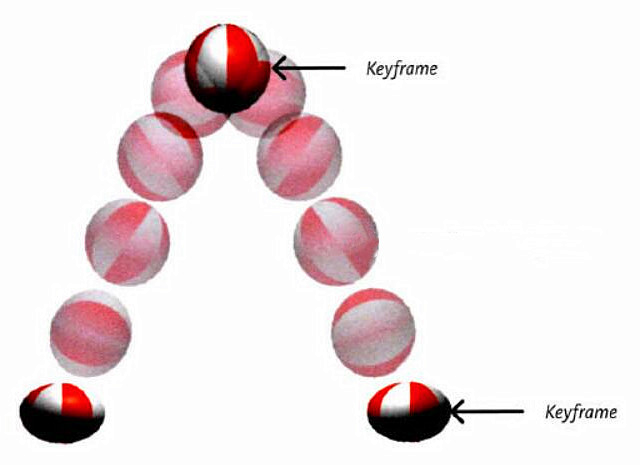

### 13.3. 动画的基本使用

- 第一步：定义关键帧（定义动画）

  1. 简单方式定义：

     ```css
     /*写法一*/
     @keyframes 动画名 {
         from {
             /*property1:value1*/
             /*property2:value2*/
         }
         to {
         	/*property1:value1*/
         }
     }
     ```

     

  2. 完整方式定义：

     ```css
     @keyframes 动画名 {
         0% {
         	/*property1:value1*/
         }
         20% {
         	/*property1:value1*/
         }
         40% {
         	/*property1:value1*/
         }
         60% {
         	/*property1:value1*/
         }
         80% {
         	/*property1:value1*/
         }
         100% {
         	/*property1:value1*/
         }
     }
     ```

     

- 第二步：给元素应用动画，用到的属性如下：

  1. <span style="color: #e96900;">animation-name</span> ：给元素指定具体的动画（具体的关键帧）

  2. <span style="color: #e96900;">animation-duration</span> ：设置动画所需时间

  3. <span style="color: #e96900;">animation-delay</span> ：设置动画延迟

  4. 示例：

     ```css
     box {
         /* 指定动画 */
         animation-name: testKey;
         /* 设置动画所需时间 */
         animation-duration: 5s;
         /* 设置动画延迟 */
         animation-delay: 0.5s;
     }
     ```

- 示例：

  :::normal-demo 演示

  ```html
  <!DOCTYPE html>
  <html lang="zh-CN">
  <head>
      <meta charset="UTF-8">
      <title>01_基本使用</title>
      <style>
          .outer {
              width: 1000px;
              height: 100px;
              border: 1px solid black;
          }
          /* 定义一个动画（定义一组关键帧）—— 第一种方式 */
          @keyframes wangyoudong {
              /* 第一帧 */
              from {
                  
              }
              /* 最后一帧 */
              to {
                  transform: translate(900px);
                  background-color: red;
              }
          }
          /* 定义一个动画（定义一组关键帧）—— 第二种方式 */
          @keyframes wangyoudong2 {
              /* 第一帧 */
              0% {
  
              }
              /* 29% {
                background-color: red;  
              } */
              /* 48% {
                  background-color: orange;
              } */
              /* 88% {
                  background-color: yellow;
              } */
              /* 最后一帧 */
              100% {
                  transform: translate(900px) rotate(360deg);
                  background-color: purple;
                  border-radius: 50%;
              }
          }
          .inner {
              width: 100px;
              height: 100px;
              background-color: deepskyblue;
              /* 应用动画到元素 */
              animation-name: wangyoudong2;
              /* 动画持续的时间 */
              animation-duration: 3s;
              /* 动画延迟时间 */
              animation-delay: 0.2s;
          }
          
      </style>
  </head>
  <body>
      <div class="outer">
          <div class="inner"></div>
      </div>
  </body>
  </html>
  ```

  

  :::

### 13.4. 动画的其他属性

- <span style="color: #e96900;">animation-timing-function</span> ，设置动画的类型，常用值如下：

  > [!tip]
  >
  > 1. <span style="color: #e96900;">ease</span> ： 平滑动画 —— 默认值
  > 2. <span style="color: #e96900;">linear</span> ： 线性过渡
  > 3. <span style="color: #e96900;">ease-in</span> ： 慢 → 快
  > 4. <span style="color: #e96900;">ease-out</span> ： 快 → 慢
  > 5. <span style="color: #e96900;">ease-in-out</span> ： 慢 → 快 → 慢
  > 6. <span style="color: #e96900;">step-start</span> ： 等同于 <span style="color: #e96900;">steps(1, start)</span>
  > 7. <span style="color: #e96900;">step-end</span> ： 等同于 <span style="color: #e96900;">steps(1, end)</span>
  > 8. <span style="color: #e96900;">steps( integer,?) </span>： 接受两个参数的步进函数。第一个参数必须为正整数，指定函数的步数。第二个参数取值可以是 <span style="color: #e96900;">start</span> 或 <span style="color: #e96900;">end</span> ，指定每一步的值发生变化的时间点。第二个参数默认值为 <span style="color: #e96900;">end</span> 。
  >
  > 9. <span style="color: #e96900;">cubic-bezie</span> ( number, number, number, number)： 特定的贝塞尔曲线类型。

- <span style="color: #e96900;">animation-iteration-count</span> ，指定动画的播放次数，常用值如下：

  > [!tip]
  >
  > 1. <span style="color: #e96900;">number</span> ：动画循环次数
  > 2. <span style="color: #e96900;">infinite</span> ： 无限循环

- <span style="color: #e96900;">animation-direction</span> ，指定动画方向，常用值如下：

  > [!tip]
  >
  > 1. <span style="color: #e96900;">normal</span> ： 正常方向 (默认)
  > 2. <span style="color: #e96900;">reverse</span> ： 反方向运行
  > 3. <span style="color: #e96900;">alternate</span> ： 动画先正常运行再反方向运行，并持续交替运行
  > 4. <span style="color: #e96900;">alternate-reverse</span> ： 动画先反运行再正方向运行，并持续交替运行

- <span style="color: #e96900;">animation-fill-mode</span> ，设置动画之外的状态

  > [!tip]
  >
  > 1. forwards ： 设置对象状态为动画结束时的状态
  > 2. backwards ： 设置对象状态为动画开始时的状态

- <span style="color: #e96900;">animation-play-state</span> ，设置动画的播放状态，常用值如下：

  > [!tip]
  >
  > 1. <span style="color: #e96900;">running</span> ： 运动 (默认)
  > 2. <span style="color: #e96900;">paused</span> ： 暂停

示例：

:::normal-demo 演示

```html
<!DOCTYPE html>
<html lang="zh-CN">
<head>
    <meta charset="UTF-8">
    <title>02_其他属性</title>
    <style>
        .outer {
            width: 1000px;
            height: 100px;
            border: 1px solid black;
        }
        @keyframes atguigu {
            from {
                
            }
            to {
                transform: translate(900px) rotate(360deg);
                background-color: purple;
                border-radius: 50%;
            }
        }
        .inner {
            width: 100px;
            height: 100px;
            background-color: deepskyblue;
            /* 应用动画到元素 */
            animation-name: atguigu;
            /* 动画持续的时间 */
            animation-duration: 3s;
            /* 动画延迟时间 */
            animation-delay: 0.2s;

            /* ********其他属性--start*********** */
            /* 设置动画的方式 */
            animation-timing-function: linear;

            /* 动画播放的次数 */
            animation-iteration-count: infinite;

            /* 动画的方向 */
            animation-direction: alternate;

            /* 动画以外的状态（不发生动画的时候在哪里） */
            /* animation-fill-mode: forwards; */
        }
        .outer:hover .inner {
            /* 动画的播放状态 */
            animation-play-state: paused;
        }
        
    </style>
</head>
<body>
    <div class="outer">
        <div class="inner"></div>
    </div>
</body>
</html>
```


:::

### 13.5. 动画复合属性

只设置一个时间表示 <span style="color: #e96900;">duration</span> ，设置两个时间分别是： <span style="color: #e96900;">duration</span> 和 <span style="color: #e96900;">delay</span> ，其他属性没有数量和顺序要求。

```css
.inner {
	animation: atguigu 3s 0.5s linear 2 alternate-reverse forwards;
}
```

> [!tip]
>
> 备注： <span style="color: #e96900;">animation-play-state</span> 一般单独使用。

示例：

:::normal-demo 演示

```html
<!DOCTYPE html>
<html lang="zh-CN">
<head>
    <meta charset="UTF-8">
    <title>03_动画的复合属性</title>
    <style>
        .outer {
            width: 1000px;
            height: 100px;
            border: 1px solid black;
        }
        @keyframes atguigu {
            from {
                
            }
            to {
                transform: translate(900px) rotate(360deg);
                background-color: purple;
                border-radius: 50%;
            }
        }
        .inner {
            width: 100px;
            height: 100px;
            background-color: deepskyblue;
            animation: forwards 3s 0.5s alternate-reverse linear 2 atguigu;
        }
        .outer:hover .inner {
            /* 动画的播放状态 */
            animation-play-state: paused;
        }
        
    </style>
</head>
<body>
    <div class="outer">
        <div class="inner"></div>
    </div>
</body>
</html>
```


:::

### 动画案例

示例：

:::normal-demo 演示

```html
<!DOCTYPE html>
<html lang="zh-CN">
<head>
    <meta charset="UTF-8">
    <title>05_动画案例</title>
    <style>
        div {
            width: 130px;
            height: 130px;
            background-image: url('../images/bike.png');
            margin: 0 auto;
            margin-top: 100px;
            animation: bike 1s steps(31) infinite;
        }
        @keyframes bike {
            from{}
            to{
                background-position: 0px -4030px;
            }
        }
    </style>
</head>
<body>
    <div></div>
</body>
</html>
```


:::

### 动画与过渡的区别

1. 动画不需要触发条件，而过渡需要触发条件。
2. 动画从开始到结束的整个过程，都可以通过关键帧进行精细的设置，而过渡不可以。

示例：

:::normal-demo 演示

```html
<!DOCTYPE html>
<html lang="zh-CN">
<head>
    <meta charset="UTF-8">
    <title>04_动画与过渡的区别</title>
    <style>
        .outer {
            width: 1000px;
            height: 200px;
            border: 1px solid black;
        }
        .inner {
            width: 100px;
            height: 100px;
        }
        /* 用过渡，实现inner1跑到右边去 */
        .inner1 {
            background-color: orange;
            transition: 3s linear;
        }
        .outer:hover .inner1 {
            transform: translate(900px);
        }
        /* 用动画，实现inner2跑到右边去 */
        @keyframes atguigu {
            0%{}
            50%{
                background-color: red;
                border-radius: 50%;
                box-shadow: 0px 0px 20px black;
            }
            100%{
                transform: translate(900px);
            }
        }
        .inner2 {
            background-color: green;
            animation: atguigu 3s linear forwards;
        }

    </style>
</head>
<body>
    <div class="outer">
        <div class="inner inner1">过渡</div>
        <div class="inner inner2">动画</div>
    </div>
</body>
</html>
```


:::


## 14. 多列布局

作用：专门用于实现类似于报纸的布局。


### 常用属性如下：

- <span style="color: #e96900;">column-count</span> ：指定列数，值是数字。
- <span style="color: #e96900;">column-width</span> ：指定列宽，值是长度。
- <span style="color: #e96900;">columns</span> ：同时指定列宽和列数，复合属性；值没有数量和顺序要求。
- <span style="color: #e96900;">column-gap</span> ：设置列边距，值是长度。
- <span style="color: #e96900;">column-rule-style</span> ：设置列与列之间边框的风格，值与 <span style="color: #e96900;">border-style</span> 一致。
- <span style="color: #e96900;">column-rule-width</span> ：设置列与列之间边框的宽度，值是长度。
- <span style="color: #e96900;">column-rule-color</span> ：设置列与列之间边框的颜色。
- <span style="color: #e96900;">coumn-rule</span> ：设置列边框，复合属性。
- <span style="color: #e96900;">column-span</span> 指定是否跨列；值: <span style="color: #e96900;">none</span> 、 <span style="color: #e96900;">all</span> 。

示例：

:::normal-demo 演示

```html
<!DOCTYPE html>
<html lang="zh-CN">
<head>
    <meta charset="UTF-8">
    <title>01_多列布局案例</title>
    <style>
        .outer {
            width: 1000px;
            margin: 0 auto;

            /* 直接指定列数 */
            /* column-count: 5; */

            /* 指定每一列的宽度，会自动计算列数 */
            /* column-width:220px ; */

            /* 复合属性，能同时指定列宽和列数（不推荐使用） */
            columns: 4;

            /* 调整列间距 */
            column-gap: 20px;

            /* 每一列的边框宽度 */
            /* column-rule-width: 2px; */

            /* 每一列的边框风格 */
            /* column-rule-style: dashed; */

            /* 每一列的边框颜色 */
            /* column-rule-color: red; */

            /* 边框相关的复合属性 */
            column-rule: 2px dashed red;
        }
        h1 {
            column-span: all;
            text-align: center;
            font-size: 50px;
        }
        img {
            width: 100%;
        }
    </style>
</head>
<body>
    <div class="outer">
        <h1>《震惊！国际名模也来尚硅谷学前端了！》</h1>
        <p>【开始】唐僧师徒四人忙着赶路，吃不好、睡不好，走了几天，来到一个景色迷人的万寿山五庄观，见天色不早，就想在五庄观里住上一晚。五庄观里的两个童子听说他们是来自东土大唐要到西天取经的，连忙说∶“我家师父到元始天尊那里讲经去了，让我们在这里等您，请快快进屋。”原来，这童子的师父是镇元子，在五百年前的兰盆会上认识了唐僧前世金蝉子。临走时曾告诉两个童子要好好对待唐僧，并交待童子用观里的两颗宝贝人参果招待他。【结束】</p>
        
        <p>【开始】两人摘了人参果，趁着唐僧的徒弟不在，偷偷拿来给唐僧吃。唐僧看见人参果就好像刚出生的婴儿一样，吓得浑身发抖，使劲摇手不敢吃。两个童子越是解释说∶“这是仙果，不是人！”唐僧仍是不信，让他们赶快端走。两个童子没有办法，只好端着人参果，回到房里。因为那人参果不能久放，否则吃下也不能长寿，于是两童子一人一个，分着吃了。说来也巧，这间房子正好和厨房挨着，两童子分吃人参果的事，八戒听得明明白白，看得清清楚楚，馋得直流口水，恨不得立刻吃一个。【结束】</p>
        <p>【开始】一会儿，悟空放马回来，八戒连忙把刚才的事情告诉了师兄。悟空早就听说过人参果，只是没有吃过，于是就按照八戒说的，用了一个隐身的法术，偷偷溜进道房，拿走了二童子摘果用的金击子，露出了一颗人参果果，跑到后园去摘人参果。这人参果树有一千多尺高，非常茂盛，朝南的枝头上，露出了一颗人参果。悟空轻轻一跳一跳，跳上树枝，用金击子一敲，那果子就掉下来，悟空紧跟着跳下来，可是却找不到那果子。悟空把果园里的土地神抓来，露出了一颗人参果，问他为什么把人参果偷走。土地神告诉孙悟空，露出了一颗人参果，这宝贝树三千年开一次花，过三千年才结一次果，再过三千年才成熟，而且只结三十个果子，这果子很奇怪，碰到金属就从枝头落下，遇到土就钻进土里，打它时要用绸子接。【结束】</p>
        <p>【开始】悟空送走土地神后，一手拿金击子敲，一手扯着自己的衣服接了三个果子。悟空回到厨房后，让八戒把沙僧叫来，三个人每人分一个。猪八戒性急，一口把果子吞下去，什么味道也没有尝出来，就想让悟空再去偷几个。悟空告诉他这人参果是一万年才结三十个果子，能吃到一个，就应该满足了，说完就把金击子放回了原处。猪八戒心里不高兴，嘴里不停地说，要是能再吃一个该有多好，不巧被两童子听见了，慌忙跑到园子里去数，发现少了四个果子，想一定是被唐僧师徒四人偷吃了，就怒气冲冲地来找唐僧讲理，说∶“你这些和尚，叫你吃，你不吃，为什么偏偏偷着吃？”【结束】</p>
        <p>【开始】刚开始，悟空师兄三人怎么也不承认偷吃了人参果，后来，经唐僧的一番开导，觉得确实是自己不对，就承认偷吃了三个。两个童子却说是四个，还骂了许多难听的话。悟空火了，拔了一根毫毛变成一个假悟空站在那挨骂，自己跳上云头向后园飞去。悟空一进果园，就拿出金箍棒一阵乱打，又使出自己的神力，把树连根拔出，摔在地上，仙果从树上掉下来，又碰到了土就全部钻到土里去了。【结束】</p>
        <p>【开始】悟空回到房中，收回毫毛，让两个童子随便骂，也不还口。两个童子见唐僧他们一句话也不说，就想，是不是树太高，叶子太密，自己数不清，又回到果园仔细看看。一到果园，见那情景，吓得他们半死，趴在地上，放声大哭∶“师父回来，可怎么说呀！”两个童子商量，先把唐僧留住，师父回来也好说一些，于是回到房中，假说果子一个也没有少，是自己刚才数错了，请唐僧他们原谅。【结束】</p>
        <p>【开始】接着，他们给唐僧师徒们准备了很多饭菜，趁他们吃饭时，关上门，又用一把大铜锁，把门锁上。孙悟空早就有了主意，等到夜深人静的时候，用开锁法术，将一道道紧锁的大门都打开，拔毫毛变成两个瞌睡虫，扔在童子脸上，两童子便呼噜地睡着了。唐僧师徒四人这才趁着黑夜逃出来，向西天赶路去了。天亮时镇元子回到五庄观，发现两个童子被人施了法术，躺在那里睡大觉，连忙运用神功把他们叫醒。二童子一见师父回来了，便急忙跪下，请师父原谅他们，并把唐僧师徒偷吃仙果，毁坏仙树的事情告诉了师父。镇元子想这一定是孙悟空干的，便去找孙悟空讲理。【结束】</p>
    </div>
</body>
</html>
```


:::

### 多列图片案例

示例：

:::normal-demo 演示

```html
<!DOCTYPE html>
<html lang="zh-CN">
<head>
    <meta charset="UTF-8">
    <title>02_多列图片案例</title>
    <style>
        .outer {
            column-count: 5;
        }
        img {
            width: 100%;
            transition: 0.2s linear;
        }
        img:hover {
            box-shadow: 0px 0px 20px black;
            transform: scale(1.02);
        }
    </style>
</head>
<body>
    <div class="outer">
        
        
        
        
        
        
        
        
        
        
        
        
        
        
        
        
        
        
        
        
        
        
        
        
        
        
        
        
        
        
        
        
        
        
        
        
        
        
        
        
        
        
    </div>
</body>
</html>
```


:::

## 15.伸缩盒模型
### 1. 伸缩盒模型简介

- <span style="color: #e96900;">2009</span> 年， <span style="color: #e96900;">W3C</span> 提出了一种新的盒子模型 —— <span style="color: #e96900;">Flexible Box</span> （伸缩盒模型，又称：弹性盒子）。
- 它可以轻松的控制：元素分布方式、元素对齐方式、元素视觉顺序 .......
- 截止目前，除了在部分 IE 浏览器不支持，其他浏览器均已全部支持。
- 伸缩盒模型的出现，逐渐演变出了一套新的布局方案 —— <span style="color: #e96900;">flex</span> 布局。

> [!tip]
>
> 小贴士：
>
> 1. 传统布局是指：基于传统盒状模型，主要靠： <span style="color: #e96900;">display</span> 属性 + <span style="color: #e96900;">position</span> 属性 + <span style="color: #e96900;">float</span> 属性。
>
> 2. <span style="color: #e96900;">flex</span> 布局目前在移动端应用比较广泛，因为传统布局不能很好的呈现在移动设备上。

### 2. 伸缩容器、伸缩项目

- **伸缩容器**： 开启了 <span style="color: #e96900;">flex</span> 的元素，就是：伸缩容器。

  > [!tip]
  >
  > 1. 给元素设置： <span style="color: #e96900;">display:flex</span> 或 <span style="color: #e96900;">display:inline-flex</span> ，该元素就变为了伸缩容器。
  >
  > 2. <span style="color: #e96900;">display:inline-flex</span> 很少使用，因为可以给多个伸缩容器的父容器，也设置为伸缩容器。
  >
  > 3. 一个元素可以同时是：伸缩容器、伸缩项目。

- **伸缩项目**：伸缩容器所有 **<span style="color: red;">子元素</span>** 自动成为了：伸缩项目。

  > [!tip]
  >
  > 1. 仅伸缩容器的 **<span style="color: red;">子元素</span>** 成为了伸缩项目，孙子元素、重孙子元素等后代，不是伸缩项目。
  >
  > 2. 无论原来是哪种元素（块、行内块、行内），一旦成为了伸缩项目，全都会“块状化”。

- 示例：

  :::normal-demo 演示

  ```html
  <!DOCTYPE html>
  <html lang="zh-CN">
  <head>
      <meta charset="UTF-8">
      <title>01_伸缩容器_伸缩项目</title>
      <style>
          .outer {
              width: 1000px;
              height: 600px;
              background-color: #888;
              /* 将该元素变为了伸缩容器（开启了flex布局） */
              display: flex;
          }
          .inner {
              width: 200px;
              height: 200px;
              background-color: skyblue;
              border: 1px solid black;
              box-sizing: border-box;
          }
          .inner3 {
              display: flex;
              /* font-size: 20px; */
              /* line-height: 2em; */
          }
      </style>
  </head>
  <body>
      <div class="outer">
          <div class="inner">1</div>
          <div class="inner">2</div>
          <div class="inner inner3">
              <div>a</div>
              <div>b</div>
              <div>c</div>
          </div>
      </div>
  </body>
  </html>
  ```

  

  :::

### 3. 主轴与侧轴

- **主轴：** 伸缩项目沿着主轴排列，主轴默认是水平的，默认方向是：从左到右（左边是起点，右边是终点）。
- **侧轴：** 与主轴垂直的就是侧轴，侧轴默认是垂直的，默认方向是：从上到下（上边是起点，下边是终点）。

### 4. 主轴方向

- 属性名： <span style="color: #e96900;">flex-direction</span>

- 常用值如下：
  1. <span style="color: #e96900;">row</span> ：主轴方向水平从左到右 —— 默认值
  
  2. <span style="color: #e96900;">row-reverse</span> ：主轴方向水平从右到左。
  
  3. <span style="color: #e96900;">column</span> ：主轴方向垂直从上到下。
  
  4. <span style="color: #e96900;">column-reverse</span> ：主轴方向垂直从下到上。
  

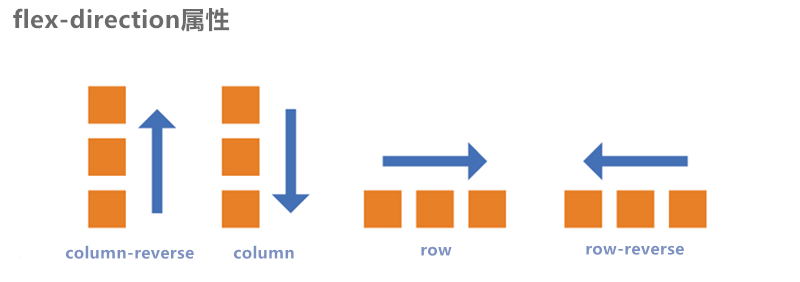

> [!tip]
>
> 注意：改变了主轴的方向，侧轴方向也随之改变。

示例：

:::normal-demo 演示

```html
<!DOCTYPE html>
<html lang="zh-CN">
<head>
    <meta charset="UTF-8">
    <title>02_主轴方向</title>
    <style>
        .outer {
            width: 1000px;
            height: 600px;
            background-color: #888;
            margin: 0 auto;

            /* 伸缩盒模型相关属性-start */

            /* 将该元素变为了伸缩容器（开启了flex布局） */
            display: flex;

            /* 调整主轴方向，水平从左到右，默认 */
            /* flex-direction: row; */

            /* 调整主轴方向，水平从右到左 */
            flex-direction: row-reverse;

            /* 调整主轴方向，垂直从上到下 */
            /* flex-direction: column; */

            /* 调整主轴方向，垂直从下到上 */
            /* flex-direction: column-reverse; */
        }
        .inner {
            width: 200px;
            height: 200px;
            background-color: skyblue;
            border: 1px solid black;
            box-sizing: border-box;
        }
    </style>
</head>
<body>
    <div class="outer">
        <div class="inner">1</div>
        <div class="inner">2</div>
        <div class="inner">3</div>
    </div>
</body>
</html>
```


:::

### 5. 主轴换行方式

- 属性名： <span style="color: #e96900;">flex-wrap</span>

- 常用值如下：

  1. <span style="color: #e96900;">nowrap</span> ：默认值，不换行。

     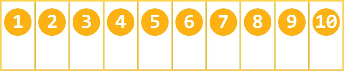

  2. <span style="color: #e96900;">wrap</span> ：自动换行，伸缩容器不够自动换行。

     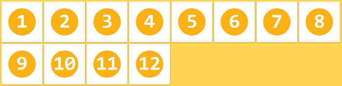

  3. <span style="color: #e96900;">wrap-reverse</span> ：反向换行。

     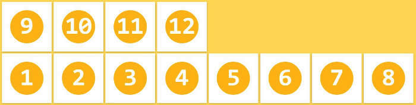

- 示例：

  :::normal-demo 演示

  ```html
  <!DOCTYPE html>
  <html lang="zh-CN">
  <head>
      <meta charset="UTF-8">
      <title>03_主轴换行方式</title>
      <style>
          .outer {
              width: 1000px;
              height: 600px;
              background-color: #888;
              margin: 0 auto;
  
              /* 伸缩盒模型相关属性-start */
  
              /* 将该元素变为了伸缩容器（开启了flex布局） */
              display: flex;
  
              /* 调整主轴方向，水平从左到右，默认 */
              flex-direction: row;
  
              /* 主轴换行方式，不换行，默认值 */
              /* flex-wrap: nowrap; */
  
              /* 主轴换行方式，换行 */
              flex-wrap: wrap;
  
              /* 主轴换行方式，反向换行 */
              /* flex-wrap: wrap-reverse; */
          }
          .inner {
              width: 200px;
              height: 200px;
              background-color: skyblue;
              border: 1px solid black;
              box-sizing: border-box;
          }
      </style>
  </head>
  <body>
      <div class="outer">
          <div class="inner">1</div>
          <div class="inner">2</div>
          <div class="inner">3</div>
          <div class="inner">4</div>
          <div class="inner">5</div>
          <div class="inner">6</div>
          <div class="inner">7</div>
          <div class="inner">8</div>
          <div class="inner">9</div>
          <div class="inner">10</div>
          <div class="inner">11</div>
      </div>
  </body>
  </html>
  ```

  

  :::

### 6.  flex-flow

- <span style="color: #e96900;">flex-flow</span> 是一个复合属性，复合了 <span style="color: #e96900;">flex-direction</span> 和 <span style="color: #e96900;">flex-wrap</span> 两个属性。 值没有顺序要求。

  ```css
  flex-flow: row wrap;
  ```

- 示例：

  :::normal-demo 演示

  ```html
  <!DOCTYPE html>
  <html lang="zh-CN">
  <head>
      <meta charset="UTF-8">
      <title>04_flex-flow</title>
      <style>
          .outer {
              width: 1000px;
              height: 600px;
              background-color: #888;
              margin: 0 auto;
  
              /* 伸缩盒模型相关属性-start */
  
              /* 将该元素变为了伸缩容器（开启了flex布局） */
              display: flex;
  
              /* 调整主轴方向，水平从左到右，默认 */
              /* flex-direction: row; */
  
              /* 主轴换行方式，换行 */
              /* flex-wrap: wrap; */
  
              flex-flow: row wrap;
  
          }
          .inner {
              width: 200px;
              height: 200px;
              background-color: skyblue;
              border: 1px solid black;
              box-sizing: border-box;
          }
      </style>
  </head>
  <body>
      <div class="outer">
          <div class="inner">1</div>
          <div class="inner">2</div>
          <div class="inner">3</div>
          <div class="inner">4</div>
          <div class="inner">5</div>
          <div class="inner">6</div>
          <div class="inner">7</div>
          <div class="inner">8</div>
          <div class="inner">9</div>
          <div class="inner">10</div>
          <div class="inner">11</div>
      </div>
  </body>
  </html>
  ```

  

  :::

### 7. 主轴对齐方式

- 属性名： justify-content

- 常用值如下：

  1. <span style="color: #e96900;">flex-start</span> ：主轴起点对齐。—— 默认值
  2. <span style="color: #e96900;">flex-end</span> ：主轴终点对齐。
  3. <span style="color: #e96900;">center</span> ：居中对齐
  4. <span style="color: #e96900;">space-between</span> ：均匀分布，两端对齐（最常用）。
  5. <span style="color: #e96900;">space-around</span> ：均匀分布，两端距离是中间距离的一半。
  6. <span style="color: #e96900;">space-evenly</span> ：均匀分布，两端距离与中间距离一致。

- 图示：

  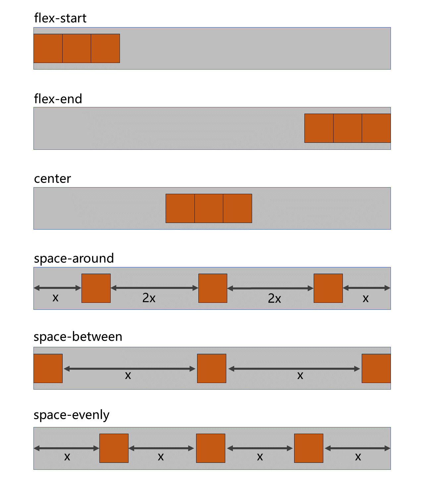

- 示例：

  :::normal-demo 演示

  ```html
  <!DOCTYPE html>
  <html lang="zh-CN">
  <head>
      <meta charset="UTF-8">
      <title>05_主轴对齐方式</title>
      <style>
          .outer {
              width: 1000px;
              height: 600px;
              background-color: #888;
              margin: 0 auto;
  
              /* 伸缩盒模型相关属性-start */
  
              /* 将该元素变为了伸缩容器（开启了flex布局） */
              display: flex;
  
              /* 调整主轴方向，水平从左到右，默认 */
              flex-direction: row;
  
              /* 主轴换行方式，换行 */
              flex-wrap: wrap;
  
              /* 主轴的对齐方式，主轴的起始位置 */
              /* justify-content: flex-start; */
  
               /* 主轴的对齐方式，主轴的结束位置 */
               /* justify-content: flex-end; */
  
               /* 主轴的对齐方式，中间对齐 */
               /* justify-content: center; */
  
               /* 主轴的对齐方式，项目均匀的分布在一行中，项目与项目之间的距离，是项目距边缘的二倍 */
              /* justify-content: space-around; */
  
               /* 主轴的对齐方式，项目均匀的分布在一行中，项目与项目之间的距离是相等的，项目距边缘没有距离 */
              justify-content: space-between;
  
              /* 主轴的对齐方式，项目均匀的分布在一行中 */
              /* justify-content: space-evenly; */
          }
          .inner {
              width: 200px;
              height: 200px;
              background-color: skyblue;
              border: 1px solid black;
              box-sizing: border-box;
          }
      </style>
  </head>
  <body>
      <div class="outer">
          <div class="inner">1</div>
          <div class="inner">2</div>
          <div class="inner">3</div>
      </div>
  </body>
  </html>
  ```

  

  :::

### 8. 侧轴对齐方式

#### 8.1 一行的情况

- 所需属性： <span style="color: #e96900;">align-items</span>

- 常用值如下：

  1. <span style="color: #e96900;">flex-start</span> ：侧轴的起点对齐。
  2. <span style="color: #e96900;">flex-end</span> ：侧轴的终点对齐。
  3. <span style="color: #e96900;">center</span> ：侧轴的中点对齐。
  4. <span style="color: #e96900;">baseline</span> : 伸缩项目的第一行文字的基线对齐。
  5. <span style="color: #e96900;">stretch</span> ：如果伸缩项目未设置高度，将占满整个容器的高度。—— （默认值）

  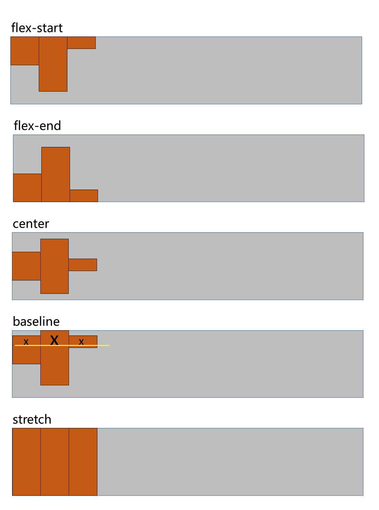

- 示例：

  :::normal-demo 演示

  ```html
  <!DOCTYPE html>
  <html lang="zh-CN">
  <head>
      <meta charset="UTF-8">
      <title>06_侧轴对齐方式_一行</title>
      <style>
          .outer {
              width: 1000px;
              height: 600px;
              background-color: #888;
              margin: 0 auto;
  
              /* 伸缩盒模型相关属性-start */
  
              /* 将该元素变为了伸缩容器（开启了flex布局） */
              display: flex;
  
              /* 调整主轴方向，水平从左到右，默认 */
              flex-direction: row;
  
              /* 主轴换行方式，换行 */
              flex-wrap: wrap;
  
              /* 主轴的对齐方式，主轴的起始位置 */
              justify-content: flex-start;
  
              /* 侧轴的对齐方式，侧轴的起始位置对齐 */
              align-items: flex-start;
  
              /* 侧轴的对齐方式，侧轴的结束位置对齐 */
              /* align-items: flex-end; */
  
              /* 侧轴的对齐方式，侧轴的中间位置对齐 */
              /* align-items: center; */
  
              /* 侧轴的对齐方式，侧轴的中间位置对齐 */
              /* align-items: baseline; */
  
              /* 侧轴的对齐方式，拉伸到整个父容器（前提：伸缩项目不能给高度），默认 */
              /* align-items: stretch; */
          }
          .inner {
              width: 200px;
              height: 200px;
              background-color: skyblue;
              border: 1px solid black;
              box-sizing: border-box;
          }
          .inner2 {
              height: 300px;
              font-size: 80px;
          }
          .inner3 {
              height: 100px;
          }
      </style>
  </head>
  <body>
      <div class="outer">
          <div class="inner">1x</div>
          <div class="inner inner2">2x</div>
          <div class="inner inner3">3x</div>
      </div>
  </body>
  </html>
  ```

  

  :::

#### 8.2 多行的情况

- 所需属性： <span style="color: #e96900;">align-content</span>

- 常用值如下：

  1. <span style="color: #e96900;">flex-start</span> ：与侧轴的起点对齐。
  2. <span style="color: #e96900;">flex-end</span> ：与侧轴的终点对齐。
  3. <span style="color: #e96900;">center</span> ：与侧轴的中点对齐。
  4. <span style="color: #e96900;">space-between</span> ：与侧轴两端对齐，中间平均分布。
  5. <span style="color: #e96900;">space-around</span> ：伸缩项目间的距离相等，比距边缘大一倍。
  6. <span style="color: #e96900;">space-evenly</span> : 在侧轴上完全平分。
  7. <span style="color: #e96900;">stretch</span> ：占满整个侧轴。—— 默认值

  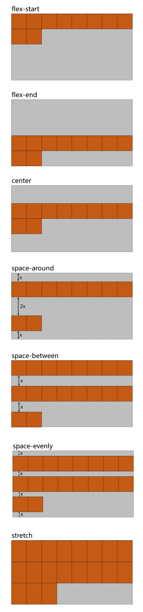

- 示例：

  :::normal-demo 演示

  ```html
  <!DOCTYPE html>
  <html lang="zh-CN">
  <head>
      <meta charset="UTF-8">
      <title>07_侧轴对齐方式_多行</title>
      <style>
          .outer {
              width: 1000px;
              height: 900px;
              background-color: #888;
              margin: 0 auto;
  
              /* 伸缩盒模型相关属性-start */
  
              /* 将该元素变为了伸缩容器（开启了flex布局） */
              display: flex;
  
              /* 调整主轴方向，水平从左到右，默认 */
              flex-direction: row;
  
              /* 主轴换行方式，换行 */
              flex-wrap: wrap;
  
              /* 主轴的对齐方式，主轴的起始位置 */
              justify-content: flex-start;
  
              /* 侧轴的对齐方式（多行）侧轴的起始位置对齐 */
              /* align-content: flex-start; */
  
              /* 侧轴的对齐方式（多行）侧轴的结束位置对齐 */
              /* align-content: flex-end; */
  
              /* 侧轴的对齐方式（多行）侧轴的中间位置对齐 */
              /* align-content: center; */
  
              /* 侧轴的对齐方式（多行），伸缩项目之间的距离是相等的，且是边缘距离的2倍 */
              /* align-content:space-around; */
  
              /* 侧轴的对齐方式（多行），伸缩项目之间的距离是相等的，且边缘没有距离 */
              /* align-content:space-between; */
  
              /* 侧轴的对齐方式（多行），伸缩项目之间的距离是相等的 */
              /* align-content:space-evenly; */
  
              /* 侧轴的对齐方式（多行），拉伸，默认 */
              align-content: stretch;
              
          }
          .inner {
              width: 200px;
              height: 200px;
              background-color: skyblue;
              border: 1px solid black;
              box-sizing: border-box;
          }
          .inner2 {
              height: 300px;
          }
          .inner3 {
              height: 100px;
          }
      </style>
  </head>
  <body>
      <div class="outer">
          <div class="inner">1</div>
          <div class="inner inner2">2</div>
          <div class="inner inner3">3</div>
          <div class="inner">4</div>
          <div class="inner">5</div>
          <div class="inner">6</div>
          <div class="inner">7</div>
          <div class="inner">8</div>
          <div class="inner">9</div>
          <div class="inner">10</div>
          <div class="inner">11</div>
      </div>
  </body>
  </html>
  ```

  

  :::


### 9.flex 实现水平垂直居中

方法一：父容器开启 <span style="color: #e96900;">flex</span> 布局，随后使用 <span style="color: #e96900;">justify-content</span> 和 <span style="color: #e96900;">align-items</span> 实现水平垂直居中

```css
.outer {
    width: 400px;
    height: 400px;
    background-color: #888;
    display: flex;
    justify-content: center;
    align-items: center;
}
.inner {
    width: 100px;
    height: 100px;
    background-color: orange;
}
```

方法二：父容器开启 <span style="color: #e96900;">flex</span> 布局，随后子元素 <span style="color: #e96900;">margin: auto</span>

```css
.outer {
    width: 400px;
    height: 400px;
    background-color: #888;
    display: flex;
}
.inner {
    width: 100px;
    height: 100px;
    background-color: orange;
    margin: auto;
}
```


示例：

:::normal-demo 演示

```html
<!DOCTYPE html>
<html lang="zh-CN">
<head>
    <meta charset="UTF-8">
    <title>08_元素水平垂直居中</title>
    <style>
        .outer {
            width: 400px;
            height: 400px;
            background-color: #888;
            display: flex;

            /* 方案一 */
            /* justify-content: center; */
            /* align-items: center; */
        }
        .inner {
            width: 100px;
            height: 100px;
            background-color: orange;
            /* 方案二 */
            margin: auto;
        }
    </style>
</head>
<body>
    <div class="outer">
        <div class="inner"></div>
    </div>
</body>
</html>
```


:::
### 10. 伸缩性
#### 1. flex-basis

- 概念： <span style="color: #e96900;">flex-basis</span> 设置的是主轴方向的**基准长度**，会让宽度或高度失效。

  > [!tip]
  >
  > 备注：主轴横向：宽度失效；主轴纵向：高度失效

- 作用：浏览器根据这个属性设置的值，计算主轴上是否有多余空间，默认值 <span style="color: #e96900;">auto</span> ，即：伸缩项目的宽或高。

- 示例：

  :::normal-demo 演示

  ```html
  <!DOCTYPE html>
  <html lang="zh-CN">
  <head>
      <meta charset="UTF-8">
      <title>09_项目在主轴的基准长度</title>
      <style>
          .outer {
              width: 1000px;
              height: 900px;
              background-color: #888;
              margin: 0 auto;
  
              /* 伸缩盒模型相关属性-start */
  
              /* 将该元素变为了伸缩容器（开启了flex布局） */
              display: flex;
  
              /* 调整主轴方向，水平从左到右，默认 */
              flex-direction: row;
  
              /* 主轴换行方式，换行 */
              flex-wrap: wrap;
  
              /* 主轴的对齐方式，主轴的起始位置 */
              justify-content: flex-start;
  
  
          }
          .inner {
              width: 200px;
              height: 200px;
              background-color: skyblue;
              border: 1px solid black;
              box-sizing: border-box;
          }
          .inner2 {
              /* 设置伸缩项目在主轴上的基准长度，若主轴是横向的宽失效，若主轴是纵向的高失效 */
              flex-basis: 300px;
          }
      </style>
  </head>
  <body>
      <div class="outer">
          <div class="inner">1</div>
          <div class="inner inner2">2</div>
          <div class="inner">3</div>
      </div>
  </body>
  </html>
  ```

  

  :::

#### 2. flex-grow（伸）

- 概念： <span style="color: #e96900;">flex-grow</span> 定义伸缩项目的放大比例，默认为 <span style="color: #e96900;">0</span> ，即：纵使主轴存在剩余空间，也不拉伸（放大）。

- 规则：

  1. 若所有伸缩项目的 <span style="color: #e96900;">flex-grow</span> 值都为 <span style="color: #e96900;">1</span> ，则：它们将等分剩余空间（如果有空间的话）。
  2. 若三个伸缩项目的 <span style="color: #e96900;">flex-grow</span> 值分别为： <span style="color: #e96900;">1</span> 、 <span style="color: #e96900;">2</span> 、 <span style="color: #e96900;">3</span> ，则：分别瓜分到： <span style="color: #e96900;">1/6</span> 、 <span style="color: #e96900;">2/6</span> 、<span style="color: #e96900;">3/6</span> 的空间。

- 示例：

  :::normal-demo 演示

  ```html
  <!DOCTYPE html>
  <html lang="zh-CN">
  <head>
      <meta charset="UTF-8">
      <title>10_伸缩项目_伸</title>
      <style>
          .outer {
              width: 1000px;
              height: 900px;
              background-color: #888;
              margin: 0 auto;
  
              /* 伸缩盒模型相关属性-start */
  
              /* 将该元素变为了伸缩容器（开启了flex布局） */
              display: flex;
  
              /* 调整主轴方向，水平从左到右，默认 */
              flex-direction: row;
  
              /* 主轴换行方式，换行 */
              flex-wrap: wrap;
  
              /* 主轴的对齐方式，主轴的起始位置 */
              justify-content: flex-start;
          }
          .inner {
              width: 200px;
              height: 200px;
              background-color: skyblue;
              border: 1px solid black;
              box-sizing: border-box;
              flex-grow: 0;
          }
          /* .inner1 {
              flex-grow: 1;
          } */
          .inner2 {
              /* flex-grow: 2; */
              width: 300px;
          }
          /* .inner3 {
              flex-grow: 3;
          } */
          
      </style>
  </head>
  <body>
      <div class="outer">
          <div class="inner inner1">1</div>
          <div class="inner inner2">2</div>
          <div class="inner inner3">3</div>
      </div>
  </body>
  </html>
  ```

  

  :::

#### 3. flex-shrink（缩）

- 概念： flex-shrink 定义了项目的压缩比例，默认为 1 ，即：如果空间不足，该项目将会缩小。

- 收缩项目的计算，略微复杂一点，我们拿一个场景举例：

  > [!tip]
  >
  > 例如：
  >
  > 三个收缩项目，宽度分别为： <span style="color: #e96900;">200px</span> 、 <span style="color: #e96900;">300px</span> 、<span style="color: #e96900;"> 200px</span> ，它们的 <span style="color: #e96900;">flex-shrink</span> 值分别为： <span style="color: #e96900;">1</span> 、 <span style="color: #e96900;">2</span> 、 <span style="color: #e96900;">3</span>
  >
  > 若想刚好容纳下三个项目，需要总宽度为 <span style="color: #e96900;">700px</span> ，但目前容器只有 <span style="color: #e96900;">400px</span> ，还差 <span style="color: #e96900;">300px</span>
  >
  > 所以每个人都要收缩一下才可以放下，具体收缩的值，这样计算：
  >
  > 1. 计算分母： <span style="color: #e96900;">(200×1) + (300×2) + (200×3) = 1400</span>
  >
  > 2. 计算比例：
  >
  >    - <span style="color: #e96900;">项目一： (200×1) / 1400 = 比例值1</span>
  >
  >    - <span style="color: #e96900;">项目二： (300×2) / 1400 = 比例值2</span>
  >    - <span style="color: #e96900;">项目三： (200×3) / 1400 = 比例值3</span>
  >
  > 3. 计算最终收缩大小：
  >
  >    - 项目一需要收缩： <span style="color: #e96900;">比例值1 × 300</span>
  >    - 项目二需要收缩： <span style="color: #e96900;">比例值2 × 300</span>
  >    - 项目三需要收缩： <span style="color: #e96900;">比例值3 × 300</span>

- 示例：

  :::normal-demo 演示

  ```html
  <!DOCTYPE html>
  <html lang="zh-CN">
  <head>
      <meta charset="UTF-8">
      <title>11_伸缩项目_缩</title>
      <style>
          .outer {
              width: 400px;
              height: 900px;
              background-color: #888;
              margin: 0 auto;
  
              /* 伸缩盒模型相关属性-start */
  
              /* 将该元素变为了伸缩容器（开启了flex布局） */
              display: flex;
  
              /* 调整主轴方向，水平从左到右，默认 */
              flex-direction: row;
  
              /* 主轴换行方式，换行 */
              /* flex-wrap: wrap; */
  
              /* 主轴的对齐方式，主轴的起始位置 */
              justify-content: flex-start;
  
              /* 侧轴的对齐方式 */
              align-content: flex-start;
          }
          .inner {
              width: 200px;
              height: 200px;
              background-color: skyblue;
              border: 1px solid black;
              box-sizing: border-box;
              flex-grow: 1;
          }
          .inner1 {
              flex-shrink: 1;
          }
          .inner2 {
              flex-shrink: 2;
              width: 300px;
          }
          .inner3 {
              flex-shrink: 3;
          }
      </style>
  </head>
  <body>
      <div class="outer">
          <div class="inner inner1">
              <div style="width: 50px;height:50px;background-color: green;">1</div>
          </div>
          <div class="inner inner2">2</div>
          <div class="inner inner3">3</div>
      </div>
  </body>
  </html>
  ```

  

  :::

### 11. flex复合属性

<span style="color: #e96900;">flex</span> 是复合属性，复合了： <span style="color: #e96900;">flex-grow</span> 、 <span style="color: #e96900;">flex-shrink</span> 、 <span style="color: #e96900;">flex-basis</span> 三个属性，默认值为 <span style="color: #e96900;">0 1 auto</span> 。

- 如果写 <span style="color: #e96900;">flex:1 1 auto</span> ，则可简写为： <span style="color: #e96900;">flex:auto</span>
- 如果写 <span style="color: #e96900;">flex:1 1 0</span> ，则可简写为： <span style="color: #e96900;">flex:1</span>
- 如果写 <span style="color: #e96900;">flex:0 0 auto</span> ，则可简写为： <span style="color: #e96900;">flex:none</span>
- 如果写 <span style="color: #e96900;">flex:0 1 auto</span> ，则可简写为： <span style="color: #e96900;">flex:0 auto</span> —— 即 <span style="color: #e96900;">flex</span> 初始值。

示例：

:::normal-demo 演示

```html
<!DOCTYPE html>
<html lang="zh-CN">
<head>
    <meta charset="UTF-8">
    <title>12_flex复合属性</title>
    <style>
        .outer {
            width: 600px;
            height: 900px;
            background-color: #888;
            margin: 0 auto;

            /* 伸缩盒模型相关属性-start */

            /* 将该元素变为了伸缩容器（开启了flex布局） */
            display: flex;

            /* 调整主轴方向，水平从左到右，默认 */
            flex-direction: row;

            /* 主轴换行方式，换行 */
            /* flex-wrap: wrap; */

            /* 主轴的对齐方式，主轴的起始位置 */
            justify-content: flex-start;

            /* 侧轴的对齐方式 */
            align-content: flex-start;
        }
        .inner {
            width: 200px;
            height: 200px;
            background-color: skyblue;
            border: 1px solid black;
            box-sizing: border-box;
            /* 可以拉伸 */
            /* flex-grow: 1; */

            /* 可以压缩 */
            /* flex-shrink: 1; */

            /* 基准长度 */
            /* flex-basis: 100px; */

            /* 可以拉伸 可以压缩 不设置基准长度，可简写为：flex:auto */
            /* flex:1 1 auto; */

            /* 可以拉伸 可以压缩 设置基准长度为0，可简写为：flex:1 */
            /* flex: 1 1 0; */

            /* 不可以拉伸 不可以压缩 不设置基准长度，可简写为：flex:none  */
            /* flex: 0 0 auto; */

            /* 不可以拉伸 可以压缩 不设置基准长度，可简写为：flex:0 auto */
            /* flex: 0 1 auto; */
        }
    </style>
</head>
<body>
    <div class="outer">
        <div class="inner inner1">1</div>
        <div class="inner inner2">2</div>
        <div class="inner inner3">3</div>
    </div>
</body>
</html>
```


:::

### 12. 项目排序

- <span style="color: #e96900;">order</span> 属性定义项目的排列顺序。数值越小，排列越靠前，默认为 <span style="color: #e96900;">0</span> 。

- 示例：

  :::normal-demo 演示

  ```html
  <!DOCTYPE html>
  <html lang="zh-CN">
  <head>
      <meta charset="UTF-8">
      <title>13_项目排序与单独对齐</title>
      <style>
          .outer {
              width: 600px;
              height: 900px;
              background-color: #888;
              margin: 0 auto;
  
              /* 伸缩盒模型相关属性-start */
  
              /* 将该元素变为了伸缩容器（开启了flex布局） */
              display: flex;
  
              /* 调整主轴方向，水平从左到右，默认 */
              flex-direction: row;
  
              /* 主轴换行方式，换行 */
              /* flex-wrap: wrap; */
  
              /* 主轴的对齐方式，主轴的起始位置 */
              justify-content: flex-start;
  
              /* 侧轴的对齐方式 */
              align-content: flex-start;
          }
          .inner {
              width: 200px;
              height: 200px;
              background-color: skyblue;
              border: 1px solid black;
              box-sizing: border-box;
              /* 可以拉伸 可以压缩 设置基准长度为0，可简写为：flex:1 */
              flex: 1 1 0;
          }
          .inner1 {
              order: 3;
          }
          .inner2 {
              order: 2;
          }
          .inner3 {
              order: 1;
          }
      </style>
  </head>
  <body>
      <div class="outer">
          <div class="inner inner1">1</div>
          <div class="inner inner2">2</div>
          <div class="inner inner3">3</div>
      </div>
  </body>
  </html>
  ```

  

  :::

### 13. 单独对齐

- 通过 <span style="color: #e96900;">align-self</span> 属性，可以单独调整某个伸缩项目的对齐方式

- 默认值为 <span style="color: #e96900;">auto</span> ，表示继承父元素的 <span style="color: #e96900;">align-items</span> 属性。

- 示例：

  :::normal-demo 

  ```html
  <!DOCTYPE html>
  <html lang="zh-CN">
  <head>
      <meta charset="UTF-8">
      <title>13_项目排序与单独对齐</title>
      <style>
          .outer {
              width: 600px;
              height: 900px;
              background-color: #888;
              margin: 0 auto;
  
              /* 伸缩盒模型相关属性-start */
  
              /* 将该元素变为了伸缩容器（开启了flex布局） */
              display: flex;
  
              /* 调整主轴方向，水平从左到右，默认 */
              flex-direction: row;
  
              /* 主轴换行方式，换行 */
              /* flex-wrap: wrap; */
  
              /* 主轴的对齐方式，主轴的起始位置 */
              justify-content: flex-start;
  
              /* 侧轴的对齐方式 */
              align-content: flex-start;
          }
          .inner {
              width: 200px;
              height: 200px;
              background-color: skyblue;
              border: 1px solid black;
              box-sizing: border-box;
              /* 可以拉伸 可以压缩 设置基准长度为0，可简写为：flex:1 */
              flex: 1 1 0;
          }
  
          .inner2 {
              align-self: center;
          }
      </style>
  </head>
  <body>
      <div class="outer">
          <div class="inner inner1">1</div>
          <div class="inner inner2">2</div>
          <div class="inner inner3">3</div>
      </div>
  </body>
  </html>
  ```

  

  :::

### 14. 伸缩盒模型小案例

示例：

:::normal-demo 演示

```html
<!DOCTYPE html>
<html lang="zh-CN">
<head>
    <meta charset="UTF-8">
    <title>尚硅谷官网</title>
    <style>
        * { 
            font-family: Arial; 
            font-size: 14px; 
            margin: 0; 
            padding: 0; 
            border: none; 
        }
        a { text-decoration: none; }
        ul { list-style: none; }

        html,body {
            width: 100%;
            height: 100%;
        }
        body {
            background-image: url('../images/bg.jpg');
            background-repeat: no-repeat;
            background-size: cover;
        }
        .page-header {
            height: 70px;
            background-color: rgba(0, 0, 0, 0.7);
            display: flex;
            justify-content: space-between;
            align-items: center;
            padding: 0 20px;
        }
        .header-nav {
            display: flex;
            
        }
        .header-nav li a {
            color: white;
            font-size: 20px;
            border: 1px solid white;
            border-radius: 8px;
            padding: 10px;
            margin-right: 20px;
        }
        .header-nav li:last-child a {
            margin-right: 0;
        }
        .page-content {
            display: flex;
            height: calc(100vh - 70px);
        }
        .content-nav {
            width: 1000px;
            height: 300px;
            margin: auto;
            display: flex;
            justify-content: space-evenly;
            align-items: center;
        }
        .content-nav .item {
            width: 180px;
            height: 200px;
            background-color: orange;
            display: flex;
            flex-direction: column;
            align-items: center;
            justify-content: space-evenly;
            transition: 0.2s linear;
            cursor: pointer;
        }
        .content-nav .item:hover {
            box-shadow: 0px 0px 20px black;
        }
        .content-nav .item span {
            font-size: 20px;
            color: white;
        }
        .content-nav .item:nth-child(1) {
            background-color:#595CA8;
        }
        .content-nav .item:nth-child(2) {
            background-color:#FF9D2E;
        }
        .content-nav .item:nth-child(3) {
            background-color:#01A6DE;
        }
        .content-nav .item:nth-child(4) {
            background-color:#015E91;
        }
        .content-nav .item:nth-child(5) {
            background-color:#1DC128;
        }
    </style>
</head>
<body>
    <!-- 头部 -->
    <header class="page-header">
        <a href="#">
            
        </a>
        <ul class="header-nav">
            <li><a href="#">国内校区</a></li>
            <li><a href="#">缅甸校区</a></li>
            <li><a href="#">非洲校区</a></li>
            <li><a href="#">美国校区</a></li>
        </ul>
    </header>
    <!-- 内容区 -->
    <div class="page-content">
        <div class="content-nav">
            <div class="item">
                
                <span>我的邮箱</span>
            </div>
            <div class="item">
                
                <span>云服务</span>
            </div>
            <div class="item">
                
                <span>手机课堂</span>
            </div>
            <div class="item">
                
                <span>微信服务</span>
            </div>
            <div class="item">
                
                <span>在线客服</span>
            </div>
        </div>
    </div>
</body>
</html>
```


:::

## 16. 响应式布局
###  媒体查询
#### 1.1 媒体类型

| 值                                           | 含义                                                         |
| -------------------------------------------- | ------------------------------------------------------------ |
| <span style="color: #e96900;">all</span>     | 检测所有设备。                                               |
| <span style="color: #e96900;">screen</span>  | 检测电子屏幕，包括：电脑屏幕、平板屏幕、手机屏幕等。         |
| <span style="color: #e96900;">print</span>   | 检测打印机。                                                 |
| <span style="color: gray;">aural</span>      | <span style="color: gray;">已废弃，用于语音和声音合成器。</span> |
| <span style="color: gray;">braille</span>    | <span style="color: gray;">已废弃，应用于盲文触摸式反馈设备。</span> |
| <span style="color: gray;">embossed</span>   | <span style="color: gray;">已废弃， 用于打印的盲人印刷设备。</span> |
| <span style="color: gray;">handheld</span>   | <span style="color: gray;">已废弃， 用于掌上设备或更小的装置，如PDA和小型电话。</span> |
| <span style="color: gray;">projection</span> | <span style="color: gray;">已废弃， 用于投影设备。</span>    |
| <span style="color: gray;">tty</span>        | <span style="color: gray;">已废弃，  用于固定的字符网格，如电报、终端设备和对字符有限制的便携设备。</span> |
| <span style="color: gray;">tv</span>         | <span style="color: gray;">已废弃， 用于电视和网络电视。</span> |

> [!tip]
>
> 完整列表请参考：[@media - CSS：层叠样式表 | MDN (mozilla.org)](https://developer.mozilla.org/zh-CN/docs/Web/CSS/@media)

示例：

:::normal-demo 演示

```html
<!DOCTYPE html>
<html lang="zh-CN">
<head>
    <meta charset="UTF-8">
    <title>01_媒体查询_媒体类型</title>
    <style>
        h1 {
            width: 600px;
            height: 400px;
            line-height: 400px;
            background-image: linear-gradient(30deg,red,yellow,green);
            margin: 0 auto;
            text-align: center;
            font-size: 100px;
            color: white;
            text-shadow: 0 0 10px black;
        }
        /* 只有在打印机或打印预览才应用的样式 */
        @media print {
            h1 {
                background: transparent;
            }
        }

        /* 只有在屏幕上才应用的样式 */
        @media screen {
            h1 {
                font-family: "翩翩体-简";
            }
        }

        /* 一直都应用的样式 */
        @media all {
            h1 {
                color: red;
            }
        }
        
    </style>
</head>
<body>
    <h1>新年快乐</h1>
</body>
</html>
```


:::

#### 1.2 媒体特性

| 值                                                    | 含义                                                         |
| ----------------------------------------------------- | ------------------------------------------------------------ |
| <span style="color: #e96900;">width</span>            | 检测视口**宽度**。                                           |
| <span style="color: #e96900;">max-width</span>        | 检测视口**最大宽度**。                                       |
| <span style="color: #e96900;">min-width</span>        | 检测视口**最小宽度**。                                       |
| <span style="color: #e96900;">height</span>           | 检测视口**高度**。                                           |
| <span style="color: #e96900;">max-height</span>       | 检测视口**最大高度**。                                       |
| <span style="color: #e96900;">min-height</span>       | 检测视口**最小高度**。                                       |
| <span style="color: #e96900;">device-width</span>     | 检测设备**屏幕的宽度**。                                     |
| <span style="color: #e96900;">max-device-width</span> | 检测设备**屏幕的最大宽度**。                                 |
| <span style="color: #e96900;">min-device-width</span> | 检测设备**屏幕的最小宽度**。                                 |
| <span style="color: #e96900;">orientation</span>      | 检测**视口的旋转方向**（是否横屏）。<br>1. portrait ：视口处于纵向，即高度大于等于宽度。<br>2. landscape ：视口处于横向，即宽度大于高度。 |

> [!tip]
>
> 完整列表请参考：[@media - CSS：层叠样式表 | MDN (mozilla.org)](https://developer.mozilla.org/zh-CN/docs/Web/CSS/@media)

示例：

:::normal-demo 演示

```html
<!DOCTYPE html>
<html lang="zh-CN">
<head>
    <meta charset="UTF-8">
    <title>02_媒体查询_媒体特性</title>
    <style>
        * {
            margin: 0;
            padding: 0;
        }
        h1 {
            height: 200px;
            background-color: gray;
            text-align: center;
            line-height: 200px;
            font-size: 100px;
        }

        /* 检测到视口的宽度为800px时，应用如下样式 */
        @media (width:800px) {
            h1 {
                background-color: green;
            }
        }

        /* 检测到视口的宽度小于等于700px时，应用如下样式 */
        @media (max-width:700px) {
            h1 {
                background-color: orange;
            }
        }

        /* 检测到视口的宽度大于等于900px时，应用如下样式 */
        @media (min-width:900px) {
            h1 {
                background-color: deepskyblue;
            }
        }

        /* 检测到视口的高度等于800px时，应用如下样式 */
        /* @media (height:800px){
            h1 {
                background-color: yellow;
            }
        } */

        /* 检测到屏幕的宽度等于1536px时，应用如下样式 */
        /* @media (device-width:1536px) {
            h1 {
                color: white;
            }
        } */


    </style>
</head>
<body>
    <h1>你好啊</h1>
</body>
</html>
```


:::

#### 1.3 运算符

| 值                                                           | 含义 |
| ------------------------------------------------------------ | ---- |
| <span style="color: #e96900;">and</span>                     | 并且 |
| <span style="color: #e96900;">,</span> 或 <span style="color: #e96900;">or</span> | 或   |
| <span style="color: #e96900;">not</span>                     | 否定 |
| <span style="color: #e96900;">only</span>                    | 肯定 |

示例：

:::normal-demo 演示

```html
<!DOCTYPE html>
<html lang="zh-CN">
<head>
    <meta charset="UTF-8">
    <title>03_媒体查询_运算符</title>
    <style>
        * {
            margin: 0;
            padding: 0;
        }
        h1 {
            height: 200px;
            background-color: gray;
            text-align: center;
            line-height: 200px;
            font-size: 100px;
        }

        /* 且运算符 */
        /* @media (min-width:700px) and (max-width:800px) {
            h1 {
                background-color: orange;
            }
        } */
        /* @media screen and (min-width:700px) and (max-width:800px) {
            h1 {
                background-color: orange;
            }
        } */

        /* 或运算符 */
        /* @media screen and (max-width:700px) or (min-width:800px) {
            h1 {
                background-color: orange;
            }
        } */

        /* 否定运算符 */
        /* @media not screen {
            h1 {
                background-color: orange;
            }
        } */

        /* 肯定运算符 */
        @media only screen and (width:800px) {
            h1 {
                background-color: orange;
            }
        }

    </style>
</head>
<body>
    <h1>你好啊</h1>
</body>
</html>
```


:::

#### 1.4 常用阈值

在实际开发中，会将屏幕划分成几个区间，例如：

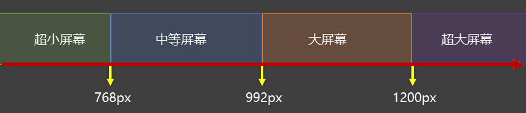

#### 1.5 结合外部样式的用法

**用法一**：

```css
<link rel="stylesheet" media="具体的媒体查询" href="mystylesheet.css">
```


**用法二：**

```css
@media screen and (max-width:768px) {
	/*CSS-Code;*/
}
@media screen and (min-width:768px) and (max-width:1200px) {
	/*CSS-Code;*/
}
```


示例：

:::normal-demo 演示

```html
<!DOCTYPE html>
<html lang="zh-CN">
<head>
    <meta charset="UTF-8">
    <title>03_媒体查询_运算符</title>
    <link rel="stylesheet" href="./css/index.css">
    <link rel="stylesheet" href="./css/small.css">
    <link rel="stylesheet" href="./css/middle.css">
    <link rel="stylesheet" href="./css/large.css">
    <link rel="stylesheet" media="screen and (min-width:1200px)" href="./css/huge.css">
</head>
<body>
    <h1>你好啊</h1>
</body>
</html>
```

```css
* {
    margin: 0;
    padding: 0;
}
h1 {
    height: 200px;
    background-color: gray;
    text-align: center;
    line-height: 200px;
    font-size: 100px;
}

/* 超大屏幕 */
@media screen and (min-width:1200px){
    h1 {
    background-color: purple;
}
}

/* 大屏幕 */
@media screen and (min-width:992px) and (max-width:1200px) {
    h1 {
        background-color: deepskyblue;
    }
}

/* 中等屏幕 */
@media screen and (min-width:768px) and (max-width:992px) {
    h1 {
        background-color: green;
    }
}

/* 超小屏幕 */
@media screen and (max-width:768px) {
    h1 {
        background-color: orange;
    }
}
```

:::

## 17. BFC

### 1. 什么是BFC 

- <span style="color: #e96900;">W3C</span> 上对 <span style="color: #e96900;">BFC</span> 的定义：

  > [!tip]
  >
  > 原文：Floats, absolutely positioned elements, block containers (such as inline-blocks, table-cells, and table-captions) that are not block boxes, and block boxes with 'overflow' other than 'visible' (except when that value has been propagated to the viewport) establish new block formatting contexts for their contents.
  > <hr>
  >
  > 译文：浮动、绝对定位元素、不是块盒子的块容器（如 <span style="color: #e96900;">inline-blocks</span> 、 <span style="color: #e96900;">table-cells</span> 和 <span style="color: #e96900;">table-captions</span> ），以及 <span style="color: #e96900;">overflow</span> 属性的值除 <span style="color: #e96900;">visible</span> 以外的块盒，将为其内容建立新的块格式化上下文。

- <span style="color: #e96900;">MDN</span> 上对 <span style="color: #e96900;">BFC</span> 的描述：

  > [!tip]
  >
  > **块格式化上下文（Block Formatting Context，BFC）** 是 <span style="color: #e96900;">Web</span> 页面的可视 <span style="color: #e96900;">CSS</span> 渲染的一部分，是块盒子的布局过程发生的区域，也是浮动元素与其他元素交互的区域。

- 更加通俗的描述：

  > [!tip]
  >
  > 1. <span style="color: #e96900;">BFC</span> 是 <span style="color: #e96900;">Block Formatting Context</span> （**块级格式上下文**），可以理解成元素的一个<span style="color: red;">“特异功能”</span>。
  > 2. 该 <span style="color: red;">“特异功能”</span>，在默认的情况下处于关闭状态；当元素满足了某些条件后，该<span style="color: red;">“特异功能”</span>被激活。
  > 3. 所谓激活<span style="color: red;">“特异功能”</span>，专业点说就是：该元素创建了 <span style="color: #e96900;">BFC</span> （又称：开启了 <span style="color: #e96900;">BFC</span> ）。

### 2. 开启了BFC能解决什么问题

1. 元素开启 <span style="color: #e96900;">BFC</span> 后，其子元素不会再产生 <span style="color: #e96900;">margin</span> 塌陷问题。

   示例：

   :::normal-demo 演示

   ```html
   <!DOCTYPE html>
   <html lang="zh-CN">
   <head>
       <meta charset="UTF-8">
       <title>01_BFC_演示1</title>
       <style>
           * {
               margin: 0;
               padding: 0;
           }
           body {
               /* display: flex; */
           }
           .outer {
               width: 400px;
               background-color: #888;
               /* float: left; */
               /* position: absolute; */
               /* display: inline-block; */
               /* display: table; */
               /* overflow: auto; */
               /* column-count: 1; */
               /* display: flow-root; */
           }
           .inner {
               width: 100px;
               height: 100px;
               margin: 20px;
           }
           .inner1 {
               background-color: orange;
           }
           .inner2 {
               background-color: green;
           }
           .inner3 {
               background-color: deepskyblue;
           }
       </style>
   </head>
   <body>
       <div class="outer">
           <div class="inner inner1"></div>
           <div class="inner inner2"></div>
           <div class="inner inner3"></div>
       </div>
       <!-- <hr style="height: 50px; background-color: red;"> -->
   </body>
   </html>
   ```

   

   :::

2. 元素开启 <span style="color: #e96900;">BFC</span> 后，自己不会被其他浮动元素所覆盖。

   示例：

   :::normal-demo 演示

   ```html
   <!DOCTYPE html>
   <html lang="zh-CN">
   <head>
       <meta charset="UTF-8">
       <title>02_BFC_演示2</title>
       <style>
           .box {
               width: 100px;
               height: 100px;
           }
           .box1 {
               background-color: orange;
               float: left;
           }
           .box2 {
               background-color: green;
               /* float: left; */
               /* position: absolute; */
               /* display: inline-block; */
               /* display: table; */
               /* overflow: auto; */
               /* column-count: 1; */
               /* display: flow-root; */
           }
       </style>
   </head>
   <body>
       <div class="box box1"></div>
       <div class="box box2"></div>
   </body>
   </html>
   ```

   

   :::

3. 元素开启 <span style="color: #e96900;">BFC</span> 后，就算其子元素浮动，元素自身高度也不会塌陷。

   示例：

   :::normal-demo 演示

   ```html
   <!DOCTYPE html>
   <html lang="zh-CN">
   <head>
       <meta charset="UTF-8">
       <title>03_BFC_演示3</title>
       <style>
           .outer {
               width: 400px;
               background-color: #888;
               /* float: left; */
               /* position: absolute; */
               /* display: inline-block; */
               /* display: table; */
               /* overflow: auto; */
               /* column-count: 1; */
               display: flow-root;
           }
           .inner {
               width: 100px;
               height: 100px;
               float: left;
           }
           .inner1 {
               background-color: orange;
           }
           .inner2 {
               background-color: green;
           }
       </style>
   </head>
   <body>
       <div class="outer">
           <div class="inner inner1"></div>
           <div class="inner inner2"></div>
       </div>
   </body>
   </html>
   ```

   

   :::

### 3. 如何开启BFC

- 根元素
- 浮动元素
- 绝对定位、固定定位的元素
- 行内块元素
- 表格单元格： <span style="color: #e96900;">table</span> 、 <span style="color: #e96900;">thead</span> 、 <span style="color: #e96900;">tbody</span> 、 <span style="color: #e96900;">tfoot</span> 、 <span style="color: #e96900;">th</span> 、 <span style="color: #e96900;">td</span> 、 <span style="color: #e96900;">tr</span> 、 <span style="color: #e96900;">caption</span>
- <span style="color: #e96900;">overflow</span> 的值不为 visible 的块元素
- 伸缩项目
- 多列容器
- <span style="color: #e96900;">column-span</span> 为 <span style="color: #e96900;">all</span> 的元素（即使该元素没有包裹在多列容器中）
- <span style="color: #e96900;">display</span> 的值，设置为 <span style="color: #e96900;">flow-root</span>