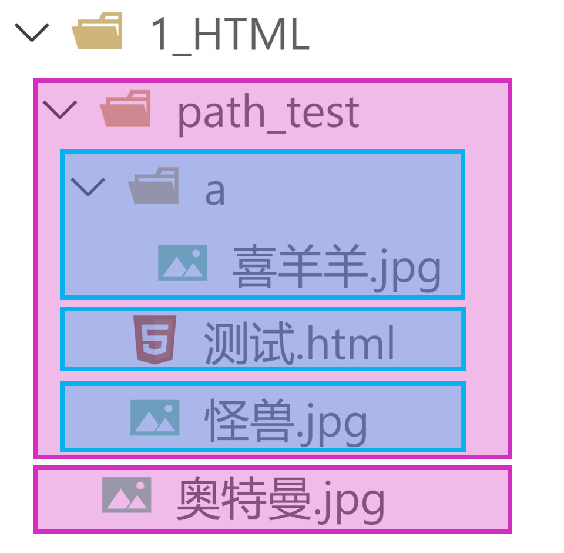

## 1. 开发者文档

1. W3C官网： www.w3c.org
2. W3School： www.w3school.com.cn
3. MDN： [MDN Web Docs](https://developer.mozilla.org/zh-CN/) —— 平时用的最多。

## 2. 排版标签

| 标签名  |                    标签含义                    | 单 / 双 标签 |
| :-----: | :--------------------------------------------: | :----------: |
| h1 ~ h6 |                      标题                      |      双      |
|    p    |                      段落                      |      双      |
|   div   | 没有任何含义，用于整体布局（生活中的包装袋）。 |      双      |

1. h1 最好写一个， h2~h6 能适当多写。
2. h1~h6 不能互相嵌套，例如： h1 标签中最好不要写h2 标签了。
3. p 标签很特殊！它里面不能有： h1~h6 、p 、div 标签（暂时先这样记，后面会说规律）。

## 3. 语义化标签

1. 概念：用特定的标签，去表达特定的含义。
2. 原则：标签的默认效果不重要（后期可以通过CSS 随便控制效果），语义最重要！
3. 举例：对于h1 标签，效果是文字很大（不重要），语义是网页主要内容（很重要）。
4. 优势：
   1. 代码结构清晰可读性强。
   2. 有利于 **SEO**（搜索引擎优化）。
   3. 方便设备解析（如屏幕阅读器、盲人阅读器等）。

## 4. 块级元素 与 行内元素

1. 块级元素：独占一行（排版标签都是块级元素）。

2. 行内元素：不独占一行（目前只学了： input ，稍后会学习更多）。

3. 使用原则：

   > [!tip]
   >
   > 1. **块级元素** 中**能**写 **行内元素** 和 **块级元**素（简单记：块级元素中几乎什么都能写）。
   > 2. **行内元素** 中**能**写 **行内元素**，但**不能**写 **块级元素**。
   >
   > 3. 一些特殊的规则：
   >
   >    1. h1~h6 不能互相嵌套。
   >
   >    2. p 中不要写块级元素。
   >
   > 备注： **marquee** 元素设计的初衷是：让文字有动画效果，但如今我们可以通过**CSS** 来实现
   > 了，而且还可以实现的更加炫酷，所以 **marquee** 标签已经：过时了（废弃了），不推荐使用。我们只是在开篇的时候，用他做了一个引子而已，在后续的学习过程中，这些已经废弃的标签，我们直接跳过。


## 5.文本标签_常用的

1. 用于包裹：词汇、短语等。
2. 通常写在排版标签里面。
3. 排版标签更宏观（大段的文字），文本标签更微观（词汇、短语）。
4. 文本标签通常都是行内元素。

| 标签名 | 标签语义                         | 单 / 双 标签 |
| :----: | -------------------------------- | :----------: |
|   em   | 要着重阅读的内容                 |      双      |
| strong | 十分重要的内容（语气比em要强）   |      双      |
|  span  | 没有语义，用于包裹短语的通用容器 |      双      |

> [!tip]
>
> 生活中的例子： **div** 是大包装袋， **span** 是小包装袋。

## 6.文本标签_不常用的

|   标签名   | 标签语义                                                     | 单 /双 标签 |
| :--------: | ------------------------------------------------------------ | :---------: |
|    cite    | 作品标题（书籍、歌曲、电影、电视节目、绘画、雕塑）           |     双      |
|    dfn     | 特殊术语 ，或专属名词                                        |     双      |
| del 与 ins | 删除的文本 【与】 插入的文本                                 |     双      |
| sub 与 sup | 下标文字 【与】 上标文字                                     |     双      |
|    code    | 一段代码                                                     |     双      |
|    samp    | 从正常的上下文中，将某些内容提取出来，例如：标识设备输出     |     双      |
|    kbd     | 键盘文本，表示文本是通过键盘输入的，经常用在与计算机相关的手册中 |     双      |
|    abbr    | 缩写，最好配合上 title 属性                                  |     双      |
|    bdo     | 更改文本方向，要配合 dir 属性，可选值: ltr （默认值）、  rtl |     双      |
|    var     | 标记变量，可以与 code 标签一起使用                           |     双      |
|   small    | 附属细则，例如：包括版权、法律文本。—— 很少使用              |     双      |
|     b      | 摘要中的关键字、评论中的产品名称。—— 很少使用                |     双      |
|     i      | 本意是：人物的思想活动、所说的话等等。  现在多用于：呈现字体图标（后面要讲的内容）。 |     双      |
|     u      | 与正常内容有反差文本，例如：错的单词、不合适的描述等。——很少使用 |     双      |
|     q      | 短引用 —— 很少使用                                           |     双      |
| blockquote | 长引用 —— 很少使用                                           |     双      |
|  address   | 地址信息                                                     |     双      |

> [!tip]
>
> 备注：
> 1. 这些不常用的文本标签，编码时不用过于纠结（酌情而定，不用也没毛病）。
> 2. **blockquote** 与 **address** 是块级元素，其他的文本标签，都是行内元素。
> 3. 有些语义感不强的标签，我们很少使用，例如：
> **small** 、**b** 、**u** 、**q** 、**blockquote**
> 4. HTML标签太多了！记住那些：重要的、语义感强的标签即可；截止目前，有这些：
> **h1~h6** 、**p** 、**div** 、**em** 、**strong** 、**span**

## 7.  图片标签

### 1. 基本使用

| 标签名 | 标签语义 | 常用属性                                                     | 单 /双 标签 |
| :----: | :------: | :----------------------------------------------------------- | :---------: |
|  img   |   图片   | src ：图片路径（又称：图片地址）—— 图片具体位置<br/>alt ：图片描述  <br/>width ：图片宽度，单位是像素，例如：200px 或 200 <br/>height ：图片高度，单位是像素，例如：200px 或  200 |     单      |

总结：

> [!tip]
>
> 1. 像素（ px ）是一种单位，学到CSS 时，我们会详细讲解。
>
> 2. 尽量不同时修改图片的宽和高，可能会造成比例失调。
>
> 3. 暂且认为img 是行内元素（学到CSS 时，会认识一个新的元素分类，目前咱们只知道：块、行内）。
>
> 4. alt 属性的作用：
>
>    - 搜索引擎通过alt 属性，得知图片的内容。—— 最主要的作用。
>
>    - 当图片无法展示时候，有些浏览器会呈现alt 属性的值。
>
>    - 盲人阅读器会朗读alt 属性的值。

### 2.  路径的分类 

1. **相对路径**：以当前位置作为参考点，去建立路径。

   | 已有结构 | 符号 | 含义 | 举例（在测试.html 中） |
   | -------- | ---- | ---- | ---------------------- |
   |  | ./ | 同级 | 引入【怪兽.jpg】：`````` |
   |          | / | 下一级 | 引入【喜羊羊.jpg】：  `````` |
   |          | ../ | 上一级 | 引入【奥特曼.jpg】： `````` |

2. **绝对路径**：以**根位置**作为参考点，去建立路径。

   1. 本地绝对路径： **E:/a/b/c/奥特曼.jpg** 。（很少使用）

   2. 网络绝对路径： **http://www.atguigu.com/images/index_new/logo.png **。

      > [!tip]
      >
      > 注意点：
      >
      > 1. 使用本地绝对路径，一旦更换设备，路径处理起来比较麻烦，所以很少使用。
      > 2. 使用网络绝对路径，确实方便，但要注意：若服务器开启了防盗链，会造成图片引入失败。


### 3.  常见图片格式

1. **jpg** 格式：

   > [!tip]
   >
   > 概述：扩展名为 **.jpg** 或 **.jpeg** ，是一种有损的压缩格式（把肉眼不容易观察出来的细节丢弃了）。
   > 主要特点：**支持的颜色丰富、占用空间较小、**不支持透明背景、不支持动态图。
   > 使用场景：对图片细节**没有极高要求**的场景，例如：网站的产品宣传图等 。—— 该格式网页中很常见。

2. **png** 格式：

   > [!tip]
   >
   > 概述：扩展名为 **.png** ，是一种无损的压缩格式，能够更高质量的保存图片。
   > 主要特点：**支持的颜色丰富**、占用空间略大、**支持透明背景**、不支持动态图。
   > 使用场景：①想让图片有透明背景；②想更高质量的呈现图片；例如 ：公司logo图、重要配图等。

3. **bmp** 格式：

   > [!tip]
   >
   > 概述：扩展名为 **.bmp** ，不进行压缩的一种格式，在最大程度上保留图片更多的细节。
   > 主要特点：**支持的颜色丰富、保留的细节更多**、占用空间极大、不支持透明背景、不支持动态图。
   > 使用场景：对图片细节**要求极高**的场景，例如：一些大型游戏中的图片 。（网页中很少使用）

4. **gif** 格式：

   > [!tip]
   >
   > 概述：扩展名为 **.gif** ，仅支持256种颜色，色彩呈现不是很完整。
   > 主要特点：支持的颜色较少、**支持简单透明背景、支持动态图。**
   > 使用场景：网页中的动态图片。

5. **webp** 格式：

   > [!tip]
   >
   > 概述：扩展名为 **.webp** ，谷歌推出的一种格式，专门用来在网页中呈现图片。
   > 主要特点：具备上述几种格式的优点，但兼容性不太好，一旦使用务必要解决兼容性问题。
   > 使用场景：网页中的各种图片。

6. **base64** 格式

   > [!tip]
   >
   > 1. 本质：一串特殊的文本，要通过浏览器打开，传统看图应用通常无法打开。
   > 2. 原理：把图片进行 **base64** 编码，形成一串文本。
   > 3. 如何生成：靠一些工具或网站。
   > 4. 如何使用：直接作为 **img** 标签的 **src** 属性的值即可，并且不受文件位置的影响。
   > 5. 使用场景：一些较小的图片，或者需要和网页一起加载的图片。

**图片的格式非常多，上面这些，只是一些常见的、我们前端人员常接触到的。**

## 8. 超链接

主要作用：从当前页面进行跳转。
可以实现：

①跳转到指定页面、

②跳转到指定文件（也可触发下载）、

③跳转到锚点位置、

④唤起指定应用。

| 标签名 | 标签语义 | 常用属性                                                 | 单 / 双 标签 |
| ---------- | ------------ | ------------------------------------------------------------ | ------------------------ |
| a          | 超链接       | **href** ： 指定要跳转到的具体目标。  <br>**target** ： 控制跳转时如何打开页面，常用值如下:  <br/>                  **_self** ：在本窗口打开。   <br/>                  **_blank** ：在新窗口打开。  <br/> **id** ： 元素的唯一 标识，可用于设置锚点。   <br/>**name** ： 元素的名字，写在 a 标签中，也能设置锚点。 | 双                       |

### 1. 跳转到页面

```html
<!-- 跳转其他网页 -->
<a href="https://www.jd.com/" target="_blank">去京东</a>

<!-- 跳转本地网页 -->
<a href="./10_HTML排版标签.html" target="_self">去看排版标签</a>
```

:::normal-demo 跳转其他网页演示

```html
<!-- 跳转其他网页 -->
<a href="https://www.jd.com/" target="_blank">去京东</a>
```


:::

> [!tip]
>
> 注意点：
> 1. 代码中的多个空格、多个回车，都会被浏览器解析成一个空格！
> 2. 虽然 **a** 是行内元素，但 **a** 元素可以包裹除它自身外的任何元素！
>
> 想展示多个回车或空格，怎么办呢？ —— 后面会讲。

### 2. 跳转到文件


### 3. 跳转到锚点
### 4. 唤起指定应用
## 9. 列表
### 1. 有序列表
### 2. 无序列表 
### 3. 列表嵌套
### 4. 自定义列表
## 10. 表格
### 1. 基本结构
### 2. 常用属性
### 3. 跨行跨列
## 11.常用标签补充
## 12. 表单
### 1. 基本结构
### 2. 常用表单控件
#### ① 文本输入框
#### ② 密码输入框
#### ③ 单选框
#### ④ 复选框
#### ⑤ 隐藏域
#### ⑥ 提交按钮
#### ⑦ 重置按钮
#### ⑧ 普通按钮
#### ⑨文本域
#### ⑩ 下拉框
### 3. 禁用表单控件
### 4.label 标签
### 5. fieldset 与 legend 的使用（了解）
### 6. 表单总结
## 13.框架标签
## 14.HTML实体
## 15.HTML全局属性
## 16.meta 元信息
## 17. HTML总结