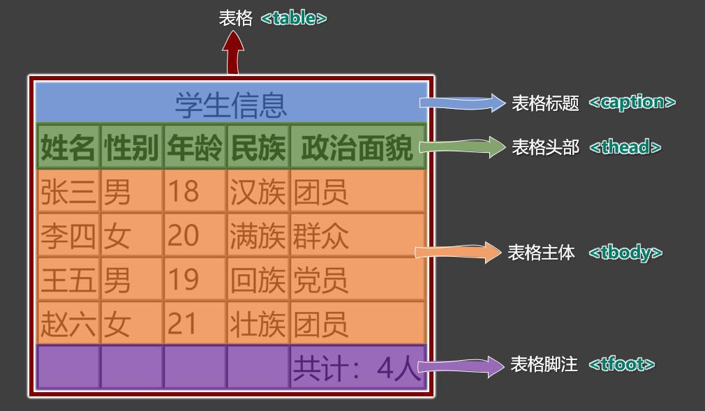
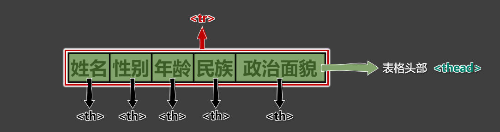
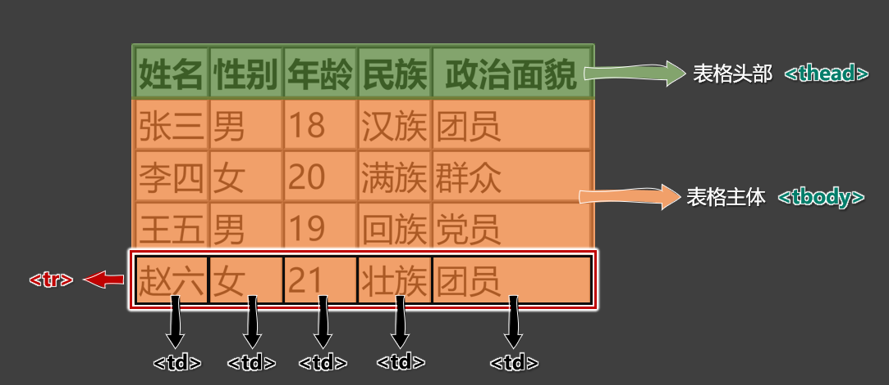
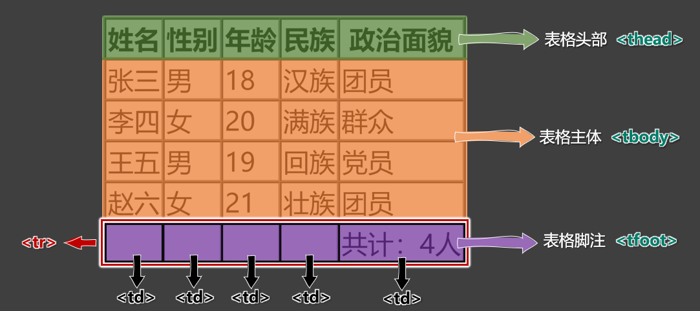
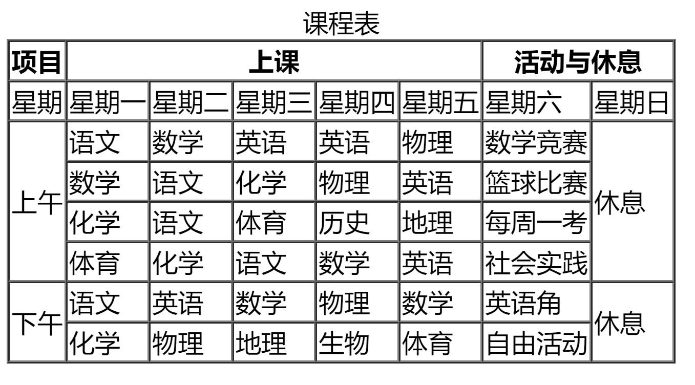
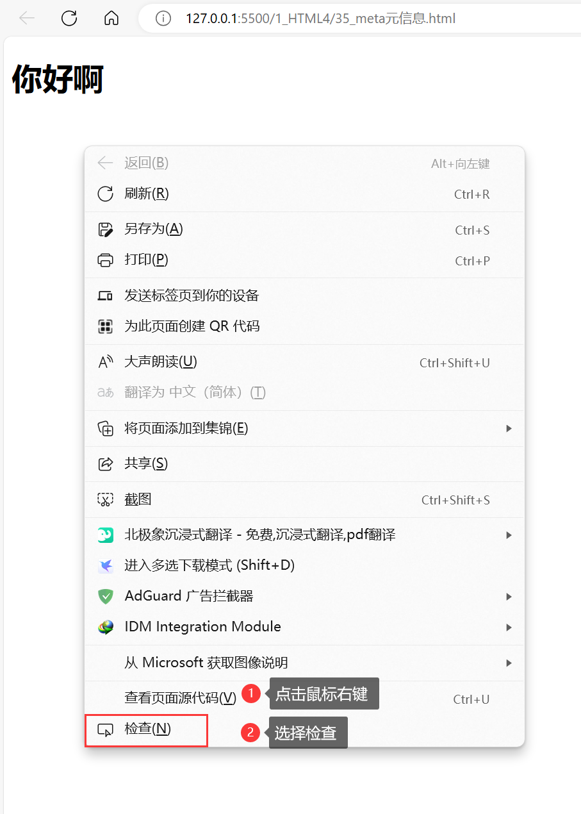
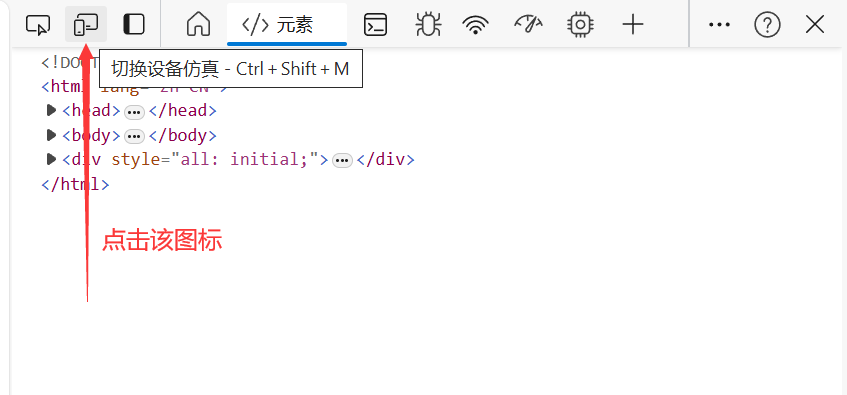
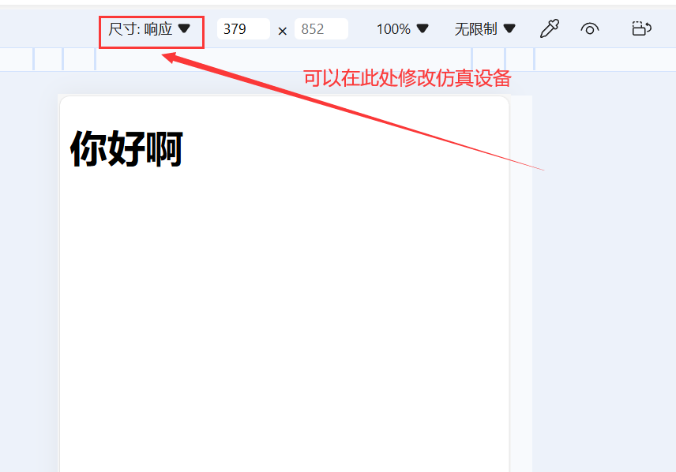

## 1. 开发者文档

1. W3C官网： [www.w3c.org](https://www.w3c.org)
2. W3School： [www.w3school.com.cn](https://www.w3school.com.cn) 
3. MDN： [https://developer.mozilla.org/zh-CN/](https://developer.mozilla.org/zh-CN/) —— 平时用的最多。

## 2. 排版标签

| 标签名  | 标签含义                                       | 单 / 双 标签 |
| :-----: | :--------------------------------------------- | :----------: |
| h1 ~ h6 | 标题                                           |      双      |
|    p    | 段落                                           |      双      |
|   div   | 没有任何含义，用于整体布局（生活中的包装袋）。 |      双      |

1. <font color='#e96900'>h1</font> 最好写一个， <font color='#e96900'>h2~h6</font> 能适当多写。

2. <font color='#e96900'>h1~h6</font> 不能互相嵌套，例如： h1 标签中最好不要写 <font color='#e96900'>h2</font> 标签了。

3. <font color='#e96900'>p</font> 标签很特殊！它里面不能有：<font color='#e96900'> h1~h6</font> 、<font color='#e96900'>p</font> 、<font color='#e96900'>div </font>标签（暂时先这样记，后面会说规律）。

4. 示例：

   :::normal-demo 演示
   
   ```html
   <!DOCTYPE html>
   <html lang="zh-CN">
   <head>
       <meta charset="UTF-8">
       <title>HTML排版标签</title>
   </head>
   <body>
       <!-- 
           <h1>我是一级标题</h1>
           <h2>我是二级标题</h2>
           <h3>我是三级标题</h3>
           <h4>我是四级标题</h4>
           <h5>我是五级标题</h5>
           <h6>我是六级标题</h6>
           <div>
               <p>我是一个段落</p>
               <p>我是一个段落</p>
               <p>我是一个段落</p>
           </div>
        -->
        <h1>把个人信息“安全堤”筑牢</h1>
        <h4>2022-06-21 07:34 · 1347条评论</h4>
        <div>
           <p>置身移动互联时代，人们在享受智能设备带来便利的同时，也在一些场景中面临个人信息泄露风险。随着时间推移，这样的风险日益呈现出新的表现形式。</p>
           <p>一些APP声称看视频、玩游戏甚至走路都能赚钱，但用户想提现却难上加难，还容易泄露个人信息；新型不法软件图标透明、没有名称，在手机屏幕上十分隐蔽，不仅不停推送广告，还会收集并转卖用户隐私信息；个人信息安全和隐私保护话题引发关注，正说明其涉及群众切身利益，问题不容小视。</p>
        </div>
   </body>
   </html>
   ```
   
   
   
   :::
   
   


> [!tip]
>
> VSCode 快捷键：光标移到下一行快捷键（不带内容）： <font color='#e96900'>**Ctrl + Enter** </font>

## 3. 语义化标签

1. 概念：用特定的标签，去表达特定的含义。
2. 原则：标签的默认效果不重要（后期可以通过 <font color='#e96900'>CSS</font> 随便控制效果），语义最重要！
3. 举例：对于 <font color='#e96900'>h1</font> 标签，效果是文字很大（不重要），语义是网页主要内容（很重要）。
4. 优势：
   1. 代码结构清晰可读性强。
   2. 有利于 **<font color='blue'>SEO</font>**（搜索引擎优化）。
   3. 方便设备解析（如屏幕阅读器、盲人阅读器等）。

## 4. 块级元素 与 行内元素

1. 块级元素：独占一行（排版标签都是块级元素）。

2. 行内元素：不独占一行（目前只学了： <font color='#e96900'>input</font> ，稍后会学习更多）。

3. 使用原则：

   > [!tip]
   >
   > 1. **块级元素** 中 **<font color='red'>能</font>** 写 **行内元素** 和 **块级元素**（简单记：块级元素中几乎什么都能写）。
   > 2. **行内元素** 中 **<font color='red'>能</font>** 写 **行内元素**，但 **<font color='red'>不能</font>** 写 **块级元素**。
   >
   > 3. 一些特殊的规则：
   >
   >    - <font color='#e96900'>h1~h6</font> 不能互相嵌套。
   >
   >    - <font color='#e96900'>p</font> 中不要写块级元素。
   >
   > 备注：<font color='#e96900'> **marquee**</font> 元素设计的初衷是：让文字有动画效果，但如今我们可以通过 <font color='#e96900'>**CSS**</font> 来实现了，而且还可以实现的更加炫酷，所以 **<font color='#e96900'>marquee</font>** 标签已经：**过时了**（废弃了），不推荐使用。我们只是在开篇的时候，用他做了一个引子而已，在后续的学习过程中，这些已经废弃的标签，我们直接跳过。

4. 示例

   :::normal-demo 演示
   
   ```html
   <!DOCTYPE html>
   <html lang="zh-CN">
   <head>
       <meta charset="UTF-8">
       <title>块级元素与行内元素</title>
   </head>
   <body>
       <!-- 块级元素，特点：独占一行 -->
       <marquee>尚硅谷</marquee>
       <marquee>尚硅谷</marquee>
       <h1>尚硅谷</h1>
       <h1>尚硅谷</h1>
       <p>尚硅谷</p>
       <p>尚硅谷</p>
       <div>尚硅谷</div>
       <div>尚硅谷</div>
   
       <!-- 行内元素，特点：不独占一行 -->
       <input type="text">
       <input type="text">
       <span>尚硅谷</span>
       <span>尚硅谷</span>  
   
   </body>
   </html>
   ```

   
   
   :::

## 5.文本标签_常用的

1. 用于包裹：词汇、短语等。
2. 通常写在排版标签里面。
3. 排版标签更宏观（大段的文字），文本标签更微观（词汇、短语）。
4. 文本标签通常都是行内元素。

| 标签名 | 标签语义                         | 单 / 双 标签 |
| :----: | -------------------------------- | :----------: |
|   em   | 要着重阅读的内容                 |      双      |
| strong | 十分重要的内容（语气比em要强）   |      双      |
|  span  | 没有语义，用于包裹短语的通用容器 |      双      |

> [!tip]
>
> VSCode 快捷键：
>
> 快速复制一行代码至上一行： <font color='#e96900'>**Shift + Alt + ↑**</font> 
>
> 快速复制一行代码至下一行：<font color='#e96900'> **Shift + Alt + ↓** </font>
>
> 生活中的例子： **<font color='#e96900'>div</font>** 是大包装袋， **<font color='#e96900'>span</font>** 是小包装袋。

5. 示例

   :::normal-demo 演示
   
   ```html
   <!DOCTYPE html>
   <html lang="zh-CN">
   <head>
       <meta charset="UTF-8">
       <title>HTML_常用的文本标签</title>
       <style>
           span{
               color: red;
           }
       </style>
   </head>
   <body>
       <p>
           预防电信诈骗，请安装：<em>国家反诈中心app</em>。
       </p>
       <p>
           当我们出门的时候，一定要<strong>关好门窗</strong>！
       </p>
       <p>
           前端三个框架为：<span>Angular、React、Vue</span>。
       </p>
   </body>
   </html>
   ```

   

   :::

## 6.文本标签_不常用的

|                            标签名                            | 标签语义                                                     | 单 /双 标签 |
| :----------------------------------------------------------: | ------------------------------------------------------------ | :---------: |
|              <font color='#e96900'>cite</font>               | 作品标题（书籍、歌曲、电影、电视节目、绘画、雕塑）           |     双      |
|               <font color='#e96900'>dfn</font>               | 特殊术语 ，或专属名词                                        |     双      |
| <font color='#e96900'>del </font>与 <font color='#e96900'>ins</font> | 删除的文本 【与】 插入的文本                                 |     双      |
| <font color='#e96900'>sub </font>与 <font color='#e96900'>sup</font> | 下标文字 【与】 上标文字                                     |     双      |
|              <font color='#e96900'>code</font>               | 一段代码                                                     |     双      |
|              <font color='#e96900'>samp</font>               | 从正常的上下文中，将某些内容提取出来，例如：标识设备输出     |     双      |
|               <font color='#e96900'>kbd</font>               | 键盘文本，表示文本是通过键盘输入的，经常用在与计算机相关的手册中 |     双      |
|              <font color='#e96900'>abbr</font>               | 缩写，最好配合上 <font color='#e96900'>title </font>属性     |     双      |
|               <font color='#e96900'>bdo</font>               | 更改文本方向，要配合 <font color='#e96900'>dir </font>属性，可选值: <font color='#e96900'>ltr </font>（默认值）、  <font color='#e96900'>rtl</font> |     双      |
|               <font color='#e96900'>var</font>               | 标记变量，可以与 <font color='#e96900'>code </font>标签一起使用 |     双      |
|              <font color='#e96900'>small</font>              | 附属细则，例如：包括版权、法律文本。—— 很少使用              |     双      |
|                <font color='#e96900'>b</font>                | 摘要中的关键字、评论中的产品名称。—— 很少使用                |     双      |
|                <font color='#e96900'>i</font>                | 本意是：人物的思想活动、所说的话等等。  现在多用于：呈现<font color='red'>字体图标</font>（后面要讲的内容）。 |     双      |
|                <font color='#e96900'>u</font>                | 与正常内容有反差文本，例如：错的单词、不合适的描述等。——很少使用 |     双      |
|                <font color='#e96900'>q</font>                | 短引用 —— 很少使用                                           |     双      |
|           <font color='#e96900'>blockquote</font>            | 长引用 —— 很少使用                                           |     双      |
|             <font color='#e96900'>address</font>             | 地址信息                                                     |     双      |

> [!tip]
>
> 备注：
> 1. 这些不常用的文本标签，编码时不用过于纠结（酌情而定，不用也没毛病）。
> 2. **<font color='#e96900'>blockquote</font>** 与 **<font color='#e96900'>address</font>** 是块级元素，其他的文本标签，都是行内元素。
> 3. 有些语义感不强的标签，我们很少使用，例如：
>     **<font color='#e96900'>small</font>** 、**<font color='#e96900'>b</font>** 、**<font color='#e96900'>u</font>** 、**<font color='#e96900'>q</font>** 、**<font color='#e96900'>blockquote</font>**
> 4. HTML标签太多了！记住那些：重要的、语义感强的标签即可；截止目前，有这些：
>     **<font color='#e96900'>h1~h6</font>** 、**<font color='#e96900'>p</font>** 、**<font color='#e96900'>div</font>** 、**<font color='#e96900'>em</font>** 、**<font color='#e96900'>strong</font>** 、**<font color='#e96900'>span</font>**

示例：

:::normal-demo 演示

```html
<!DOCTYPE html>
<html lang="zh-CN">
<head>
    <meta charset="UTF-8">
    <title>HTML_不常用的文本标签</title>
</head>
<body>
    <p>
        这首<cite>《光辉岁月》</cite>，非常的好听！
    </p>

    <p>
        <dfn>耗子尾汁</dfn>，是一个网络流行语，意思同<dfn>好自为之</dfn>。
    </p>

    <p>
        商品原价：<del>199</del>，限时秒杀：<ins>99</ins>
    </p>

    <p>
        水的化学方程式是：H<sub>2</sub>O，8的三次方是这么写的：8<sup>3</sup>
    </p>

    <p>
        等过一段我们学习了JS，你就会发现这段代码很有意思：<code>alert(1)</code>
    </p>

    <p>
        手机突然提示，<samp>支付宝到账100万元！</samp>
    </p>

    <p>
        保存的快捷键是：<kbd>ctrl + s</kbd>
    </p>

    <p>
        <abbr title="英雄联盟">LOL</abbr>这个游戏非常好玩
    </p>

    <p>
        你是年少的欢喜，这句话反过来念就是：<bdo dir="rtl">你是年少的欢喜</bdo>
    </p>

    <p>
        等过一段我们学习了JS，我们就知道要这样定义变量了：<code>let <var>a</var> = 1</code>
    </p>

    <p>
        <small>本网站所有资料、图表仅供参考，涉及投资项目所造成的盈亏与本网站无关。</small>
    </p>

    <p>
        我也买过<b>罗技GPW二代</b>这个鼠标，确实很好用！
    </p>

    <p>
        猪头声嘶力竭的喊着：<i>“燕子，没有你我怎么活啊！”</i>
    </p>

    <p>
        张三把“你好”的英文写成了：<u>heelo</u>，这是不对的！
    </p>

    <p>
        屈原曾经说过：<q>路漫漫其修远兮，吾将上下而求索</q>
    </p>

    <p>
        有一首歌，歌词是这样的：
        <blockquote>后来，我总算学会了如何去爱；可惜你早已远去消失在人海；后来终于在眼泪中明白，有些人一旦错过就不在；</blockquote>
    </p>

    <p>
        我们的学校地址是：<address>北京宏福科技园</address>
    </p>

</body>
</html>
```


:::

## 7.  图片标签

### 1. 基本使用

|              标签名              | 标签语义 | 常用属性                                                     | 单 /双 标签 |
| :------------------------------: | :------: | :----------------------------------------------------------- | :---------: |
| <font color='#e96900'>img</font> |   图片   | <font color='#e96900'>src </font>：图片路径（又称：图片地址）—— 图片具体位置<br/><font color='#e96900'>alt </font>：图片描述  <br/><font color='#e96900'>width </font>：图片宽度，单位是像素，例如：200px 或 200 <br/><font color='#e96900'>height </font>：图片高度，单位是像素，例如：200px 或  200 |     单      |

总结：

> [!tip]
>
> 1. 像素（ <font color='#e96900'>px </font>）是一种单位，学到CSS 时，我们会详细讲解。
>
> 2. 尽量不同时修改图片的宽和高，可能会造成比例失调。
>
> 3. 暂且认为 <font color='#e96900'>img </font>是行内元素（学到 <font color='#e96900'>CSS </font>时，会认识一个新的元素分类，目前咱们只知道：块、行内）。
>
> 4. <font color='#e96900'>alt </font>属性的作用：
>- 搜索引擎通过 <font color='#e96900'>alt </font>属性，得知图片的内容。—— 最主要的作用。
>    
>- 当图片无法展示时候，有些浏览器会呈现 <font color='#e96900'>alt </font>属性的值。
>    
>- 盲人阅读器会朗读 <font color='#e96900'>alt </font>属性的值。

示例：

```html
<!DOCTYPE html>
<html lang="zh-CN">
<head>
    <meta charset="UTF-8">
    <title>HTML_图片标签</title>
</head>
<body>
    
    
</body>
</html>
```


### 2.  路径的分类 

1. **相对路径**：以<font color='red'>**当前位置**</font>作为参考点，去建立路径。

   <table border="1" cellspacing="0">
           <thead>
               <tr>
                   <th>已有结构</th>
                   <th>符号</th>
                   <th>含义</th>
                   <th>举例（在测试.html 中）</th>
               </tr>
           </thead>
           <tbody>
               <tr>
                   <td rowspan="3"></td>
                   <td><font color='#e96900'>./</font></td>
                   <td>同级</td>
                   <td>引入【怪兽.jpg】<font color='#e96900'>&lt;img src="./怪兽.jpg"></font></td>
               </tr>
               <tr>
                   <td><font color='#e96900'>/</font></td>
                   <td>下一级</td>
                   <td>引入【喜羊羊.jpg】：<font color='#e96900'>&lt;img src="./a/喜羊羊.jpg"></font></td>
               </tr>
               <tr>
                   <td><font color='#e96900'>../</font></td>
                   <td>上一级</td>
                   <td>引入【奥特曼.jpg】： <font color='#e96900'>&lt;img src="../奥特曼.jpg"></font></td>
               </tr>
           </tbody>
       </table>
   
2. **绝对路径**：以 **<font color='red'>根位置</font>** 作为参考点，去建立路径。

   1. 本地绝对路径： **<font color='#e96900'>E:/a/b/c/奥特曼.jpg</font>** 。（很少使用）

   2. 网络绝对路径： [http://www.atguigu.com/images/index_new/logo.png ](http://www.atguigu.com/images/index_new/logo.png )

      > [!tip]
      >
      > 注意点：
      >
      > 1. 使用本地绝对路径，一旦更换设备，路径处理起来比较麻烦，所以很少使用。
      > 2. 使用网络绝对路径，确实方便，但要注意：若服务器开启了防盗链，会造成图片引入失败。

> [!tip]
>
> VSCode 快捷键：
>
> VScode整个页面变大：<font color='#e96900'> **Ctrl + Shift + +**</font>
>
> VScode整个页面变小： <font color='#e96900'>**Ctrl + Shift + -**</font>

### 3.  常见图片格式

1. **<font color='#e96900'>jpg</font>** 格式：

   > [!tip]
   >
   > 概述：扩展名为 **<font color='#e96900'>.jpg</font>** 或 **<font color='#e96900'>.jpeg</font>** ，是一种有损的压缩格式（把肉眼不容易观察出来的细节丢弃了）。
   > 主要特点： **<font color='green'>支持的颜色丰富、占用空间较小</font>、** 不支持透明背景、不支持动态图。
   > 使用场景：对图片细节 **<font color='blue'>没有极高要求</font>** 的场景，例如：网站的产品宣传图等 。—— 该格式网页中很常见。

2. **<font color='#e96900'>png</font>** 格式：

   > [!tip]
   >
   > 概述：扩展名为 **<font color='#e96900'>.png</font>** ，是一种无损的压缩格式，能够更高质量的保存图片。
   > 主要特点：**<font color='green'>支持的颜色丰富</font>**、占用空间略大、**<font color='green'>支持透明背景</font>**、不支持动态图。
   > 使用场景：①想让图片有透明背景；②想更高质量的呈现图片；例如 ：公司logo图、重要配图等。

3. **<font color='#e96900'>bmp</font>** 格式：

   > [!tip]
   >
   > 概述：扩展名为 **<font color='#e96900'>.bmp</font>** ，不进行压缩的一种格式，在最大程度上保留图片更多的细节。
   > 主要特点：**<font color='green'>支持的颜色丰富、保留的细节更多</font>**、占用空间极大、不支持透明背景、不支持动态图。
   > 使用场景：对图片细节 **<font color='blue'>要求极高</font>** 的场景，例如：一些大型游戏中的图片 。（网页中很少使用）

4. **<font color='#e96900'>gif</font>** 格式：

   > [!tip]
   >
   > 概述：扩展名为 **<font color='#e96900'>.gif</font>** ，仅支持256种颜色，色彩呈现不是很完整。
   > 主要特点：支持的颜色较少、**<font color='green'>支持<font color='red'>简单</font>透明背景、支持动态图</font>。**
   > 使用场景：网页中的动态图片。

5. **<font color='#e96900'>webp</font>** 格式：

   > [!tip]
   >
   > 概述：扩展名为 **<font color='#e96900'>.webp</font>** ，谷歌推出的一种格式，专门用来在网页中呈现图片。
   > 主要特点：具备上述几种格式的优点，但兼容性不太好，一旦使用务必要解决兼容性问题。
   > 使用场景：网页中的各种图片。

6. **<font color='#e96900'>base64</font>** 格式

   > [!tip]
   >
   > 1. 本质：一串特殊的文本，要通过浏览器打开，传统看图应用通常无法打开。
   > 2. 原理：把图片进行 <font color='#e96900'>**base64**</font> 编码，形成一串文本。
   > 3. 如何生成：靠一些工具或网站。
   > 4. 如何使用：直接作为 <font color='#e96900'>**img**</font> 标签的 <font color='#e96900'>**src**</font> 属性的值即可，并且不受文件位置的影响。
   > 5. 使用场景：一些较小的图片，或者需要和网页一起加载的图片。

**图片的格式非常多，上面这些，只是一些常见的、我们前端人员常接触到的。**

## 8. 超链接

主要作用：从当前页面进行跳转。
可以实现：

①跳转到指定页面、

②跳转到指定文件（也可触发下载）、

③跳转到锚点位置、

④唤起指定应用。

| 标签名 | 标签语义 | 常用属性                                                 | 单 / 双 标签 |
| ---------- | ------------ | ------------------------------------------------------------ | ------------------------ |
| a          | 超链接       | **<font color='#e96900'>href</font>** ： 指定要跳转到的具体目标。  <br>**<font color='#e96900'>target</font>** ： 控制跳转时如何打开页面，常用值如下:  <br/>&emsp;&emsp;&emsp;&emsp;**<font color='green'>_self ：在本窗口打开（默认效果）。</font>**   <br/>&emsp;&emsp;&emsp;&emsp;**<font color='green'>_blank：在新窗口打开</font>。 <br/> **<font color='#e96900'>**id**</font>  ： 元素的唯一 标识，可用于设置锚点。   <br/>**<font color='#e96900'>name</font>** ： 元素的名字，写在 <font color='#e96900'>a </font>标签中，也能设置锚点。 | 双                       |

### 1. 跳转到页面

```html
<!-- 跳转其他网页 -->
<a href="https://www.jd.com/" target="_blank">去京东</a>

<!-- 跳转本地网页 -->
<a href="./10_HTML排版标签.html" target="_self">去看排版标签</a>
```

:::normal-demo 跳转其他网页演示

```html
<!-- 跳转其他网页 -->
<a href="https://www.jd.com/" target="_blank">去京东</a>
<a href="https://www.baidu.com/" target="_self">去百度</a>
```


:::

> [!tip]
>
> 注意点：
> 1. 代码中的**多个空格**、**多个回车**，都会被浏览器解析成一个空格！
> 2. 虽然 **<font color='#e96900'>a</font>** 是行内元素，但 **<font color='#e96900'>a</font>** 元素可以包裹除它自身外的任何元素！
>
> 想展示多个回车或空格，怎么办呢？ —— 后面会讲。

### 2. 跳转到文件

```html
<!-- 浏览器能直接打开的文件 -->
<a href="./resource/自拍.jpg">看自拍</a>
<a href="./resource/小电影.mp4">看小电影</a>
<a href="./resource/小姐姐.gif">看小姐姐</a>
<a href="./resource/如何一夜暴富.pdf">点我一夜暴富</a>
<!-- 浏览器不能打开的文件，会自动触发下载 -->
<a href="./resource/内部资源.zip">内部资源</a>
<!-- 强制触发下载 -->
<a href="./resource/小电影.mp4" download="电影片段.mp4">下载电影</a>
```

> [!tip]
>
> 注意1：若浏览器无法打开文件，则会引导用户下载。
> 注意2：若想强制触发下载，请使用download 属性，属性值即为下载文件的名称。

### 3. 跳转到锚点

什么是锚点？—— 网页中的一个标记点。
具体使用方式：

- **第一步：设置锚点**

  ```html
  <!-- 第一种方式：a标签配合name属性 -->
  <a name="test1"></a>
  
  <!-- 第二种方式：其他标签配合id属性 -->
  <h2 id="test2">我是一个位置</h2>
  ```
  
  > [!tip]
  >
  > 注意点：
  > 1. 具有 **<font color='#e96900'>href</font>** 属性的 **a** 标签是 **<font color='#e96900'>超链接</font>**，具有 **<font color='#e96900'>name</font>** 属性的 **<font color='#e96900'>a</font>** 标签是 **锚点** 。
  > 2. **<font color='#e96900'>name</font>** 和 **<font color='#e96900'>id</font>** 都是区分大小写的，且 **<font color='#e96900'>id</font>** 最好别是数字开头。
  
- **第二步：跳转锚点**

  ```html
  <!-- 跳转到test1锚点 -->
  <a href="#test1">去test1锚点</a>
  
  <!-- 跳转到本页面顶部 -->
  <a href="#">回到顶部</a>
  
  <!-- 跳转到其他页面锚点 -->
  <a href="demo.html#test1">去demo.html页面的test1锚点</a>
  
  <!-- 刷新本页面 -->
  <a href="">刷新本页面</a>
  
  <!-- 执行一段js，如果还不知道执行什么，可以留空， javascript:; -->
  <a href="javascript:alert(1);">点我弹窗</a>
  ```

  

  

### 4. 唤起指定应用

通过 **<font color='#e96900'>a</font>** 标签，可以唤起设备应用程序。

```html
<!-- 唤起设备拨号 -->
<a href="tel:10010">电话联系</a>
<!-- 唤起设备发送邮件 -->
<a href="mailto:10010@qq.com">邮件联系</a>
<!-- 唤起设备发送短信 -->
<a href="sms:10086">短信联系</a>
```

:::normal-demo 演示

```html
<!DOCTYPE html>
<html lang="zh-CN">
<head>
    <meta charset="UTF-8">
    <title>超链接_唤起指定应用</title>
</head>
<body>
    <a href="tel:10010">电话联系</a>
    <a href="mailto:1234567@qq.com">邮件联系</a>
    <a href="sms:10086">短信联系</a>
</body>
</html>
```


:::

## 9. 列表
### 1. 有序列表（ordered list）

概念：有顺序或侧重顺序的列表。

```html
<h2>要把大象放进冰箱总共分几步</h2>
<o1>
	<li>把冰箱门打开</li>
    <li>把大象放进去</li>
    <li>把冰箱门福安上</li>
</o1>
```

:::normal-demo 演示

```html
<!DOCTYPE html>
<html lang="zh-CN">
<head>
    <meta charset="UTF-8">
    <title>有序列表</title>
</head>
<body>
    <h2>要把大象放冰箱拢共分几步？</h2>
    <ol>
        <li>把冰箱门打开</li>
        <li>把大象放进去</li>
        <li>把冰箱门关上</li>
    </ol>
</body>
</html>
```


:::

### 2. 无序列表（unordered list）

概念：无顺序或不侧重顺序的列表。

```html
<h2>我想去的几个城市</h2>
<ul>
    <li>成都</li>
    <li>上海</li>
    <li>西安</li>
    <li>武汉</li>
</ul>
```

:::normal-demo 演示

```html
<!DOCTYPE html>
<html lang="zh-CN">
<head>
    <meta charset="UTF-8">
    <title>无序列表</title>
</head>
<body>
    <h2>我想去的几个城市</h2>
    <ul>
        <li>成都</li>
        <li>上海</li>
        <li>西安</li>
        <li>武汉</li>
    </ul>
</body>
</html>
```


:::

### 3. 列表嵌套

概念：列表中的某项内容，又包含一个列表（注意：嵌套时，请务必把解构写完整）。

```html
<h2>我想去的几个城市</h2>
<ul>
    <li>成都</li>
    <li>
    	<span>上海</span>
        <ul>
            <li>外滩</li>
            <li>杜莎夫人蜡像馆</li>
            <li>
            	<a href="https://www.org.cn/">东方明珠</a>
            </li>
            <li>迪士尼乐园</li>
        </ul>
    </li>
    <li>西安</li>
    <li>武汉</li>
</ul>
```

:::normal-demo 演示

```html
<!DOCTYPE html>
<html lang="zh-CN">
<head>
    <meta charset="UTF-8">
    <title>无序列表</title>
</head>
<body>
    <h2>我想去的几个城市</h2>
    <ul>
        <li>成都</li>
        <li>
            <span>上海</span>
            <ul>
                <li>外滩</li>
                <li>东方明珠</li>
                <li>迪士尼乐园</li>
                <li>杜莎夫人蜡像馆</li>
            </ul>
        </li>
        <li>西安</li>
        <li>武汉</li>
    </ul>
</body>
</html>
```


:::

> [!tip]
>
> 注意： **<font color='#e96900'>li</font>** 标签最好写在 **<font color='#e96900'>ul</font>** 或 **<font color='#e96900'>ol</font>** 中，不要单独使用。

### 4. 自定义列表（definition list）

1. 概念：所谓自定义列表，就是一个包含 **<font color='red'>术语名称</font>** 以及 **<font color='red'>术语描述</font>** 的列表。
2. 一个 **<font color='#e96900'>dl</font>** 就是一个自定义列表，一个 **<font color='#e96900'>dt</font>** 就是一个术语名称，一个 **<font color='#e96900'>dd</font>** 就是术语描述（可以有多个）。

```html
<h2>如何高效学习？</h2>
<dl>
    <dt>做好笔记</dt>
    <dd>笔记是我们以后复习的一个抓手</dd>
    <dd>笔记可以是电子版，也可以是纸质版</dd>
    <dt>多加练习</dt>
    <dd>只有敲出来的代码，才是自己的</dd>
    <dt>别怕出错</dt>
    <dd>错很正常，改正后并记住，就是经验</dd>
</dl>
```

:::normal-demo 演示

```html
<h2>如何高效学习？</h2>
<dl>
    <dt>做好笔记</dt>
    <dd>笔记是我们以后复习的一个抓手</dd>
    <dd>笔记可以是电子版，也可以是纸质版</dd>
    <dt>多加练习</dt>
    <dd>只有敲出来的代码，才是自己的</dd>
    <dt>别怕出错</dt>
    <dd>错很正常，改正后并记住，就是经验</dd>
</dl>
```


:::

### 5.注意事项

1. 有序列表与无序列表的子元素最好是 **<font color='#e96900'>li</font>** 

   :::normal-demo 演示

   ```html
   <h2>要把大象放冰箱拢共分几步？</h2>
   <ol>
       <li>把冰箱门打开</li>
       <li>把大象放进去</li>
       <li>把冰箱门关上</li>
       <li>
           <a href="https://www.baidu.com">去百度</a>
       </li>
   </ol>
   ```

   

   :::

2.  **<font color='#e96900'>li</font>** 最好不要单独使用

3. 列表是可以嵌套的

   :::normal-demo 演示

   ```html
   <h2>我想去的几个城市</h2>
   <ul>
       <li>成都</li>
       <li>
           <span>上海</span>
           <ul>
               <li>外滩</li>
               <li>东方明珠</li>
               <li>迪士尼乐园</li>
               <li>杜莎夫人蜡像馆</li>
           </ul>
       </li>
       <li>西安</li>
       <li>武汉</li>
   </ul>
   ```

   

   :::

4. 自定义列表 **<font color='#e96900'>dd</font>** （术语描述）可以有多个

## 10. 表格
### 1. 基本结构

1. 一个完整的表格由：**表格标题**、**表格头部**、**表格主体**、**表格脚注**，四部分组成。

   

2. 表格涉及到的标签：

   **<font color='#e96900'>table</font>** ：表格

   **<font color='#e96900'>caption</font>** ：表格标题

   **<font color='#e96900'>thead</font>** ：表格头部

   **<font color='#e96900'>tbody</font>** ：表格主体

   **<font color='#e96900'>tfoot</font>** ：表格注脚

   **<font color='#e96900'>tr</font>** ：每一行

   **<font color='#e96900'>th</font>** 、 **<font color='#e96900'>td</font>** ：每一个单元格（备注：表格头部中用 **<font color='#e96900'>th</font>** ，表格主体、表格脚注中用： **<font color='#e96900'>td</font>** ）

   

   

   

3. 具体编码

   ```html
   <table border="1">
       <!-- 表格标题 -->
       <caption>学生信息</caption>
       <!-- 表格头部 -->
       <thead>
       	<tr>
           	<th>姓名</th>
               <th>性别</th>
               <th>年龄</th>
               <th>民族</th>
               <th>政治面貌</th>
           </tr>
       </thead>
       <!-- 表格主体 -->
       <tbody>
       	<tr>
           	<td>张三</td>
               <td>男</td>
               <td>18</td>
               <td>汉族</td>
               <td>团员</td>
           </tr>
           <tr>
           	<td>王五</td>
               <td>男</td>
               <td>20</td>
               <td>回族</td>
               <td>党员</td>
           </tr>
           <tr>
           	<td>赵六</td>
               <td>女</td>
               <td>21</td>
               <td>团员</td>
           </tr>
       </tbody>
       <!-- 表格脚注 -->
       <tfoot>
       	<tr>
           	<td></td>
               <td></td>
               <td></td>
               <td>共计：4人</td>
           </tr>
       </tfoot>
   </table>
   ```

   :::normal-demo 演示

   ```html
   <!DOCTYPE html>
   <html lang="zh-CN">
   <head>
       <meta charset="UTF-8">
       <title>表格_整体结构</title>
   </head>
   <body>
       <table border="1">
           <!-- 表格标题 -->
           <caption>学生信息</caption>
           <!-- 表格头部 -->
           <thead>
               <tr>
                   <th>姓名</th>
                   <th>性别</th>
                   <th>年龄</th>
                   <th>民族</th>
                   <th>政治面貌</th>
               </tr>
           </thead>
           <!-- 表格主体 -->
           <tbody>
               <tr>
                   <td>张三</td>
                   <td>男</td>
                   <td>18</td>
                   <td>汉族</td>
                   <td>团员</td>
               </tr>
               <tr>
                   <td>李四</td>
                   <td>女</td>
                   <td>20</td>
                   <td>满族</td>
                   <td>群众</td>
               </tr>
               <tr>
                   <td>王五</td>
                   <td>男</td>
                   <td>19</td>
                   <td>回族</td>
                   <td>党员</td>
               </tr>
               <tr>
                   <td>赵六</td>
                   <td>女</td>
                   <td>21</td>
                   <td>壮族</td>
                   <td>团员</td>
               </tr>
           </tbody>
           <!-- 表格脚注 -->
           <tfoot>
               <tr>
                   <td></td>
                   <td></td>
                   <td></td>
                   <td></td>
                   <td>共计：4人</td>
               </tr>
           </tfoot>
       </table>
   </body>
   </html>
   ```

   

   :::

### 2. 常用属性

| 标签名 | 标签语义 | 常用属性                                                 | 单/双 标签 |
| :--------: | ------------ | ------------------------------------------------------------ | ------------------------------- |
| **<font color='#e96900'>table</font>** | 表格         | **<font color='#e96900'>width</font>** ：设置表格宽度。<br>**<font color='#e96900'>height</font>** ：设置表格**最小**高度，表格最终高度可能比设置的值大。<br>**<font color='#e96900'>border</font>** ：设置表格边框宽度。<br>**<font color='#e96900'>cellspacing</font>** ： 设置单元格之间的间距。 | 双                              |
| **<font color='#e96900'>thead</font>** | 表格头部     | **<font color='#e96900'>height</font>** ：设置表格头部高度。<br>**<font color='#e96900'>align</font>** ： 设置单元格的**水平**对齐方式，可选值如下：<br>&emsp;&emsp;1. **<font color='#e96900'>left</font>** ：左对齐<br>&emsp;&emsp;2. **<font color='#e96900'>center</font>** ：中间对齐<br>&emsp;&emsp;3. **<font color='#e96900'>right</font>** ：右对齐<br>**<font color='#e96900'>valign</font>** ：设置单元格的**垂直**对齐方式，可选值如下：<br>&emsp;&emsp;1. **<font color='#e96900'>top</font>** ：顶部对齐<br>&emsp;&emsp;2. **<font color='#e96900'>middle</font>** ：中间对齐<br>&emsp;&emsp;3. **<font color='#e96900'>bottom</font>** ：底部对齐 | 双                              |
| **<font color='#e96900'>tbody</font>** | 表格主体     | 常用属性与 **<font color='#e96900'>thead</font>** 相同。 | 双                              |
| **<font color='#e96900'>tr</font>** | 行           | 常用属性与 **<font color='#e96900'>thead</font>** 相同。 | 双                              |
| **<font color='#e96900'>tfoot</font>** | 表格脚注     | 常用属性与 **<font color='#e96900'>thead</font>** 相同。 | 双                              |
| **<font color='#e96900'>td</font>** | 普通单元格   | **<font color='#e96900'>width</font>** ：设置单元格的宽度，同列所有单元格全都受影响。<br>**<font color='#e96900'>heigth</font>** ：设置单元格的高度，同行所有单元格全都受影响。<br>**<font color='#e96900'>align</font>** ：设置单元格的水平对齐方式。 <br>**<font color='#e96900'>valign</font>** ：设置单元格的垂直对齐方式。 <br>**<font color='#e96900'>rowspan</font>** ：指定要跨的行数。<br>**<font color='#e96900'>colspan</font>** ：指定要跨的列数。 | 双                              |
| **<font color='#e96900'>th</font>** | 表头单元格   | 常用属性与 **<font color='#e96900'>td</font>** 相同。      | 双                              |

注意点：

> [!tip]
>
> 1.   **<font color='#e96900'>\<table></font>** 元素的 **<font color='#e96900'>border</font>** 属性可以控制表格边框，但 **<font color='#e96900'>border</font>** 值的大小，并不控制单元格边框的宽度，只能控制表格最外侧边框的宽度，这个问题如何解决？—— 后期靠 <font color='#e96900'>**CSS** </font>控制。
>
> 2.   默认情况下，每列的宽度，得看这一列单元格最长的那个文字。
> 3.   给某个 **<font color='#e96900'>th</font>** 或 **<font color='#e96900'>td</font>** 设置了宽度之后，他们所在的那一列的宽度就确定了。
> 4.   给某个 **<font color='#e96900'>th</font>** 或 **<font color='#e96900'>td</font>** 设置了高度之后，他们所在的那一行的高度就确定了。

示例：

:::normal-demo 演示

```html
<!DOCTYPE html>
<html lang="zh-CN">
<head>
    <meta charset="UTF-8">
    <title>表格_常用属性</title>
</head>
<body>
    <table border="1" width="500" height="500" cellspacing="0">
        <!-- 表格标题 -->
        <caption>学生信息</caption>
        <!-- 表格头部 -->
        <thead height="50" align="center" valign="middle">
            <tr>
                <th width="50" height="50" align="right" valign="bottom">姓名</th>
                <th>性别</th>
                <th>年龄</th>
                <th>民族</th>
                <th>政治面貌</th>
            </tr>
        </thead>
        <!-- 表格主体 -->
        <tbody height="520" align="center" valign="middle">
            <tr height="50" align="center" valign="middle">
                <td>张三</td>
                <td>男</td>
                <td>18</td>
                <td>汉族</td>
                <td>团员</td>
            </tr>
            <tr>
                <td>李四</td>
                <td>女</td>
                <td>20</td>
                <td>满族</td>
                <td>群众</td>
            </tr>
            <tr>
                <td>王五</td>
                <td>男</td>
                <td>19</td>
                <td>回族</td>
                <td>党员</td>
            </tr>
            <tr>
                <td align="right" valign="top">赵六</td>
                <td>女</td>
                <td>21</td>
                <td>壮族</td>
                <td>团员</td>
            </tr>
        </tbody>
        <!-- 表格脚注 -->
        <tfoot height="50" align="center" valign="middle">
            <tr>
                <td></td>
                <td></td>
                <td></td>
                <td></td>
                <td>共计：4人</td>
            </tr>
        </tfoot>
    </table>
</body>
</html>
```


:::

### 3. 跨行跨列

1. **<font color='#e96900'>rowspan</font>** ：指定要跨的行数。
2. **<font color='#e96900'>colspan</font>** ：指定要跨的列数。

> [!tip]
>
> VSCode 快捷键：
>
> 光标选中多行： **<font color='#e96900'>Alt + 鼠标左键</font>**

课程表效果：



编写思路：

:::normal-demo 演示

```html
<!DOCTYPE html>
<html lang="zh-CN">
<head>
    <meta charset="UTF-8">
    <title>表格_跨行与跨列</title>
</head>
<body>
    <table border="1" cellspacing="0">
        <caption>课程表</caption>
        <thead>
            <tr>
                <th>项目</th>
                <th colspan="5">上课</th>
                <th colspan="2">活动与休息</th>
            </tr>
        </thead>
        <tbody>
            <tr>
                <td>星期</td>
                <td>星期一</td>
                <td>星期二</td>
                <td>星期三</td>
                <td>星期四</td>
                <td>星期五</td>
                <td>星期六</td>
                <td>星期日</td>
            </tr>
            <tr>
                <td rowspan="4">上午</td>
                <td>3-2</td>
                <td>3-3</td>
                <td>3-4</td>
                <td>3-5</td>
                <td>3-6</td>
                <td>3-7</td>
                <td rowspan="4">休息</td>
            </tr>
            <tr>
                <td>4-2</td>
                <td>4-3</td>
                <td>4-4</td>
                <td>4-5</td>
                <td>4-6</td>
                <td>4-7</td>
            </tr>
            <tr>
                <td>5-2</td>
                <td>5-3</td>
                <td>5-4</td>
                <td>5-5</td>
                <td>5-6</td>
                <td>5-7</td>
            </tr>
            <tr>
                <td>6-2</td>
                <td>6-3</td>
                <td>6-4</td>
                <td>6-5</td>
                <td>6-6</td>
                <td>6-7</td>
            </tr>
            <tr>
                <td rowspan="2">下午</td>
                <td>7-2</td>
                <td>7-3</td>
                <td>7-4</td>
                <td>7-5</td>
                <td>7-6</td>
                <td>7-7</td>
                <td rowspan="2">休息</td>
            </tr>
            <tr>
                <td>8-2</td>
                <td>8-3</td>
                <td>8-4</td>
                <td>8-5</td>
                <td>8-6</td>
                <td>8-7</td>
            </tr>
        </tbody>
    </table>
</body>
</html>
```


:::

## 11.常用标签补充

| 标签名 | 标签含义                               | 单/双 标签 |
| :--------: | ------------------------------------------ | :----------------------: |
| **<font color='#e96900'>br</font>** | 换行                                       | 单                       |
| **<font color='#e96900'>hr</font>** | 分隔                                       | 单                       |
| **<font color='#e96900'>pre</font>** | 按原文显示（一般用于在页面中嵌入大段代码） | 双                       |

> [!tip]
>
> 注意点：
>
> 1. 不要用  **<font color='#e96900'>\<br></font>** 来增加文本之间的行间隔，应使用 **<font color='#e96900'>\<p></font>** 元素，或后面即将学到的 **<font color='#e96900'>CSS margin</font>** 属性。
>
> 2. **<font color='#e96900'>\<hr></font>** 的语义是分隔，如果不想要语义，只是想画一条水平线，那么应当使用 **<font color='#e96900'>CSS</font>** 完成。

示例：

:::normal-demo 演示

```html
<!DOCTYPE html>
<html lang="zh-CN">
<head>
    <meta charset="UTF-8">
    <title>补充几个常用的标签</title>
</head>
<body>
    <!-- 换行标签 -->
    <a href="https://www.baidu.com">去百度</a>
    <br>
    <a href="https://www.jd.com">去京东</a>
    <!-- 分割线 -->
    <div>第一章</div>
    <p>xxxxxx，就这样最后王子和公主就在一起了！</p>
    <hr>
    <div>第二章</div>
    <p>一个月黑风高的晚上，xxxxxxxxxxxxxx</p>
    <!-- 按原文显示 -->
    <pre>
        I      Love      You
           I   Love   You
               Love
    </pre>
</body>
</html>
```


:::

## 12. 表单

概念：一个包含交互的区域，用于收集用户提供的数据。

### 1. 基本结构

简单梳理：

| 标签名 | 标签语义 | 常用属性                                                 | 单 / 双标签 |
| :----: | ---------------- | ------------------------------------------------------------ | ----------------------- |
| **<font color='#e96900'>form</font>** | 表单             | **<font color='#e96900'>action</font>** ：用于指定表单的提交地址（需要与后端人员沟通后确定）。<br>**<font color='#e96900'>target</font>** ：用于控制表单提交后，如何打开页面，常用值如下：<br>&emsp;&emsp;&emsp;&emsp;**<font color='#e96900'>_self</font>** ：在本窗口打开。<br>&emsp;&emsp;&emsp;&emsp;**<font color='#e96900'>_blank</font>** ：在新窗口打开。<br>**<font color='#e96900'>method</font>** ：用于控制表单的提交方式，暂时只需了解，在后面 **<font color='#e96900'>Ajax</font>** 的课程中，会详细讲解。 | 双                      |
| **<font color='#e96900'>input</font>** | 输入框           | **<font color='#e96900'>type</font>** ：设置输入框的类型，目前用到的值是 **text** ，表示普通文本。<br>**<font color='#e96900'>name</font>** ：用于指定提交数据的名字，（需要与后端人员沟通后确定）。 | 单                      |
| **<font color='#e96900'>button</font>** | 按钮             | 本小节暂不涉及                                               | 双                      |

> [!tip]
>
> 在本小节，我们先记住表单的整体形式，稍后会对表单控件进行详细讲解。

示例代码：

:::normal-demo 演示

```html
<!DOCTYPE html>
<html lang="zh-CN">
<head>
    <meta charset="UTF-8">
    <title>表单_基本结构</title>
</head>
<body>
    <form action="https://www.baidu.com/s" target="_blank" method="get">
        <input type="text" name="wd">
        <button>去百度搜索</button>
    </form>
</body>
</html>
```


:::

### 2. 常用表单控件

#### ① 文本输入框

```html
<input type="text">
```

:::normal-demo 演示

```html
<input type="text">
```


:::

> [!tip]
>
> 常用属性如下：
>
> **name** 属性：数据的名称。
>
> **value** 属性：输入框的默认输入值。
>
> **maxlength** 属性：输入框最大可输入长度。

#### ② 密码输入框

```html
<input type="password">
```


:::normal-demo 演示

```html
<input type="password">
```


:::

> [!tip]
>
> 常用属性如下：
>
> **<font color='#e96900'>name</font>** 属性：数据的名称。
>
> **<font color='#e96900'>value</font>** 属性：输入框的默认输入值（一般不用，无意义）。
>
> **<font color='#e96900'>maxlength</font>** 属性：输入框最大可输入长度。

#### ③ 单选框

```html
<input type=radio name="sex" value="female">女
<input type=radio name="sex" value="male">男
```


:::normal-demo 演示

```html
<input type=radio name="sex" value="female">女
<input type=radio name="sex" value="male">男
```


:::

> [!tip]
>
> 常用属性如下：
>
> **<font color='#e96900'>name</font>** 属性：数据的名称，注意：想要单选效果，多个 **<font color='#e96900'>radio</font>** 的 **<font color='#e96900'>name</font>** 属性值要保持一致。
>
> **<font color='#e96900'>value</font>** 属性：提交的数据值。
>
> **<font color='#e96900'>checked</font>** 属性：让该单选按钮默认选中。

#### ④ 复选框

```html
<input type="checkbox" name="hobby" value="smoke">抽烟
<input type="checkbox" name="hobby" value="drink">喝酒
<input type="checkbox" name="hobby" value="perm">烫头
```


:::normal-demo

```html
<input type="checkbox" name="hobby" value="smoke">抽烟
<input type="checkbox" name="hobby" value="drink">喝酒
<input type="checkbox" name="hibby" value="perm">烫头
```


:::

> [!tip]
>
> 常用属性如下：
>
> **<font color='#e96900'>name</font>** 属性：数据的名称。
>
> **<font color='#e96900'>value</font>** 属性：提交的数据值。
>
> **<font color='#e96900'>checked</font>** 属性：让该复选框默认选中。

#### ⑤ 隐藏域

```html
<input type="hidden" name="tag" value="100">
```


:::normal-demo 演示

```html
<input type="hidden" name="tag" value="100"
```


:::

> [!tip]
>
> 用户不可见的一个输入区域，作用是： 提交表单的时候，携带一些固定的数据。
>
> **<font color='#e96900'>name</font>** 属性：指定数据的名称。
>
> **<font color='#e96900'>value</font>** 属性：指定的是真正提交的数据。

#### ⑥ 提交按钮

```html
<input type="submit" value="点我提交表单">
<button>点我提交表单</button>
```


:::normal-demo 演示

```html
<input type="submit" value="点我提交表单">
<button>点我提交表单</button>
```


:::

> [!tip]
>
> 注意：
>
> 1. **<font color='#e96900'>button</font>** 标签 **<font color='#e96900'>type</font>** 属性的默认值是 **<font color='#e96900'>submit</font>** 。
> 2. **<font color='#e96900'>button</font>** 不要指定 **<font color='#e96900'>name</font>** 属性
> 3. **<font color='#e96900'>input</font>** 标签编写的按钮，使用 **<font color='#e96900'>value</font>** 属性指定按钮文字。

#### ⑦ 重置按钮

```html
<input type="reset" value="点我重置">
<button type="reset">点我重置</button>
```


:::normal-demo

```html
<input type="reset" value="点我重置">
<button type="reset">点我重置</button>
```


:::

> [!tip]
>
> 注意点：
>
> 1. **<font color='#e96900'>button</font>** 不要指定 **<font color='#e96900'>name</font>** 属性
> 2. **<font color='#e96900'>input</font>** 标签编写的按钮，使用 **<font color='#e96900'>value</font>** 属性指定按钮文字。

#### ⑧ 普通按钮

```html
<input type="button" value="普通按钮">
<button type="button">普通按钮</button>
```


:::normal-demo

```html
<input type="button" value="普通按钮">
<button type="button">普通按钮</button>
```


:::

> [!tip]
>
> 注意点：普通按钮的 **<font color='#e96900'>type</font>** 值为 **<font color='#e96900'>button</font>** ，若不写 **<font color='#e96900'>type</font>** 值是 **submit** 会引起表单的提交。

#### ⑨文本域

```html
<textarea name="msg" row="22" cols="3">我是文本域</textarea>
```


:::normal-demo 演示

```html
<textarea name="msg" row="22" cols="3">我是文本域</textarea>
```


:::

> [!tip]
>
> 常用属性如下：
>
> 1. **<font color='#e96900'>rows</font>** 属性：指定默认显示的行数，会影响文本域的高度。
> 2. **<font color='#e96900'>cols</font>** 属性：指定默认显示的列数，会影响文本域的宽度。
> 3. 不能编写 **<font color='#e96900'>type</font>** 属性，其他属性，与普通文本输入框一致。

#### ⑩ 下拉框

```html
<select name="from">
    <option value="黑">黑龙江</option>
    <option value="辽">辽宁</option>
    <option value="吉">吉林</option>
    <option value="粤" selected>广东</option>
</select>
```


:::normal-demo 演示

```html
<select name=from>
    <option value="黑">黑龙江</option>
    <option value="辽">辽宁</option>
    <option value="吉">吉林</option>
    <option value="粤" selected>广东</option>
</select>
```


:::

> [!tip]
>
> 常用属性及注意事项：
>
> 1. **<font color='#e96900'>name</font>** 属性：指定数据的名称。
> 2. **option** 标签设置 **<font color='#e96900'>value</font>** 属性， 如果没有 **<font color='#e96900'>value</font>** 属性，提交的数据是 **<font color='#e96900'>option</font>** 中间的文字；如果设置了 **<font color='#e96900'>value</font>** 属性，提交的数据就是 **<font color='#e96900'>value</font>** 的值（建议设置 **<font color='#e96900'>value</font>** 属性）
>
> 3. **<font color='#e96900'>option</font>** 标签设置了 **<font color='#e96900'>selected</font>** 属性，表示默认选中。

### 3. 禁用表单控件

给表单控件的标签设置 **<font color='#e96900'>disabled</font>** 既可禁用表单控件。

> [!tip]
>
> **<font color='#e96900'>input</font>** 、 **<font color='#e96900'>textarea</font>** 、 **<font color='#e96900'>button</font>** 、 **<font color='#e96900'>select</font>** 、 **<font color='#e96900'>option</font>** 都可以设置 **<font color='#e96900'>disabled</font>** 属性

### 4.label 标签

**<font color='#e96900'>label</font>** 标签可与表单控件相关联，关联之后点击文字，与之对应的表单控件就会获取焦点。

两种与 **<font color='#e96900'>label</font>** 关联方式如下：

1. 让 **<font color='#e96900'>label</font>** 标签的 **<font color='#e96900'><font color='#e96900'>for</font></font>** 属性的值等于表单控件的 **<font color='#e96900'>id</font>** 。
2. 把表单控件套在 **<font color='#e96900'>label</font>** 标签的里面。

### 5. fieldset 与 legend 的使用（了解）

**fieldset** 可以为表单控件分组、 **legend** 标签是分组的标题。

示例：

:::normal-demo 演示

```html
<fieldset>
    <legend>主要信息</legend>
    <label for="zhanghu">账户：</label>
    <input id="zhanghu" type="text" name="account" maxlength="10"><br>
    <label>
    	密码：
        <input id="mima" type="password" name="pwd" maxlength="6">
    </label>
    <br>
    性别：
    <input type="radio" name="gender" value="male" id="nan">
    <label for="nan">男</label>
    <label>
    	<input type="radio" name="gender" value="female" id="nv">女
    </label>
</fieldset>
```


:::

### 6. 表单总结

| 标签名                                                   | 标签语义       | 常用属性                                                 |
| ------------------------------------------------------------ | ------------------ | ------------------------------------------------------------ |
| **<font color='#e96900'>form</font>**                    | 表单               | **<font color='#e96900'>action</font>** 属性： 表单要提交的地址。<br>**<font color='#e96900'>target</font>** 属性： 要跳转的新地址打开位置; 值: **<font color='#e96900'>_self</font>** 、 **<font color='#e96900'>_blank</font>**<br> **<font color='#e96900'>method</font>** 属性： 请求方式，值： **<font color='#e96900'>get</font>** 、 **<font color='#e96900'>post</font>** |
| **<font color='#e96900'>input</font>**                  | 多种形式的表单控件 | **<font color='#e96900'>type</font>** 属性： 指定表单控件的类型。值： **<font color='#e96900'>text</font>** 、 **<font color='#e96900'>password</font>** 、 **<font color='#e96900'>radio</font>** 、 **<font color='#e96900'>checkbox</font>** 、 **<font color='#e96900'>hidden</font>** 、 **<font color='#e96900'>submit</font>** 、 **<font color='#e96900'>res</font>**、**<font color='#e96900'>button</font>** 等。<br>**<font color='#e96900'>name</font>** 属性： 指定数据名称<br>**<font color='#e96900'>value</font>** 属性：<br>对于输入框：指定默认输入的值；<br>对于单选和复选框：实际提交的数据；<br>对于按钮：显示按钮文字。<br>**<font color='#e96900'>disabled</font>** 属性： 设置表单控件不可用。<br>**<font color='#e96900'>maxlength</font>** 属性： 用于输入框，设置最大可输入长度。<br>**<font color='#e96900'>checked</font>** 属性： 用于单选按钮和复选框，默认选中 |
| **<font color='#e96900'>textarea</font>**            | 文本域             | **<font color='#e96900'>name</font>** 属性： 指定数据名称<br>**<font color='#e96900'>rows</font>** 属性： 指定默认显示的行数，影响文本域的高度。<br> **<font color='#e96900'>cols</font>** 属性： 指定默认显示的列数，影响文本域的宽度。 <br>**<font color='#e96900'>disabled</font>** 属性： 设置表单控件不可用。 |
| **<font color='#e96900'>select</font>**                | 下拉框             | **<font color='#e96900'>name</font>** 属性： 指定数据名称<br>**<font color='#e96900'>disabled</font>** 属性： 设置整个下拉框不可用。 |
| **<font color='#e96900'>option</font>**                | 下拉框的选项       | **<font color='#e96900'>disabled</font>** 属性： 设置拉下选项不可用。<br>**<font color='#e96900'>value</font>** 属性： 该选项事件提交的数据<br>（不指定value，会把标签中的内容作为提交数据）<br/>**<font color='#e96900'>selected</font>** 属性： 默认选中。 |
| **<font color='#e96900'>button</font>**                | 按钮               | **<font color='#e96900'>disabled</font>** 属性： 设置按钮不可用。<br/>**<font color='#e96900'>type</font>** 属性： 设置按钮的类型，值： **<font color='#e96900'>submit</font>** （默认）、 **<font color='#e96900'>reset</font>** 、 **<font color='#e96900'>button</font>** |
| **<font color='#e96900'>label</font>**                  | 与表单控件做关联   | **<font color='#e96900'>for</font>** 属性： 值与要关联的表单控件的ID值相同。 |
| **<font color='#e96900'>fieldset</font>**            | 表单边框           |                                                              |

:::normal-demo 演示

```html
<!DOCTYPE html>
<html lang="zh-CN">
<head>
    <meta charset="UTF-8">
    <title>表单_fieldset与legend</title>
</head>
<body>
    <form action="https://search.jd.com/search">
        <!-- 主要信息 -->
        <fieldset>
            <legend>主要信息</legend>
            <label for="zhanghu">账户：</label>
            <input id="zhanghu" type="text" name="account" maxlength="10"><br>
            <label>
                密码：
                <input id="mima" type="password" name="pwd" maxlength="6">
            </label>
            <br>
            性别：
            <input type="radio" name="gender" value="male" id="nan">
            <label for="nan">男</label> 
            <label>
                <input type="radio" name="gender" value="female" id="nv">女
            </label>
        </fieldset>
        <br>
        <fieldset>
            <legend>附加信息</legend>
            爱好：
            <label>
                <input type="checkbox" name="hobby" value="smoke">抽烟
            </label>
            <label>
                <input type="checkbox" name="hobby" value="drink">喝酒
            </label>
            <label>
                <input type="checkbox" name="hobby" value="perm">烫头
            </label><br>
            <label for="qita">其他：</label>
            <textarea id="qita" name="other" cols="23" rows="3"></textarea><br>
            籍贯：
            <select name="place">
                <option value="冀">河北</option>
                <option value="鲁">山东</option>
                <option value="晋">山西</option>
                <option value="粤">广东</option>
            </select>
        </fieldset>
        <input type="hidden" name="from" value="toutiao">
        <br>
        <input type="submit" value="确认">
        <input type="reset" value="点我重置">
        <input type="button" value="检测账户是否被注册">
    </form>
</body>
</html>
```


:::

## 13.框架标签

| 标签名 | 功能和语义               | 属性                                                     | 单 / 双标签 |
| ---------- | ---------------------------- | ------------------------------------------------------------ | --------------------------- |
| <font color="#e96900">**iframe**</font> | 框架（在网页中嵌入其他文件） | <font color='#e96900'>**name** </font>：框架名字，可以与 target 属性配合。<br><font color='#e96900'>**width** </font>： 框架的宽。<br><font color='#e96900'>**height** </font>： 框架的高度。<br/><font color='#e96900'>**frameborder** </font>：是否显示边框，值：0或者1。 | 双                          |

> [!tip]
>
> <font color='#e96900'>iframe </font>标签的实际应用：
>
> 1. 在网页中嵌入广告。
> 2. 与超链接或表单的 <font color='#e96900'>target </font>配合，展示不同的内容。

示例：

:::normal-demo 演示

```html
<!-- 利用iframe嵌入一个普通网页 -->
<!-- <iframe src="https://www.toutiao.com" width="900" height="300" frameborder="0"></iframe> -->

<!-- 利用iframe嵌入其他内容 -->
<!-- <iframe src="./resource/如何一夜暴富.pdf" frameborder="0"></iframe> -->

<!-- 与超链接的target属性配合使用 -->
<a href="https://www.toutiao.com" target="container">点我看新闻</a>
<a href="https://www.taobao.com" target="container">点我看淘宝</a><br>
<!-- 与表单的target属性配合使用 -->
<form action="https://so.toutiao.com/search" target="container">
    <input type="text" name="keyword">
    <input type="submit" value="搜索">
</form>


<iframe name="container" frameborder="0" width="900" height="300"></iframe>
```


:::

## 14.HTML实体

在 <font color='#e96900'>HTML </font>中我们可以用一种 **<font color='blue'>特殊的形式</font>** 的内容，来表示某个**符号**，这种特殊形式的内容，就是 <font color='#e96900'>HTML </font>实体。

比如小于号 <font color='#e96900'>< </font>用于定义 HTML 标签的开始。如果我们希望浏览器正确地显示这些字符，我们必须在 <font color='#e96900'>HTML </font>源码中插入字符实体。

> [!tip]
>
> **字符实体**由三部分组成：一个 <font color='#e96900'>& </font>和 一个<font color='#e96900'>实体名称</font>（或者一个 # 和 一个<font color='#e96900'>实体编号</font>），最后加上一个分号 <font color='#e96900'>; </font>。

常见字符实体总结：

|                                | **描述**                                       | **实体名称** | **实体编号** |
| ------------------------------ | ---------------------------------------------- | ------------ | ------------ |
|                                | **<font color='red'>空格</font>**      | **<font color='#e96900'>\&nbsp;</font>** | <font color='red'>**\&#160;**</font> |
| **<font color='red'><</font>** | **<font color='red'>小于号</font>**            | **<font color='#e96900'>\&lt;</font>** | <font color='red'>**\&#60;**</font> |
| **<font color='red'>></font>** | **<font color='red'>大于号</font>**            | **<font color='#e96900'>\&gt;</font>** | <font color='red'>**\&#62;**</font> |
| **<font color='red'>&</font>** | **<font color='red'>和号</font>**              | **<font color='#e96900'>\&amp;</font>** | <font color='red'>**\&#38;**</font> |
| **"**                          | 引号                                           | <font color='#e96900'>\&quot;</font> | \&#34;    |
| **´**                          | 反引号                                         | <font color='#e96900'>\&acute;</font> | \&#180;    |
| **￠**                         | 分（cent）                                     | <font color='#e96900'>\&cent;</font> | \&#162;     |
| **£**                          | 镑（pound）                                    | <font color='#e96900'>\&pound; </font> | \&#163;     |
| **<font color='red'>¥</font>** | **<font color='red'>元（yen）</font>**         | <font color='#e96900'>**\&yen;** </font> | <font color='red'>**\&#165;**</font> |
| **€**                          | 欧元（euro）                                   | <font color='#e96900'>\&euro; </font> | \&#8364;    |
| **<font color='red'>©</font>** | **<font color='red'>版权（copyright）</font>** | <font color='#e96900'>**\&copy;** </font> | <font color='red'>**\&#169;**</font> |
| **®**                          | 注册商标                                       | <font color='#e96900'>\&reg; </font> | \&#174;     |
| **™**                          | 商标                                           | <font color='#e96900'>\&trade; </font> | \&#8482;    |
| **<font color='red'>×</font>** | <font color='red'>**乘号**</font>              | <font color='#e96900'>**\&times;**</font> | <font color='red'>**\&#215;**</font> |
| **<font color='red'>÷</font>** | **<font color='red'>除号</font>**              | <font color='#e96900'>**\&divide;**</font> | <font color='red'>**\&#247;**</font> |

完整实体列表，请参考：[HTML Standard (whatwg.org)](https://html.spec.whatwg.org/multipage/named-characters.html#named-character-references)

示例：

:::normal-demo HTML字符实体演示

```html
<!DOCTYPE html>
<html lang="zh-CN">
<head>
    <meta charset="UTF-8">
    <title>HTML字符实体</title>
</head>
<body>
    <div>我 美女</div>
    <div>我&nbsp;&nbsp;&nbsp;&nbsp;美女</div>
    <div>我&#160;&#160;&#160;&#160;美女</div>
    <div>我们学习过很多的标题标签，其中&lt;h1&gt;是最厉害的一个！</div>
    <div>我们今天学习了一个可以表示空格的字符实体，它是：&amp;nbsp;</div>
    <div>我们今天学习了一个可以表示&的字符实体，它是：&amp;amp;</div>
    <div>当前商品的价格是：￥199</div>
    <div>当前商品的价格是：¥199</div>
    <div>当前商品的价格是：&yen;199</div>
    <div>©版权所有</div>
    <div>&copy;版权所有</div>
    <div>2 * 2 = 4</div>
    <div>2 x 2 = 4</div>
    <div>2 × 2 = 4</div>
    <div>2 &times; 2 = 4</div>
    <div>2 / 2 = 1</div>
    <div>2 ÷ 2 = 1</div>
    <div>2 &divide; 2 = 1</div>
</body>
</html>
```


:::

## 15.HTML全局属性

常用的全局属性：

| 属性名                             | 含义                                                         |
| ---------------------------------- | ------------------------------------------------------------ |
| <font color='#e96900'>id</font>    | 给标签指定唯一标识，注意： <font color='#e96900'>id</font> 是不能重复的。<br>作用：可以让 label 标签与表单控件相关联；也可以与 CSS 、JavaScript 配合使用。 |
| <font color='#e96900'>class</font> | 给标签指定类名，随后通过 <font color='#e96900'>CSS</font> 就可以给标签设置样式。 |
| <font color='#e96900'>style</font> | 给标签设置 <font color='#e96900'>CSS</font> 样式。           |
| <font color='#e96900'>dir</font>   | 内容的方向，值: <font color='#e96900'>ltr</font> 、 <font color='#e96900'>rtl</font> |
| <font color='#e96900'>title</font> | 给标签设置一个文字提示，一般超链接和图片用得比较多。         |
| <font color='#e96900'>lang</font>  | 给标签指定语言，具体规范和可选值请参考【10. HTML 设置语言】。 |

完整的全局属性，请参考：[全局属性 - HTML（超文本标记语言） | MDN (mozilla.org)](https://developer.mozilla.org/zh-CN/docs/Web/HTML/Global_attributes)

示例：

:::normal-demo HTML全局属性演示

```html
<!DOCTYPE html>
<html lang="zh-CN">
<head>
    <meta charset="UTF-8">
    <title>HTML全局属性</title>
    <style>
        .student {
            color: red;
        }
    </style>
</head>
<body>
    <div id="hello1">你好啊！</div>
    <div id="hello2">你好啊2！</div>
    <div class="student">张三</div>
    <div class="student">李四</div>
    <div style="color:green">旺财</div>
    <bdo dir="rtl">你是年少的欢喜</bdo>
    <div dir="rtl">你是年少的欢喜</div>
    <div title="英雄联盟">LOL</div>
    <a href="https://www.baidu.com" title="去百度">去百度</a>
    <div lang="en">hello</div>
</body>
</html>
```


:::

## 16.meta 元信息

1. 配置字符编码

   ```html
   <meta charset="utf-8">
   ```

   

2. 针对 <font color='#e96900'>IE</font> 浏览器的兼容性配置。

   ```html
   <meta  http-equiv="X-UA-Compatible" content="IE=edge">
   ```

   

3. 针对移动端的配置（移动端课程中会详细讲解）

   ```html
   <meta name="viewport" content="width=device-width, initial-scale=1.0">
   ```

   

   查看移动端网页：

   鼠标右键 => 检查 => 切换设备仿真

   

   

   

4. 配置网页关键字

   ```html
   <meta name="keywords" content="8-12个以英文逗号隔开的单词/词语">
   ```

   

5. 配置网页描述信息

   ```html
   <meta name="description" content="80字以内的一段话，与网站内容相关"
   ```

   

6. 针对搜索引擎爬虫配置：

   ```html
   <meta name="robots" content="此处可选值见下表"
   ```

   | 值                                     | 描述                                                         |
   | -------------------------------------- | ------------------------------------------------------------ |
   | <font color='#e96900'>index</font>     | 允许搜索爬虫索引此页面。                                     |
   | <font color='#e96900'>noindex</font>   | 要求搜索爬虫不索引此页面。                                   |
   | <font color='#e96900'>follow</font>    | 允许搜索爬虫跟随此页面上的链接。                             |
   | <font color='#e96900'>nofollow</font>  | 要求搜索爬虫不跟随此页面上的链接。                           |
   | <font color='#e96900'>all</font>       | 与 <font color='#e96900'>index</font>, <font color='#e96900'>follow</font> 等价 |
   | <font color='#e96900'>none</font>      | 与 <font color='#e96900'>noindex</font>, <font color='#e96900'>nofollow </font>等价 |
   | <font color='#e96900'>noarchive</font> | 要求搜索引擎不缓存页面内容。                                 |
   | <font color='#e96900'>nocache</font>   | <font color='#e96900'>noarchive </font>的替代名称。          |

7. 配置网页作者：

   ```html
   <meta name="author" content="tony">
   ```

   

8. 配置网页生成工具

   ```html
   <meta name="generator" content="Visual Studio Code">
   ```

   

9. 配置定义网页版权信息：

   ```html
   <meta name="copyright" content="2023-2027©版权所有">
   ```

   

10. 配置网页自动刷新

    ```html
    <meta http-equiv="refresh" content="10;url=http://www.baidu.com">
    ```


示例：

:::normal-demo 演示

```html
<!DOCTYPE html>
<html lang="zh-CN">
<head>
    <!-- 配置字符编码 -->
    <meta charset="UTF-8">
    <!-- 针对IE浏览器的一个兼容性设置 -->
    <meta http-equiv="X-UA-Compatible" content="IE=edge">
    <!-- 针对移动端的一个配置 -->
    <meta name="viewport" content="width=device-width, initial-scale=1.0">
    <!-- 配置网页的关键字 -->
    <meta name="keywords" content="网上购物,电商购物,皮鞋,化妆品">
    <!-- 配置网页描述信息 -->
    <meta name="description" content="哈哈购物网成立于2003年，致力于打造国内优质的电商购物平台....">
    <!-- 自动刷新 -->
    <meta http-equiv="refresh" content="3">
    <title>meta元信息</title>
</head>
<body>
    <h1>你好啊</h1>
</body>
</html>
```


:::

## 17. HTML总结

