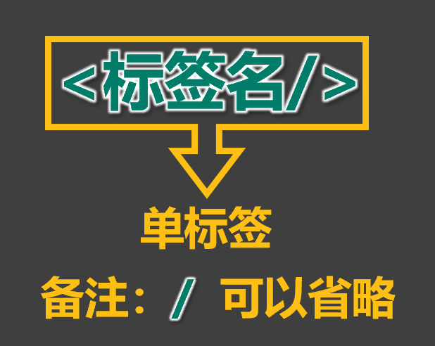
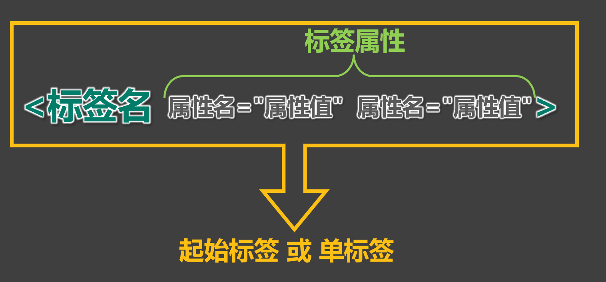
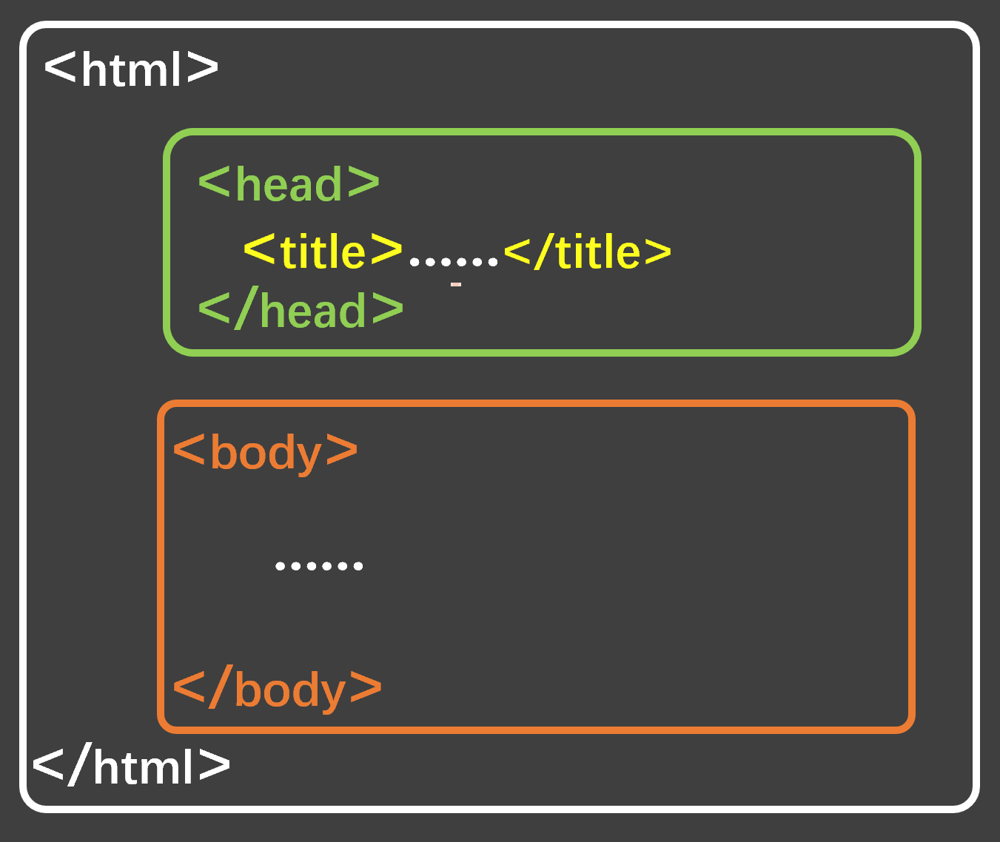
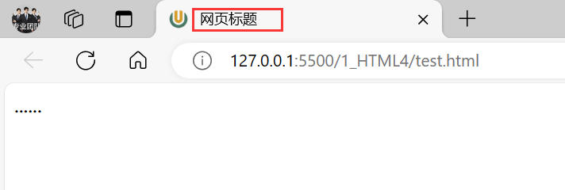
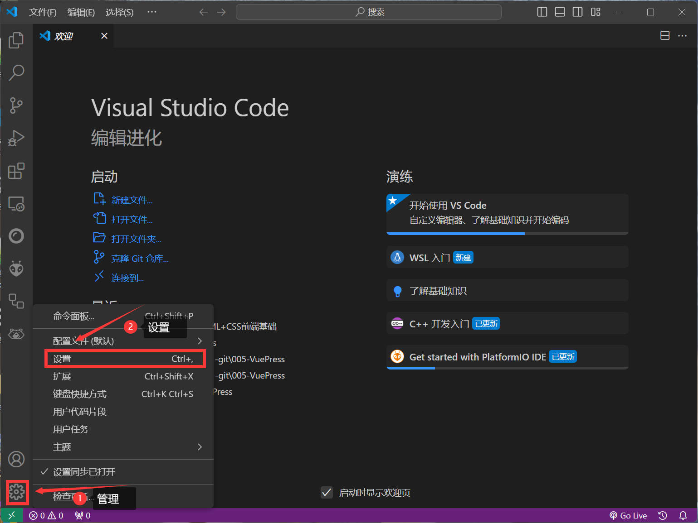
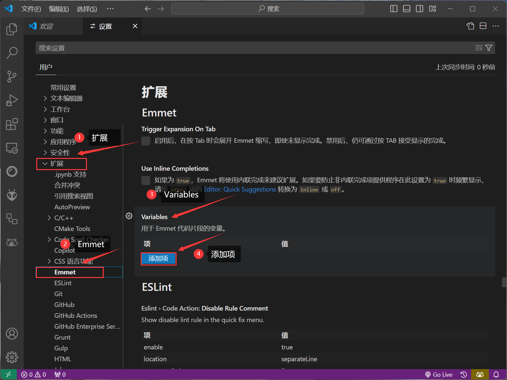
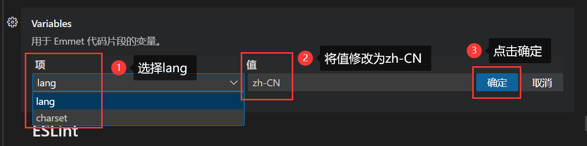
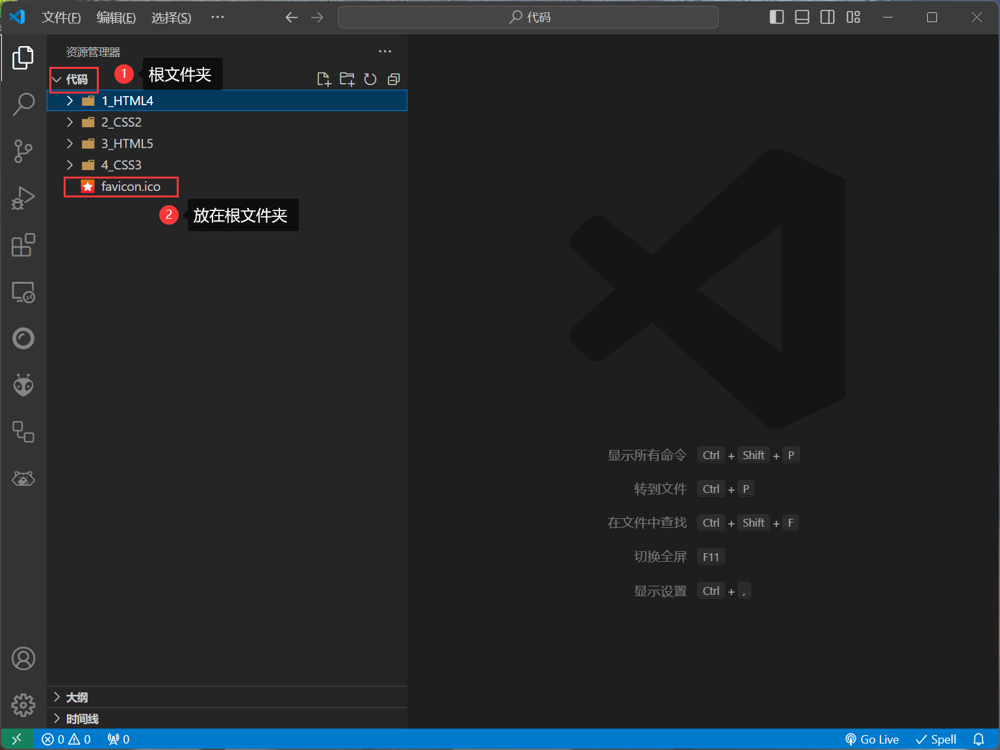
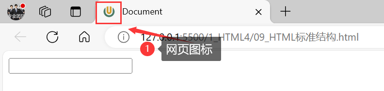

## 1. HTML 初体验

1. 第一步：鼠标右键 => 新建 => 文本文档 => 输入以下内容，并保存。

   ```html
   <marquee> 尚硅谷，让天下没有难学的技术！</marquee>
   ```

   ::: normal-demo 演示

   ```html
      <marquee> 尚硅谷，让天下没有难学的技术！</marquee>
   ```

   :::

2. 第二步：修改后缀为 <font color='#e96900'>.html</font> ，然后双击打开即可。

   > [!tip]
   >
   > 这里的后缀名，使用 <font color='#e96900'>.htm</font> 也可以，但推荐使用更标准的 <font color='#e96900'>.html</font> 。

3. 程序员写的叫 **源代码**，要交给浏览器进行渲染。

4. 借助浏览器看网页的 **源代码**，具体操作：

   > [!tip]
   >
   > 在网页空白处：鼠标右键 ==> 查看网页源代码

## 2. HTML 标签

1. **标签** 又称 **元素**，是HTML的基本组成单位。

2. 标签分为：**双标签** 与 **单标签** （绝大多数都是双标签）。

3. 标签名不区分大小写，但推荐小写，因为小写更规范。

4. 双标签：

   > [!tip]
   >
   > 
   >
   > 示例代码：
   >
   > ```html
   > <marquee> 尚硅谷，让天下没有难学的技术！</marquee>
   >    ```

5. 单标签：

    > [!tip]
    >
    > 
    >
    > ```html
    > <input>
    > ```
    >
    > ::: normal-demo 演示
    >
    > ```html
    > <input>
    > ```
    >
    > ::: 

6. 标签之间的关系：并列关系、嵌套关系，可以使用 **<font color='#e96900'>tab</font>** 键进行缩进：

    ```html
    <marquee>
        尚硅谷，让天下没有难学的技术！
        <input>
    </marquee>
    <input>
    ```

    :::normal-demo 演示

    ```html
    <marquee>
     尚硅谷，让天下没有难学的技术！
        <input>
    </marquee>
    <input>
    ```

    :::

## 3. HTML 标签属性

1. 用于给标签提供 **附加信息**。

2. 可以写在：**起始标签** 或 **单标签中**，形式如下：

   > [!tip]
   >
   > 
   >
   > 例如：
   >
   > ```html
   > <marquee loop="1" bgcolor="orange">尚硅谷，让天下没有难学的技术</marquee>
   > <input type="password">
   > ```
   >
   > :::normal-demo 演示
   >
   > ```html
   > <marquee loop="1" bgcolor="orange">尚硅谷，让天下没有难学的技术</marquee>
   > <input type="password">
   > ```
   >
   > :::

3. 有些特殊的属性，没有属性名，只有属性值，例如：

      ```html
      <input disabled>
      ```

      :::normal-demo 演示

      ```html
      <input disabled>
      ```

      :::
4. 注意点：

      > [!tip]
      >
      > 1. 不同的标签，有不同的属性；也有一些通用属性（在任何标签内都能写，后面会详细总结）。
      >
      > 2. 属性名、属性值不能乱写，都是W3C规定好的。
      >
      > 3. 属性名、属性值，都不区分大小写，但推荐小写。
      >
      > 4. 双引号，也可以写成单引号，甚至不写都行，但还是推荐写双引号。
      >
      > 5. 标签中不要出现同名属性，否则后写的会失效，例如：
      >
      >    ```html
      >    <input type="text" type="password">
      >    ```
      >
      >    :::normal-demo 演示
      >
      >    ```html
      >    <input type="text" type="password">
      >    ```
      >
      >    :::

## 4. HTML 基本结构

1. 在网页中，如何查看某段结构的具体代码？—— 点击鼠标右键，选择“检查”。

2. 【检查】 和 【查看网页源代码】的区别：

   > [!tip]
   >
   > 【查看网页源代码】看到的是：程序员编写的源代码。
   > 
   > 【检查】看到的是：经过浏览器 “处理” 后的源代码。
   > 
   > 【备注】：日常开发中，【检查】用的最多。

3. 网页的 基本结构 如下：

   > [!tip]
   >
   > 1. 想要呈现在网页中的内容写在 <font color='#e96900'>body </font>标签中。
   >
   > 2. <font color='#e96900'>head </font>标签中的内容不会出现在网页中。
   >
   > 3. <font color='#e96900'>head </font>标签中的 <font color='#e96900'>title </font>标签可以指定网页的标题。
   >
   > 4. 图示：
   >
   >    
   >
   > 5. 代码：
   >
   >    ```html
   >    <html>
   >        <head>
   >            <title>网页标题</title>
   >        </head>
   >        <body>
   >            ......
   >        </body>
   >    </html>
   >    ```
   >
   >    
   >
   >    :::normal-demo 演示
   >
   >    ```html
   >    <html>
   >        <head>
   >            <title>网页标题</title>
   >        </head>
   >        <body>
   >            ......
   >        </body>
   >    </html>
   >    ```
   >
   >    :::
   >
   >    

## 5. 安装 VSCode

1. 安装中文语言包。
2. 使用 VSCode打开文件夹的两种方式。
3. 调整字体大小。
4. 设置主题。
5. 安装图标主题： **<font color='#e96900'>vscode-icons</font>** 。

## 6. 安装 Live Server 插件

1. 可以更加方便的打开网页。
2. 打开网页的方式更贴近项目上线。
3. 代码出现改动后，可以自动刷新。
4. 根据自己的情况，去配置一下 VSCode 的自动保存

> [!tip]
>
> <font color='red'>注意1：务必使用VSCode打开的是文件夹，否则 Live Server 插件无法正常工作！</font>
>
> <font color='red'>注意2：打开的网页必须是标准的HTML结构，否则无法自动刷新！</font>

## 7. HTML 注释

1. 特点：注释的内容会被浏览器所忽略，不会呈现到页面中，但源代码中依然可见。

2. 作用：对代码进行解释和说明。

3. 写法：

   ```html
   <!-- 下面的文字只能滚动一次 -->
   <marquee loop="1">尚硅谷</marquee>
   
   <!-- 下面的文字可以无限滚动 -->
   <marquee>尚硅谷</marquee>
   ```

   :::normal-demo 演示

   ```html
   <!-- 下面的文字只能滚动一次 -->
   <marquee loop="1">尚硅谷</marquee>
   
   <!-- 下面的文字可以无限滚动 -->
   <marquee>尚硅谷</marquee>
   ```

   

   :::

4. 注释不可以嵌套，以下这么写是错的（反例）。

   ```html
   <!--
   	我是一段注释
   	<!-- 我是一段注释 -->
   -->
   ```

5. vscode注释快捷键 **Ctrl** + **/**

   > [!tip]
   >
   > 1. 单行注释：光标放在目标行，按下快捷键 **Ctrl** + **/** 
   > 2. 多行注释：选中需要注释的内容（行），按下快捷键 **Ctrl** + **/** 
   > 3. 对已注释的代码再次使用快捷键可取消注释

   

   

## 8. HTML 文档声明

1. 作用：告诉浏览器当前网页的版本。

2. 写法：

   - **旧写法**：要依网页所用的HTML版本而定，写法有很多

     > [!tip]
     >
     > 具体有哪些写法请参考 ： [W3C官网-文档声明](https://www.w3.org/QA/2002/04/valid-dtd-list.html)（了解即可，千万别背！）

   - **<font color='red'>新写法</font>** ：一切都变得简单了！W3C 推荐使用 HTML 5 的写法。

     ```html
        <!DOCTYPE html>
        <!-- 或 -->
        <!DOCTYPE HTML>
        <!-- 或 -->
        <!doctype html>
     ```

     

3. **注意**：文档声明，必须在网页的**第一行**，且在**html** 标签的外侧。

## 9. HTML 字符编码

1. 计算机对数据的操作：
    存储时，对数据进行：**编码**。
    读取时，对数据进行：**解码**。

2. 编码、解码，会遵循一定的规范 —— **字符集**。

3. 字符集有很多中，常见的有（了解）：

   > [!tip]
   >
   > 1. <font color='#e96900'>ASCII </font>：大写字母、小写字母、数字、一些符号，共计128个。
   > 2. <font color='#e96900'>ISO 8859-1</font> ：在 ASCII 基础上，扩充了一些希腊字符等，共计是256个。
   > 3. <font color='#e96900'>GB2312 </font>：继续扩充，收录了 6763 个常用汉字、682个字符。
   > 4. <font color='#e96900'>GBK </font>：收录了的汉字和符号达到 20000+ ，支持繁体中文。
   > 5. <font color='#e96900'>UTF-8</font> ：包含世界上所有语言的：所有文字与符号。—— 很常用。

4. 使用原则是怎样的？

   > [!tip]
   >
   > 原则1：存储时，务必采用<font color='red'>合适</font>的字符编码 。
   > <font color='red'>否则：无法存储，数据会丢失！</font>

   > [!tip]
   >
   > 原则2：存储时采用哪种方式编码 ，读取时就采用哪种方式解码。
   > <font color='red'>否则：数据错乱（乱码）！</font>

   > [!tip]
   >
   > 例如下面文字中，包含有：中文、英文、泰文、缅甸文
   >
   > ```
   > 我爱你
   > I love you!
   > ကdနမ် ကိL
   > ချစ်တယ်။
   > ```
   >
   > 若使用 **<font color='#e96900'>ISO8859-1</font>** 编码存储，在存入的那一刻，就出问题了，因为 **<font color='#e96900'>ISO8859-1</font>** 仅支持英文！
   > 为保证所有的输入，都能正常存储和读取，现在几乎全都采用 **<font color='#e96900'>UFT-8</font>** 编码。
   > 所以我们编写 html 文件时，也都统一用 **<font color='#e96900'>UFT-8</font>** 编码。

5. 总结：
   
   - 平时编写代码时，统一采用 **<font color='#e96900'>UTF-8</font>** 编码（最稳妥）。
   - 为了让浏览器在渲染 **<font color='#e96900'>html</font>** 文件时，不犯错误，可以通过  **<font color='#e96900'>meta</font>** 标签配合 **<font color='#e96900'>charset</font>** 属性指
     定字符编码。
   
   ```html
   <head>
       <meta charset="UTF-8"/>
   </head>
   ```

## 10. HTML 设置语言

1. 主要作用：
    
    - 让浏览器显示对应的翻译提示。
    - 有利于搜索引擎优化。
    
2. 具体写法：

    ```html
    <html lang="zh-CN"></html>
    ```
    
3. 扩展知识： <font color='#e96900'>lang</font> 属性的编写规则（作为一个课外扩展知识，了解即可）。

    > [!tip]
    >
    > 1. 第一种写法（ 语言-国家/地区 ），例如：
    > -  **<font color='#e96900'>zh-CN</font>** ：中文-中国大陆（简体中文）
    > -  **<font color='#e96900'>zh-TW</font>** ：中文-中国台湾（繁体中文）
    > -  **<font color='#e96900'>zh</font>** ：中文
    > -  **<font color='#e96900'>en-US</font>** ：英语-美国
    > -  **<font color='#e96900'>en-GB</font>** ：英语-英国
    > 2. 第二种写法（ 语言—具体种类）已不推荐使用，例如：
    > -  **<font color='#e96900'>zh-Hans</font>** ：中文—简体
    > - **<font color='#e96900'>zh-Hant</font>** ：中文—繁体
    > 3. W3School 上的说明：[HTML 语言代码参考手册](https://www.w3school.com.cn/tags/html_ref_language_codes.asp)、[HTML ISO 国家/地区代码参考手册](https://www.w3school.com.cn/tags/html_ref_country_codes.asp)
    > 4. W3C官网上的说明： [Language tags in HTML and XML](https://www.w3.org/International/articles/language-tags/)

## 11. HTML标准结构

1. HTML标准结构如下：

   ```html
   <!DOCTYPE html>
   <html lang="zh-CN">
       <head>
           <meta charset="UTF-8">
           <title>我是一个标题</title>
           <body>
               
           </body>
       </head>
   </html>
   ```

2. 输入 **!** ，随后回车即可快速生成标准结构。

   ```html
   <!DOCTYPE html>
   <html lang="en">
   <head>
       <meta charset="UTF-8">
       <meta name="viewport" content="width=device-width, initial-scale=1.0">
       <title>Document</title>
   </head>
   <body>
       
   </body>
   </html>
   ```

   > [!tip]
   >
   > 1. 生成的结构中，有一个<font color='#e96900'>meta</font>标签，我们暂时用不到，可以先删掉。
   >
   > 2. <font color='#e96900'>vscode</font> 删除快捷键：**<font color='#e96900'>Ctrl + Shift + k</font>** 
   >
   >    <font color='#e96900'>单行删除</font>：光标放在目标行，按下快捷键 <font color='#e96900'>**Ctrl + Shift + k** </font>
   >
   >    <font color='#e96900'>多行删除</font>：选中需要注释的内容（行），按下快捷键 <font color='#e96900'>**Ctrl + Shift + k** </font>

   

   ```html
   <!DOCTYPE html>
   <html lang="en">
   <head>
       <meta charset="UTF-8">
       <title>Document</title>
   </head>
   <body>
       
   </body>
   </html>
   ```

3. 配置 **<font color='#e96900'>VScode</font>** 的内置插件 **<font color='#e96900'>Emmet</font>** ，可以对生成结构的属性进行定制。

   修改自动生成标准结构的 <font color='#e96900'>lang </font>默认值

   vscode => 管理 => 设置 => 扩展 => Emmet => Variables => 添加项 => 选择lang项 => 将值修改为zh-CN => 点击确定

   
   
   
   
   
   
   测试
   
   ```html
   <!DOCTYPE html>
   <html lang="zh-CN">
   <head>
       <meta charset="UTF-8">
       <meta name="viewport" content="width=device-width, initial-scale=1.0">
       <title>Document</title>
   </head>
   <body>
       
   </body>
   </html>
   ```
   
   


4. 在存放代码的文件夹中，存放一个 **<font color='#e96900'>favicon.ico</font>** 图片，可配置网站图标。

   > [!tip]
   >
   > vscode打开哪个文件夹，就把 **<font color='#e96900'>favicon.ico</font>** 图片放在这个文件夹
   >
   > 示例：
   >
   > 
   >
   > 效果：
   >
   > 
