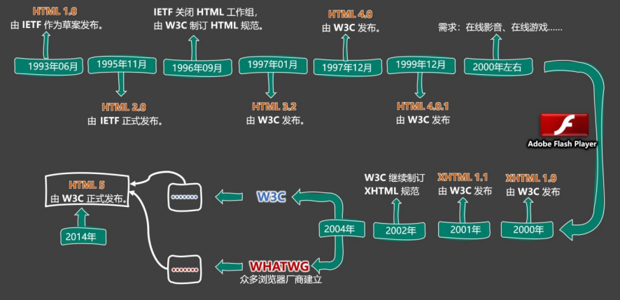

## **1.什么是 HTML？**

全称：HyperText Markup Language（超文本标记语言）。

> [!tip]
> 超文本：暂且简单理解为 “超级的文本”，和普通文本比，内容更丰富。
> 标 记：文本要变成超文本，就需要用到各种标记符号。
> 语 言：每一个标记的写法、读音、使用规则，组成了一个标记语言。

## 2. 相关国际组织（了解）

**1. IETF**

> [!tip]
>
> 全称：Internet Engineering Task Force（国际互联网工程任务组），成立于1985年底，是一个权威
>
> 的互联网技术标准化组织，主要负责互联网相关技术规范的研发和制定，当前绝大多数国际互联网
>
> 技术标准均出自IETF。官网：**https://www.ietf.org**

**2. W3C**

> [!tip]
>
> 全称：World Wide Web Consortium（万维网联盟），创建于1994年，是目前Web技术领域，最具影
>
> 响力的技术标准机构。共计发布了200多项技术标准和实施指南，对互联网技术的发展和应用起到
>
> 了基础性和根本性的支撑作用，官网：**https://www.w3.org**

**3. WHATWF**

> [!tip]
>
> 全称：Web Hypertext Application Technology Working Group（网页超文本应用技术工作小组）成立
>
> 于2004年，是一个以推动网络HTML 5 标准为目的而成立的组织。由Opera、Mozilla基金会、苹果，
>
> 等这些浏览器厂商组成。官网：**https://whatwg.org/**

## 3. HTML 发展历史（了解）

从 HTML 1.0 开始发展，期间经历了很多版本，目前HTML的最新标准是：HMTL 5，具体发展史如图（了解即可）。

