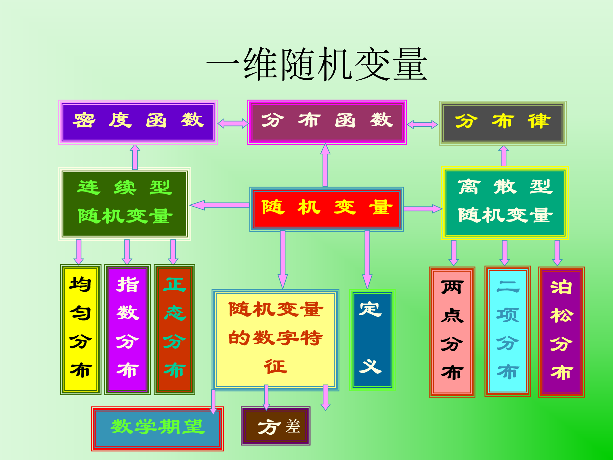
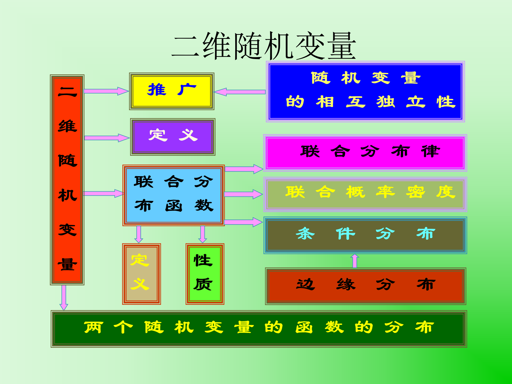

## 引例

在相同条件下相互独立地进行 **5** 次射击,每次射击时击中目标的概率为 **0.6** , 求击中 **3** 次的概率。

> [!tip]
>
> **X** 表示击中目标的次数.
>
> | X     | 0         | 1                       | 2                         | 3                         | 4                       | 5        |
> | ----- | --------- | ----------------------- | ------------------------- | ------------------------- | ----------------------- | -------- |
> | $P_k$ | $(0.4)^5$ | $C_5^1 0.6 \cdot 0.4^4$ | $C_5^2 0.6^2 \cdot 0.4^3$ | $C_5^3 0.6^3 \cdot 0.4^2$ | $C_5^4 0.6^4 \cdot 0.4$ | $ 0.6^5$ |

## 一维随机变量

> [!tip]
>
> 

## 二维随机变量

> [!tip]
>
> 

## 随机试验：

可重复、可预见、不确定

## 样本空间：

随机试验所有可能结果的集合 $\Omega$

## 样本点：

基本事件 $e \in \Omega$

## 事件：

$A \subseteq \Omega$ 

## 必然事件：

$\Omega$

## 不可能事件：

$\varnothing$

## 事件运算：

并、交、差、（上、下）极限

## 定义1.1 $\sigma$-代数(事件域)

集合 $\Omega$ 的某些子集组成集合族 $\mathcal{F}$

（1）$\Omega \in \mathcal{F} $  （必然事件）

（2）若 $A \in F$ , 则 $\Omega \ \text{\\} \ A \in \mathcal{F}$ （对立事件）

（3）若 $A_i \in \mathcal{F}, i=1,2 \dots，$ 则  $\displaystyle \bigcup_{i=1}^{\infty}A_i \in \mathcal{F}$ （可列并事件） 

称 $\mathcal{F}$ 为 $\sigma$ - 代数，$(\Omega, \mathcal{F})$ 为 **可测空间** 

### 例：投掷一次骰子试验

> [!tip]
>
> $e_i$ 表示出现 $i$ 点，
> $$
> \Omega = \{ e_1, e_2, e_3, e_4, e_5, e_6 \}
> $$
>
> $$
> \mathcal{F} = \{ \varnothing, \{ e_1, e_2, e_3 \}, \{ e_4, e_5, e_6 \} , \Omega \}
> $$
>
> 称 $\mathcal{F}$ 为 $\sigma$ - 代数，$(\Omega, \mathcal{F})$ 为 **可测空间** 

###    例：连续投掷两次硬币试验

> [!tip]
>
> $\Omega$ = {正正，正反，反正，反反}
>
> F1 ={ $\varnothing$ ，{正正}， {正反，反正，反反}， $\Omega$ } 
>
> F2 ={ $\varnothing$ ，{正正}，{正反}，{正正，正反}，  {反正，反反}，{正反，反正，反反}， {正正，反正，反反} ，{正正，正反，反正，反反}}
>
> F3 ={ $\varnothing$ ，{反正}，{反反}， {反正，反反}， {正正，正反}，{正正，正反，反反}， {正正，正反，反正} ，{正正，正反，反正，反反}}
>
> F4 ={ $\varnothing$ ，{正反}， {正正，反正，反反} ，$\Omega$ }
>
> $\mathcal{F}_i$ 为 $\sigma$ - 代数， $(\Omega, \mathcal{F_i})$ 为可测空间
>
> $\mathcal{F}$ ={ $\varnothing$，{正正}，{正反}，{反正}，{反反}， {正正，正反}，{正正，反正}，{正正，反反}，{正反，反正}，{正反，反反}，{反正，反反}，{正正，正反，反正}，{正正，正反，反反}，{正正，反正，反反}，{正反，反正，反反}，{正正，正反，反正，反反}} 为  $\sigma$ - 代数。
>
> $(\Omega, \mathcal{F})$ 为 **可测空间** 。

### 可测空间的性质

设 $(\Omega , \mathcal{F})$ 为可测空间,则

（4）$\varnothing \in \mathcal{F}$ （不可能事件）

（5）若 $A, B \in \mathcal{F}$ ,则 $A \text{\\} B \in F $（差事件）

（6）若 $A_i \in \mathcal{F}$ ,则 $\displaystyle \bigcup_{i=1}^{n}A_i, \ \displaystyle \bigcap_{i=1}^{n}A_i , \ \displaystyle \bigcap_{i=1}^{\infty}A_i \in \mathcal{F}$ 

​	（有限并，有限交，可列交事件）

## 定义1.2概率空间：

设 $(\Omega, \mathcal{F})$ 为可测空间,  映射 $P$ ： $\mathcal{F} \rightarrow R, A \rightarrow P(A)$ 满足

(1) 任意 $A \in \mathcal{F}, 0 \leq P(A) \leq 1 $ 

(2) $P(\Omega) = 1$

(3)  $P \left( \displaystyle \bigcup_{i=1}^{\infty}A_i \right) = \displaystyle \sum_{i=1}^{\infty}P(A_i), (A_i \cap A_j = \varnothing, i \neq j)$

称 $P$ 是 $(\Omega, \mathcal{F})$ 上的 **概率** ，$(\Omega, \mathcal{F}, P)$ 为 **概率空间** ， $P(A)$ 为事件 $A$ 的概率。

### 概率空间的性质

设 $(\Omega, \mathcal{F}, P)$ 为 **概率空间** ，则

(4) $P(\varnothing) = 0$

(5) $P(B \text{\\} A) = P(B)-P(A), (A \subseteq B)$

(6) $\begin{equation}
\displaystyle \lim_{n \rightarrow \infty} P(A_n) \left\{
\begin{aligned}
P \left( \displaystyle \bigcup_{n=1}^{\infty} A_n \right), A_1 \subseteq A_2 \subseteq A_3 \dots \subseteq A_n \\[5mm]
P \left( \displaystyle \bigcap_{n=1}^{\infty} A_n \right), A_1 \supseteq A_2 \supseteq A_3 \dots \supseteq A_n  \\
\end{aligned}
\right.
\end{equation}
$ 

## 乘法公式和全概率公式

### 乘法公式：

$$
P(AB) = P(B \mid A)P(A)
$$

### 全概率公式：

$$
\begin{aligned}
P(B) &= P(BA_1) + P(BA_2) + \dots \\
	 &= P(B \mid A_1)P(A_1) + P(B \mid A_2)P(A_2) + \dots \\
\end{aligned}
$$

​		     其中 $A_1, A_2 \dots$ 为完备事件族

### 练习

袋中有2个红球，3个白球，从中不放回的接连取出两个球。

求第二次取出红球的概率。

> [!tip]
>
> 解：设 $A_1$ 表示第一次取出红球， $A2$ 表示第一次取出白球， $B$ 表示第二次取出红球。
>
> 那么
> $$
> \begin{align}
> P(B) &= P(BA_1)+ P(BA_2) \\[5mm]
> 	 &= P(B|A_1)P(A_1)+ P(B|A_2)P(A_2) \\[5mm]
> 	 &= \frac{1}{4} * \frac{2}{5} + \frac{2}{4} * \frac{3}{5} \\[5mm]
> 	 &= \frac{2}{5}
> \end{align}
> $$

## 独立事件

设 $(\Omega, \mathcal{F}, P)$ 为概率空间， $\mathcal{F_1} \subseteq \mathcal{F}$ ，若对任意 $A_1, A_2, \dots, A_n \in \mathcal{F_1}, n=2, 3, \dots ,$ ，有 
$$
P \left(  \right)
$$

则称F1为独立事件族,或称F1中的事件相互独立。                     事件A, B独立，有                      P(AB)=P(A)P(B)

## 随机实验

**三个特性** ：

1. 可以在相同的条件下重复进行。
2. 每次实验的结果不止一个，但预先知道实验的所有可能的结果。
3. 每次实验前不能确定哪个结果会出现。

## 样本空间（或基本事件空间）

**定义** ：随机实验所有可能结果组成的集合。

**符号** ：

## 样本点（或基本事件）

**定义** ：样本空间（）中的元素 e 。

## 事件

**定义** ：样本空间（）的子集A

## 必然事件

**定义** ：样本空间（）称为必然事件。

## 不可能事件

**定义** ：空集（）称为不可能事件。

## 定义 1. 1 是一个集合， 是 的某些子集组成的集合族．

如果：

1. 

