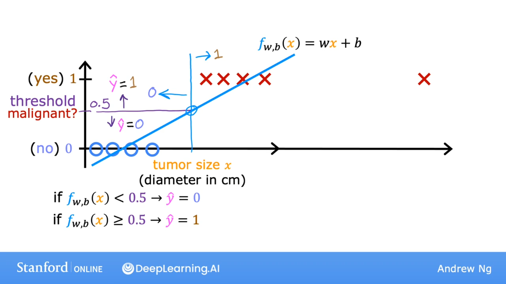
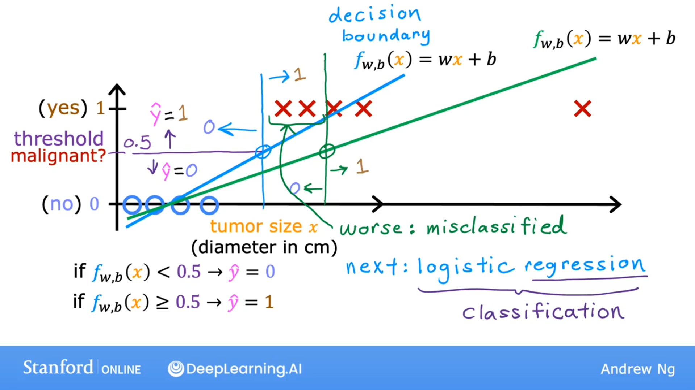

## 分类

事实证明，线性回归对于分类问题不是一个好的算法。

It turns out that linear regression is not a good algorithm for classification problems.

为什么？

## 如何构建分类算法？

how do you build a classification algorithm?

## 线性回归

Linear regression

线性回归不仅可以预测值为0和1的数据，还可以预测介于0和1之间的所有数值，甚至是小于0或大于1的数值。
但是在这里，我们想要预测的是类别。
你可以尝试设定一个阈值，比如0.5。如果模型输出的值低于0.5，那么你就预测Y等于0或非恶性。如果模型输出的值等于或大于0.5，那么你就预测Y等于1或恶性。

Linear regression predicts not just the values zero and one. But all numbers between zero and one or even less than zero or greater than one.

But here we want to predict categories. 

One thing you could try is to pick a threshold of say 0.5. So that if the model outputs a value below 0.5, then you predict why equal zero or not malignant. And if the model outputs a number equal to or greater than 0.5, then predict Y equals one or malignant.

请注意，0.5 这个阈值在这一点与最佳拟合直线相交。

因此，如果在此处绘制这条垂直线，那么左边的所有内容最终会得到 y 等于 0 的预测结果。而右边的所有内容最终会得到 y 等于 1 的预测结果。

就这个特定的数据集而言，线性回归看起来能够做出合理的预测。

Notice that this threshold value of 0.5 intersects the best fit straight line at this point. 

So if you draw this vertical line here, everything to the left ends up with a prediction of y equals zero. And everything on the right ends up with the prediction of y equals one. 

Now, for this particular data set it looks like linear regression could do something reasonable. 

就这个特定的数据集而言，线性回归看起来能够做出合理的预测。但现在让我们看看，如果您的数据集再增加一个训练示例会怎样。就是这边右侧的这一个。

让我们也延长水平轴。请注意，这个训练示例实际上不应改变您对数据点的分类方式。我们刚刚绘制的这条垂直分界线仍然合理，作为分割线，小于此值的肿瘤应分类为 0，大于此值的肿瘤应分类为 1。

但一旦在右侧添加了这个额外的训练示例，线性回归的最佳拟合线就会像这样偏移。并且如果您继续使用 0.5 的阈值，现在您会注意到，此点左侧的所有内容都被预测为 0（非恶性）。而此点右侧的所有内容都被预测为 1（恶性）。

这并非我们所期望的，因为在右侧添加这个示例不应改变我们关于如何区分恶性肿瘤和良性肿瘤的任何结论。但如果您尝试使用线性回归来处理，添加这个看似不应产生任何变化的示例。结果我们学到了更糟糕的分类问题的函数。

But now let's see what happens if your dataset has one more training example. This one way over here on the right. 

Let's also extend the horizontal axis. Notice that this training example shouldn't really change how you classify the data points. This vertical dividing line that we drew just now still makes sense as the cut off where tumors smaller than this should be classified as zero. And tumors greater than this should be classified as one. 

But once you've added this extra training example on the right. The best fit line for linear regression will shift over like this. And if you continue using the threshold of 0.5, you now notice that everything to the left of this point is predicted at zero non malignant. And everything to the right of this point is predicted to be one or malignant. 

This isn't what we want because adding that example way to the right shouldn't change any of our conclusions about how to
classify malignant versus benign tumors. But if you try to do this with linear regression, adding this one example which feels like it shouldn't be changing anything. It ends up with us learning a much worse function for this classification problem.

