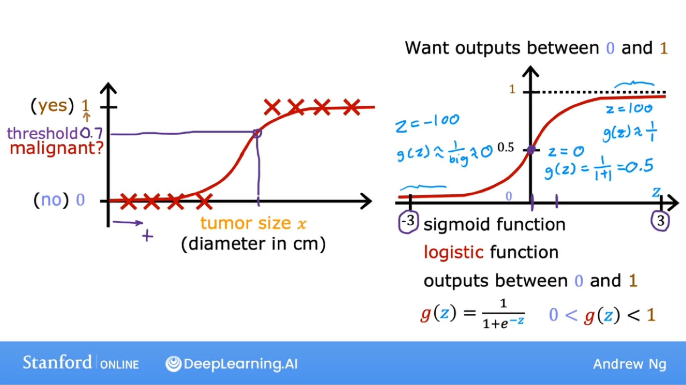
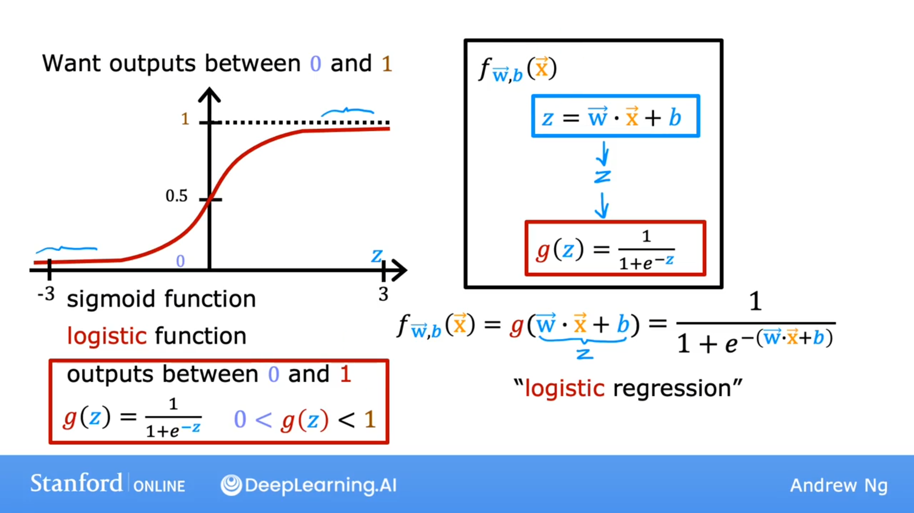
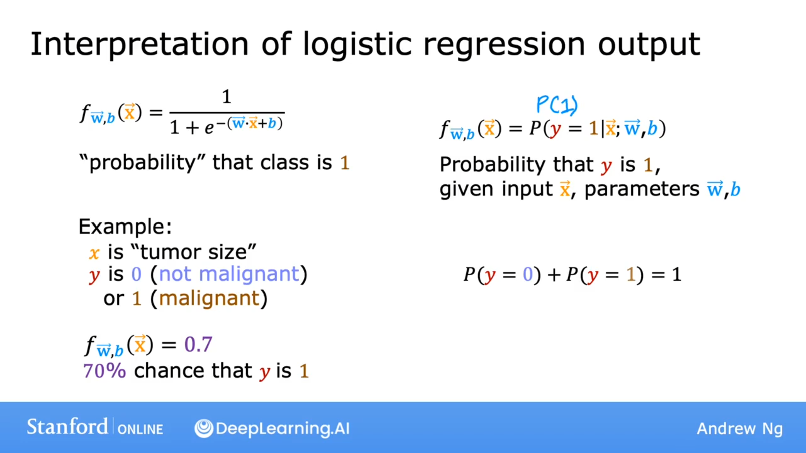

## 逻辑回归

In contrast, what logistic regression we end up doing is fit a curve that looks like this, S-shaped curve to this dataset.

相比之下，逻辑回归拟合的曲线是这个数据集的s形曲线。

For this example, if a patient comes in with a tumor of this size, which I'm showing on the x-axis, then the algorithm will output 0.7 suggesting that is closer or maybe more likely to be malignant and benign. Will say more later what 0.7 actually means in this context. 

But the output label y is never 0.7 is only ever 0 or 1.

举个例子，如果一个病人带着这么大的肿瘤进来，就是我在x轴上展示的，那么这个算法将输出0.7，表明更接近或更可能是恶性和良性。稍后我会详细说明0.7在这种情况下的实际含义。

但是输出标签y从来不是0.7只有0或1。

## Sigmoid函数

To build out to the logistic regression algorithm, there's an important mathematical function I like to describe which is called the Sigmoid function, sometimes also referred to as the logistic function. 

为了构建逻辑回归算法，我想描述一个重要的数学函数它被称为Sigmoid函数，有时也被称为逻辑函数。

$$
g(z) = \frac{1}{1+e^{-z}},0<g(z)<1
$$

### 为什么 0<g(z)<1? 

当 z = 100时：
$$
g(z) \approx \frac{1}{1}
$$
当 z = -100时：
$$
g(z) \approx \frac{1}{\infty} \approx 0
$$
当 z = 0时：
$$
g(z) = \frac{1}{2} = 0.5
$$

## 构建逻辑回归模型

1. z
   $$
   z = \vec{w} \cdot \vec{x} + b
   $$

2. g(z)
   $$
   g(z) = \frac{1}{1+e^{-z}}
   $$

3. f函数
   $$
   f_{\vec{w}, b}(\vec{x})=g(\vec{w} \cdot \vec{x}+b) = \frac{1}{1+e^{-(\vec{w} \cdot \vec{x} + b)}}
   $$

## 逻辑回归输出的解释

$$
f_{\vec{w}, b}(\vec{x}) = \frac{1}{1+e^{-(\vec{w} \cdot \vec{x} + b)}}
$$
类别是1的概率。
$$
f_{\vec{w}, b}(\vec{x}) = 0.7
$$

y 有 70% 的概率是1。
$$
p(y=0)+p(y=1) = 1
$$
