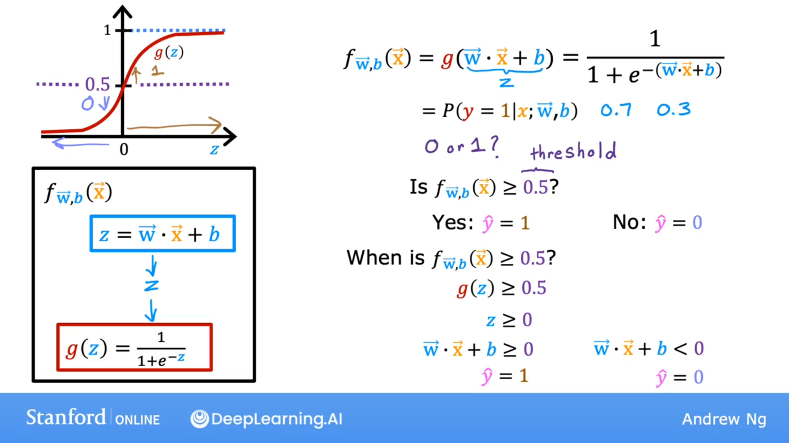
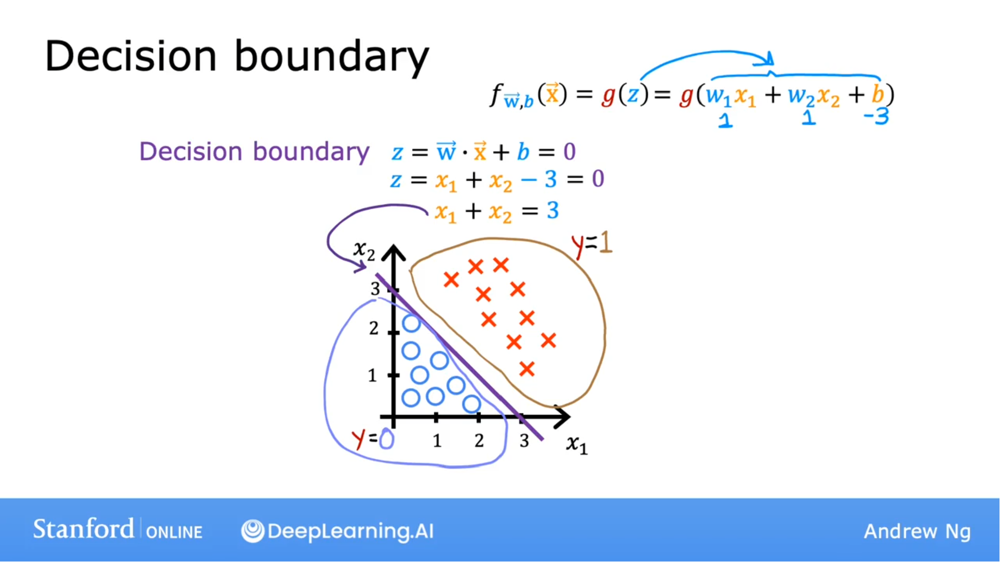
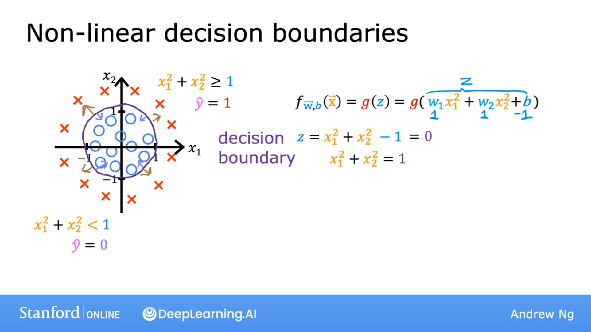
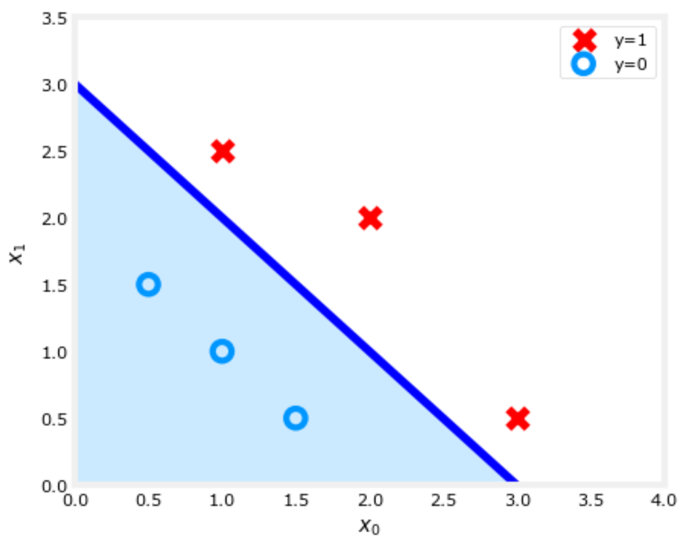

## 常见的阈值 0.5

### 何时 f 大于 0.5？

$$
f_{\vec{w},b}(\vec{x}) = g(\vec{w} \cdot \vec{x}+b)=\frac{1}{1+e^{-(\vec{w} \cdot \vec{x}+b)}}
$$

$$
f_{\vec{w},b}(\vec{x}) \geq 0.5
$$

$$
g(z) \geq 0.5
$$

$$
z \geq 0
$$

$$
\vec{w} \cdot \vec{x} + b \geq 0
$$

此时：
$$
\hat{y} = 1
$$

### 何时 f 小于0.5？

$$
\vec{w} \cdot \vec{x} + b < 0
$$

此时：
$$
\hat{y} = 0
$$
## 决策边界可视化

$$
f_{\vec{w},b}(\vec{x}) = g(z)=g(w_1x_1 + w_2x_2 + b)
$$

### 决策边界：

假设 
$$
w_1 = 1, w_2 = 1, b = -3 
$$

$$
z = \vec{w} \cdot \vec{x} + b = 0
$$

$$
z = x_1 + x_2 -3 = 0
$$

则决策边界线是：

$$
x_1 + x_2 = 3
$$

## 非线性的决策边线

$$
f_{\vec{w},b}(\vec{x}) = g(z) = g(w_1x_1^2 + w_2x_2^2 + b)
$$
假设：
$$
w_1 = 1, w_2 = 2, b = -1
$$

### 决策边界

$$
z = x_1^2 + x_2^2 - 1 = 0
$$

$$
x_1^1 + x_2^2 = 1
$$

实验：

