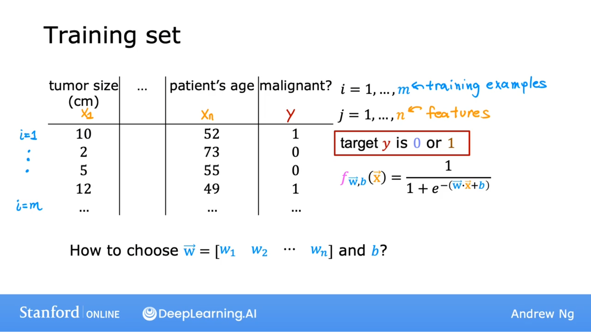
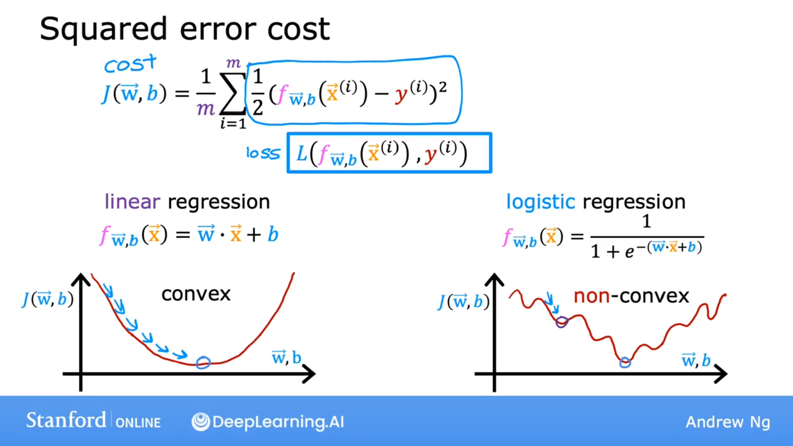
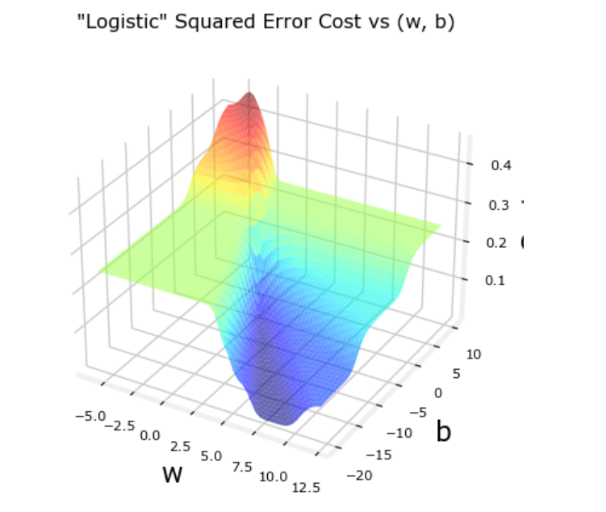
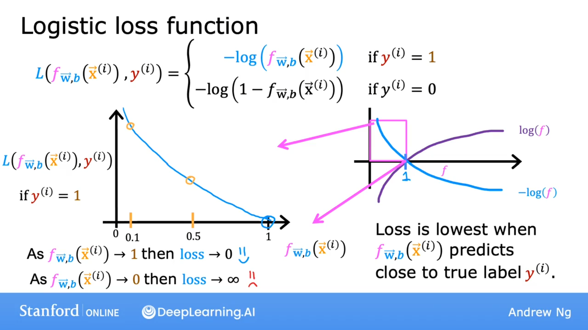
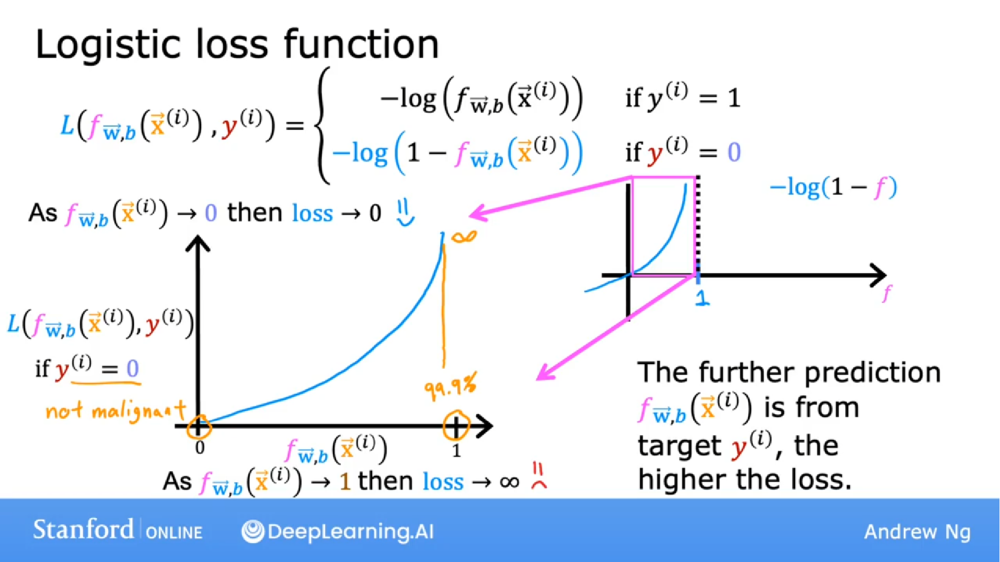
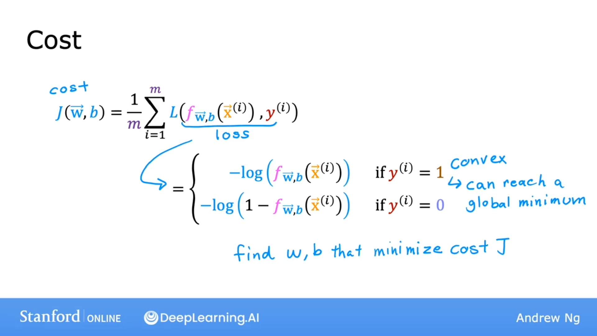

## 训练集

## 怎么选择w,b?

### 平方误差成本

### 成本函数

$$
J(\vec{w}, b) = \frac{1}{m}\displaystyle \sum^{m}_{i = 0}{\frac{1}{2}}(f_{\vec{w},b}(\vec{x}^{(i)}) - y^{(i)})
$$

该成本函数并不是一个好的选择。

### 逻辑损失函数

$$
\begin{equation}
L(f_{\vec{w}, b}(\vec{x}^{(i)}, y^{(i)})=\left\{
\begin{aligned}
-\log(f_{\vec{w}, b}(\vec{x}^{(i)})) & \quad \text{当 } y^{(i)} = 1\\ 
-\log(1-f_{\vec{w}, b}(\vec{x}^{(i)})) & \quad \text{当 } y^{(i)} = 0\\
\end{aligned}
\right.
\end{equation}
$$

#### 为什么起作用？

