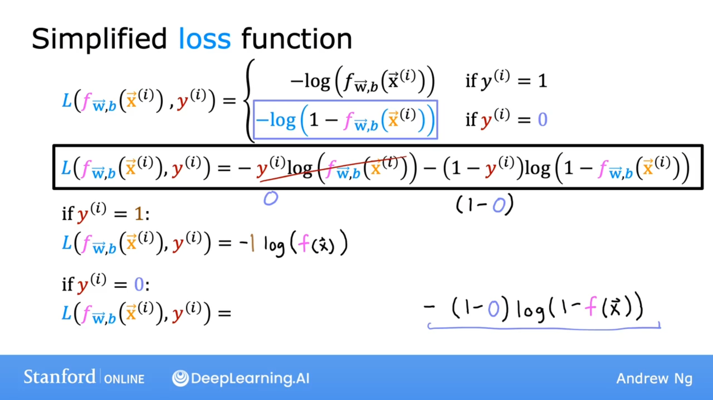
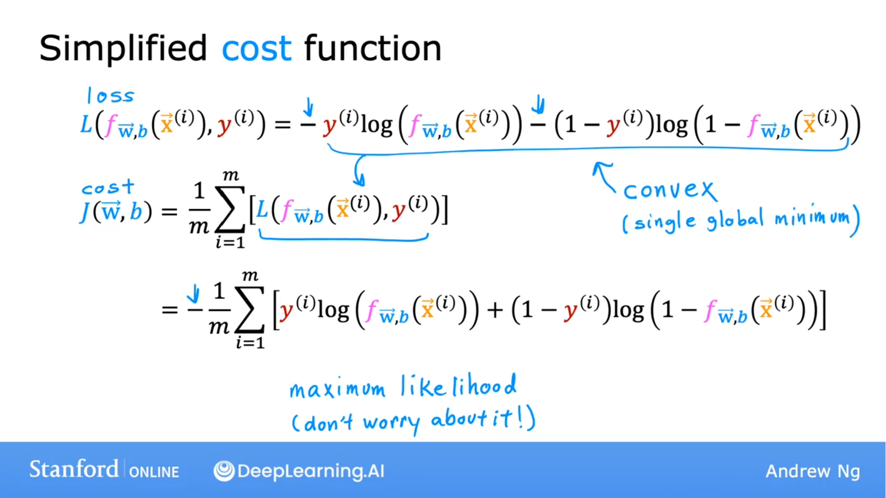

## 简化损失函数

$$
\begin{equation}
L(f_{\vec{w}, b}(\vec{x}^{(i)}, y^{(i)})=\left\{
\begin{aligned}
-\log(f_{\vec{w}, b}(\vec{x}^{(i)})) & \quad \text{当 } y^{(i)} = 1\\ 
-\log(1-f_{\vec{w}, b}(\vec{x}^{(i)})) & \quad \text{当 } y^{(i)} = 0\\
\end{aligned}
\right.
\end{equation}
$$

$$
L(f_{\vec{w}, b}(\vec{x}^{(i)}, y^{(i)}) = -y^{(i)}\log(f_{\vec{w},b}(x^{(i)}))-(1-y^{(i)})\log(1-f_{\vec{w}, b}(\vec{x}^{(i)}))
$$

### 为什么可以这样简化？

如果 
$$
y^{(i)} = 1
$$
则：
$$
1-y^{(i)} = 0
$$

$$
L(f_{\vec{w}, b}(\vec{x}^{(i)}, y^{(i)})=-\log(f_{\vec{w}, b}(\vec{x}^{(i)}))
$$

如果
$$
y^{(i)} = 0
$$
前项消失，则：
$$
L(f_{\vec{w}, b}(\vec{x}^{(i)}, y^{(i)})=-\log(1-f_{\vec{w}, b}(\vec{x}^{(i)}))
$$

### 简化的成本函数

$$
L(f_{\vec{w}, b}(\vec{x}^{(i)}, y^{(i)}) = -y^{(i)}\log(f_{\vec{w},b}(x^{(i)}))-(1-y^{(i)})\log(1-f_{\vec{w}, b}(\vec{x}^{(i)}))
$$

$$
J(\vec{w}, b) = \frac{1}{m}\displaystyle \sum^{m}_{i=1}[L(f_{\vec{w},b}(\vec{x}^{(i)}), y^{(i)}] 
$$

$$
= - \frac{1}{m} \displaystyle \sum^{m}_{i=1}[ y^{(i)}\log(f_{\vec{w},b}(x^{(i)}))+(1-y^{(i)})\log(1-f_{\vec{w}, b}(\vec{x}^{(i)}))]
$$

