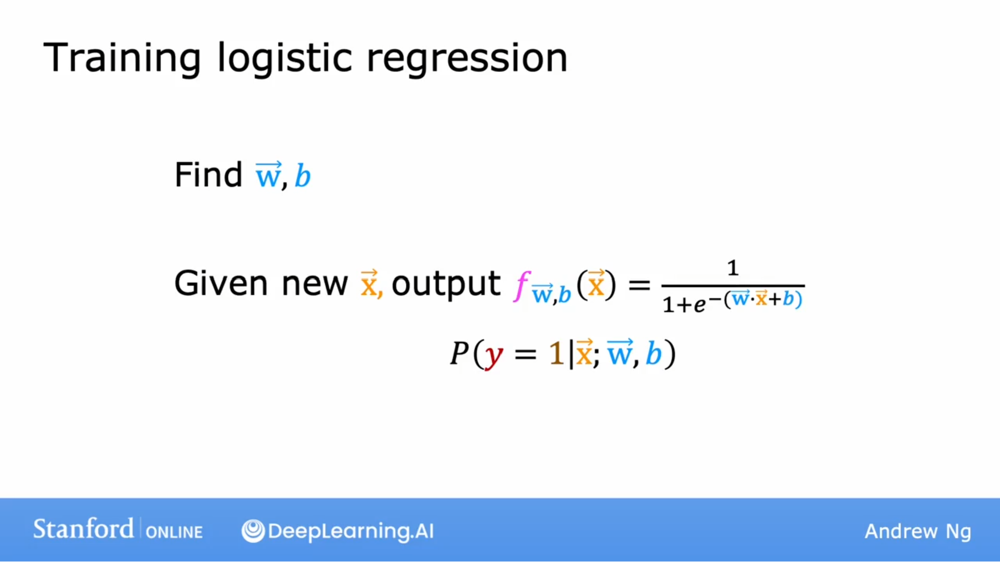
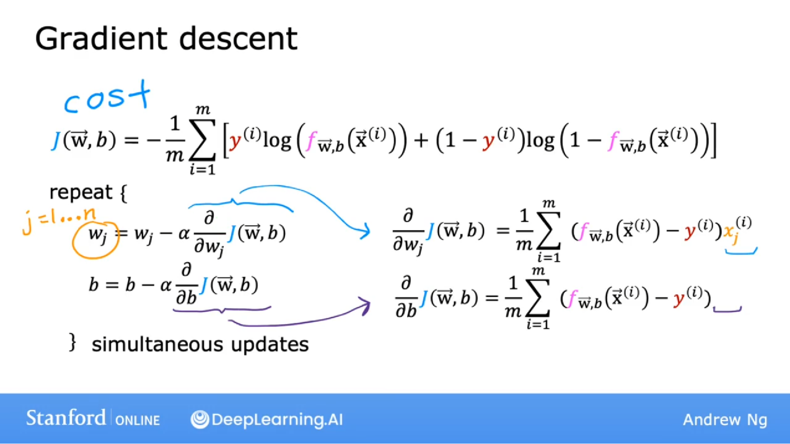
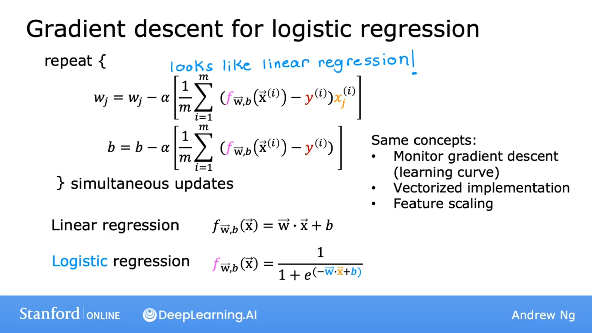

## 训练逻辑回归

找到
$$
\vec{w}, b
$$
给一个新的
$$
\vec{x}
$$
输出
$$
f_{\vec{w}, b}(\vec{x}) = \frac{1}{1 + e^{-(\vec{w} \cdot \vec{x} + b)}}
$$
预测概率：
$$
p(y = 1 \mid \vec{x};\vec{w},b)
$$

## 梯度下降

成本函数
$$
J(\vec{w},b) = - \frac{1}{m} \displaystyle \sum^{m}_{i=1}[ y^{(i)}\log(f_{\vec{w},b}(x^{(i)}))+(1-y^{(i)})\log(1-f_{\vec{w}, b}(\vec{x}^{(i)}))]
$$
梯度下降：
$$
w_j = w_j - \alpha \frac{\partial}{\partial w_j}J(\vec{w}, b)
$$

$$
b = b - \alpha \frac{\partial}{\partial b}J(\vec{w}, b)
$$

注意也要同时更新w,b

其中
$$
\frac{\partial}{\partial w_j}J(\vec{w}, b) = \frac{1}{m} \displaystyle \sum^{m}_{i=1}(f_{\vec{w}, b}(\vec{x}^{(i)}-y^{(i)})x_j^{(i)}
$$

$$
\frac{\partial}{\partial b}J(\vec{w}, b) = \frac{1}{m} \displaystyle \sum^{m}_{i=1}(f_{\vec{w}, b}(\vec{x}^{(i)}-y^{(i)})
$$

线性回归：
$$
f_{\vec{w}, b}(x) = \vec{w} \cdot \vec{x} + b
$$
逻辑回归：
$$
f_{\vec{w}, b}(\vec{x}) = \frac{1}{1 + e^{(-\vec{w} \cdot \vec{x} + b)}}
$$
