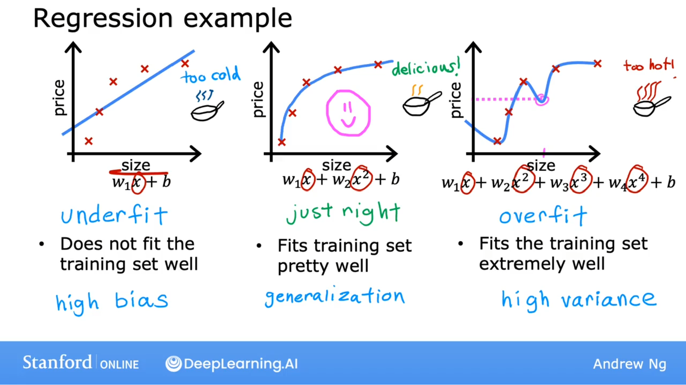
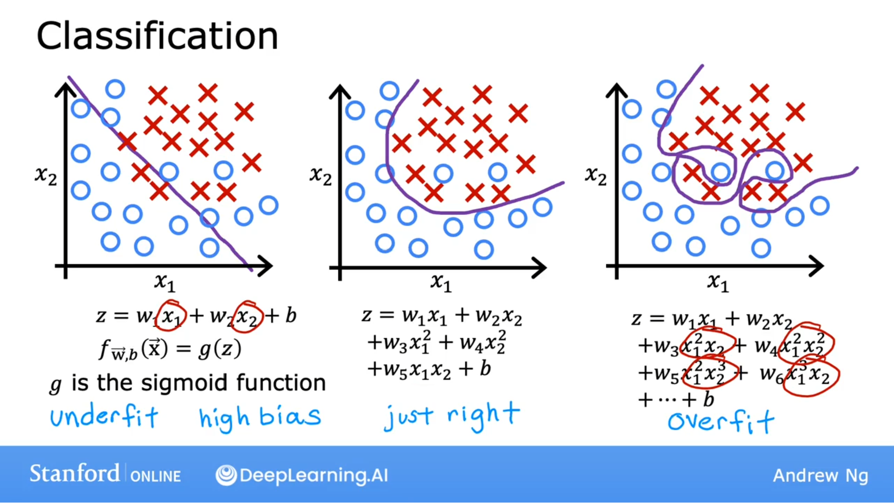

## 什么是过拟合？

欠拟合：高的偏差。这种认为数据是线性的先入之见，导致它拟合了一条与数据拟合不佳的直线，从而导致数据欠拟合。特征太少也会导致。

正常拟合：泛化能力强

过拟合：拟合训练集非常好，算法具有高方差，泛化能力差。如果两个不同机器学习的工程师要拟合这个四阶多项式模型，只是稍微不同的数据集，他们就不会得到完全不同的预测或高度可变的预测。这就是为什么我们说该算法具有高方差。

## 过拟合也适用于分类算法

