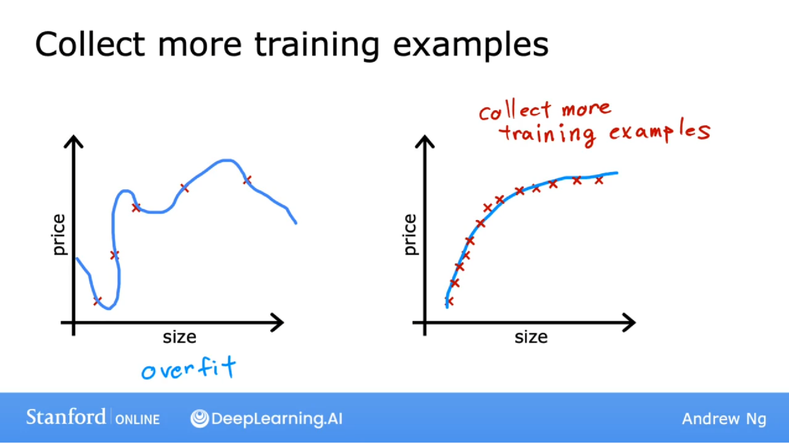
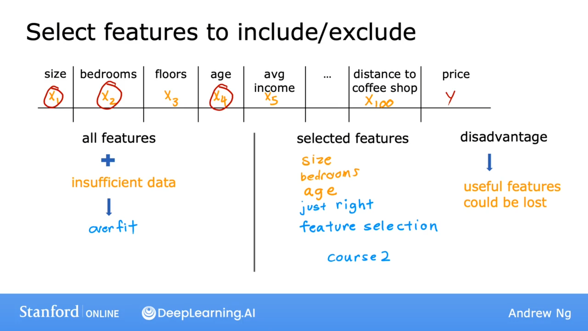
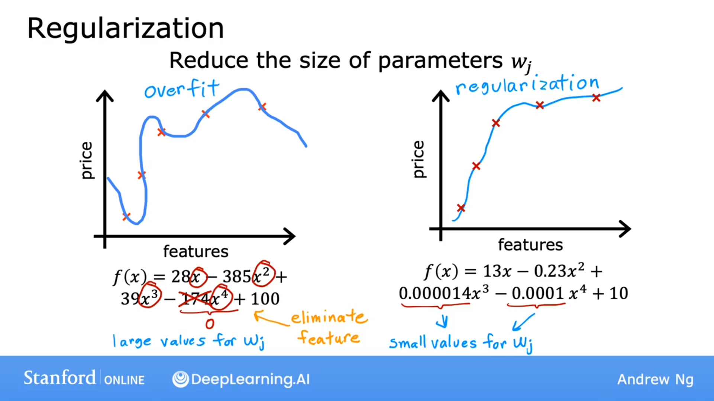
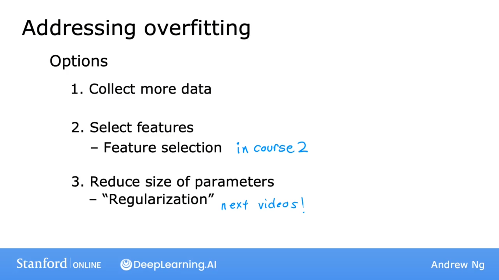

## 收集更多的训练数据

## 使用更少的特征

所有的特征 + 不足的数据 → 过拟合

选择特征  +    同样的数据 → 正常拟合

缺点：有用的特征可能被丢弃。

## 正则化

正则化保留所有的特征，只防止特征产生过大的影响。

一般正则化
$$
w_1 ... w_n
$$
而不正则化 b 

## 总结

解决过拟合的方法

1. 收集更多的数据
2. 特征选择
3. 正则化