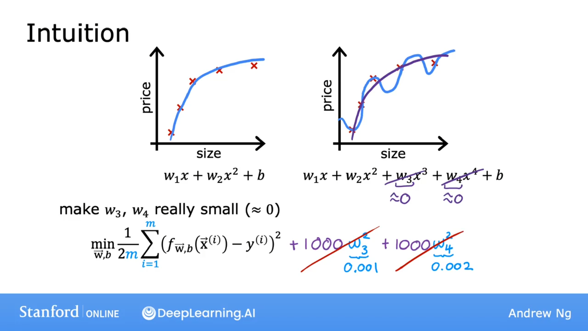
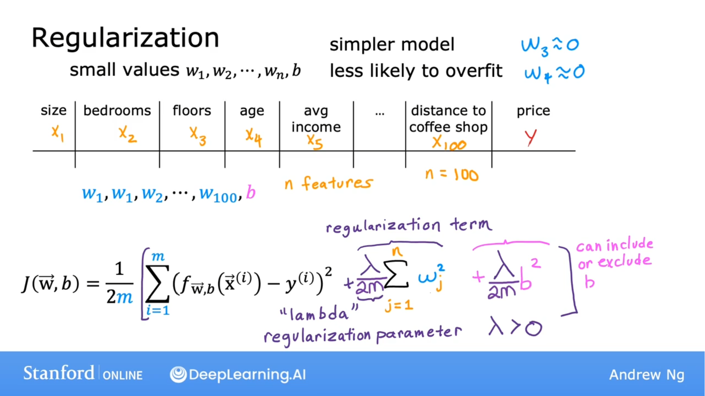
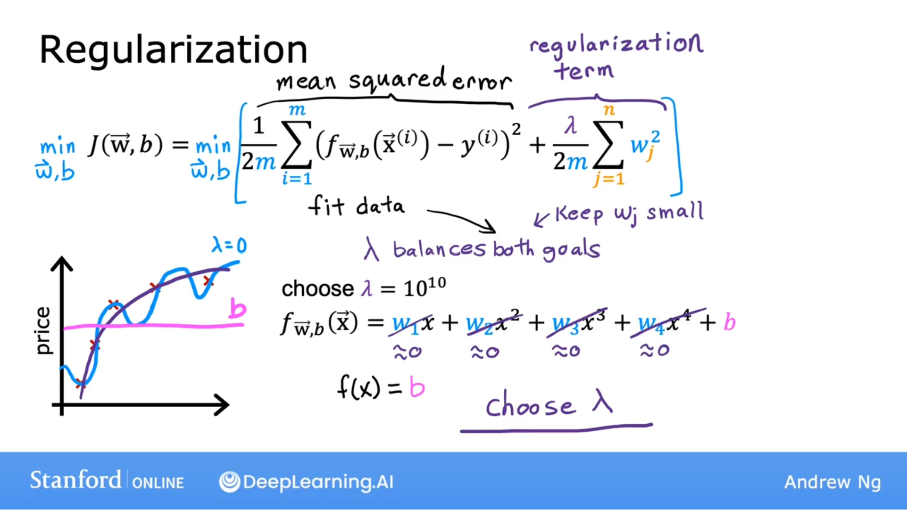

## 直观展示

假设线性回归的成本函数是：
$$
 \frac{1}{2m} \displaystyle \sum^{m}_{i = 1}(f_{ \vec{w},b}( \vec{x}^{(i)})- y^{(i)})^2 + 1000w_3^2 + 1000w_4^2
$$
最小化这个函数，$w_3, w_4$ 将会变得很小，十分接近0。

因此，$w_3, w_3$ 几乎不起作用。

最终会拟合出更接近二次函数的曲线。

## 正则化

一般的说，正则化的思想是：如果参数的值较小，那么就有点像拥有一个更简单的模型，也许是特征较少的一个，因此不太容易过渡拟合。

一般来说，正则化的实现方式是：如果你有很多特征，比如100个特征，你可能不知道哪些是重要的特征，哪些是不重要的。因此正则化典型实现方式是惩罚所有特征，更准确的来说是惩罚所有的 $w_j$ 参数。这样做通常会使拟合更平滑、更简单、更不易过拟合。

## 正则化后的成本函数

$$
J(\vec{w}, b) = \frac{1}{2m} \displaystyle \sum^m_{i = 1}(f_{\vec{w}, b}(\vec{x})-y^{(i)})^2 + \frac{\lambda}{2m} \displaystyle \sum^n_{j=1}w^2_j
$$
其中 $\frac{1}{2m} \displaystyle \sum^m_{i = 1}(f_{\vec{w}, b}(\vec{x})-y^{(i)})^2$ 用来拟合数据，

 $\frac{\lambda}{2m} \displaystyle \sum^n_{j=1}w^2_j$ 用来正则化 $w_j$ 使 $w_j$ 保持较小，这将有助于减少过拟合，

 $\lambda$ 是正则化参数。

如果 $\lambda = 0$ ，拟合出的过度摆动，过度复杂的曲线，并且过拟合。

如果 $\lambda$ 过大，会导致 $w_j$ 过小（趋近于0），将会拟合水平曲线，并且欠拟合。

