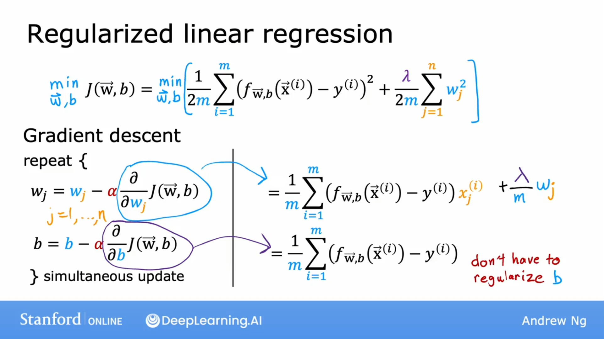
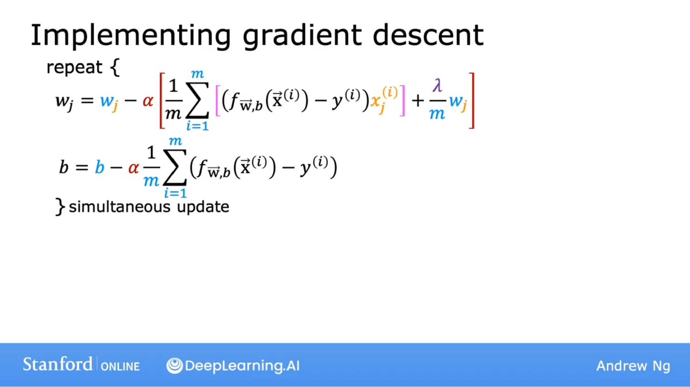
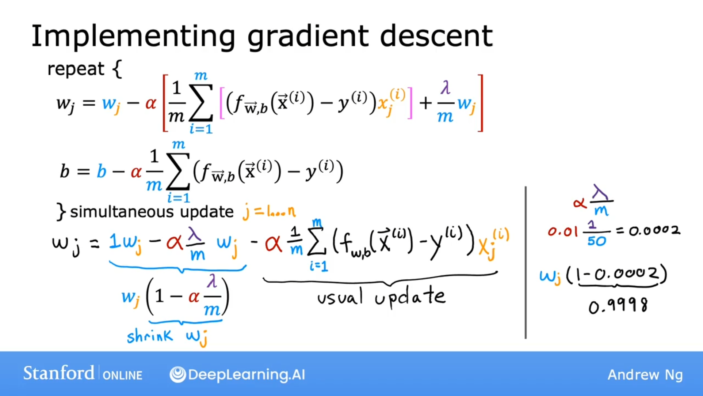
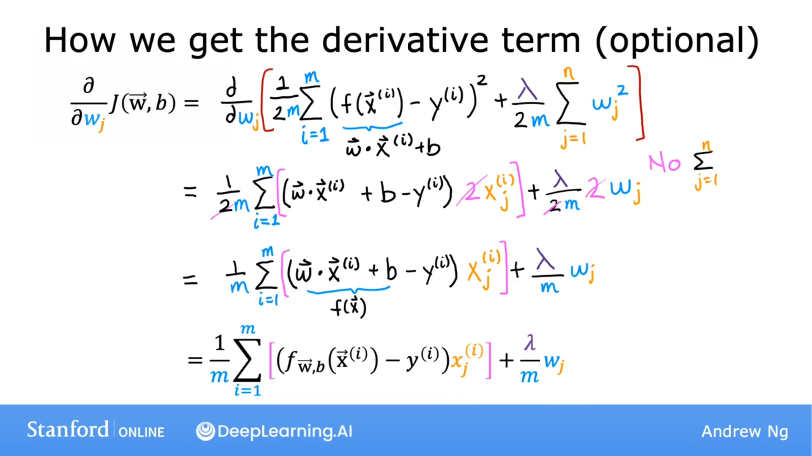

## 梯度下降

$$
J(\vec{w}, b) = \frac{1}{2m} \displaystyle \sum^m_{i=1}(f_{\vec{w}, b}(\vec{x}^{(i)}) - y^{(i)})^2 + \frac{\lambda}{2m} \displaystyle \sum^n_{j=1}w^2_j
$$

$$
w_j = w_j - \alpha \frac{\partial}{\partial w_j}J(\vec{w}, b)
$$

$$
b = b - \alpha \frac{\partial}{\partial b}J(\vec{w},b)
$$

其中 
$$
\frac{\partial}{\partial w_j}J(\vec{w}, b) = \frac{1}{m} \displaystyle \sum^m_{i=1} (f_{\vec{w}, b}(\vec{x}^{(i)}) - y^{(i)})x^{(i)}_j + \frac{\lambda}{m}w_j
$$

$$
\frac{\partial}{\partial b}J(\vec{w},b) = \frac{1}{m} \displaystyle \sum^m_{i=1}(f_{\vec{w},b}(\vec{x}^{(i)}) - y^{(i)})
$$

## 梯度下降分析

$$
w_j = w_j - \alpha \left[ \frac{1}{m} \displaystyle \sum^m_{i=1} (f_{\vec{w}, b}(\vec{x}^{(i)}) - y^{(i)})x^{(i)}_j + \frac{\lambda}{m}w_j \right]
$$

$$
b = b - \alpha \left[ \frac{1}{m} \displaystyle \sum^m_{i=1}(f_{\vec{w},b}(\vec{x}^{(i)}) - y^{(i)}) \right]
$$

$$
w_j = 1w_j - \alpha \frac{1}{m}w_j - \alpha \frac{1}{m} \displaystyle \sum^m_{i=1} (f_{\vec{w}, b}(\vec{x}^{(i)}) - y^{(i)})x^{(i)}_j
$$

其中 $1w_j - \alpha \frac{1}{m}w_j = w_j(1- \alpha \frac{\lambda}{m})$ 表示 $w_j$ 每次只缩小一点点。

## 偏导计算

