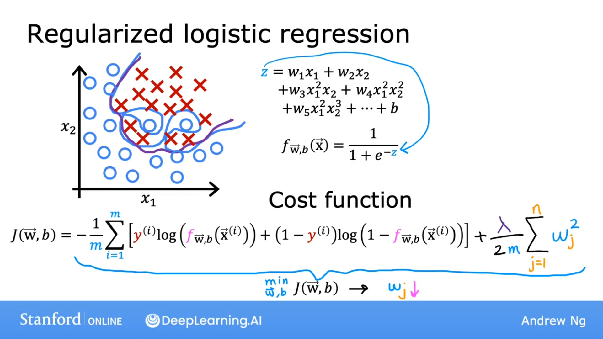
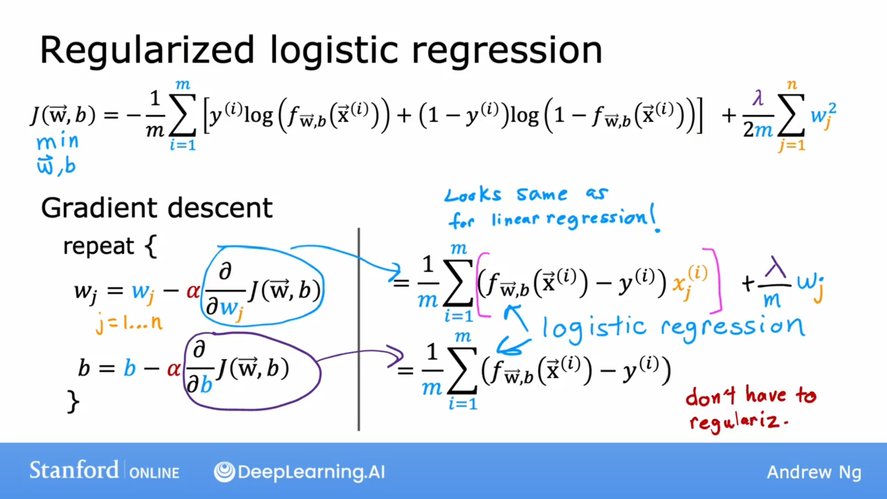

## 成本函数

$$
J(\vec{w}, b)= - \frac{1}{m} \displaystyle \sum^{m}_{i=1}[ y^{(i)}\log(f_{\vec{w},b}(x^{(i)}))+(1-y^{(i)})\log(1-f_{\vec{w}, b}(\vec{x}^{(i)}))] + \frac{\lambda}{2m} \displaystyle \sum^n_{j=1}w^2_j
$$

## 梯度下降

$$
w_j = w_j - \alpha \frac{\partial}{\partial w_j}J(\vec{w}, b)
$$

$$
b = b - \alpha \frac{\partial}{\partial b}J(\vec{w}, b)
$$

其中
$$
\frac{\partial}{\partial b}J(\vec{w}, b) = \frac{1}{m} \displaystyle \sum^{m}_{i=1}(f_{\vec{w}, b}(\vec{x}^{(i)}-y^{(i)})x_j^{(i)}
$$

$$
\frac{\partial}{\partial b}J(\vec{w}, b) = \frac{1}{m} \displaystyle \sum^{m}_{i=1}(f_{\vec{w}, b}(\vec{x}^{(i)}-y^{(i)})
$$
