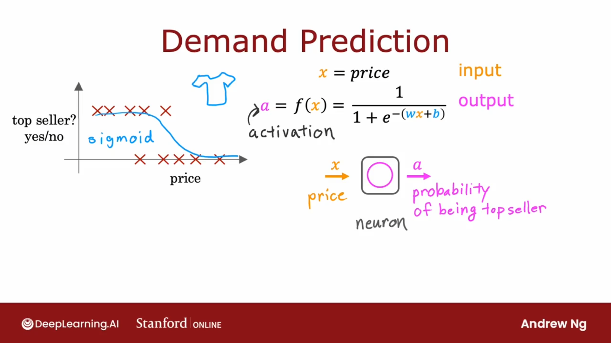
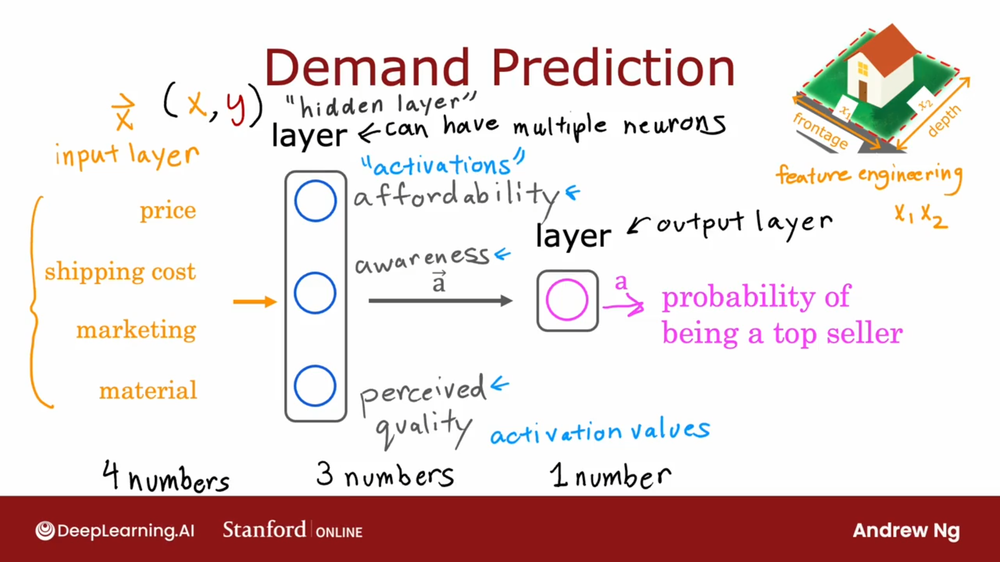
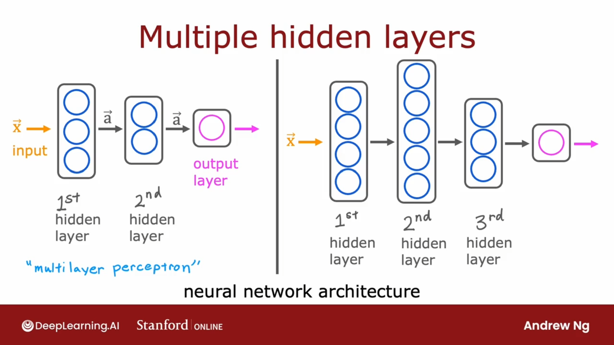

## 使用逻辑回归进行预测

$$
a = f(x) = \frac{1}{1+e^{-(wx + b)}}
$$
其中 $x$ 是衬衫的价格， $a$ 是最畅销的概率

| 输入层（$\vec{x}$） | 隐藏层       | 输出层     |
| ------------------- | ------------ | ---------- |
| 价格                | 负担能力     | 畅销的概率 |
| 运费                | 认知度       |            |
| 营销                | 感知到的质量 |            |
| 材质                |              |            |

## 多个隐藏层

