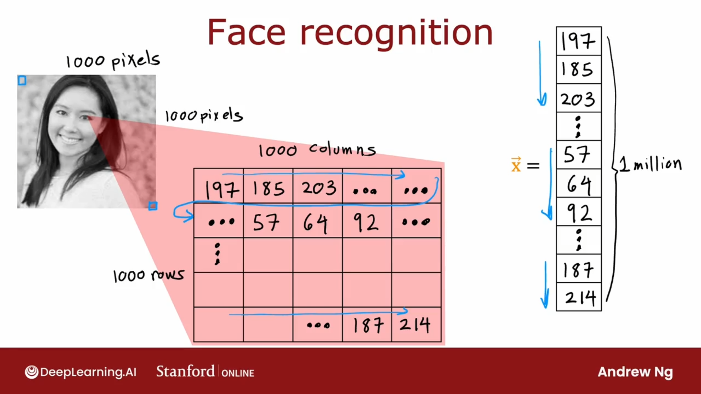
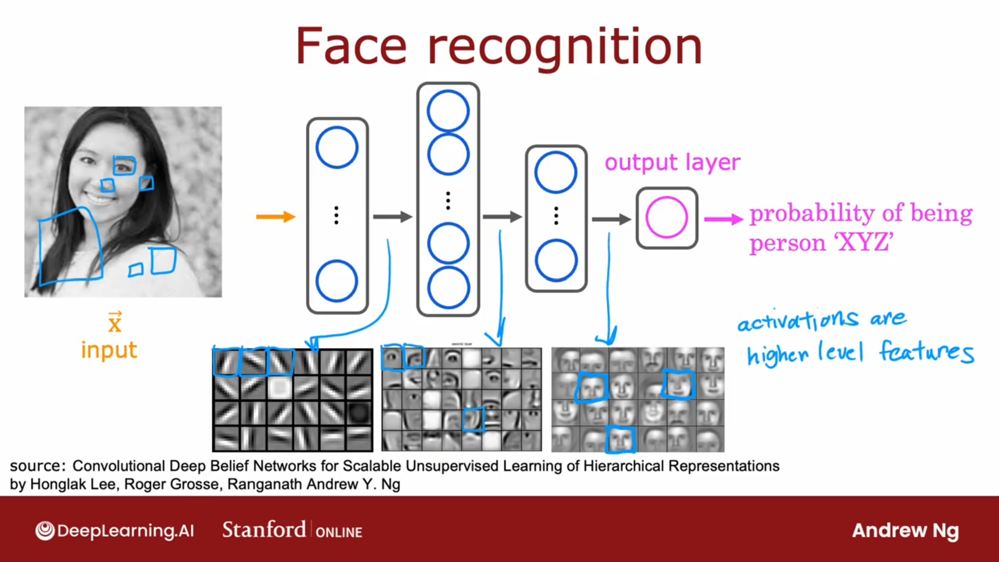
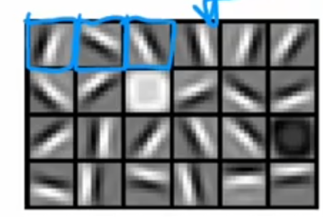
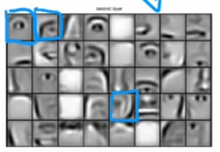
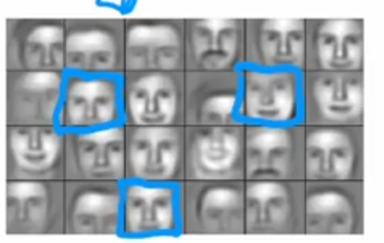
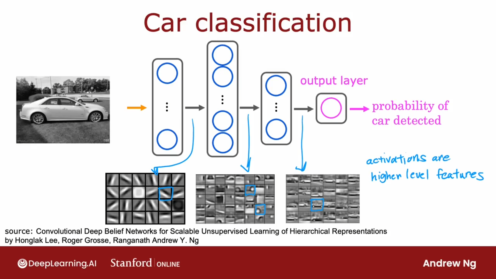

## 人脸识别

1000 × 1000 像素的图片，拥有1000 × 1000个像素强度值。

## 隐藏层

### 第一个隐藏层

在第一个隐藏层中，神经元寻找低垂直线或者垂直边缘。

### 第二个隐藏层

在第二个隐藏层中，神经元寻找定向线或者定向边缘。

### 第三个隐藏层

在第二个隐藏层中，神经元在那个方向寻找一条直线。

在神经网络的最早层中，神经元正在寻找图像中非常短的线或非常短的边缘。

在下一个隐藏层，神经元可能会学习将许多小的短线和小的短边段组合在一起，以寻找面部的各个部分。

这些小方框中的每一个都是神经元试图检测的可视化。

然后，在下一个隐藏层时，神经网络会聚合面部的不同部分，然后尝试检测是否存在更大、更粗糙的面部形状。

最后，检测面部与不同面部形状的对应程度可以创建一组丰富的特征，然后帮助输出层尝试确定人物图片的身份。

在这个例子中，没有人告诉它在第一层寻找短小的边缘，在第二层寻找眼睛、鼻子和面部部位，然后在第三层寻找更完整的面部形状。

神经网络能够自己从数据中找出这些东西。

请注意，在这个可视化中，第一个隐藏层中的神经元正在查看相对较小的窗口以寻找这些边缘，在第二个隐藏层看更大的窗口，第三个隐藏层看更大的窗口。

这些小神经元可视化实际上对应于图像中不同大小的区域。

## 汽车分类

同样的学习算法被要求检测汽车，然后将学习第一层的边缘，

非常相似，但随后他们将学习在第二个隐藏层中检测汽车的零件，

然后在第三个隐藏层中检测更完整的汽车形状。

只需向其提供不同的数据，神经网络就会自动学习检测非常不同的特征，以便尝试预测汽车检测或人员识别，或者是否有特定的给定任务接受过训练。

