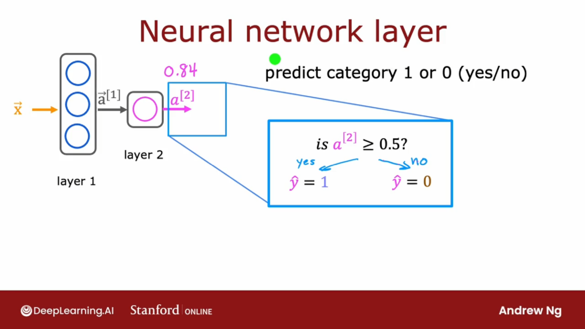

## 隐藏层(第一层)

这个隐藏层被输入四个数字，这四个数字是每一个神经元中的输入。

每一个神经元都只是在实现一个小逻辑回归单元或一个小逻辑回归函数。

以第一个神经元为例，它有两个参数， $w_1$ 和 $b_1$ 。它所做的是输出激活值 $a_1$ 。
$$
a_1 = g(\vec{w}_1 \cdot \vec{x} + b_1)
$$
其中
$$
g(z) = \frac{1}{1 + e ^{-(z)}}
$$
假设 $a_1 = 0.3, a_2 = 0.7, a_3 = 0.2$ ，则 
$$
\vec{a} = \begin{bmatrix}
	0.3 \\
	0.7 \\
	0.2 \\
\end{bmatrix}
$$

## 引入符号区分不同层

为了引入符号来帮助我们区分不同的层，我将使用上标方括号来索引到不同的层

### 隐藏层的第一层

$$
a_1^{[1]} = g(\vec{w}_1^{[1]} \cdot \vec{x}^{[1]} + b_1^{[1]})
$$

$$
a_2^{[1]} = g(\vec{w}_2^{[1]} \cdot \vec{x}^{[1]} + b_2^{[1]})
$$

$$
a_3^{[1]} = g(\vec{w}_3^{[1]} \cdot \vec{x}^{[1]} + b_3^{[1]})
$$

## 输出层(第二层)

$$
a_1^{[2]} = g(\vec{w}_1^{[2]} \cdot \vec{a}^{[1]} + b_1^{[2]})
$$
此时， $a^{[2]}$ 是一个标量，因为仅有一个神经元输出。

## 一个可选步骤：预测类别1或0 (是/否)

