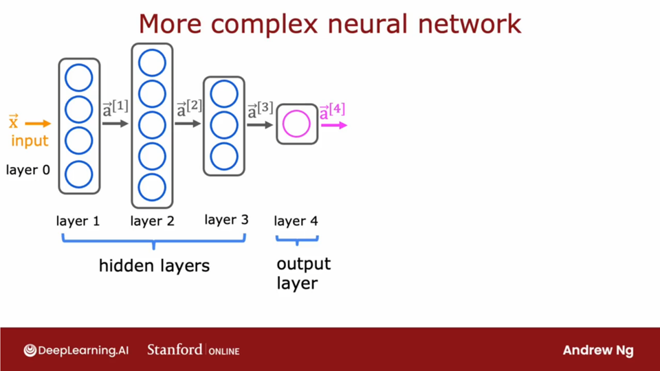
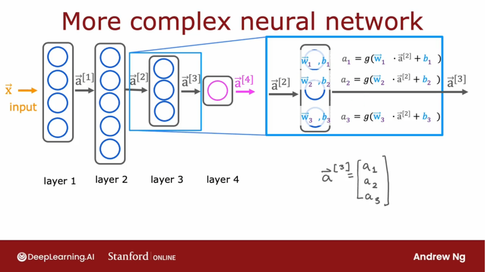
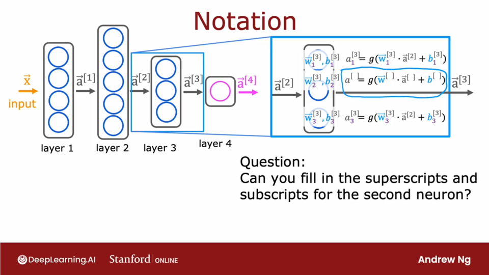
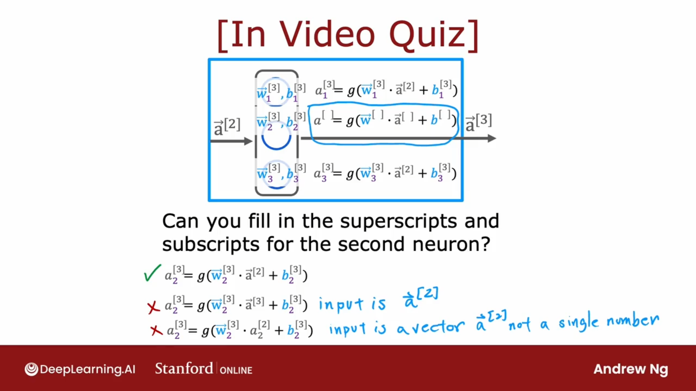
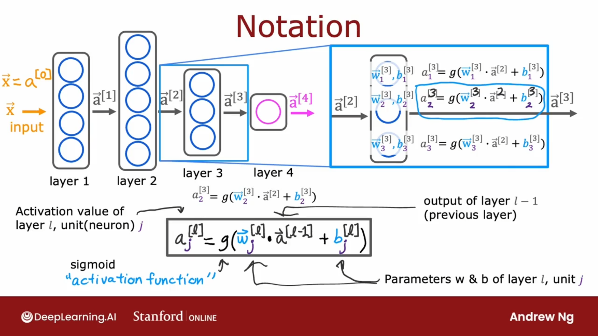

## 层级划分

## 填写上标

## 一般形式

$$
a_j^{[l]} = g(\vec{w}^{[l]}_j  \cdot \vec{a}^{[l-1]} + b_j^{[l]})
$$
其中

 $a_j^{[l]}$ 指的是 第 $l$ 层，第 $j$ 个神经单元的激活值。

 $g()$ 指的是 sigmoid 激活函数

 $\vec{w}_j^{[l]}, \vec{b}_j^{[l]}$ 指的是 第 $l$ 层，第 $j$ 个神经单元的参数。

 $a_j^{[l-1]}$ 指的是 第 $l-1$ 层（前一层）的输出。

> [!tip]
>
> 在输入层（第0层）
>
>  $\vec{x} = a^{[0]}$ 