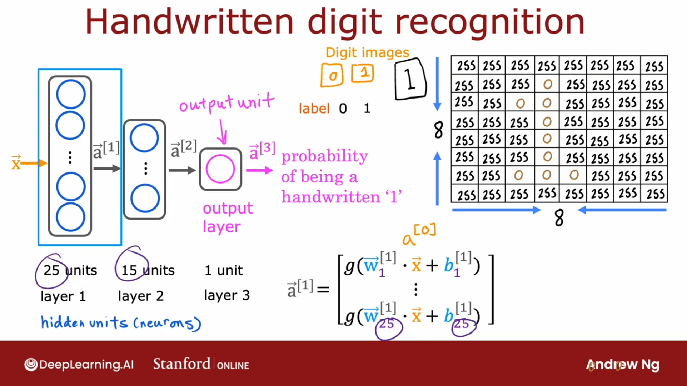
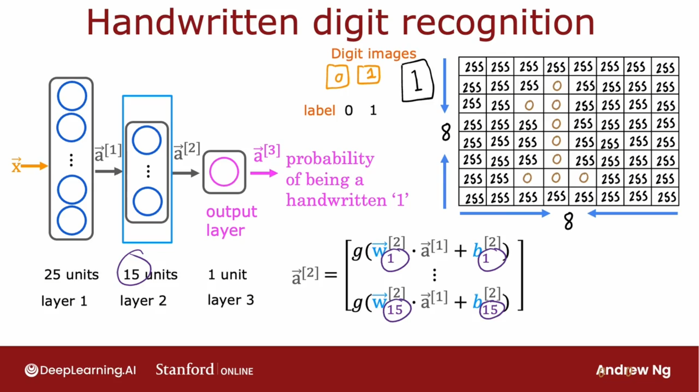
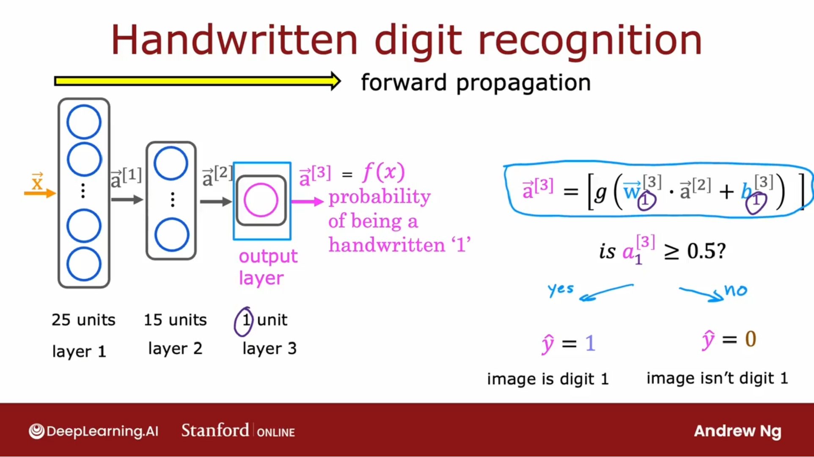

## 手写数字识别

第一个隐藏层有25个神经元，第二个隐藏层有15个神经元，最后是输出单元

## 第一个隐藏层：

$$
\vec{a}^{[1]} = 
\begin{bmatrix}
   g(\vec{w}_1^{[1]} \cdot \vec{x} + b_1^{[1]}) \\
   \vdots \\
   g(\vec{w}_{25}^{[1]} \cdot \vec{x} + b_{25}^{[1]})
  \end{bmatrix}
$$

## 第二个隐藏层：

$$
\vec{a}^{[2]} = 
\begin{bmatrix}
   g(\vec{w}_1^{[2]} \cdot \vec{a}^{[1]} + b_1^{[2]}) \\
   \vdots \\
   g(\vec{w}_{15}^{[1]} \cdot \vec{a}^{[1]} + b_{25}^{[1]})
  \end{bmatrix}
$$

## 第三层：

$$
\vec{a}^{[3]} = 
\begin{bmatrix}
   g(\vec{w}_1^{[3]} \cdot \vec{a}^{[2]} + b_1^{[3]}) \\
\end{bmatrix}
$$

## 前向传播

 这种类型的神经网络架构，最初有很多的隐藏单元，随着靠近输出层，隐藏单元的数量会逐渐减少。