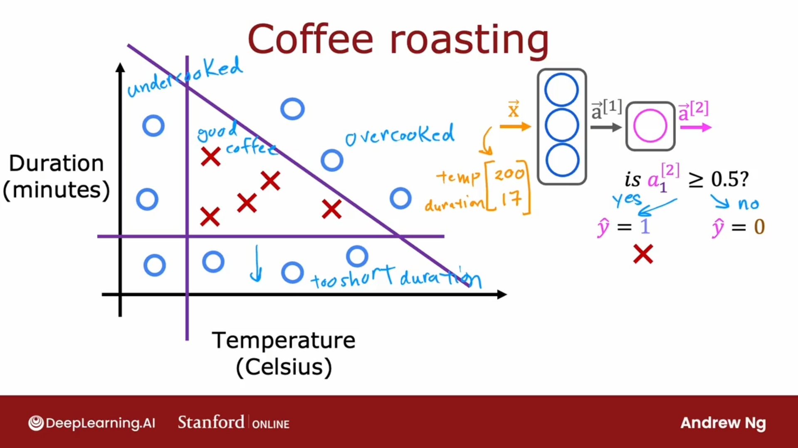
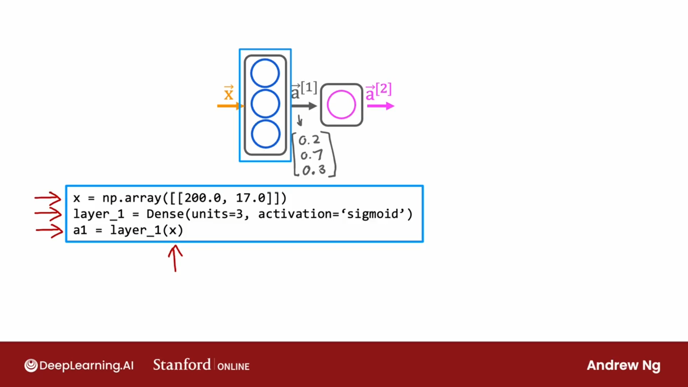
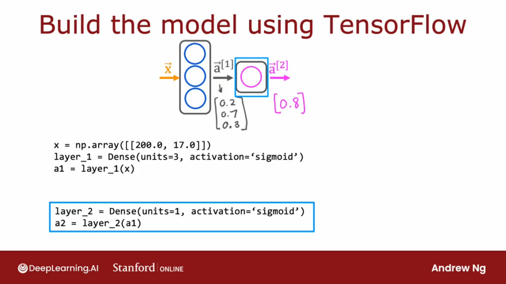
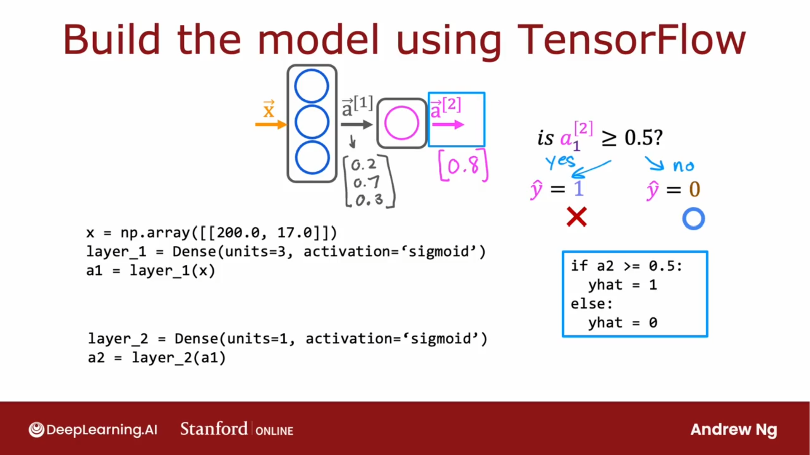
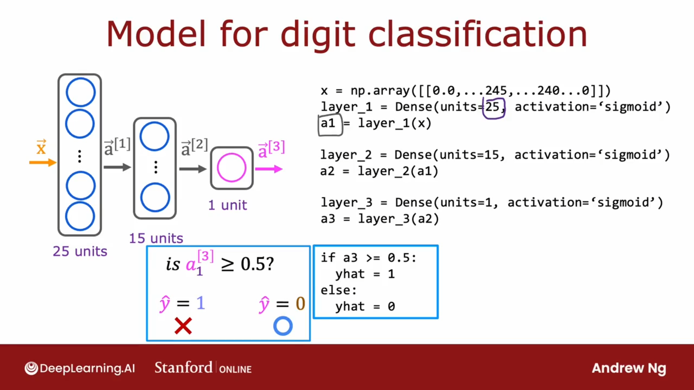

## 烘培咖啡



温度：200℃， 时长：17分钟
$$
\vec{x} = 
\begin{bmatrix}
200 \\
17 
\end{bmatrix}
$$


```python
x = np.array([[200.0, 17.0]])
layer_1 = Dense(units=3, activation='sigmoid')
a1 = layer_1(x)
```



```python
layer_2 = Dense(units=1, activation='sigmoid')
a2 = layer_2(a1)
```



```python
if a2 >= 0.5:
    yhat = 1
else:
    yhat = 0
```

## 数字分类模型




```python
x = np.array([[0.0, ..., 245, ..., 240, ..., 0.0]])
layer_1 = Dense(units=25, activation='sigmoid')
a1 = layer_1(x)

layer_2 = Dense(units=15, activation='sigmoid')
a2 = layer_2(a1)

layer_3 = Dense(units=1, activation='sigmoid')
a3 = layer32(a2)

if a3 >= 0.5:
    yhat = 1
else:
    yhat = 0
```

