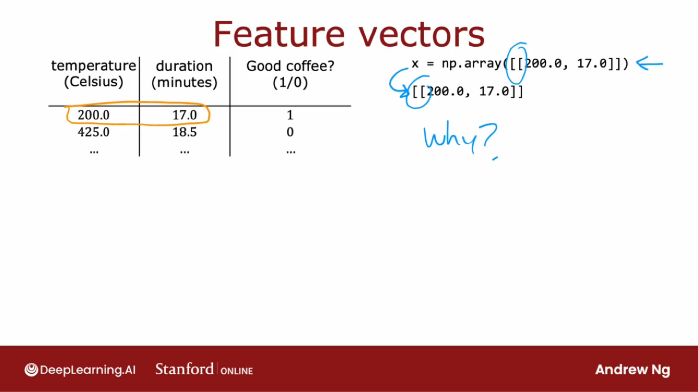
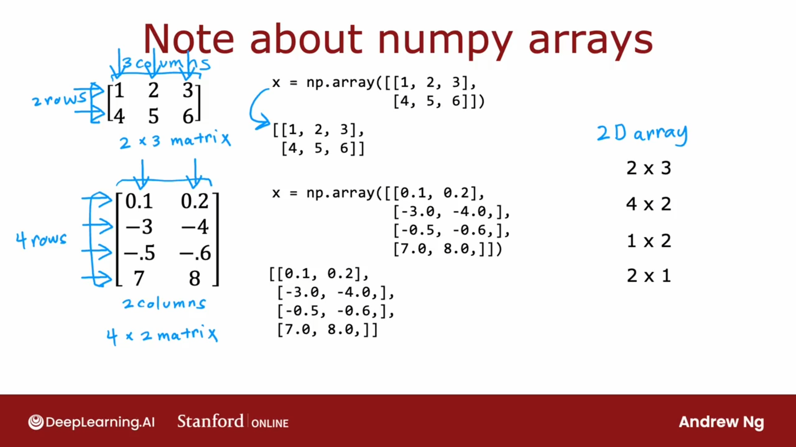
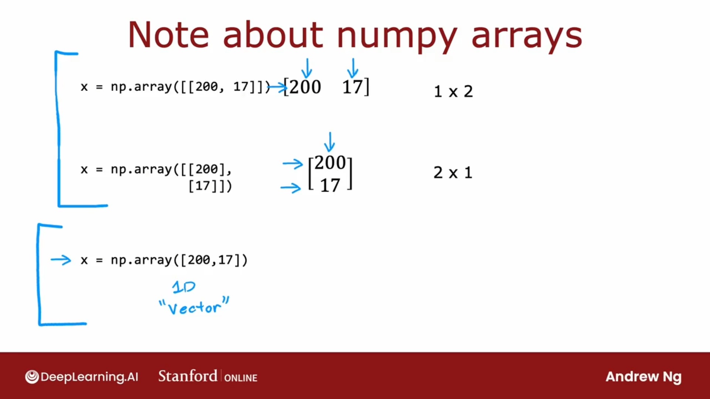
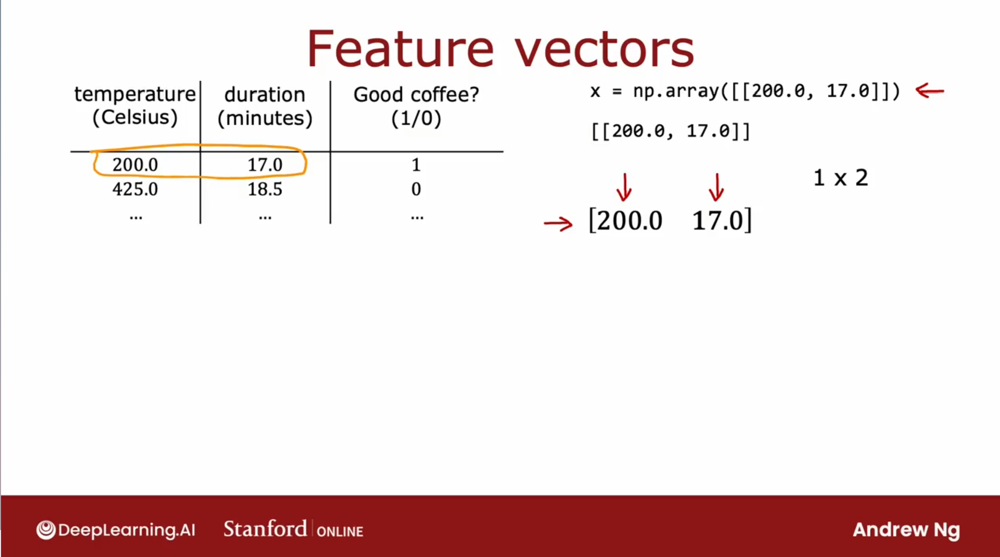
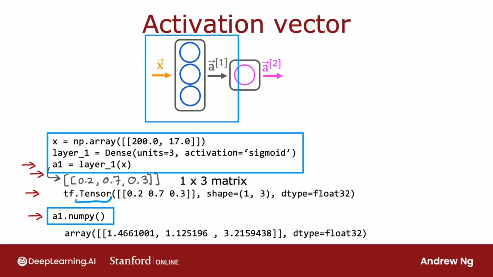
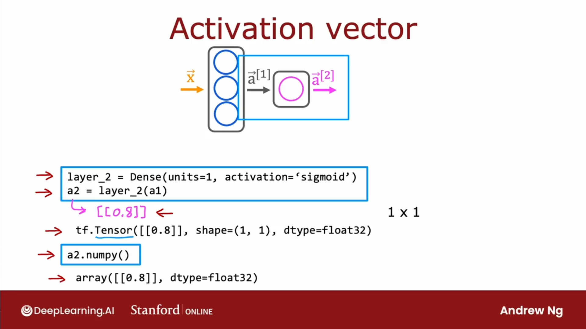

## 特征向量




## 为什么是双方括号？

```python
x = np.array[[200.0, 17.0]]
```



对于
$$
\begin{bmatrix}
1 & 2 & 3 \\
4 & 5 & 6 \\
\end{bmatrix}
$$
numpy 表示为

```python
x = np.array([[1, 2, 3], 
              [4, 5, 6]])
```

对于
$$
\begin{bmatrix}
0.1 & 0.2 \\
-3 & -4   \\
-0.5 & -0.6 \\
7 & 8 \\
\end{bmatrix}
$$

```python
x = np.array([[0.1, 0.2],
             [-3, -4],
             [-0.5, -0.6],
             [7, 8]])
```

## 行向量与列向量




Tensor5low 旨在处理非常大的数据集，并且通过在矩阵表示数据。这让 TensorFlow 在内部的计算效率更高一些。



[200.0 17.0]是一个 1 × 2 的矩阵

## 第一层激活输出




a1 实际上是一个 1 × 3 的矩阵

可以使用 a1.numpy 将张量转换为 NumPy 数组

## 第二层激活输出



a2 实际上是 1 × 1 的矩阵（表现形式是二维数组）
